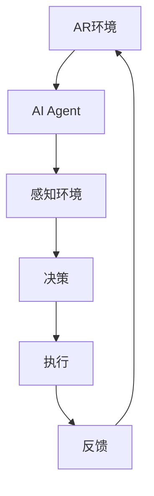
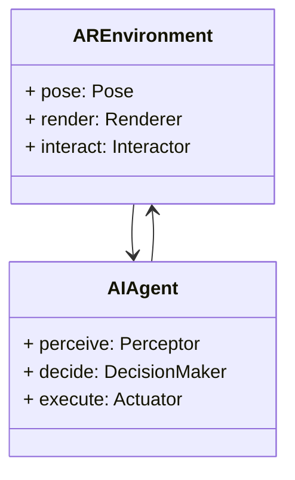

                 


---

# 增强现实技术与AI Agent的结合

> 关键词：增强现实，人工智能，AI Agent，协同模型，系统设计，项目实战

> 摘要：本文探讨了增强现实技术与AI Agent的结合，分析了两者的核心概念、协同关系、算法原理、系统设计以及实际项目中的应用。通过详细的技术分析和案例展示，展示了增强现实与AI Agent如何协同工作，提升用户体验和智能化水平。

---

## 第一部分：增强现实技术与AI Agent的背景与基础

### 第1章：增强现实技术概述

#### 1.1 增强现实的基本概念
- **定义与特点**  
  增强现实（Augmented Reality, AR）是一种通过技术手段将数字信息叠加到现实世界中的技术，具有实时性、交互性和沉浸性的特点。
  
- **核心技术**  
  包括定位追踪、渲染技术和交互技术。  
  - 定位追踪：通过摄像头和传感器确定用户在现实世界中的位置。  
  - 渲染技术：将数字内容叠加到现实环境中。  
  - 交互技术：实现用户与AR内容的互动。

- **应用场景**  
  包括教育、医疗、工业和游戏等领域。

#### 1.2 AI Agent的基本概念与技术
- **定义与分类**  
  AI Agent是一种具备自主决策能力的智能体，分为简单反射型、基于模型的反应型、目标驱动型和实用驱动型。

- **核心技术**  
  包括感知、决策和执行能力。  
  - 感知：通过传感器获取环境信息。  
  - 决策：基于感知信息做出决策。  
  - 执行：通过执行机构执行决策。

- **应用场景**  
  包括智能助手、自动驾驶和游戏AI。

#### 1.3 增强现实与AI Agent的结合背景
- **协同效应**  
  - AR的交互需求与AI Agent的智能决策能力结合，提升用户体验。  
  - 例如，AR游戏中的AI NPC（非玩家角色）能够自主决策并与玩家互动。

- **应用潜力**  
  - 教育：AR提供虚拟实验，AI Agent作为虚拟导师。  
  - 医疗：AR辅助手术，AI Agent提供实时诊断建议。  
  - 工业：AR辅助设备维护，AI Agent优化操作流程。

---

### 第2章：AI Agent的基本概念与技术

#### 2.1 AI Agent的定义与分类
- **定义**  
  AI Agent是具备感知环境、做出决策并执行操作的智能体。

- **分类**  
  - 简单反射型：基于当前状态做出反应。  
  - 基于模型的反应型：利用环境模型做出决策。  
  - 目标驱动型：基于目标选择行动。  
  - 实用驱动型：基于效用函数选择最优行动。

- **核心技术**  
  - 感知：通过传感器获取环境信息。  
  - 决策：基于感知信息做出决策。  
  - 执行：通过执行机构执行决策。

---

### 第3章：增强现实与AI Agent的结合背景

#### 3.1 增强现实与AI Agent的协同效应
- **协同模型**  
  - 定义：AR提供虚拟环境，AI Agent在其中执行任务。  
  - 实现方式：通过API接口实现AR内容与AI Agent的交互。  
  - 优势：提升AR应用的智能化水平。

- **协同流程**  
  - AR环境渲染：生成虚拟场景。  
  - AI Agent感知：获取环境信息。  
  - AI Agent决策：基于感知做出决策。  
  - AR执行：根据决策执行操作。

---

## 第二部分：增强现实与AI Agent的核心概念与联系

### 第4章：增强现实与AI Agent的核心概念对比

#### 4.1 增强现实的核心概念
| 定义 | 核心技术 | 应用场景 | 优势 |
|------|----------|----------|------|
| 增强现实是通过技术手段将数字信息叠加到现实世界中的技术。 | 定位追踪、渲染技术、交互技术 | 教育、医疗、工业、游戏 | 实时性、交互性、沉浸性 |

#### 4.2 AI Agent的核心概念
| 定义 | 核心技术 | 应用场景 | 优势 |
|------|----------|----------|------|
| AI Agent是具备自主决策能力的智能体。 | 感知、决策、执行 | 智能助手、自动驾驶、游戏AI | 智能化、自主性、适应性 |

---

### 第5章：增强现实与AI Agent的协同关系

#### 5.1 增强现实与AI Agent的协同模型
- **定义**  
  协同模型是AR与AI Agent结合的方式，通过协同模型实现信息共享和任务协作。

- **实现方式**  
  - 通过API接口实现数据交互。  
  - 通过消息队列实现任务协作。

- **优势**  
  - 提升AR应用的智能化水平。  
  - 实现AI Agent在AR环境中的高效协作。

#### 5.2 增强现实与AI Agent的协同流程


---

## 第三部分：增强现实与AI Agent的算法与数学模型

### 第6章：相关算法与数学模型

#### 6.1 增强现实中的 pose estimation
- **算法步骤**  
  1. 摄像头获取图像数据。  
  2. 通过特征匹配定位目标物体。  
  3. 通过优化算法计算 pose 参数。

- **数学模型**  
  $$ \text{pose} = \arg\min_{p} \sum_{i=1}^{n} (I_{\text{real}} - I_{\text{render}}(p))^2 $$  
  其中，\( I_{\text{real}} \) 是真实图像，\( I_{\text{render}}(p) \) 是渲染图像，\( p \) 是 pose 参数。

#### 6.2 AI Agent中的决策算法
- **算法步骤**  
  1. 感知环境信息。  
  2. 构建决策树。  
  3. 基于感知信息选择最优路径。

- **数学模型**  
  $$ \text{action} = \arg\max_{a} \sum_{i=1}^{n} w_i \cdot s_i(a) $$  
  其中，\( w_i \) 是特征权重，\( s_i(a) \) 是动作 \( a \) 的评分。

---

## 第四部分：系统设计与实现

### 第7章：系统设计

#### 7.1 项目场景
- 项目名称：AR游戏中的AI NPC。  
- 项目目标：实现AI NPC在AR环境中的自主决策与互动。

#### 7.2 系统功能设计


#### 7.3 系统架构设计


#### 7.4 系统接口设计
- 接口1：AREnvironment -> AIAgent  
  - 输入：pose信息  
  - 输出：决策结果  

- 接口2：AIAgent -> AREnvironment  
  - 输入：决策结果  
  - 输出：执行反馈  

---

## 第五部分：项目实战

### 第8章：项目实战

#### 8.1 环境安装
- 安装Python 3.8及以上版本。  
- 安装OpenCV、NumPy、Pillow库。  
  ```bash
  pip install opencv-python numpy pillow
  ```

#### 8.2 核心代码实现
- AR环境渲染代码：
  ```python
  import cv2
  import numpy as np

  def render_ar(pose):
      # 渲染AR内容
      return rendered_image
  ```

- AI Agent决策代码：
  ```python
  def decide(action):
      # 决策逻辑
      return decision_result
  ```

#### 8.3 案例分析
- 案例1：AR游戏中的AI NPC。  
  - 项目介绍：实现AI NPC在AR环境中的自主决策与互动。  
  - 代码实现：通过OpenCV渲染AR内容，通过决策树实现AI Agent的决策。  
  - 结果展示：AI NPC能够自主决策并与玩家互动。

---

## 第六部分：总结与展望

### 第9章：总结与展望

#### 9.1 总结
- 增强现实技术与AI Agent的结合能够提升AR应用的智能化水平。  
- 通过协同模型和协同流程，实现AR与AI Agent的高效协作。

#### 9.2 最佳实践 tips
- 在项目中，建议使用开源AR框架（如ARKit、ARCore）和AI框架（如TensorFlow、PyTorch）。  
- 注意数据隐私和用户安全问题。

#### 9.3 未来展望
- 更加智能化的AR应用。  
- 更加自主化的AI Agent。

---

以上是《增强现实技术与AI Agent的结合》的技术博客文章的完整撰写，涵盖了从背景到系统设计的各个方面，并提供了详细的代码示例和图表。

