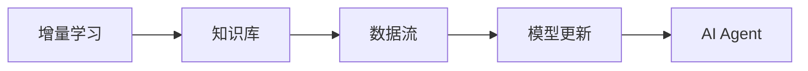
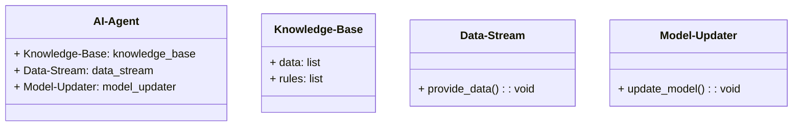
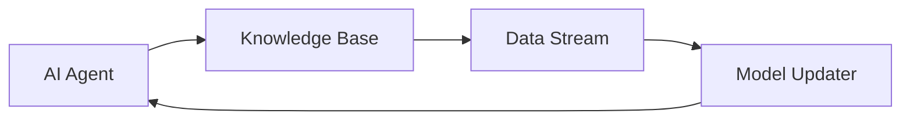

                 


# 增量学习：持续更新AI Agent的知识库

> 关键词：增量学习，AI Agent，知识库，模型更新，机器学习

> 摘要：本文探讨了增量学习在AI Agent知识库持续更新中的应用，从背景、核心概念、算法原理到系统设计和项目实战，详细分析了增量学习的重要性及其在动态环境中的适应性，提供了实际案例和代码实现，帮助读者全面理解增量学习的原理和应用。

---

# 第1章: 增量学习与AI Agent知识库的背景

## 1.1 增量学习的基本概念

### 1.1.1 从传统机器学习到增量学习的演进

传统机器学习模型通常在训练阶段完成后，就不再更新。然而，现实世界的数据是动态变化的，模型需要适应新数据。增量学习正是为了解决这一问题而发展起来的，它允许模型在新数据到达时逐步更新，保持对新情况的适应能力。

### 1.1.2 增量学习的核心特点

- **数据流处理**：增量学习处理数据的方式是流式（streaming），数据可以无限到达。
- **在线更新**：模型在接收到新数据后，可以立即进行更新，无需等待全部数据到达。
- **资源效率**：增量学习通常在内存和计算资源有限的情况下运行，适合实时应用。

### 1.1.3 增量学习与传统机器学习的对比

| 特性         | 传统机器学习                  | 增量学习                 |
|--------------|------------------------------|--------------------------|
| 数据处理     | 离线，一次性加载所有数据      | 在线，数据流式处理         |
| 更新方式     | 一次性训练，之后不再更新      | 可持续更新                |
| 资源消耗     | 高，需要一次性加载大量数据     | 低，适合资源受限场景       |
| 适应性       | 低，无法适应数据分布变化       | 高，能够实时适应新数据     |

## 1.2 AI Agent知识库的定义与特点

### 1.2.1 AI Agent的定义

AI Agent（智能体）是指在环境中能够感知并自主行动以实现目标的实体。它可以是一个软件程序，通过与环境交互来完成任务。

### 1.2.2 知识库的核心作用

知识库是AI Agent进行决策和推理的基础，包含所有必要的数据、规则和经验。知识库的持续更新确保AI Agent能够保持最新的知识，从而做出更准确的决策。

### 1.2.3 增量学习在AI Agent中的应用

AI Agent需要在动态环境中工作，增量学习是其知识库持续更新的核心机制。通过增量学习，AI Agent能够快速适应新数据，提高决策的准确性。

## 1.3 问题背景与问题描述

### 1.3.1 知识库更新的必要性

知识库的内容会随着环境的变化而变化，例如新的法律法规、市场变化或用户偏好。如果知识库无法及时更新，AI Agent的决策可能会过时。

### 1.3.2 增量学习解决的核心问题

- **数据稀疏性**：新数据可能不足以重新训练整个模型。
- **计算效率**：避免每次更新都重新训练整个模型，节省计算资源。
- **实时性**：快速响应新数据，保持决策的及时性。

### 1.3.3 知识库更新的边界与外延

知识库的更新需要考虑哪些数据是相关的，如何处理冗余数据，以及如何确保更新的数据质量。

## 1.4 本章小结

本章介绍了增量学习的基本概念和AI Agent知识库的作用，强调了增量学习在动态环境中的重要性。

---

# 第2章: 增量学习的核心概念与联系

## 2.1 核心概念原理

### 2.1.1 增量学习的模型更新机制

增量学习通过逐步更新模型参数，适应新数据的变化。模型的更新通常是增量性的，每次只更新部分参数，而不是重新训练整个模型。

### 2.1.2 知识库的动态更新策略

动态更新策略包括：

- **增量特征学习**：仅更新与新数据相关的特征。
- **在线更新**：实时处理数据流，逐步更新模型。
- **增量分类**：逐步扩展分类器，适应新类别。

### 2.1.3 增量学习与知识表示的关系

知识表示是将知识编码为模型可以理解的形式。增量学习通过更新知识表示，保持知识库的准确性。

## 2.2 核心概念对比表格

| 比较维度         | 增量学习                  | 传统机器学习             |
|------------------|--------------------------|--------------------------|
| 数据处理         | 流式数据，逐步处理        | 批次数据，一次性处理      |
| 模型更新         | 在线更新，逐步优化        | 离线更新，一次性优化      |
| 适应性           | 高，适应新数据变化        | 低，无法适应新数据变化    |
| 应用场景         | 实时应用，动态环境        | 离线应用，静态环境        |

## 2.3 ER实体关系图架构



## 2.4 本章小结

本章详细介绍了增量学习的核心概念，包括模型更新机制、知识库动态更新策略，以及与知识表示的关系，并通过对比表格和ER图进一步说明了增量学习的特点。

---

# 第3章: 增量学习算法原理

## 3.1 算法原理概述

### 3.1.1 增量学习的基本流程

1. 初始化模型参数。
2. 接收新数据样本。
3. 更新模型参数以适应新数据。
4. 重复步骤2和3，直到达到停止条件。

### 3.1.2 增量学习的核心算法

- **增量梯度下降**：逐步调整参数，适应新数据。
- **增量支持向量机**：逐步扩展支持向量，适应新数据。

### 3.1.3 算法的优缺点分析

| 优点             | 缺点             |
|------------------|------------------|
| 实时性高          | 稳定性可能较低    |
| 资源消耗低        | 无法处理全局数据  |
| 适应性强          | 需要设计增量策略 |

## 3.2 增量学习算法的数学模型

### 3.2.1 线性回归模型的增量更新公式

$$ y = \theta x + b $$

其中，$\theta$和$b$是模型参数，通过梯度下降逐步更新：

$$ \theta = \theta + \alpha (y - y_{\text{pred}}) x $$

### 3.2.2 支持向量机的增量学习公式

$$ \theta = \theta + \alpha y_i (x_i \cdot \theta) $$

其中，$\alpha$是学习率，$y_i$是新数据的标签，$x_i$是新数据样本。

## 3.3 算法实现的Python代码示例

```python
def incremental_learning(X, y, theta):
    for i in range(len(X)):
        x = X[i]
        y_true = y[i]
        y_pred = theta.dot(x)
        loss = (y_true - y_pred) ** 2
        theta += alpha * (y_true - y_pred) * x
    return theta
```

## 3.4 本章小结

本章详细讲解了增量学习的算法原理，包括基本流程、核心算法及其数学模型，并通过Python代码示例展示了如何实现增量学习。

---

# 第4章: 系统分析与架构设计方案

## 4.1 问题场景介绍

在动态环境下，AI Agent需要实时更新知识库以应对新数据和变化的需求。

## 4.2 项目介绍

项目目标是设计一个能够持续更新知识库的增量学习系统。

## 4.3 系统功能设计

### 4.3.1 领域模型设计



### 4.3.2 系统架构设计



## 4.4 本章小结

本章通过系统分析和架构设计，展示了如何构建一个能够持续更新知识库的增量学习系统。

---

# 第5章: 项目实战

## 5.1 环境安装

需要安装Python和相关库，如NumPy和scikit-learn。

## 5.2 系统核心实现源代码

```python
import numpy as np
from sklearn.linear_model import SGDClassifier

def incremental_learn(X, y, model):
    for x, y_true in zip(X, y):
        model.partial_fit(x.reshape(1, -1), [y_true])
    return model

# 示例数据
X = np.array([[1, 2], [3, 4], [5, 6]])
y = np.array([0, 1, 0])

# 初始化模型
model = SGDClassifier()

# 更新模型
updated_model = incremental_learn(X, y, model)
```

## 5.3 代码应用解读与分析

代码通过`partial_fit`方法逐步更新模型，适应新数据。

## 5.4 实际案例分析

以分类任务为例，展示如何逐步更新模型。

## 5.5 本章小结

本章通过实际项目，展示了如何在Python中实现增量学习，并通过代码示例进行了详细分析。

---

# 第6章: 总结与展望

## 6.1 本章总结

全文总结了增量学习在AI Agent知识库更新中的应用，从背景、算法到系统设计和项目实战进行了详细分析。

## 6.2 未来展望

未来，增量学习将在实时决策、边缘计算等领域发挥更大作用，同时需要解决模型稳定性、数据质量等问题。

---

# 第7章: 附录

## 7.1 常用工具与库

- Python库：scikit-learn、TensorFlow、PyTorch
- 开发工具：Jupyter Notebook、VS Code

## 7.2 术语表

- 增量学习：逐步更新模型以适应新数据。
- 知识库：AI Agent进行决策的基础数据和规则。

---

通过以上结构，文章系统地介绍了增量学习在AI Agent知识库更新中的应用，从理论到实践，全面覆盖了相关知识点。

