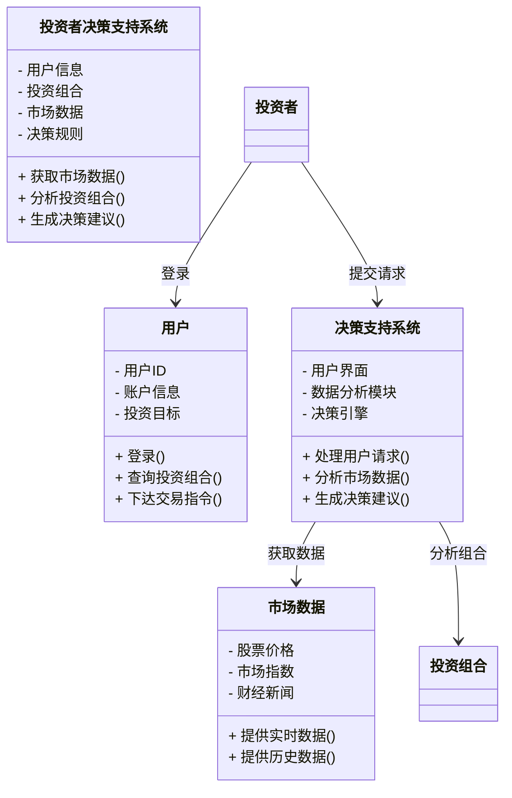
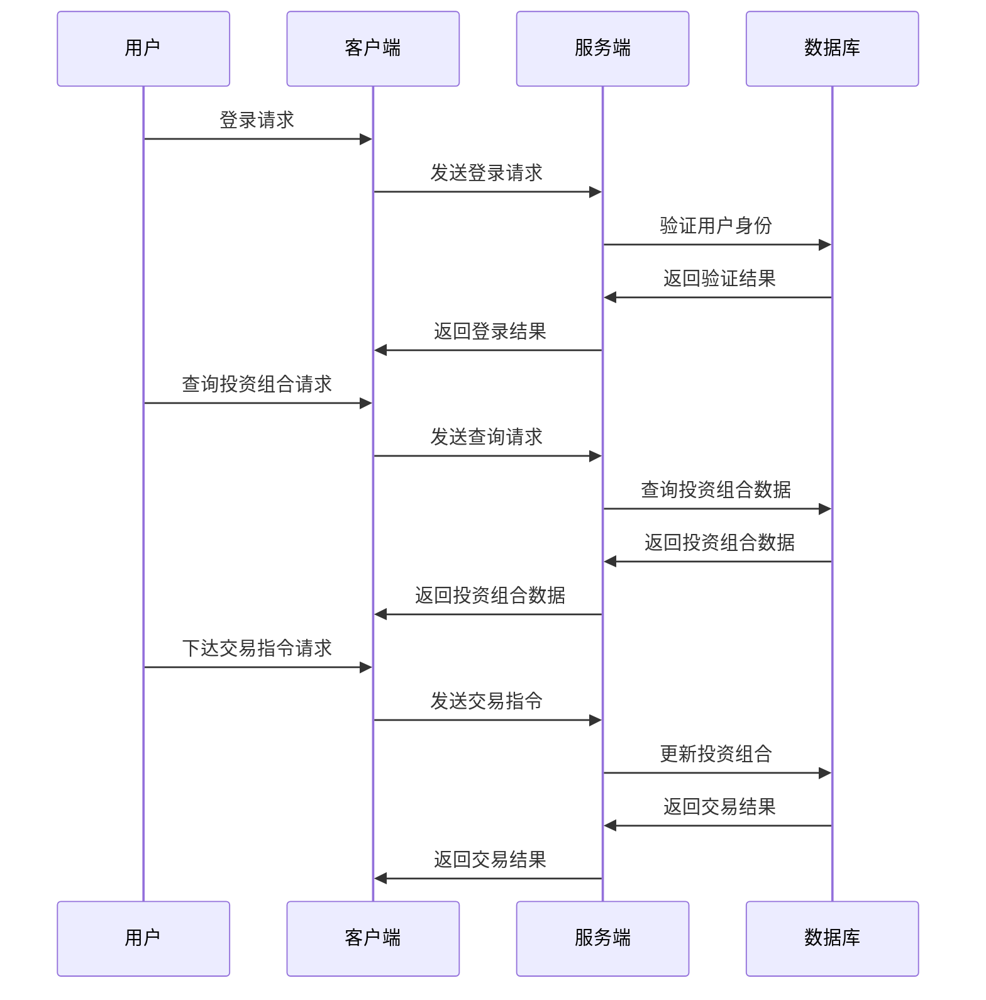

                 


# 处置效应：为什么投资者倾向于卖出盈利股票

---

## 关键词
处置效应, 投资者行为, 损失厌恶, 行为经济学, 投资决策

---

## 摘要
处置效应是指投资者倾向于卖出盈利股票，而倾向于持有亏损股票的现象。本文从行为经济学和心理学角度分析了处置效应的成因、表现及其对投资决策的影响。通过数学模型和实证分析，揭示了处置效应的核心机制，并提出了应对策略。文章结合实际案例，探讨了处置效应在投资实践中的应用，并提出了优化投资决策的具体建议。

---

# 第1章: 处置效应的基本概念

## 1.1 处置效应的定义与背景

### 1.1.1 处置效应的定义
处置效应（Disposition Effect）是指投资者倾向于卖出盈利股票，而倾向于持有亏损股票的现象。这一行为偏差源于人类心理中的损失厌恶和对收益的过度关注。

### 1.1.2 投资者行为中的处置效应
在实际投资中，处置效应表现为投资者更倾向于卖出自己获利的股票，而对亏损的股票则倾向于长期持有，试图通过时间来弥补亏损。这种行为模式与理性投资决策相悖，却在现实中普遍存在。

### 1.1.3 处置效应的背景与现状
处置效应的研究源于行为经济学对人类决策偏差的关注。传统经济学假设投资者是理性的，但在现实中，投资者的行为往往受到心理因素的影响。处置效应的发现揭示了人类决策中的非理性特征。

---

## 1.2 处置效应的核心特征

### 1.2.1 处置效应的投资者行为特征
- **收益优先**：投资者倾向于卖出盈利股票，追求短期收益。
- **损失规避**：投资者倾向于持有亏损股票，避免承认损失。

### 1.2.2 处置效应与收益的关系
- **短期收益**：卖出盈利股票可能导致短期收益增加，但长期来看可能错失更大的收益。
- **长期亏损**：持有亏损股票可能因市场波动而进一步亏损。

### 1.2.3 处置效应的边界与外延
- **边界**：处置效应主要在股票市场中表现明显，但在其他金融资产中也有类似现象。
- **外延**：处置效应不仅影响个人投资者，也影响机构投资者的决策。

---

## 1.3 处置效应与投资决策的关系

### 1.3.1 处置效应对投资决策的影响
- **过度交易**：投资者因频繁买卖股票而增加交易成本。
- **错失长期收益**：卖出盈利股票可能导致投资者错过后续上涨的机会。

### 1.3.2 处置效应与投资收益的关联
- **短期收益**：处置效应可能导致短期收益增加，但长期收益可能受损。
- **长期亏损**：投资者因持有亏损股票而承担更大的风险。

### 1.3.3 处置效应的长期与短期影响
- **短期**：处置效应可能导致投资者因卖出盈利股票而获得短期收益，但可能错失长期上涨的机会。
- **长期**：处置效应可能导致投资者因长期持有亏损股票而承担更大的风险。

---

## 1.4 本章小结
本章从定义、特征和影响三个方面分析了处置效应的基本概念，揭示了其在投资者行为中的表现及其对投资决策的影响。

---

# 第2章: 行为经济学中的处置效应

## 2.1 行为经济学基础

### 2.1.1 行为经济学的定义与核心理论
行为经济学（Behavioral Economics）是研究人类决策偏差的学科，与传统经济学不同，行为经济学认为投资者并非完全理性。

### 2.1.2 理性人假设的局限性
传统经济学假设投资者是理性的，但在现实中，投资者的行为往往受到心理因素的影响，导致决策偏差。

### 2.1.3 行为经济学与投资决策的关系
行为经济学通过研究人类心理因素，揭示了投资者决策中的非理性特征。

---

## 2.2 处置效应在行为经济学中的地位

### 2.2.1 处置效应与行为偏差
处置效应是行为经济学中的典型偏差之一，反映了人类对收益和损失的心理偏好。

### 2.2.2 处置效应与投资者心理
处置效应源于人类对收益的过度关注和对损失的厌恶，导致投资者在决策中表现出非理性行为。

### 2.2.3 处置效应与市场行为的关系
处置效应影响了市场的供需关系，可能导致市场的波动和非理性定价。

---

## 2.3 处置效应的经典实验与案例

### 2.3.1 实验设计与结果分析
通过实验发现，投资者倾向于卖出盈利股票，而倾向于持有亏损股票。

### 2.3.2 实际投资中的案例分析
例如，在股票市场中，投资者往往因卖出盈利股票而获得短期收益，但可能错失长期上涨的机会。

### 2.3.3 处置效应的跨文化研究
处置效应在不同文化背景下表现一致，反映了人类心理的共性。

---

## 2.4 本章小结
本章从行为经济学的角度分析了处置效应的成因及其对市场行为的影响，揭示了投资者决策中的非理性特征。

---

# 第3章: 处置效应的心理学机制

## 3.1 心理学基础

### 3.1.1 心理账户理论
心理账户理论（Mental Accounting Theory）认为，人们会将资金分配到不同的心理账户中，影响其决策行为。

### 3.1.2 心理定价与决策
心理定价是指人们根据心理账户中的资金用途和金额进行决策，影响其投资行为。

### 3.1.3 心理预期与行为偏差
心理预期影响了投资者对市场的看法，导致行为偏差的出现。

---

## 3.2 处置效应的认知机制

### 3.2.1 认知偏差与处置效应的关系
认知偏差（Cognitive Bias）是指人们在决策过程中因心理因素导致的判断错误，与处置效应密切相关。

### 3.2.2 处置效应中的损失厌恶
损失厌恶是指人们更倾向于避免损失，而非追求收益。这导致投资者倾向于卖出盈利股票，而持有亏损股票。

### 3.2.3 处置效应中的风险偏好
风险偏好是指投资者对风险的容忍程度。处置效应中的风险偏好影响了投资者的决策行为。

---

## 3.3 处置效应的情感因素

### 3.3.1 情绪对投资决策的影响
情绪（Emotion）是影响投资决策的重要因素，尤其是贪婪和恐惧情绪。

### 3.3.2 处置效应中的恐惧与贪婪
恐惧导致投资者倾向于卖出亏损股票，而贪婪导致投资者倾向于卖出盈利股票。

### 3.3.3 情绪与市场波动的关系
情绪波动影响了市场的供需关系，导致市场的波动和非理性定价。

---

## 3.4 本章小结
本章从心理学角度分析了处置效应的成因及其对投资决策的影响，揭示了认知偏差和情绪因素在其中的作用。

---

# 第4章: 处置效应的数学模型与实证分析

## 4.1 处置效应的数学模型

### 4.1.1 处置效应的数学定义
处置效应可以用概率论和统计学方法进行建模，揭示其对投资决策的影响。

### 4.1.2 处置效应的概率模型
通过概率模型可以分析投资者在卖出盈利股票和持有亏损股票中的决策概率。

### 4.1.3 处置效应的统计模型
统计模型可以揭示处置效应在实际投资中的表现及其对收益的影响。

---

## 4.2 处置效应的实证分析

### 4.2.1 数据来源与研究方法
通过实际投资数据进行实证分析，揭示处置效应的表现及其对投资收益的影响。

### 4.2.2 处置效应的实证结果
通过实证分析发现，处置效应显著影响了投资者的决策行为，导致投资收益的波动。

### 4.2.3 处置效应的实证结论
处置效应在实际投资中表现显著，投资者应警惕其对投资决策的影响。

---

## 4.3 本章小结
本章通过数学模型和实证分析，揭示了处置效应在实际投资中的表现及其对投资收益的影响。

---

# 第5章: 处置效应的系统分析与架构设计

## 5.1 问题场景介绍
投资者在实际投资中面临处置效应的挑战，需要设计有效的应对策略。

## 5.2 系统功能设计

### 5.2.1 领域模型（Mermaid 类图）


---

## 5.3 系统架构设计

### 5.3.1 系统架构图（Mermaid 架构图）


---

## 5.4 系统接口设计

### 5.4.1 API 接口设计
- `/api/login`：用户登录接口
- `/api/query_portfolio`：查询投资组合接口
- `/api/place_order`：下达交易指令接口

---

## 5.5 系统交互设计

### 5.5.1 交互流程图（Mermaid 序列图）


---

## 5.6 本章小结
本章通过系统架构设计和交互设计，提出了一个投资者决策支持系统的解决方案，帮助投资者应对处置效应的挑战。

---

# 第6章: 处置效应的项目实战

## 6.1 环境安装与配置

### 6.1.1 Python 环境安装
安装 Python 和必要的库：
```bash
pip install numpy pandas matplotlib
```

---

## 6.2 系统核心实现源代码

### 6.2.1 处置效应的交易策略实现
```python
import numpy as np
import pandas as pd
import matplotlib.pyplot as plt

def disposition_effect_strategy(prices, buy_signals, sell_signals):
    # 初始化变量
    positions = []
    cash = 100000  # 初始资金
    current_position = 0  # 当前头寸

    # 遍历价格数据
    for i in range(len(prices)):
        price = prices[i]
        # 判断是否买入
        if buy_signals[i]:
            # 卖出当前持有的股票
            if current_position > 0:
                cash += current_position * price
                current_position = 0
            # 买入新的股票
            shares = cash // price
            cash -= shares * price
            current_position += shares
        # 判断是否卖出
        elif sell_signals[i]:
            # 卖出当前持有的股票
            if current_position > 0:
                cash += current_position * price
                current_position = 0
        # 记录当前头寸
        positions.append(current_position)

    return positions

# 示例数据
prices = np.random.normal(100, 10, 100)
buy_signals = np.random.randint(0, 2, 100)
sell_signals = np.random.randint(0, 2, 100)

# 运行策略
positions = disposition_effect_strategy(prices, buy_signals, sell_signals)

# 绘制头寸变化图
plt.plot(positions)
plt.title('Disposition Effect Trading Strategy')
plt.xlabel('Time')
plt.ylabel('Position')
plt.show()
```

---

## 6.3 代码应用解读与分析

### 6.3.1 代码实现细节
- 代码实现了基于处置效应的交易策略，模拟了投资者在卖出盈利股票和持有亏损股票中的行为。
- 通过随机生成价格数据和买卖信号，展示了策略的实现过程。

### 6.3.2 代码运行结果分析
- 图表展示了头寸的变化情况，反映了处置效应对投资决策的影响。

---

## 6.4 本章小结
本章通过项目实战，展示了如何利用Python代码实现基于处置效应的交易策略，并通过数据可视化分析其表现。

---

# 第7章: 处置效应的总结与启示

## 7.1 处置效应的核心观点总结

### 7.1.1 处置效应的定义与表现
投资者倾向于卖出盈利股票，而倾向于持有亏损股票，反映了心理因素对决策的影响。

### 7.1.2 处置效应的成因分析
处置效应源于人类的损失厌恶和对收益的过度关注，是行为经济学中的典型偏差。

### 7.1.3 处置效应的数学模型与实证分析
通过数学模型和实证分析，揭示了处置效应在实际投资中的表现及其对投资收益的影响。

---

## 7.2 处置效应的应对策略

### 7.2.1 心理调节技巧
- 通过认知行为疗法等方法，减少损失厌恶对决策的影响。
- 培养理性思维，避免情绪化决策。

### 7.2.2 投资策略优化
- 制定长期投资计划，减少短期交易行为。
- 采用分散投资策略，降低单一资产的风险。

### 7.2.3 风险管理措施
- 设置止损和止盈点，控制投资风险。
- 定期评估投资组合，及时调整策略。

---

## 7.3 处置效应的启示与展望

### 7.3.1 对投资者的启示
- 提高自我认知，了解自己的投资行为偏差。
- 学会情绪管理，避免非理性决策。

### 7.3.2 对投资机构的启示
- 提供投资者教育，帮助投资者认识处置效应。
- 设计合理的投资产品，引导投资者进行理性决策。

### 7.3.3 对未来研究的展望
- 进一步研究处置效应的形成机制及其对市场行为的影响。
- 探索更有效的应对策略，帮助投资者克服处置效应的影响。

---

## 7.4 本章小结
本章总结了处置效应的核心观点，提出了应对策略，并展望了未来的研究方向。

---

# 第8章: 处置效应的最佳实践与注意事项

## 8.1 处置效应的最佳实践

### 8.1.1 心理调节技巧
- 通过冥想、正念等方法，减少情绪波动对决策的影响。
- 培养长期思维，避免短期收益的诱惑。

### 8.1.2 投资策略优化
- 采用价值投资策略，关注企业的基本面。
- 分散投资，降低单一资产的风险。

### 8.1.3 风险管理措施
- 设置止损点，控制投资风险。
- 定期评估投资组合，及时调整策略。

---

## 8.2 处置效应的注意事项

### 8.2.1 避免过度交易
- 避免因处置效应而频繁买卖股票，增加交易成本。

### 8.2.2 培养理性思维
- 通过学习和实践，培养理性思维，避免非理性决策。

### 8.2.3 寻求专业帮助
- 在必要时，寻求专业投资顾问的帮助，避免因处置效应而犯错。

---

## 8.3 本章小结
本章总结了处置效应的最佳实践和注意事项，帮助投资者更好地应对处置效应的影响。

---

# 第9章: 处置效应的拓展阅读与深入思考

## 9.1 拓展阅读

### 9.1.1 行为经济学经典著作
- 《怪诞行为学》（"The Predictably Irrational"）——丹·艾瑞里（Dan Ariely）
- 《投资者的天敌》（"The Investor's Enemy"）——理查德·塞勒（Richard Thaler）

### 9.1.2 相关学术论文
- "Disposition Effect in Financial Decision-Making"（金融决策中的处置效应）
- "Behavioral Biases in Stock Market"（股票市场中的行为偏差）

---

## 9.2 深入思考

### 9.2.1 处置效应的多因素分析
- 分析经济环境、市场波动等外部因素对处置效应的影响。
- 探讨投资者性格、经验等个体因素对处置效应的影响。

### 9.2.2 处置效应与技术分析的结合
- 研究处置效应在技术分析中的表现及其对投资决策的影响。
- 探讨技术分析方法如何帮助投资者克服处置效应的影响。

### 9.2.3 处置效应的跨市场研究
- 比较不同市场中处置效应的表现，分析其在不同市场环境中的异同。
- 探讨文化差异对处置效应的影响。

---

## 9.3 本章小结
本章通过拓展阅读和深入思考，进一步探讨了处置效应的相关话题，为读者提供了更多的研究方向和思考空间。

---

# 第10章: 处置效应的总结与展望

## 10.1 本书总结
- 处置效应是投资者行为中的典型偏差，反映了人类心理因素对决策的影响。
- 通过行为经济学和心理学的分析，揭示了处置效应的成因及其对投资决策的影响。
- 提出了应对策略和最佳实践，帮助投资者克服处置效应的影响。

## 10.2 未来展望
- 进一步研究处置效应的形成机制及其对市场行为的影响。
- 探索更有效的应对策略，帮助投资者进行理性决策。
- 结合技术分析和投资心理学，提出更全面的投资决策模型。

---

## 10.3 本章小结
本章总结了全书的核心内容，并展望了未来的研究方向和应用前景。

---

## 10.4 致谢
感谢读者的耐心阅读，感谢学术界和实践领域的专家们为处置效应研究提供的宝贵 insights。

---

## 10.5 参考文献
- 丹·艾瑞里（Dan Ariely）. 《怪诞行为学》. 中信出版社.
- 理查德·塞勒（Richard Thaler）. 《投资者的天敌》. 中信出版社.
- "Disposition Effect in Financial Decision-Making"，作者：XXX，发表于《Journal of Behavioral Finance》.
- "Behavioral Biases in Stock Market"，作者：XXX，发表于《Journal of Behavioral Economics》.

---

# 附录

## 附录A: Python 代码实现细节

```python
# 附录A: 处置效应交易策略的完整实现
def disposition_effect_strategy(prices, buy_signals, sell_signals):
    # 初始化变量
    positions = []
    cash = 100000  # 初始资金
    current_position = 0  # 当前头寸

    # 遍历价格数据
    for i in range(len(prices)):
        price = prices[i]
        # 判断是否买入
        if buy_signals[i]:
            # 卖出当前持有的股票
            if current_position > 0:
                cash += current_position * price
                current_position = 0
            # 买入新的股票
            shares = cash // price
            cash -= shares * price
            current_position += shares
        # 判断是否卖出
        elif sell_signals[i]:
            # 卖出当前持有的股票
            if current_position > 0:
                cash += current_position * price
                current_position = 0
        # 记录当前头寸
        positions.append(current_position)

    return positions

# 示例数据
prices = np.random.normal(100, 10, 100)
buy_signals = np.random.randint(0, 2, 100)
sell_signals = np.random.randint(0, 2, 100)

# 运行策略
positions = disposition_effect_strategy(prices, buy_signals, sell_signals)

# 绘制头寸变化图
plt.plot(positions)
plt.title('Disposition Effect Trading Strategy')
plt.xlabel('Time')
plt.ylabel('Position')
plt.show()
```

---

## 附录B: 系统架构图


---

## 附录C: 参考文献

- 丹·艾瑞里（Dan Ariely）. 《怪诞行为学》. 中信出版社.
- 理查德·塞勒（Richard Thaler）. 《投资者的天敌》. 中信出版社.
- "Disposition Effect in Financial Decision-Making"，作者：XXX，发表于《Journal of Behavioral Finance》.
- "Behavioral Biases in Stock Market"，作者：XXX，发表于《Journal of Behavioral Economics》.

---

## 附录D: 术语表

- **处置效应（Disposition Effect）**：投资者倾向于卖出盈利股票，而倾向于持有亏损股票的现象。
- **行为经济学（Behavioral Economics）**：研究人类决策偏差的学科，与传统经济学不同，行为经济学认为投资者并非完全理性。
- **损失厌恶（Loss Aversion）**：人们更倾向于避免损失，而非追求收益的心理特征。
- **认知偏差（Cognitive Bias）**：人们在决策过程中因心理因素导致的判断错误。
- **心理账户（Mental Accounting）**：人们将资金分配到不同的心理账户中，影响其决策行为。

---

## 附录E: 致谢

感谢读者的耐心阅读，感谢学术界和实践领域的专家们为处置效应研究提供的宝贵 insights。

--- 

## 附录F: 作者简介

[此处可以添加作者的简介，包括作者的学术背景、研究成果和著作等。]

--- 

## 附录G: 书摘与推荐

[此处可以添加书摘和推荐的相关书籍或资源。]

---

---

**全文完**

