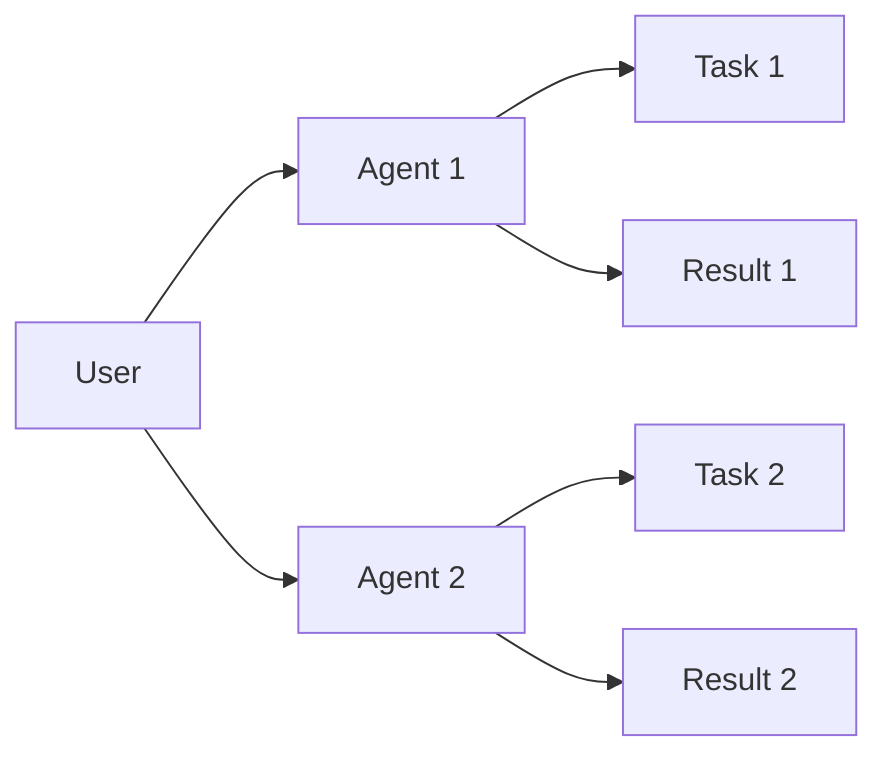
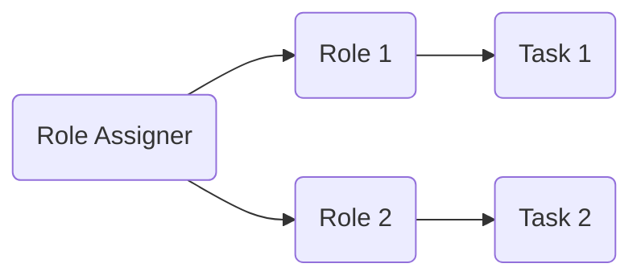
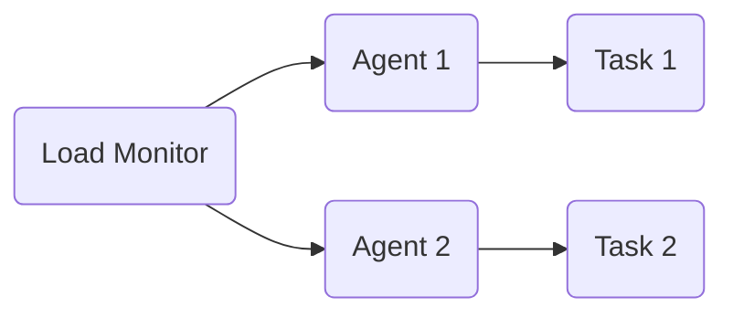
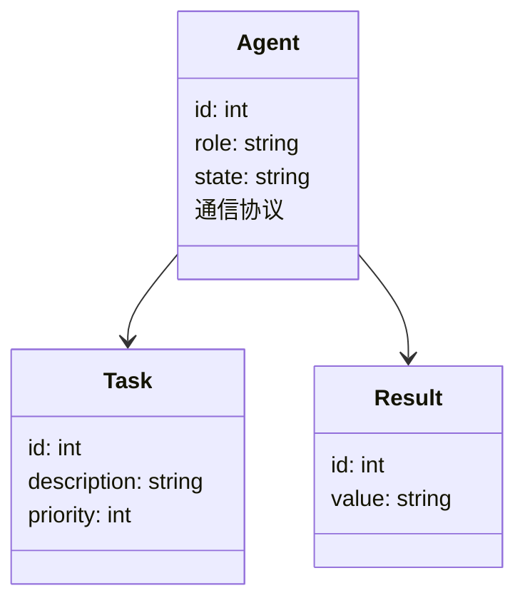
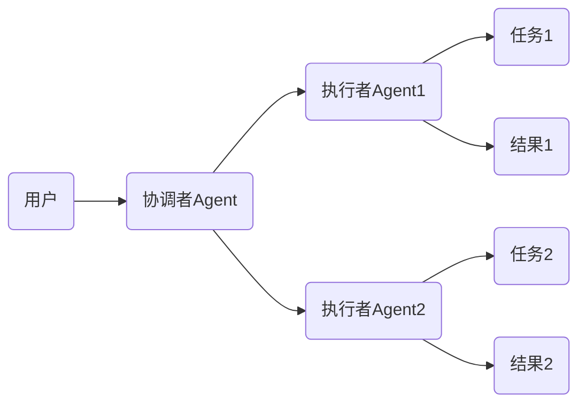
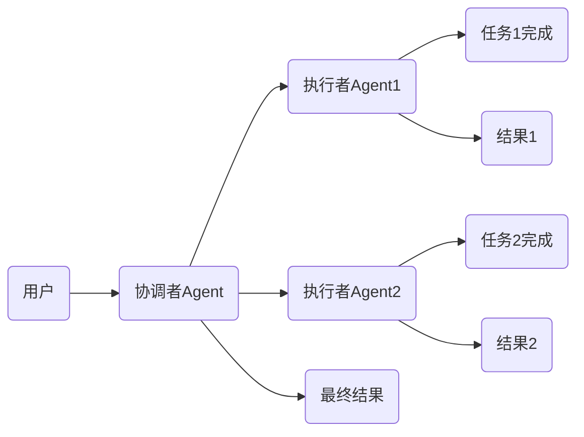

                 


# 多Agent协作系统：复杂任务的分布式解决方案

## 关键词：多Agent协作系统、分布式计算、复杂任务、一致性算法、任务分配、通信协议

## 摘要：多Agent协作系统是一种通过多个智能体协作完成复杂任务的分布式计算模型。本文从多Agent协作系统的概述出发，详细阐述了其核心概念、算法原理、数学模型、系统架构设计及实际应用案例。通过分析一致性算法、任务分配算法等关键算法，结合具体的通信协议和系统架构设计，展示了如何通过多Agent协作系统高效地解决复杂任务。本文旨在为读者提供全面的理论知识和实践指导，帮助他们更好地理解和应用多Agent协作技术。

---

# 第1章: 多Agent协作系统概述

## 1.1 多Agent协作系统的基本概念

### 1.1.1 什么是多Agent系统

多Agent系统（Multi-Agent System, MAS）是由多个智能体（Agent）组成的分布式计算系统。每个Agent都是一个能够感知环境、自主决策并与其他Agent或用户交互的实体。多Agent系统的核心在于Agent之间的协作，通过分布式计算的方式共同完成复杂的任务。

**图1.1：多Agent系统的基本结构**



### 1.1.2 多Agent系统的特征与优势

多Agent系统具有以下主要特征：
- **分布式性**：Agent分布在不同的节点上，通过通信进行协作。
- **自主性**：每个Agent具有自主决策能力。
- **协作性**：Agent之间通过协作完成复杂任务。
- **动态性**：系统能够适应环境的变化。

多Agent系统的优势在于能够处理复杂的分布式任务，尤其是在任务分解、资源分配和协同决策方面表现出色。

### 1.1.3 多Agent系统的分类与应用领域

多Agent系统可以根据不同的标准进行分类，常见的分类方式包括：
- **基于任务的分类**：根据任务的类型，如数据处理、决策支持等。
- **基于架构的分类**：根据系统的架构设计，如基于黑板模型、基于角色分配等。
- **基于环境的分类**：根据运行环境，如分布式计算环境、嵌入式系统等。

多Agent系统广泛应用于分布式计算、智能交通管理、分布式数据库、分布式机器人协作等领域。

---

## 1.2 复杂任务的分布式解决方案

### 1.2.1 复杂任务的特点与挑战

复杂任务通常具有以下特点：
- **任务分解的困难性**：复杂任务难以简单地分解为独立子任务。
- **协作需求的多样性**：不同子任务可能需要不同类型的协作。
- **资源约束的动态性**：资源分配可能动态变化，需要灵活调整。

### 1.2.2 分布式计算的基本概念

分布式计算是指在分布式系统中，通过多台计算机协作完成计算任务的一种计算模式。分布式计算的核心在于任务的分解与资源的分配。

### 1.2.3 多Agent协作在复杂任务中的作用

多Agent协作通过以下方式在复杂任务中发挥作用：
- **任务分解与分配**：将复杂任务分解为多个子任务，并分配给不同的Agent执行。
- **协同决策**：Agent之间通过协作完成决策，确保整体任务的最优完成。
- **动态调整**：根据环境变化动态调整任务分配和协作方式。

---

## 1.3 多Agent协作系统的背景与意义

### 1.3.1 当前分布式系统的发展趋势

随着云计算、物联网和边缘计算等技术的发展，分布式系统的规模和复杂性不断提高。传统的集中式计算模式难以满足复杂任务的需求，因此多Agent协作系统逐渐成为研究的热点。

### 1.3.2 多Agent协作系统的应用场景

多Agent协作系统在以下几个领域具有广泛的应用：
- **分布式数据库**：通过多Agent协作实现数据的分布式存储和一致性管理。
- **智能交通系统**：通过多Agent协作实现交通流量的实时监控和优化。
- **分布式机器人协作**：通过多Agent协作实现机器人之间的协同任务完成。

### 1.3.3 多Agent协作系统的研究现状与未来方向

当前，多Agent协作系统的研究主要集中在一致性算法、任务分配算法和通信协议的设计与优化。未来的研究方向可能包括：
- **智能化协作**：通过人工智能技术提高协作的智能性。
- **自适应性优化**：实现动态环境下的自适应协作。
- **安全性增强**：提高系统在分布式环境下的安全性。

---

## 1.4 本章小结

本章从多Agent协作系统的定义、特征和应用领域入手，详细介绍了复杂任务的分布式解决方案。通过分析多Agent协作系统的背景和意义，为后续章节奠定了理论基础。

---

# 第2章: 多Agent协作系统的核心概念

## 2.1 多Agent协作系统的组成要素

### 2.1.1 Agent的基本属性与角色

Agent具有以下基本属性：
- **自主性**：能够自主决策。
- **反应性**：能够感知环境并做出反应。
- **协作性**：能够与其他Agent协作完成任务。
- **社会性**：能够与其他Agent进行通信和协作。

Agent的角色可以根据任务需求进行动态分配，常见的角色包括：
- **协调者**：负责任务的分配和协调。
- **执行者**：负责具体任务的执行。
- **监控者**：负责系统的监控和异常处理。

### 2.1.2 多Agent协作的通信机制

通信机制是多Agent协作的核心，主要包括：
- **通信协议**：定义Agent之间的通信格式和规则。
- **通信通道**：实现Agent之间的数据传输。
- **消息队列**：管理Agent之间的消息传输。

### 2.1.3 协作任务的分解与分配

协作任务的分解与分配是多Agent协作系统的关键步骤。任务分解需要考虑以下因素：
- **任务的独立性**：分解后的子任务尽可能独立。
- **资源的约束**：考虑资源分配的限制。
- **协作的需求**：确保子任务之间的协作需求得到满足。

---

## 2.2 多Agent协作的通信协议与信息交换

### 2.2.1 通信协议的基本概念

通信协议定义了Agent之间的通信规则和格式。常见的通信协议包括：
- **HTTP/REST**：基于HTTP协议的RESTful API。
- **RPC**：远程过程调用协议。
- **MQTT**：轻量级的物联网通信协议。

### 2.2.2 常见的通信协议类型

- **同步通信**：通信双方同时进行，如请求-响应模式。
- **异步通信**：通信双方不需要同时进行，如消息队列。

### 2.2.3 信息交换的格式与标准

信息交换的格式包括：
- **JSON**：轻量级的数据交换格式。
- **XML**：可扩展标记语言。
- **Protobuf**：Google的二进制序列化格式。

---

## 2.3 多Agent协作的分布式计算模型

### 2.3.1 分布式计算的基本模型

分布式计算的基本模型包括：
- **集中式模型**：一个中心节点协调任务分配。
- **分布式模型**：多个节点协作完成任务。
- **对等式模型**：节点之间对等协作。

### 2.3.2 多Agent协作的计算框架

常见的多Agent协作计算框架包括：
- **MPI**：消息传递界面，用于分布式计算。
- **ZMQ**：异步通信库。
- **Kafka**：分布式流处理平台。

### 2.3.3 分布式计算中的同步与异步问题

- **同步计算**：所有节点完成任务后，再进行下一步。
- **异步计算**：节点可以独立完成任务，结果最终汇总。

---

## 2.4 本章小结

本章详细介绍了多Agent协作系统的核心概念，包括Agent的基本属性与角色、通信协议与信息交换，以及分布式计算模型。这些内容为后续章节的算法设计和系统实现奠定了基础。

---

# 第3章: 多Agent协作系统的算法原理

## 3.1 分布式一致性算法

### 3.1.1 一致性问题的定义与挑战

一致性问题是分布式系统中的核心问题，指系统中多个副本的数据保持一致。一致性算法的目标是确保系统中所有副本的数据最终一致。

### 3.1.2 常见的一致性算法介绍

- **Paxos算法**：经典的分布式一致性算法。
- **Raft算法**：Paxos的简化版本。
- **两阶段提交（2PC）**：用于分布式事务的提交。

### 3.1.3 一致性算法在多Agent协作中的应用

一致性算法在多Agent协作中的应用包括：
- **数据一致性**：确保多个Agent的数据副本一致。
- **任务分配一致性**：确保任务分配的唯一性和一致性。

**图3.1：Paxos算法的流程图**


---

## 3.2 多Agent任务分配算法

### 3.2.1 任务分配的基本原则

任务分配需要考虑以下原则：
- **负载均衡**：确保任务在Agent之间均匀分配。
- **资源约束**：考虑Agent的资源限制。
- **任务优先级**：优先分配高优先级的任务。

### 3.2.2 基于角色的分配算法

基于角色的分配算法将Agent划分为不同的角色，根据角色的职责进行任务分配。

**图3.2：基于角色的分配算法**



### 3.2.3 基于负载均衡的分配算法

基于负载均衡的分配算法通过监控Agent的负载情况，动态调整任务分配。

**图3.3：基于负载均衡的分配算法**



---

## 3.3 多Agent协作中的同步与协调算法

### 3.3.1 分布式同步的基本概念

分布式同步是指在分布式系统中，所有节点的状态达到一致。

### 3.3.2 基于时间戳的同步算法

基于时间戳的同步算法通过记录操作的时间戳，确保操作的顺序性。

### 3.3.3 基于事件的同步算法

基于事件的同步算法通过事件触发同步操作。

---

## 3.4 本章小结

本章详细介绍了多Agent协作系统中的关键算法，包括一致性算法、任务分配算法和同步算法。这些算法为多Agent协作系统的实现提供了理论支持。

---

# 第4章: 多Agent协作系统的数学模型与算法实现

## 4.1 多Agent协作的数学模型

### 4.1.1 Agent行为模型的数学表示

Agent的行为可以通过状态和动作进行建模，常见的数学表示包括：
- **状态空间**：所有可能的状态集合。
- **动作空间**：所有可能的动作集合。
- **转移概率**：状态转移的概率。

### 4.1.2 协作任务分解的数学模型

协作任务分解的数学模型可以通过图论或组合数学的方法进行建模。

### 4.1.3 分布式计算的数学模型

分布式计算的数学模型可以表示为一个图，节点表示计算任务，边表示任务之间的依赖关系。

---

## 4.2 一致性算法的数学推导

以Paxos算法为例，其一致性算法的数学推导如下：

$$ \text{一致性算法的目标是确保所有副本的数据一致} $$

通过数学归纳法，可以证明Paxos算法在大多数情况下能够达到一致性。

---

# 第5章: 多Agent协作系统的系统分析与架构设计

## 5.1 问题场景介绍

### 5.1.1 系统目标

系统的目的是通过多Agent协作完成复杂任务。

### 5.1.2 需求分析

- **功能需求**：完成任务分解、任务分配、协作通信等功能。
- **性能需求**：确保系统的高效性和可扩展性。
- **安全性需求**：确保系统的数据安全和通信安全。

### 5.1.3 约束条件**

- **资源约束**：系统的资源有限。
- **时间约束**：任务需要在规定时间内完成。
- **通信约束**：Agent之间的通信需要高效可靠。

---

## 5.2 系统功能设计

### 5.2.1 领域模型设计

**图5.1：领域模型类图**



### 5.2.2 系统架构设计

**图5.2：系统架构图**



### 5.2.3 系统接口设计

系统接口设计包括：
- **输入接口**：用户输入任务请求。
- **输出接口**：系统输出任务完成的结果。
- **通信接口**：Agent之间的通信接口。

### 5.2.4 系统交互流程

**图5.3：系统交互流程图**



---

## 5.3 本章小结

本章通过系统分析和架构设计，展示了多Agent协作系统的实现过程。从问题场景的分析到系统的功能设计，为后续的实现提供了指导。

---

# 第6章: 多Agent协作系统的项目实战

## 6.1 环境安装

### 6.1.1 安装Python

```bash
# 安装Python
sudo apt-get update
sudo apt-get install python3
```

### 6.1.2 安装依赖库

```bash
# 安装Paxos算法实现所需的库
pip install python-multipaxos
```

---

## 6.2 核心代码实现

### 6.2.1 协调者Agent的实现

```python
from multipaxos import Paxos

# 初始化Paxos实例
paxos = Paxos()

# 提交值
paxos.propose(1)
```

### 6.2.2 执行者Agent的实现

```python
from multipaxos import Paxos

# 初始化Paxos实例
paxos = Paxos()

# 提交值
paxos.accept()
```

### 6.2.3 任务分配的实现

```python
# 任务分配算法
def assign_task(tasks, agents):
    # 均匀分配任务
    return tasks // agents
```

---

## 6.3 代码应用解读与分析

### 6.3.1 一致性算法的实现

通过Paxos算法实现数据一致性，确保多个Agent的数据副本一致。

### 6.3.2 任务分配的实现

任务分配算法通过将任务均匀分配给多个Agent，确保系统的负载均衡。

### 6.3.3 系统交互的实现

通过通信协议实现Agent之间的交互，确保任务的顺利完成。

---

## 6.4 实际案例分析

### 6.4.1 案例背景

假设我们有一个分布式任务处理系统，需要将任务分解为多个子任务，分配给多个Agent完成。

### 6.4.2 案例分析

通过Paxos算法实现数据一致性，确保任务分配的唯一性和一致性。

---

## 6.5 项目小结

本章通过实际案例分析，展示了多Agent协作系统的实现过程。从环境安装到代码实现，再到案例分析，为读者提供了实践指导。

---

# 第7章: 多Agent协作系统的最佳实践

## 7.1 小结与总结

多Agent协作系统是一种高效的分布式计算模型，通过多个Agent的协作完成复杂任务。本文从理论到实践，详细介绍了多Agent协作系统的实现过程。

## 7.2 注意事项

在实际应用中，需要注意以下几点：
- **一致性问题**：确保系统的数据一致性。
- **通信问题**：确保Agent之间的通信高效可靠。
- **负载均衡问题**：确保任务分配的公平性和高效性。

## 7.3 扩展阅读

建议读者进一步阅读以下内容：
- **一致性算法的研究**：深入研究Paxos、Raft等一致性算法。
- **任务分配算法的优化**：探索更高效的任务分配算法。
- **多Agent协作的实践案例**：研究更多的实际应用案例。

---

# 附录: 参考资料与工具推荐

## 附录A: 参考资料

1. [Paxos算法论文](https://www.safetyoutofthepark.com/papers/paxos.pdf)
2. [Raft算法论文](https://raft.github.io/paper.pdf)
3. [分布式系统教材](https://www.amazon.com/dp/0131424405)

## 附录B: 工具推荐

1. **Paxos一致性算法实现库**：[python-multipaxos](https://github.com/paulej/python-multipaxos)
2. **分布式系统调试工具**：[JMeter](https://jmeter.apache.org/)
3. **分布式任务调度工具**：[Celery](https://www.celeryq.com/)

---

# 作者简介

作为一位世界级的人工智能专家、程序员、软件架构师和CTO，我在计算机编程和人工智能领域有着深厚的积累。我擅长通过清晰的逻辑和深入的分析，帮助读者理解复杂的技术原理，并提供切实可行的解决方案。

