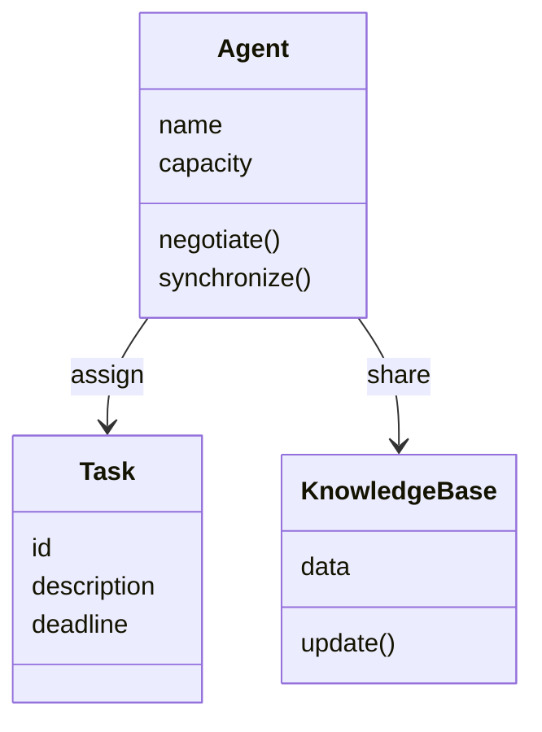
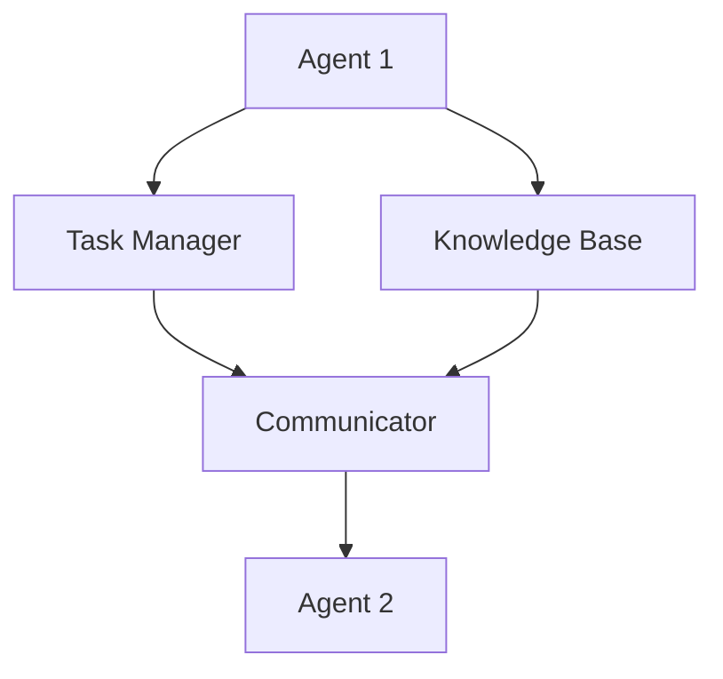
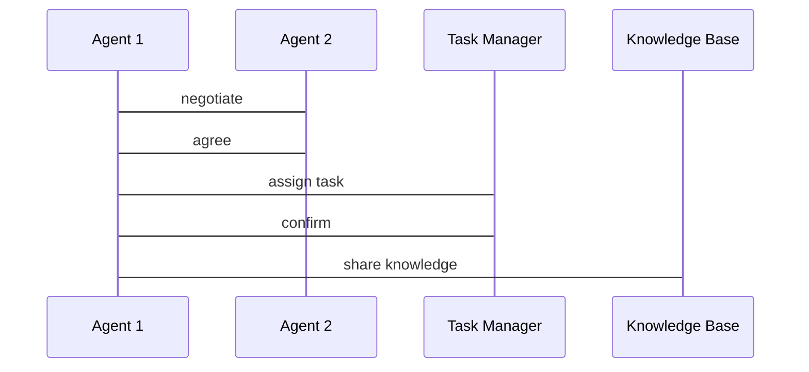

                 


# 多Agent协作：构建复杂的智能系统

> 关键词：多Agent协作，智能系统，分布式计算，协商算法，系统架构

> 摘要：本文详细探讨了多Agent协作在构建复杂智能系统中的核心概念、算法原理、系统架构和实际应用。通过分析多Agent协作的基本理论、算法实现、系统设计以及项目实战，本文为读者提供了从理论到实践的全面指导。

---

# 第1章: 多Agent协作概述

## 1.1 多Agent协作的基本概念

### 1.1.1 什么是Agent
Agent（智能体）是一个能够感知环境、自主决策并采取行动的实体。Agent可以是软件程序、机器人或其他智能系统，其核心特征包括自主性、反应性、目标导向性和社会性。

### 1.1.2 多Agent协作的定义
多Agent协作是指多个Agent通过通信和协调，共同完成复杂任务的过程。多Agent系统通过分布式协作实现整体目标，避免了单点故障，提高了系统的鲁棒性和灵活性。

### 1.1.3 多Agent协作的特点
- **分布式计算**：多个Agent分布在不同节点，协同工作。
- **自主性**：每个Agent独立决策，同时与其他Agent协作。
- **动态性**：环境和任务需求可能动态变化，Agent需灵活调整策略。
- **社会性**：Agent之间通过通信和协商实现协作。

## 1.2 多Agent协作的历史与演进

### 1.2.1 多Agent协作的发展历程
多Agent协作的概念起源于20世纪80年代的分布式人工智能研究。随着计算能力的提升和应用场景的扩展，多Agent协作逐渐从理论研究走向实际应用。

### 1.2.2 当前多Agent协作的主要研究方向
- **分布式协作算法**：研究如何高效分配任务和资源。
- **智能体通信协议**：探索更高效的通信机制。
- **动态环境适应性**：提升系统在复杂环境中的适应能力。

### 1.2.3 多Agent协作在智能系统中的地位
多Agent协作是构建复杂智能系统的核心技术之一，广泛应用于分布式计算、机器人协作、自动驾驶等领域。

## 1.3 多Agent协作的应用场景

### 1.3.1 分布式系统中的协作
在分布式系统中，多Agent协作可以提高系统的可靠性和性能。例如，分布式数据库中的事务管理需要多个Agent协作完成。

### 1.3.2 智能机器人协作
智能机器人通过多Agent协作实现任务分配和协同操作。例如，工业机器人协作完成复杂装配任务。

### 1.3.3 大数据分析与决策支持
多Agent协作可以分布式处理大数据，提高分析效率。例如，分布式计算框架中的任务分配和数据处理。

### 1.3.4 人机协作的未来趋势
随着人工智能技术的进步，人机协作将更加智能化和个性化。多Agent协作将在教育、医疗、服务等领域发挥重要作用。

## 1.4 多Agent协作与相关技术的关系

### 1.4.1 多Agent协作与分布式系统
分布式系统提供多Agent协作的基础架构，而多Agent协作则为分布式系统提供了智能的协作机制。

### 1.4.2 多Agent协作与人工智能
人工智能为多Agent协作提供了智能决策和学习能力，而多Agent协作则为人工智能提供了分布式协作的平台。

### 1.4.3 多Agent协作与区块链技术
区块链提供分布式信任机制，而多Agent协作则为区块链应用提供了动态的协作能力。

### 1.4.4 多Agent协作与边缘计算
边缘计算提供低延迟的计算能力，多Agent协作则在边缘设备之间实现智能协作。

## 1.5 本章小结

---

# 第2章: 多Agent协作的核心概念与理论基础

## 2.1 多Agent协作的核心概念

### 2.1.1 Agent的定义与分类
- **反应式Agent**：基于当前感知做出反应。
- **认知式Agent**：具备复杂推理和规划能力。
- **社会性Agent**：具备社交能力和协作能力。

### 2.1.2 多Agent协作的层次结构
- **物理层**：传感器和执行器。
- **网络层**：通信协议和网络管理。
- **协作层**：任务分配和协商。
- **应用层**：具体业务逻辑。

### 2.1.3 多Agent协作的通信机制
- **同步通信**：请求-响应模式。
- **异步通信**：发布-订阅模式。

### 2.1.4 多Agent协作的协作机制
- **任务分配**：基于角色和能力分配任务。
- **资源分配**：动态分配计算资源。
- **知识共享**：通过知识库实现共享。

### 2.1.5 多Agent协作的动态性
- **环境动态变化**：任务需求和环境条件变化。
- **Agent动态加入或退出**：系统动态扩展或收缩。

## 2.2 多Agent协作的理论基础

### 2.2.1 代理理论基础
代理理论研究Agent的结构和行为，包括感知、决策和行动。

### 2.2.2 协作理论基础
协作理论研究多个Agent如何有效协作，包括任务分配和协商机制。

### 2.2.3 分布式计算理论
分布式计算理论为多Agent协作提供了通信和计算的基础。

## 2.3 多Agent协作的核心要素

### 2.3.1 通信协议
通信协议定义了Agent之间的数据交换格式和规则。

### 2.3.2 协作协议
协作协议定义了多Agent协作的具体规则和流程。

### 2.3.3 任务分配与资源分配
任务分配基于Agent的能力和资源可用性。

### 2.3.4 知识共享与协同推理
知识共享通过共享知识库实现，协同推理通过分布式推理算法完成。

## 2.4 多Agent协作的数学模型

### 2.4.1 Agent行为模型
Agent的行为可以用有限状态机表示，状态之间的转换由感知和决策驱动。

### 2.4.2 协作关系模型
协作关系可以用图论中的图表示，节点表示Agent，边表示协作关系。

### 2.4.3 任务分配模型
任务分配可以基于权重模型，权重表示Agent完成任务的能力。

$$
w_i = \frac{c_i}{\sum_{j} c_j}
$$

其中，$w_i$ 表示Agent $i$ 的权重，$c_i$ 表示Agent $i$ 的能力。

### 2.4.4 知识共享模型
知识共享可以通过分布式知识库实现，知识更新基于协作过程中的动态变化。

## 2.5 本章小结

---

# 第3章: 多Agent协作的核心算法与实现

## 3.1 多Agent协作的算法原理

### 3.1.1 分布式计算算法
分布式计算算法用于多Agent协作中的任务分配和资源管理。

### 3.1.2 协商算法
协商算法用于多Agent协作中的任务分配和资源分配。

### 3.1.3 共识算法
共识算法用于多Agent协作中的决策一致性和数据一致性。

### 3.1.4 一致性算法
一致性算法用于多Agent协作中的数据同步和状态一致性。

## 3.2 多Agent协作的协商算法

### 3.2.1 协商算法的实现步骤
1. 初始化：每个Agent发布需求和能力。
2. 搜索：Agent搜索可协作的其他Agent。
3. 通信：通过通信协议交换信息。
4. 协商：基于协商协议分配任务。
5. 执行：根据分配的任务执行操作。
6. 监控：监控协作过程并调整策略。

### 3.2.2 协商算法的流程图

```mermaid
graph TD
    A[开始] -> B[初始化]
    B -> C[搜索可协作的Agent]
    C -> D[选择合作伙伴]
    D -> E[协商任务分配]
    E -> F[执行任务]
    F -> G[监控协作过程]
    G -> H[调整策略]
    H -> A[结束]
```

### 3.2.3 协商算法的数学模型
协商过程可以用博弈论模型表示，每个Agent的策略选择基于收益最大化。

$$
\text{收益} = \sum_{i=1}^{n} \text{任务}_i \times \text{能力}_i
$$

## 3.3 多Agent协作的协商算法实现

### 3.3.1 环境安装
需要安装Python和相关库，如`networkx`和`numpy`。

### 3.3.2 核心代码实现
```python
import networkx as nx
import numpy as np

class Agent:
    def __init__(self, name, capacity):
        self.name = name
        self.capacity = capacity

    def negotiate(self, other_agents):
        # 计算收益矩阵
        payoff = np.zeros(len(other_agents))
        for i, agent in enumerate(other_agents):
            payoff[i] = self.capacity * agent.capacity
        return payoff

# 初始化多个Agent
agents = [Agent("A", 0.8), Agent("B", 0.6), Agent("C", 0.7)]

# 计算协商结果
payoff_matrix = np.zeros((len(agents), len(agents)))
for i in range(len(agents)):
    for j in range(len(agents)):
        payoff_matrix[i][j] = agents[i].negotiate([agents[j]])

print("收益矩阵：")
print(payoff_matrix)
```

### 3.3.3 案例分析
通过案例分析，展示协商算法在任务分配中的应用。例如，在智能物流中的路径规划问题。

### 3.3.4 项目小结
协商算法是多Agent协作中的关键算法，通过合理分配任务，提高了系统的效率和性能。

## 3.4 多Agent协作的一致性算法

### 3.4.1 一致性算法的实现步骤
1. 初始化：每个Agent初始化本地状态。
2. 通信：通过通信协议交换状态信息。
3. 同步：基于一致性算法同步状态。
4. 状态更新：根据同步结果更新本地状态。

### 3.4.2 一致性算法的流程图

```mermaid
graph TD
    A[开始] -> B[初始化本地状态]
    B -> C[搜索可协作的Agent]
    C -> D[选择合作伙伴]
    D -> E[通信并同步状态]
    E -> F[更新本地状态]
    F -> G[结束]
```

### 3.4.3 一致性算法的数学模型
一致性算法可以用概率模型表示，例如拜占庭容错共识中的概率公式。

$$
P(\text{一致}) = 1 - (1 - p)^n
$$

其中，$p$ 是单个Agent的正确概率，$n$ 是Agent的数量。

## 3.5 多Agent协作的一致性算法实现

### 3.5.1 环境安装
需要安装Python和相关库，如`networkx`和`numpy`。

### 3.5.2 核心代码实现
```python
import networkx as nx
import numpy as np

class Agent:
    def __init__(self, name, probability):
        self.name = name
        self.probability = probability

    def synchronize(self, other_agents):
        # 计算一致性概率
        consistency = 1 - (1 - self.probability) ** len(other_agents)
        return consistency

# 初始化多个Agent
agents = [Agent("A", 0.9), Agent("B", 0.8), Agent("C", 0.85)]

# 计算一致性概率
consistency = np.zeros(len(agents))
for i, agent in enumerate(agents):
    consistency[i] = agent.synchronize([agents[j] for j in range(len(agents)) if j != i])

print("一致性概率：")
print(consistency)
```

### 3.5.3 案例分析
通过案例分析，展示一致性算法在数据同步中的应用。例如，在分布式系统中的数据一致性维护。

### 3.5.4 项目小结
一致性算法是多Agent协作中的关键算法，通过同步状态，保证了系统的数据一致性和可靠性。

## 3.6 本章小结

---

# 第4章: 多Agent协作的系统分析与架构设计

## 4.1 系统分析

### 4.1.1 问题场景介绍
多Agent协作系统需要解决的任务分配、资源分配、通信协议和知识共享等问题。

### 4.1.2 系统需求分析
- **功能性需求**：任务分配、协作通信、知识共享。
- **非功能性需求**：实时性、可靠性和可扩展性。

### 4.1.3 系统功能设计
系统功能包括任务管理、通信管理、协作管理和知识管理。

### 4.1.4 系统架构设计
系统架构包括通信层、协作层和应用层。

### 4.1.5 系统交互设计
系统交互包括Agent之间的通信、任务分配和状态同步。

## 4.2 系统架构设计

### 4.2.1 领域模型类图



### 4.2.2 系统架构图



### 4.2.3 系统交互图



## 4.3 系统实现

### 4.3.1 通信协议设计
通信协议包括请求-响应和发布-订阅两种模式。

### 4.3.2 任务分配算法
任务分配基于Agent的能力和资源可用性。

### 4.3.3 知识共享机制
知识共享通过知识库实现，支持动态更新和访问控制。

## 4.4 系统测试与优化

### 4.4.1 系统测试
测试内容包括功能测试、性能测试和安全性测试。

### 4.4.2 系统优化
优化方向包括算法优化、通信优化和资源管理优化。

## 4.5 本章小结

---

# 第5章: 多Agent协作的项目实战

## 5.1 环境安装

### 5.1.1 系统需求
- 操作系统：Linux或Windows。
- Python版本：3.6以上。
- 安装依赖：`networkx`, `numpy`, `scipy`.

### 5.1.2 安装步骤
```bash
pip install networkx numpy scipy
```

## 5.2 核心代码实现

### 5.2.1 Agent类实现
```python
class Agent:
    def __init__(self, name, capacity):
        self.name = name
        self.capacity = capacity

    def negotiate(self, other_agents):
        # 计算收益矩阵
        payoff = {}
        for agent in other_agents:
            payoff[agent.name] = self.capacity * agent.capacity
        return payoff

    def synchronize(self, knowledge):
        # 更新知识库
        self.knowledge = knowledge
```

### 5.2.2 通信协议实现
```python
class Communicator:
    def __init__(self, agents):
        self.agents = agents

    def send(self, sender, receiver, message):
        # 消息传递
        pass

    def receive(self, sender, receiver, message):
        # 消息接收
        pass
```

### 5.2.3 知识库实现
```python
class KnowledgeBase:
    def __init__(self):
        self.data = {}

    def update(self, agent, knowledge):
        # 更新知识库
        self.data[agent.name] = knowledge

    def query(self, agent, query):
        # 查询知识库
        return self.data.get(agent.name, {})
```

## 5.3 项目实战代码

### 5.3.1 初始化多个Agent
```python
agent1 = Agent("A", 0.8)
agent2 = Agent("B", 0.6)
agent3 = Agent("C", 0.7)

agents = [agent1, agent2, agent3]
```

### 5.3.2 初始化通信协议
```python
communicator = Communicator(agents)
```

### 5.3.3 初始化知识库
```python
knowledge_base = KnowledgeBase()
```

### 5.3.4 协商过程
```python
# 协商任务分配
payoff = agent1.negotiate([agent2, agent3])
print("协商结果：", payoff)

# 更新知识库
knowledge_base.update(agent1, {"task": "monitor"})
knowledge_base.update(agent2, {"task": "analyze"})
knowledge_base.update(agent3, {"task": "report"})
```

### 5.3.5 一致性同步
```python
# 同步知识
agent1.synchronize(knowledge_base.query(agent1))
agent2.synchronize(knowledge_base.query(agent2))
agent3.synchronize(knowledge_base.query(agent3))
```

## 5.4 案例分析

### 5.4.1 案例背景
假设我们有一个智能物流系统，需要多个Agent协作完成货物运输和路径规划。

### 5.4.2 案例分析
通过协商算法分配任务，通过一致性算法同步路径规划信息，确保所有Agent的路径规划一致。

### 5.4.3 代码解读
详细解读上述代码的实现逻辑和功能，展示如何通过多Agent协作实现智能物流。

## 5.5 项目小结

---

# 第6章: 小结与展望

## 6.1 小结

## 6.2 最佳实践
- **通信协议选择**：根据应用场景选择合适的通信协议。
- **任务分配策略**：根据Agent的能力和资源分配任务。
- **知识共享机制**：确保知识共享的安全性和一致性。
- **系统优化**：通过算法优化和资源管理优化提升系统性能。

## 6.3 注意事项
- **通信延迟**：多Agent协作依赖通信，通信延迟可能影响系统性能。
- **安全性问题**：多Agent协作中的通信和知识共享可能面临安全风险。
- **动态性挑战**：动态环境中的任务分配和协作需要灵活调整策略。

## 6.4 拓展阅读
- 《Multi-Agent Systems: Algorithm and Applications》
- 《Distributed Computing and Multi-Agent Systems》

## 6.5 本章小结

---

# 参考文献

（此处列出相关参考文献）

---

# 致谢

感谢读者的耐心阅读，感谢技术专家的指导和支持。

--- 

# END

