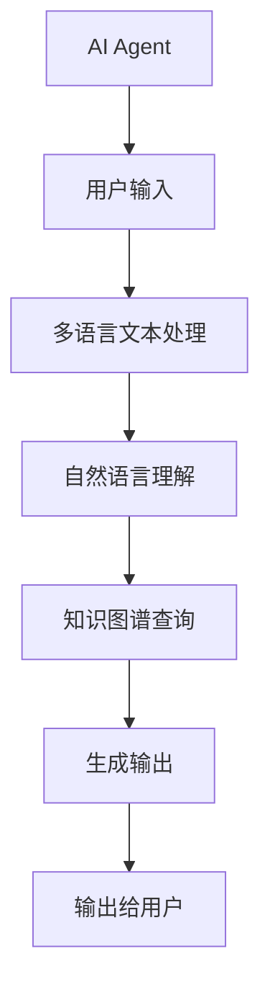
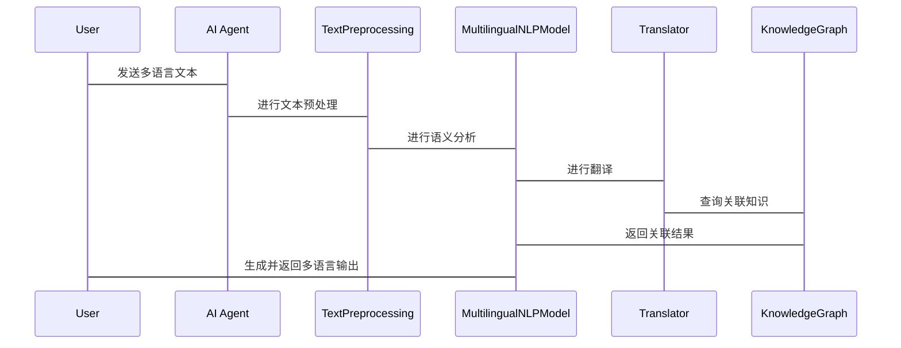

                 


# 多语言支持：构建国际化的AI Agent

## 关键词
- 多语言支持
- AI Agent
- 自然语言处理
- 国际化
- 深度学习

## 摘要
构建一个多语言支持的AI Agent，能够理解、生成并处理多种语言的自然语言文本，是实现真正国际化AI系统的关键。本文从多语言支持的重要性出发，详细探讨了多语言支持的核心技术与实现原理，包括自然语言处理（NLP）基础、多语言语言模型的训练与优化、基于深度学习的多语言算法原理，以及系统架构设计与项目实战。通过本文的学习，读者将能够掌握构建一个多语言支持的国际化AI Agent所需的关键技术和方法。

# 第一部分: 多语言支持与国际化的概述

## 第1章: 多语言支持与国际化的背景

### 1.1 多语言支持的重要性
#### 1.1.1 全球化背景下的语言多样性
在当今全球化时代，语言多样性是一个不可忽视的现实。随着互联网的普及，信息的传播不再局限于单一语言，用户对于多语言支持的需求日益增长。例如，一家跨国公司可能需要在不同国家使用不同语言的用户界面，或者一个AI客服系统需要能够理解并回应多种语言的客户需求。这种需求推动了多语言支持技术的发展。

#### 1.1.2 多语言支持的市场需求与应用场景
多语言支持的应用场景非常广泛。例如：
- **国际化的商业应用**：企业需要通过多语言支持来覆盖全球市场，提升用户体验。
- **跨文化交流**：在跨国会议、社交平台等场景中，多语言支持能够促进更有效的沟通。
- **教育与信息共享**：多语言支持使得教育资源和信息能够被更多人获取，推动知识的普及。

#### 1.1.3 国际化在AI Agent中的意义
AI Agent的目标是为用户提供智能化的服务，而多语言支持是其实现国际化的关键。一个能够理解并生成多种语言的AI Agent，不仅能够满足不同地区用户的需求，还能提升用户体验，增强产品的市场竞争力。

### 1.2 国际化与多语言支持的核心概念
#### 1.2.1 多语言支持的定义与范围
多语言支持（Multilingual Support）指的是系统能够理解和处理多种语言的能力。这包括文本的输入、处理、输出等环节。多语言支持的范围包括：
- 文本的多语言分词与解析
- 多语言文本的语义分析
- 多语言的自然语言生成

#### 1.2.2 国际化在AI Agent中的实现方式
国际化（Internationalization）在AI Agent中的实现，不仅仅是界面的多语言显示，更包括整个系统对不同语言环境的适应。这需要从数据处理、模型训练到系统架构等多方面进行优化。

#### 1.2.3 多语言支持与国际化的区别与联系
虽然多语言支持和国际化在目标上都有涉及多种语言，但它们的概念有所不同。多语言支持更侧重于技术实现，而国际化则是一个更广泛的概念，涵盖了产品在不同文化、语言环境下的适应性。两者相辅相成，共同推动AI Agent的国际化。

### 1.3 本章小结
本章从全球化背景出发，分析了多语言支持的重要性及其在AI Agent中的意义。通过明确多语言支持与国际化的区别与联系，为后续的技术实现奠定了基础。

---

# 第二部分: 多语言支持的核心技术与实现原理

## 第2章: 多语言支持的关键技术

### 2.1 自然语言处理（NLP）基础
#### 2.1.1 NLP的核心概念与技术
自然语言处理（NLP）是实现多语言支持的核心技术。NLP的目标是让计算机能够理解、处理和生成人类语言。核心概念包括：
- **文本预处理**：如分词、去停用词、词干提取等。
- **特征提取**：通过词袋模型、TF-IDF等方法提取文本特征。
- **文本分类**：对文本进行主题分类、情感分析等。

#### 2.1.2 多语言NLP的挑战与解决方案
多语言NLP面临的主要挑战包括：
- **语言间差异**：不同语言的语法、词汇差异大，影响模型的泛化能力。
- **数据稀缺性**：某些语言的数据量有限，影响模型的训练效果。
- **计算资源限制**：多语言模型的训练需要更多的计算资源。

解决方案包括：
- **跨语言迁移学习**：利用资源丰富的语言数据来提升低资源语言的性能。
- **多语言预训练模型**：如多语言BERT（mBERT）等，直接在多种语言上进行预训练。

### 2.2 语言模型的多语言扩展
#### 2.2.1 多语言语言模型的原理
多语言语言模型（如mBERT、XLM）通过在多种语言的数据上进行预训练，使得模型能够捕捉到跨语言的语义信息。其核心思想是，语言间的语义有相似性，可以通过联合训练来提升模型的多语言能力。

#### 2.2.2 基于预训练模型的多语言支持
预训练模型通过大规模的无监督学习，掌握了多种语言的语法和语义信息。在实际应用中，可以根据具体任务对模型进行微调（Fine-tuning）。例如：
- **机器翻译**：使用多语言模型进行跨语言翻译。
- **问答系统**：支持多语言的问答系统。

#### 2.2.3 多语言模型的训练与优化
多语言模型的训练需要考虑以下因素：
- **数据平衡**：避免某一种语言的数据过多，导致模型偏向该语言。
- **语言间的相似性**：选择语义相似的语言进行联合训练，提升模型的性能。
- **模型架构优化**：如使用共享参数、跨语言注意力机制等。

### 2.3 文本处理与语言转换技术
#### 2.3.1 多语言文本的分词与解析
不同语言的文本分词规则差异很大。例如，英文是基于空格分词，而中文需要分词工具进行处理。多语言分词需要针对每种语言的特点进行定制化处理。

#### 2.3.2 语言间的自动翻译技术
自动翻译技术（Machine Translation）是多语言支持的重要组成部分。主流的翻译技术包括：
- **统计机器翻译（SMT）**：基于语言学规则和统计模型。
- **基于神经网络的机器翻译（NMT）**：如Transformer模型。

#### 2.3.3 文本的语义分析与统一表示
为了实现多语言支持，需要将不同语言的文本映射到一个统一的语义空间中。这可以通过跨语言表示学习（Cross-lingual Representation Learning）实现。例如，使用多语言BERT模型对不同语言的文本进行嵌入表示，这些表示能够捕捉到语义信息。

### 2.4 知识图谱与跨语言知识关联
#### 2.4.1 知识图谱的基本概念
知识图谱是一种结构化的知识表示方式，用于存储实体及其关系。在多语言支持中，知识图谱需要能够关联不同语言的实体和概念。

#### 2.4.2 跨语言知识关联技术
通过跨语言链接（Cross-lingual Linking），可以将不同语言的知识图谱中的实体关联起来。例如，将中文的“苹果”与英文的“Apple”关联起来，以便在多语言环境中共享知识。

---

## 第3章: 多语言支持的算法原理

### 3.1 多语言NLP算法概述
#### 3.1.1 多语言文本分类算法
多语言文本分类的核心挑战在于如何处理不同语言的文本特征。解决方案包括：
- 使用多语言预训练模型提取特征。
- 使用跨语言迁移学习。

#### 3.1.2 多语言情感分析算法
情感分析是判断文本的情感倾向（如正面、负面、中性）。在多语言环境下，需要考虑不同语言情感表达的差异。例如，中文中的“高兴”对应英文的“happy”，但表达方式可能不同。

#### 3.1.3 多语言机器翻译算法
基于Transformer的多语言机器翻译模型（如mBERT、XLM）能够同时支持多种语言的翻译任务。其核心思想是利用跨语言的注意力机制，捕捉语言间的语义关联。

### 3.2 基于深度学习的多语言模型
#### 3.2.1 Transformer模型的多语言扩展
Transformer模型通过自注意力机制（Self-attention）能够捕捉文本中的长距离依赖关系。在多语言环境下，可以使用跨语言注意力机制来增强模型的多语言理解能力。

#### 3.2.2 多语言BERT模型的原理与实现
多语言BERT模型（mBERT）在多种语言的文本上进行预训练，使得模型能够理解不同语言的上下文关系。具体实现包括：
1. 使用多语言数据进行预训练。
2. 对每种语言进行微调，以适应特定任务的需求。

#### 3.2.3 多语言GPT模型的训练与应用
多语言GPT模型（如XLM）通过联合训练多种语言的文本，生成多语言的文本生成能力。其应用场景包括：
- 多语言对话生成
- 跨语言文本摘要
- 多语言内容生成

### 3.3 算法实现的数学模型与公式
#### 3.3.1 Transformer模型的数学公式
Transformer模型的自注意力机制可以通过以下公式表示：
$$
\text{Attention}(Q,K,V) = \text{softmax}\left(\frac{QK^T}{\sqrt{d_k}}\right)V
$$

其中：
- \( Q \) 是查询（Query）
- \( K \) 是键（Key）
- \( V \) 是值（Value）
- \( d_k \) 是维度

#### 3.3.2 BERT模型的损失函数
BERT模型的损失函数包括遮蔽词预测（Masked LM）和下文分类（NextSentencePrediction）两部分。遮蔽词预测的损失函数为：
$$
\text{loss}_{\text{ MLM}} = -\frac{1}{L}\sum_{i=1}^{L}\text{CE}(y_i, \hat{y}_i)
$$
其中，\( L \) 是遮蔽词的数量，\( \text{CE} \) 是交叉熵损失。

#### 3.3.3 GPT模型的生成概率公式
GPT模型的生成概率公式为：
$$
P(\text{下一个词}| \text{上下文}) = \text{softmax}(W_{o}h_i)
$$
其中，\( h_i \) 是第i层的隐藏层输出，\( W_{o} \) 是输出权重矩阵。

---

## 第4章: 系统分析与架构设计

### 4.1 问题场景介绍
在构建一个多语言支持的AI Agent时，需要考虑以下问题：
- 如何实现多语言文本的输入、处理和输出？
- 如何保证不同语言的语义理解准确？
- 如何实现跨语言的知识关联与共享？

### 4.2 系统功能设计
#### 4.2.1 领域模型类图
通过Mermaid绘制领域模型类图，展示系统中各核心类及其关系。

```mermaid
classDiagram
    class TextPreprocessing {
        - input_text: str
        - processed_text: str
        + preprocess()
    }
    class MultilingualNLPModel {
        - model: Model
        + predict(text: str): Result
    }
    class Translator {
        - source_lang: str
        - target_lang: str
        + translate(text: str): str
    }
    class KnowledgeGraph {
        - entities: list
        - relations: list
        + link_entities(lang: str)
    }
    TextPreprocessing -> MultilingualNLPModel
    MultilingualNLPModel -> Translator
    Translator -> KnowledgeGraph
```

#### 4.2.2 系统架构设计
通过Mermaid绘制系统架构图，展示系统的整体结构。



### 4.3 系统接口设计
系统需要提供以下接口：
- 多语言文本处理接口：接受多种语言的文本输入，返回处理后的结果。
- 机器翻译接口：接受源语言和目标语言，返回翻译后的文本。
- 知识图谱查询接口：接受查询语言，返回关联的知识。

### 4.4 系统交互设计
通过Mermaid绘制交互序列图，展示系统与用户之间的交互流程。



---

## 第5章: 项目实战

### 5.1 环境安装
要实现一个多语言支持的AI Agent，需要安装以下环境：
- **Python**：推荐使用Python 3.8及以上版本。
- **深度学习框架**：如TensorFlow、PyTorch。
- **NLP库**：如transformers库（用于加载预训练的多语言模型）。

安装命令示例：
```bash
pip install python>=3.8
pip install tensorflow==2.5.0
pip install transformers==4.10.0
```

### 5.2 核心代码实现
以下是多语言支持的AI Agent的核心代码示例：

#### 5.2.1 加载多语言模型
```python
from transformers import AutoTokenizer, AutoModelForMaskedLM

# 加载多语言BERT模型
model_name = "bert-base-multilingual-cased"
tokenizer = AutoTokenizer.from_pretrained(model_name)
model = AutoModelForMaskedLM.from_pretrained(model_name)
```

#### 5.2.2 多语言文本处理
```python
def preprocess(text: str) -> str:
    # 分词
    tokens = tokenizer.tokenize(text)
    # 生成输入ID
    inputs = tokenizer.encode_plus(text, return_tensors='pt', padding=True, truncation=True)
    return inputs

def process_multilingual_text(text: str, model, tokenizer):
    inputs = preprocess(text)
    with torch.no_grad():
        outputs = model(**inputs)
    # 获取预测结果
    predictions = outputs.logits.argmax(dim=-1)
    return predictions
```

#### 5.2.3 跨语言知识关联
```python
def link_entities(entity1: str, entity2: str, language: str):
    # 查询知识图谱中的关联
    # 假设知识图谱支持多语言实体链接
    graph = KnowledgeGraph()
    return graph.link_entities(entity1, entity2, language)
```

### 5.3 案例分析与详细解读
假设我们构建一个多语言客服AI Agent，能够理解并回答用户用多种语言提出的问题。例如，用户可以用中文或英文提问，AI Agent能够理解并生成相应的回答。

#### 5.3.1 中文问题处理
```python
text_zh = "如何使用这个功能？"
inputs_zh = preprocess(text_zh)
outputs_zh = model(**inputs_zh)
predictions_zh = outputs_zh.logits.argmax(dim=-1)
print(predictions_zh)
```

#### 5.3.2 英文问题处理
```python
text_en = "How to use this feature?"
inputs_en = preprocess(text_en)
outputs_en = model(**inputs_en)
predictions_en = outputs_en.logits.argmax(dim=-1)
print(predictions_en)
```

#### 5.3.3 跨语言知识关联
假设用户用中文询问“苹果的价格”，系统需要关联到英文的“Apple”进行知识查询：
```python
result = link_entities("苹果", "Apple", "zh")
print(result)
```

### 5.4 项目小结
通过本章的项目实战，我们展示了如何利用现有的深度学习框架和NLP库，快速实现一个多语言支持的AI Agent。代码示例涵盖了文本预处理、模型加载、多语言文本处理以及跨语言知识关联等多个方面，为实际应用提供了参考。

---

## 第6章: 总结与展望

### 6.1 本章总结
本文详细探讨了多语言支持在AI Agent中的实现，从技术背景到核心算法，再到系统架构和项目实战，全面阐述了构建一个多语言支持的国际化AI Agent的关键技术和方法。

### 6.2 未来展望
随着深度学习和NLP技术的不断进步，多语言支持的AI Agent将具备更强的语义理解和生成能力。未来的研究方向包括：
- **更高效的多语言模型**：如更大规模的预训练模型，更高的训练效率。
- **跨语言知识图谱的优化**：提升跨语言实体关联的准确性和效率。
- **多模态多语言支持**：结合视觉、听觉等多种模态，提供更全面的多语言支持。

### 6.3 最佳实践Tips
- 在实际应用中，根据具体需求选择合适的多语言模型和算法。
- 注意数据的多样性和平衡性，避免模型偏向某一种语言。
- 定期更新模型和知识图谱，保持系统的准确性和时效性。

---

通过本文的学习，读者可以掌握构建一个多语言支持的国际化AI Agent所需的关键技术和方法。希望本文能够为相关领域的研究和实践提供有价值的参考。

