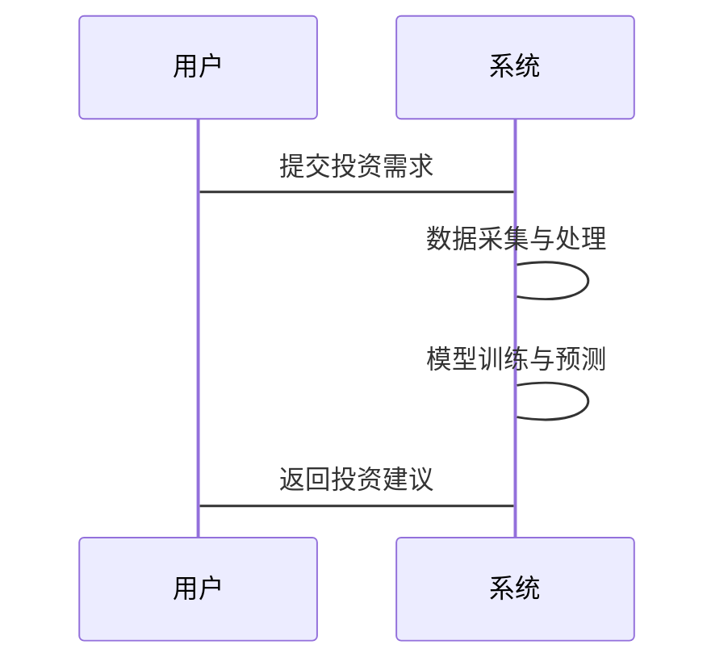

                 


# 大数据驱动的投资决策模型构建

## 关键词：大数据、投资决策模型、机器学习、特征工程、算法优化、数学模型

## 摘要：  
随着大数据技术的快速发展，投资决策领域正在经历一场深刻的变革。传统的投资决策方式依赖于经验判断和少量数据支持，而大数据的引入为投资决策带来了前所未有的机遇。通过收集和分析海量数据，结合先进的机器学习算法，构建高效、准确的投资决策模型已经成为可能。本文将从大数据的基本概念出发，逐步探讨投资决策模型的构建过程，包括数据采集、特征工程、模型选择与优化、系统架构设计等关键环节。通过实际案例分析，我们将展示如何利用大数据技术提升投资决策的科学性和准确性，为投资者提供更可靠的决策支持。

---

# 第一部分: 大数据驱动的投资决策模型构建基础

## 第1章: 大数据与投资决策概述

### 1.1 大数据的定义与特点
- 大数据的三个核心特征：Volume（数据量）、Velocity（数据速度）、Variety（数据多样性）
- 大数据的处理挑战：数据存储、数据清洗、数据计算
- 大数据的价值：从数据中提取有用信息，支持决策

### 1.2 投资决策的传统模式与挑战
- 传统投资决策的局限性：依赖经验判断、数据来源单一、决策周期长
- 数据驱动投资决策的优势：数据量大、维度多、实时性强
- 大数据在投资决策中的应用场景：量化投资、风险控制、市场预测

### 1.3 大数据驱动的决策优势
- 数据驱动的精准性：通过分析海量数据，捕捉市场规律
- 数据的实时性：快速响应市场变化，抓住投资机会
- 数据的多样性：结合市场、财务、社交媒体等多种数据源

---

## 第2章: 投资决策模型的核心概念

### 2.1 投资决策模型的定义与分类
- 投资决策模型的定义：基于数据和算法，预测市场走势或资产价值的数学模型
- 模型的分类：回归模型、分类模型、时间序列模型、强化学习模型

### 2.2 投资决策模型的核心要素
- 数据来源：市场数据、财务数据、新闻数据、社交媒体数据
- 特征：市场情绪、技术指标、财务指标、宏观经济指标
- 算法：机器学习算法、统计学习算法、深度学习算法

### 2.3 模型构建的边界与外延
- 数据的边界：数据的时间范围、空间范围和来源范围
- 模型的外延：模型的适用场景、适用范围和限制条件

---

# 第二部分: 大数据驱动的投资决策模型构建

## 第3章: 数据采集与预处理

### 3.1 数据采集方法
- 数据源的选择：公开市场数据、新闻数据、社交媒体数据
- 数据采集工具：API接口、网络爬虫、数据库查询

### 3.2 数据清洗与整合
- 数据清洗步骤：去除重复数据、处理缺失值、消除噪声数据
- 数据整合方法：数据融合、数据标准化、数据归一化

### 3.3 特征工程
- 特征选择：基于统计方法和机器学习方法选择重要特征
- 特征构建：通过组合或变换生成新的特征
- 特征标准化：归一化处理，确保模型输入的均匀性

---

## 第4章: 模型选择与训练

### 4.1 算法选择策略
- 选择回归算法：线性回归、逻辑回归、支持向量回归
- 选择分类算法：随机森林、K近邻、朴素贝叶斯
- 选择时间序列算法：ARIMA、LSTM

### 4.2 模型训练流程
- 数据集划分：训练集、验证集、测试集
- 模型训练：使用训练数据拟合模型参数
- 模型调优：交叉验证、网格搜索、超参数优化

### 4.3 模型评估与优化
- 评估指标：均方误差（MSE）、准确率、召回率、F1值
- 模型优化：基于梯度下降、Adam优化器等方法改进模型性能

---

## 第5章: 系统架构与实现

### 5.1 系统功能设计
- 数据采集模块：实时获取市场数据
- 数据处理模块：清洗、特征提取、数据存储
- 模型训练模块：训练投资决策模型
- 决策输出模块：生成投资建议、风险预警

### 5.2 系统架构设计


### 5.3 系统接口设计
- 输入接口：数据接口、模型参数接口
- 输出接口：预测结果接口、风险提示接口
- 调用方式：API接口、命令行调用

### 5.4 系统交互设计


---

## 第6章: 项目实战

### 6.1 项目环境搭建
- 环境安装：Python、Jupyter Notebook、Pandas、Scikit-learn
- 数据源获取：股票市场数据、新闻数据

### 6.2 核心代码实现
```python
import pandas as pd
import numpy as np
from sklearn.model_selection import train_test_split
from sklearn.ensemble import RandomForestRegressor

# 数据加载
data = pd.read_csv('stock_data.csv')

# 数据预处理
data = data.dropna()
X = data[['open', 'high', 'low', 'volume']]
y = data['close']

# 数据划分
X_train, X_test, y_train, y_test = train_test_split(X, y, test_size=0.2)

# 模型训练
model = RandomForestRegressor(n_estimators=100)
model.fit(X_train, y_train)

# 模型评估
score = model.score(X_test, y_test)
print(f'模型得分：{score}')
```

### 6.3 案例分析与解读
- 案例背景：某股票的历史数据
- 模型预测：预测未来3天的股价走势
- 结果分析：模型的预测准确性、误差来源、改进方向

---

## 第7章: 总结与展望

### 7.1 本章总结
- 大数据在投资决策中的重要性
- 投资决策模型构建的关键步骤：数据采集、特征工程、模型训练
- 系统架构设计的核心要素：模块划分、接口设计、交互流程

### 7.2 未来展望
- 数据源的扩展：引入更多维度的数据
- 模型优化：深度学习算法的应用、强化学习的探索
- 系统应用的扩展：实时决策系统、组合投资优化

---

## 小结与注意事项
- 在构建投资决策模型时，数据的质量和特征的选择是关键
- 模型的评估和优化需要结合实际业务场景
- 系统设计需要考虑可扩展性和可维护性
- 投资者在使用大数据模型时，需要结合市场经验和模型结果

---

通过以上内容，我们详细探讨了大数据驱动的投资决策模型构建的全过程，从理论到实践，从算法到系统设计，为读者提供了一个全面的学习和参考框架。

