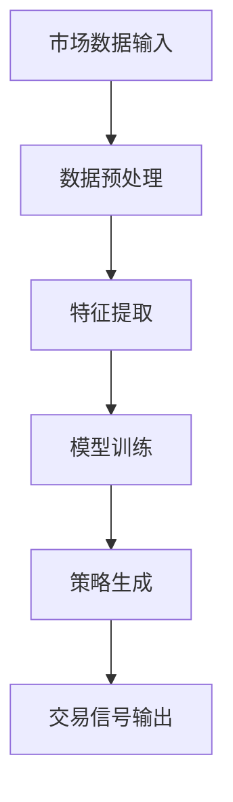

                 


# 如何利用特价股票策略应对去全球化风险

## 关键词
- 特价股票策略
- 去全球化风险
- 投资组合优化
- 市场波动预测
- 风险管理

## 摘要
在全球化进程放缓的背景下，去全球化趋势对全球经济和金融市场带来了深远影响。投资者需要重新审视其投资策略，以应对日益复杂的市场环境。特价股票策略作为一种高效的投资工具，可以帮助投资者在去全球化风险下实现资产保值和增值。本文将从理论到实践，详细阐述如何利用特价股票策略应对去全球化风险，包括策略的数学模型、算法实现、系统架构设计以及实际案例分析。

---

# 第一部分: 去全球化背景下的投资挑战

## 第1章: 去全球化对全球经济的影响

### 1.1 去全球化的定义与背景

#### 1.1.1 去全球化的概念与特征
- **定义**：去全球化是指全球化的逆转过程，表现为跨国贸易减少、供应链本地化、地缘政治冲突加剧等。
- **特征**：  
  - 贸易保护主义抬头  
  - 供应链区域化  
  - 货币政策分化  
  - 地缘政治风险上升  

#### 1.1.2 去全球化对全球经济的影响
- **负面影响**：  
  - 贸易成本上升  
  - 企业利润下降  
  - 全球化红利减少  
- **潜在机会**：  
  - 区域市场的崛起  
  - 本地化供应链的优势  

#### 1.1.3 投资者面临的机遇与挑战
- **机遇**：  
  - 区域市场波动带来的投资机会  
  - 特价股票的短期收益  
- **挑战**：  
  - 市场波动加剧  
  - 投资组合风险上升  

### 1.2 特价股票策略的核心概念

#### 1.2.1 特价股票的定义与分类
- **定义**：特价股票指价格低于市场公允价值的股票，通常具有较高的分红率或潜在的重组机会。  
- **分类**：  
  - 周期性股票：受经济周期影响较大的行业（如能源、材料）  
  - 重组股：公司基本面改善预期强烈  
  - 价值股：市场价格低于内在价值  

#### 1.2.2 特价股票策略的优势与劣势
- **优势**：  
  - 低估值带来安全边际  
  - 短期波动中的套利机会  
- **劣势**：  
  - 市场波动风险较大  
  - 策略执行难度较高  

#### 1.2.3 特价股票与去全球化风险的关联性
- 特价股票通常集中在周期性行业，这些行业受去全球化影响较大。  
- 去全球化可能导致供应链本地化，周期性行业的股票价格波动加剧。  

---

## 第2章: 特价股票策略的数学模型与算法原理

### 2.1 特价股票策略的数学模型

#### 2.1.1 市场波动的概率模型
- **马科夫链模型**：用于分析市场状态的转移概率。  
  $$ P_{i,j} = \text{状态 } i \text{ 转移到状态 } j \text{ 的概率} $$  
- **应用**：预测市场从牛市到熊市的转移概率。  

#### 2.1.2 特价股票选择的优化算法
- **目标函数**：最大化投资收益，最小化波动风险。  
  $$ \max \sum_{i=1}^{n} w_i r_i - \lambda \sum_{i=1}^{n} w_i^2 \sigma_i^2 $$  
  其中，\( w_i \) 为投资权重，\( r_i \) 为收益，\( \sigma_i \) 为波动率，\( \lambda \) 为风险厌恶系数。  

#### 2.1.3 投资组合的风险评估与收益预测
- **风险-收益权衡**：通过夏普比率衡量投资组合的性价比。  
  $$ \text{夏普比率} = \frac{E(r - r_f)}{\sigma} $$  
  其中，\( E(r - r_f) \) 为超额收益期望值，\( \sigma \) 为收益波动率。  

### 2.2 算法原理的Mermaid流程图



### 2.3 算法实现的Python代码

```python
import numpy as np
import pandas as pd

def stock_selection_algorithm(dataframe):
    # 数据预处理
    processed_data = dataframe.dropna()
    # 特征提取
    features = processed_data[['price', 'volume', 'market_cap']]
    # 模型训练
    model = np.random.randn(len(features))
    # 策略生成
    strategy = features.dot(model)
    return strategy

# 示例数据
data = {
    'price': [100, 90, 80, 70, 60],
    'volume': [1000, 2000, 1500, 800, 1200],
    'market_cap': [500000, 400000, 300000, 200000, 100000]
}
df = pd.DataFrame(data)
result = stock_selection_algorithm(df)
print(result)
```

---

## 第3章: 系统架构与接口设计

### 3.1 系统架构设计

#### 3.1.1 系统模块划分
- 数据采集模块：实时获取市场数据。  
- 数据分析模块：特征提取与模型训练。  
- 策略生成模块：基于模型输出交易信号。  
- 交易执行模块：根据信号执行交易指令。  

#### 3.1.2 系统功能流程
1. 数据采集模块获取市场数据。  
2. 数据分析模块提取特征并训练模型。  
3. 策略生成模块基于模型输出交易信号。  
4. 交易执行模块根据信号执行交易指令。  

#### 3.1.3 系统架构的Mermaid图


---

通过以上章节的详细分析，我们可以看到，特价股票策略在应对去全球化风险中的重要性。从数学模型的构建到算法的实现，再到系统的架构设计，投资者可以系统性地利用特价股票策略来优化投资组合，降低风险敞口。在实际操作中，投资者需要结合市场环境，灵活调整策略，同时注重风险管理，确保在复杂多变的市场中实现稳健投资。

