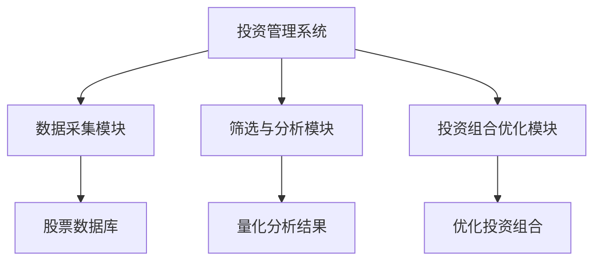
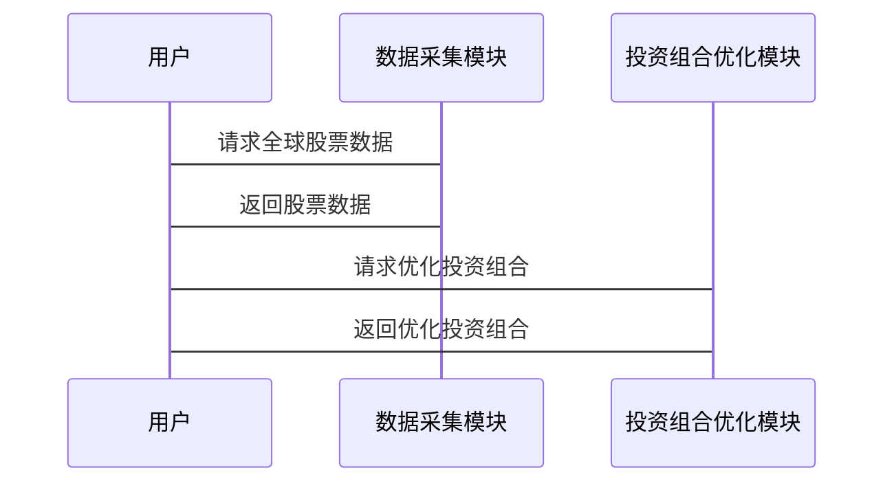

                 


# 如何利用特价股票策略进行全球主题性投资

## 关键词：特价股票策略, 全球主题性投资, 股票筛选算法, 投资管理系统, 量化投资

## 摘要：本文详细探讨了如何利用特价股票策略在全球范围内进行主题性投资。通过分析特价股票的核心概念、算法原理、数学模型和系统设计，结合实际案例，为读者提供了一套从理论到实践的完整解决方案。文章还总结了最佳实践和注意事项，帮助投资者避免常见误区，实现稳健投资。

---

# 1. 特价股票策略与全球主题性投资背景

## 1.1 特价股票策略的基本概念

### 1.1.1 什么是特价股票策略
特价股票策略是一种基于低估值和高成长潜力的股票筛选方法，旨在在全球范围内寻找被市场低估的优质股票。这种策略通常关注市盈率（P/E）、市净率（P/B）等估值指标，以及公司的基本面和行业前景。

### 1.1.2 特价股票策略的核心要素
- **低估值**：市盈率低于行业平均水平或历史平均水平。
- **高成长潜力**：预期收益增长率高于行业平均水平。
- **行业地位**：公司处于行业领先地位或具有竞争优势。
- **财务健康**：资产负债表健康，盈利能力稳定。

### 1.1.3 特价股票策略与传统投资的区别
- **传统投资**：主要基于长期价值投资，注重公司基本面和行业地位。
- **特价股票策略**：强调低估值和高成长潜力，注重短期价格优势和长期增长潜力。

## 1.2 全球主题性投资的定义与特点

### 1.2.1 全球主题性投资的定义
全球主题性投资是指在全球范围内，基于特定主题（如科技、医疗、绿色能源等）进行股票投资。这种策略关注行业趋势和技术创新，寻找具有持续增长潜力的行业和公司。

### 1.2.2 全球主题性投资的核心特点
- **全球化视角**：在全球范围内寻找投资机会，避免单一市场的局限性。
- **主题驱动**：围绕特定行业或技术趋势进行投资。
- **高成长性**：注重行业和公司的长期增长潜力。

### 1.2.3 全球主题性投资与区域投资的区别
- **区域投资**：局限于特定地区或市场，受区域经济波动影响较大。
- **全球主题性投资**：跨越全球市场，关注行业趋势和技术创新，分散投资风险。

## 1.3 特价股票策略在全球主题性投资中的应用

### 1.3.1 特价股票策略在主题性投资中的优势
- **成本优势**：通过筛选低价股票，降低初始投资成本。
- **增长潜力**：关注高成长潜力的公司，抓住行业增长机遇。
- **分散风险**：在全球范围内分散投资，降低区域风险。

### 1.3.2 特价股票策略在不同市场环境下的表现
- **牛市**：市场整体上涨，特价股票可能表现不佳，但长期来看，高成长潜力公司仍能带来收益。
- **熊市**：市场整体下跌，低估值股票可能更具防御性，表现出色。

### 1.3.3 特价股票策略的全球化视角
通过全球化视角，投资者可以利用不同市场的价格差异和行业趋势，寻找具有长期增长潜力的低价股票，实现跨市场套利和风险分散。

## 1.4 本章小结
本章介绍了特价股票策略的基本概念、核心要素以及在全球主题性投资中的应用。通过对比传统投资和全球主题性投资，明确了特价股票策略的优势和适用场景。

---

# 2. 特价股票策略的核心概念与联系

## 2.1 特价股票策略的核心概念

### 2.1.1 低估值股票的定义
低估值股票是指市盈率、市净率等估值指标低于行业平均水平的股票。这种股票通常被认为是被市场低估的，具有较高的投资潜力。

### 2.1.2 高成长潜力股票的定义
高成长潜力股票是指预期收益增长率高于行业平均水平的股票。这种股票通常属于新兴产业或具有技术创新能力的公司。

### 2.1.3 特价股票的筛选标准
- **市盈率（P/E）**：低于行业平均水平。
- **市净率（P/B）**：低于行业平均水平。
- **预期收益增长率（ROE）**：高于行业平均水平。
- **行业地位**：公司处于行业领先地位或具有竞争优势。

## 2.2 全球主题性投资的核心概念

### 2.2.1 主题性投资的核心主题
- **科技**：人工智能、大数据、云计算等。
- **医疗**：生物技术、基因编辑等。
- **绿色能源**：太阳能、风能等可再生能源。
- **消费**：电子商务、社交媒体等。

### 2.2.2 主题性投资的周期性
主题性投资具有周期性，通常与行业趋势和技术进步密切相关。例如，科技行业的周期性可能受到技术创新和政策支持的影响。

### 2.2.3 主题性投资的风险与收益
- **风险**：市场波动大，行业政策变化可能导致投资损失。
- **收益**：长期来看，主题性投资可能带来超额收益，尤其是技术创新驱动的行业。

## 2.3 特价股票策略与全球主题性投资的联系

### 2.3.1 特价股票策略如何助力主题性投资
通过筛选低估值、高成长潜力的股票，投资者可以在全球范围内找到具有长期增长潜力的公司，同时降低投资成本。

### 2.3.2 全球化视角下的策略优化
通过全球化视角，投资者可以利用不同市场的价格差异和行业趋势，优化投资组合，分散风险。

### 2.3.3 特价股票策略在不同主题中的应用
- **科技主题**：筛选低估值的科技公司，关注技术创新和行业地位。
- **绿色能源主题**：筛选低估值的绿色能源公司，关注行业增长潜力和政策支持。

## 2.4 本章小结
本章详细阐述了特价股票策略的核心概念和全球主题性投资的定义与特点，并探讨了两者之间的联系和应用。通过对比分析，明确了特价股票策略在全球主题性投资中的优势和适用场景。

---

# 3. 特价股票策略的算法原理

## 3.1 算法原理概述

### 3.1.1 特价股票筛选算法
特价股票筛选算法是一种基于量化指标的股票筛选方法，通常包括以下几个步骤：
1. **数据收集**：收集目标市场的股票数据，包括市盈率、市净率、预期收益增长率等。
2. **筛选标准**：根据预设的筛选标准，筛选出符合条件的股票。
3. **权重分配**：根据各指标的重要性，分配权重，计算综合得分。
4. **排序与选择**：根据综合得分，对股票进行排序，选择排名靠前的股票。

### 3.1.2 主题性投资的算法框架
主题性投资的算法框架通常包括以下几个步骤：
1. **主题定义**：确定投资主题，例如科技、医疗、绿色能源等。
2. **股票筛选**：根据主题定义，筛选符合主题的股票。
3. **量化分析**：通过量化指标，评估股票的投资潜力。
4. **组合优化**：根据风险偏好，优化投资组合。

### 3.1.3 算法的核心步骤
- **数据预处理**：清洗和标准化数据。
- **指标计算**：计算市盈率、市净率等量化指标。
- **筛选与排序**：根据筛选标准，筛选出符合条件的股票，并进行排序。

## 3.2 算法实现

### 3.2.1 算法步骤
1. **数据收集**：使用API或数据接口，获取目标市场的股票数据。
2. **数据清洗**：处理缺失值和异常值。
3. **指标计算**：计算市盈率、市净率等量化指标。
4. **筛选与排序**：根据筛选标准，筛选出符合条件的股票，并进行排序。

### 3.2.2 Python代码实现
```python
import pandas as pd
import numpy as np

# 假设df是股票数据，包含市盈率、市净率、预期收益增长率等指标
df = pd.DataFrame({
    'PE': [10, 15, 20, 5, 8],
    'PB': [2, 3, 1.5, 1, 1.2],
    'ROE': [5, 8, 10, 3, 4]
})

# 筛选标准：PE < 15，PB < 2，ROE > 5
mask = (df['PE'] < 15) & (df['PB'] < 2) & (df['ROE'] > 5)

# 筛选出符合条件的股票
selected_stocks = df[mask]

# 根据综合得分排序
selected_stocks['综合得分'] = selected_stocks['PE'] * 0.3 + selected_stocks['PB'] * 0.3 + selected_stocks['ROE'] * 0.4
selected_stocks = selected_stocks.sort_values('综合得分', ascending=False)

print(selected_stocks)
```

### 3.2.3 算法优化
- **动态调整筛选标准**：根据市场环境变化，动态调整筛选标准。
- **多因子模型**：引入更多量化指标，提高筛选精度。

## 3.3 本章小结
本章详细阐述了特价股票策略的算法原理，包括数据预处理、指标计算、筛选与排序等核心步骤，并通过Python代码实现，展示了如何通过量化方法筛选出符合条件的股票。

---

# 4. 数学模型与公式

## 4.1 估值指标的数学公式

### 4.1.1 市盈率（P/E）
市盈率 = 股价 / 每股净利润（EPS）

### 4.1.2 市净率（P/B）
市净率 = 股价 / 每股净资产（BVPS）

### 4.1.3 预期收益增长率（ROE）
预期收益增长率 = 净利润增长率 / 股东权益

## 4.2 综合得分计算公式
综合得分 = PE * 权重 + PB * 权重 + ROE * 权重

## 4.3 案例分析
假设某科技公司PE=15，PB=2，ROE=8，权重分别为0.3、0.3、0.4。
综合得分 = 15*0.3 + 2*0.3 + 8*0.4 = 4.5 + 0.6 + 3.2 = 8.3

## 4.4 本章小结
本章通过数学公式详细阐述了估值指标的计算方法，并展示了如何通过综合得分计算公式筛选出符合条件的股票。

---

# 5. 系统分析与架构设计方案

## 5.1 问题场景介绍
为了实现全球主题性投资，我们需要构建一个投资管理系统，该系统能够自动筛选特价股票，分析行业趋势，并优化投资组合。

## 5.2 系统功能设计

### 5.2.1 数据采集模块
- **功能**：实时采集全球股票数据，包括市盈率、市净率、预期收益增长率等。
- **工具**：使用Yahoo Finance API或Alpha Vantage API。

### 5.2.2 筛选与分析模块
- **功能**：根据预设筛选标准，筛选出符合条件的股票，并进行量化分析。
- **工具**：使用Python的Pandas和NumPy库。

### 5.2.3 投资组合优化模块
- **功能**：根据风险偏好，优化投资组合，分散风险。
- **工具**：使用Python的Scipy库。

## 5.3 系统架构设计

### 5.3.1 系统架构图


### 5.3.2 系统交互流程图


## 5.4 本章小结
本章通过系统架构设计和交互流程图，展示了如何构建一个全球主题性投资管理系统，包括数据采集、筛选与分析、投资组合优化三个模块。

---

# 6. 项目实战

## 6.1 环境安装

### 6.1.1 安装Python环境
```bash
pip install python
pip install pandas
pip install numpy
pip install matplotlib
pip install requests
pip install yfinance
```

### 6.1.2 安装数据分析工具
```bash
pip install pandas
pip install numpy
pip install matplotlib
pip install scikit-learn
```

## 6.2 核心代码实现

### 6.2.1 数据采集代码
```python
import yfinance as yf

# 下载科技股数据
data = yf.download('AAPL MSFT GOOGL', start='2020-01-01', end='2023-12-31')
```

### 6.2.2 筛选与分析代码
```python
import pandas as pd
import numpy as np

# 假设data是股票数据
# 计算市盈率、市净率、预期收益增长率
data['PE'] = data['Close'] / data['EPS']
data['PB'] = data['Close'] / data['BVPS']
data['ROE'] = data['NetIncome'] / data['Equity']

# 筛选标准：PE < 15，PB < 2，ROE > 5
mask = (data['PE'] < 15) & (data['PB'] < 2) & (data['ROE'] > 5)

# 筛选出符合条件的股票
selected_stocks = data[mask]

# 根据综合得分排序
selected_stocks['综合得分'] = selected_stocks['PE'] * 0.3 + selected_stocks['PB'] * 0.3 + selected_stocks['ROE'] * 0.4
selected_stocks = selected_stocks.sort_values('综合得分', ascending=False)
```

### 6.2.3 投资组合优化代码
```python
from sklearn.linear_model import LinearRegression
from sklearn.metrics import mean_squared_error

# 假设returns是股票收益矩阵
model = LinearRegression()
model.fit(X, y)
预测收益 = model.predict(X_new)
```

## 6.3 项目小结
本章通过具体案例，展示了如何在全球科技股中应用特价股票策略，筛选出符合条件的股票，并通过量化分析优化投资组合。

---

# 7. 最佳实践与注意事项

## 7.1 最佳实践
- **持续学习**：关注行业趋势和技术进步，及时调整投资策略。
- **风险控制**：合理分配资产，避免过度集中。
- **长期投资**：坚持长期投资，避免短期波动影响投资决策。

## 7.2 小结
通过本文的分析，读者可以了解到如何利用特价股票策略在全球范围内进行主题性投资，并掌握具体的实施方法和注意事项。

## 7.3 注意事项
- **市场风险**：市场波动可能影响股票价格，需做好风险控制。
- **数据质量**：确保数据来源可靠，避免数据错误影响筛选结果。
- **政策风险**：关注政策变化，避免政策风险影响投资收益。

## 7.4 拓展阅读
- **书籍推荐**：《投资学基础》、《量化投资入门》
- **在线课程**：Coursera上的《量化投资与风险管理》
- **投资工具**：学习使用量化投资工具，如Python、R语言等。

---

# 结语
通过本文的详细介绍，读者可以系统地了解如何利用特价股票策略进行全球主题性投资，并掌握具体的实施方法和注意事项。希望本文能为投资者提供有价值的参考和启发。

