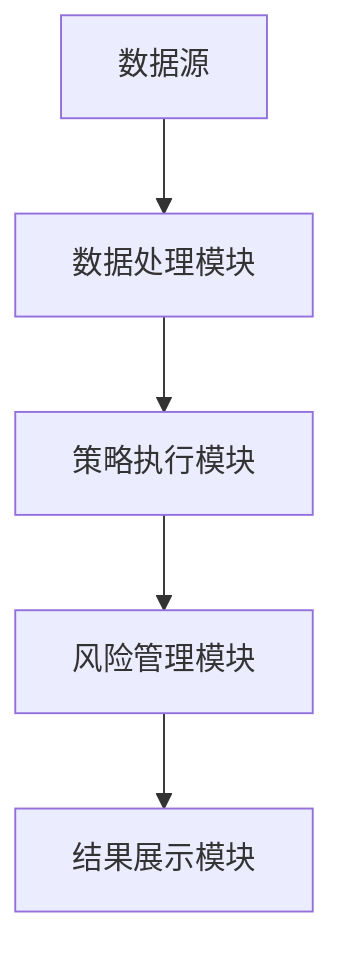
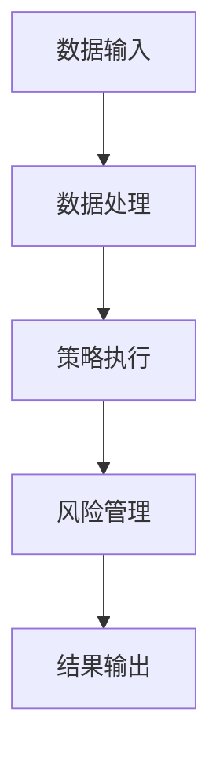

                 


# 如何利用特价股票策略进行反周期投资

## 关键词：
- 特价股票策略
- 反周期投资
- 股票投资
- 投资策略
- 股票分析
- 投资组合优化

## 摘要：
本文详细探讨了如何利用特价股票策略进行反周期投资，从基本概念到数学模型，再到系统设计和实际案例，全面分析了这一策略的核心原理和应用方法。通过本文，读者将能够理解特价股票策略与反周期投资的关系，掌握相关的数学模型和算法，设计并实现一个高效的反周期投资系统，并通过实际案例验证策略的有效性。

---

# 第1章: 特价股票策略与反周期投资概述

## 1.1 特价股票策略的基本概念
### 1.1.1 特价股票的定义
- 特价股票是指价格低于其内在价值的股票。
- 特价股票通常出现在市场低迷或公司暂时遇到困境时。
- 特价股票的识别需要结合估值指标（如P/E、P/B）和市场趋势。

### 1.1.2 特价股票的特点
| 特性 | 描述 |
|------|------|
| 低估值 | P/E和P/B低于行业平均水平 |
| 高分红 | 股息率较高，回报稳定 |
| 高波动性 | 市场波动大时容易出现低估机会 |

### 1.1.3 特价股票与普通股票的区别
- **低估值**：特价股票通常价格低于其内在价值，而普通股票的价格可能反映其真实价值。
- **高风险**：特价股票的风险较高，但潜在回报也更大；普通股票的风险相对较低。
- **市场敏感性**：特价股票受市场波动影响较大，而普通股票受市场影响较为稳定。

## 1.2 反周期投资的定义与特点
### 1.2.1 反周期投资的基本概念
- 反周期投资是指在经济周期的低谷期投资，以期在经济复苏时获得超额回报。
- 反周期投资的核心是利用市场的非理性波动，在低价时买入优质资产。

### 1.2.2 反周期投资的核心特点
| 特性 | 描述 |
|------|------|
| 逆向思维 | 在市场恐慌时寻找机会 |
| 长期视角 | 着重于长期价值而非短期波动 |
| 风险承受 | 能够承受较高的短期波动风险 |

### 1.2.3 反周期投资与周期性投资的区别
- **周期性投资**：随市场波动频繁调整投资组合，注重短期收益。
- **反周期投资**：在市场低谷时增加投资，市场高点时减少投资，注重长期价值。

## 1.3 特价股票策略与反周期投资的关系
### 1.3.1 特价股票策略在反周期投资中的作用
- 特价股票策略帮助投资者在市场低谷时发现低估资产。
- 通过精选特价股票，反周期投资者能够在经济衰退期间布局优质资产。

### 1.3.2 反周期投资对特价股票策略的指导作用
- 反周期投资的市场分析为特价股票的筛选提供了方向。
- 经济周期的判断帮助投资者更好地把握特价股票的投资时点。

### 1.3.3 两者结合的综合投资策略
- 结合经济周期判断和特价股票筛选，构建逆周期投资组合。
- 在经济衰退期，通过特价股票策略布局优质资产；在经济复苏期，逐步兑现收益。

## 1.4 本章小结
- 本章介绍了特价股票策略和反周期投资的基本概念、特点，以及两者结合的综合投资策略。

---

# 第2章: 特价股票策略的核心概念与联系

## 2.1 特价股票策略的核心要素
### 2.1.1 特价股票的筛选标准
- **低市盈率（P/E）**：P/E < 行业平均值。
- **低市净率（P/B）**：P/B < 1。
- **高股息率**：股息率 > 行业平均值。

### 2.1.2 特价股票的估值方法
- **相对估值法**：通过P/E、P/B等指标比较同类公司。
- **绝对估值法**：使用现金流折现模型（DCF）估算内在价值。

### 2.1.3 特价股票的投资周期
- 短期投资：抓住市场波动带来的快速反弹机会。
- 长期投资：等待公司基本面改善，价值逐步回归。

## 2.2 反周期投资的核心要素
### 2.2.1 反周期投资的市场周期分析
- 经济周期的四个阶段：复苏、过热、衰退、滞胀。
- 不同阶段的资产表现：衰退期债券和现金最佳，复苏期股票表现较好。

### 2.2.2 反周期投资的资产配置策略
- 通过多元化配置降低风险。
- 在衰退期增加股票配置，尤其是廉价资产。

### 2.2.3 反周期投资的风险管理
- 设定止损点，避免重大损失。
- 分批建仓，逐步增加仓位。

## 2.3 特价股票策略与反周期投资的联系
### 2.3.1 特价股票策略在反周期投资中的应用
- 在衰退期寻找廉价股票，布局优质资产。
- 在复苏期逐步卖出，锁定收益。

### 2.3.2 反周期投资对特价股票策略的指导作用
- 通过经济周期判断，确定特价股票投资的时机。
- 在特定周期下调整特价股票的筛选标准。

### 2.3.3 两者结合的综合投资策略
- 结合经济周期判断和特价股票筛选，构建逆周期投资组合。
- 在经济衰退期，通过特价股票策略布局优质资产；在经济复苏期，逐步兑现收益。

## 2.4 本章小结
- 本章详细探讨了特价股票策略和反周期投资的核心要素及其相互联系。

---

# 第3章: 特价股票策略的数学模型与算法原理

## 3.1 特价股票筛选的数学模型
### 3.1.1 市净率（P/B）模型
- 公式：P/B = 市场价 / 每股净资产
- 应用：筛选P/B < 1的公司。

### 3.1.2 市盈率（P/E）模型
- 公式：P/E = 市场价 / 每股收益
- 应用：筛选P/E < 行业平均值的公司。

### 3.1.3 股息率模型
- 公式：股息率 = 每股股息 / 市场价
- 应用：筛选股息率高于行业平均值的公司。

## 3.2 反周期投资的数学模型
### 3.2.1 均值-方差模型
- 最优化目标：最大化收益，最小化风险。
- 约束条件：投资组合的方差最小化。

### 3.2.2 资本资产定价模型（CAPM）
- 公式：E(R) = R_f + β(R_m - R_f)
- 应用：评估资产的预期收益。

### 3.2.3 风险调整后的收益模型
- 公式：夏普比率 = (R_p - R_f) / σ_p
- 应用：评估投资组合的风险调整后收益。

## 3.3 特价股票策略与反周期投资的算法流程
### 3.3.1 数据收集与处理
- 数据来源：股票价格、财务报表、市场指数。
- 数据清洗：处理缺失值、异常值。

### 3.3.2 模型构建与参数设置
- 筛选模型：基于P/E、P/B、股息率的多因子模型。
- 风险控制：设定最大回撤、波动率限制。

### 3.3.3 策略优化与验证
- 回测分析：验证策略在历史数据中的表现。
- 模拟交易：模拟交易过程，评估策略的有效性。

## 3.4 本章小结
- 本章通过数学模型和算法原理，详细阐述了特价股票策略和反周期投资的实现方法。

---

# 第4章: 特价股票策略的系统分析与架构设计

## 4.1 系统分析
### 4.1.1 问题场景介绍
- 投资者希望在经济衰退期间利用特价股票策略进行反周期投资。
- 系统需要实现数据收集、策略执行、风险管理等功能。

### 4.1.2 项目目标与范围
- 目标：开发一个自动化投资系统，实现特价股票筛选、投资组合优化和风险管理。
- 范围：包括数据处理、策略执行、结果分析模块。

### 4.1.3 系统功能需求
- 数据采集：实时采集股票价格、财务数据。
- 策略执行：根据模型自动买卖股票。
- 风险管理：监控市场波动，调整投资组合。

## 4.2 系统架构设计
### 4.2.1 系统架构图


### 4.2.2 数据流图


### 4.2.3 模块划分与功能分配
- 数据处理模块：负责数据清洗、特征提取。
- 策略执行模块：根据模型生成买卖信号。
- 风险管理模块：监控市场波动，调整仓位。

## 4.3 系统接口设计
### 4.3.1 数据接口设计
- 数据接口类型：API接口。
- 数据接口功能：实时获取股票数据。

### 4.3.2 用户接口设计
- 用户界面：仪表盘展示投资组合表现。
- 用户交互：允许用户调整策略参数。

### 4.3.3 系统间接口设计
- 模块间接口：数据处理模块向策略执行模块传递信号。

## 4.4 系统交互设计
### 4.4.1 用户与系统交互流程
1. 用户登录系统。
2. 用户查看市场数据。
3. 用户调整策略参数。
4. 系统执行交易。

### 4.4.2 数据处理流程
1. 获取市场数据。
2. 清洗数据。
3. 提取特征。
4. 生成信号。

### 4.4.3 策略执行流程
1. 根据信号生成订单。
2. 执行交易。
3. 记录交易日志。

## 4.5 本章小结
- 本章通过系统分析与架构设计，明确了投资系统的功能模块和交互流程。

---

# 第5章: 特价股票策略的项目实战

## 5.1 环境安装与配置
### 5.1.1 系统环境要求
- 操作系统：Windows 10或更高版本，或macOS 10.15或更高版本。
- 硬件要求：4GB以上内存，推荐8GB以上。
- 软件要求：Python 3.8或更高版本，Jupyter Notebook，Pandas，NumPy，Matplotlib。

### 5.1.2 数据源配置
- 数据获取方式：通过API接口获取股票数据。
- 数据存储方式：使用CSV文件或数据库存储。

## 5.2 系统核心实现源代码
### 5.2.1 数据处理代码
```python
import pandas as pd
import numpy as np

# 获取股票数据
data = pd.read_csv('stock_data.csv')

# 数据清洗
data.dropna(inplace=True)
data = data[~data['volume'].eq(0)]
```

### 5.2.2 策略执行代码
```python
# 策略逻辑
def screen_stocks(data):
    # 筛选P/E < 15且P/B < 1的股票
    cheap_stocks = data[(data['pe'] < 15) & (data['pb'] < 1)]
    return cheap_stocks

# 执行策略
selected_stocks = screen_stocks(data)
```

### 5.2.3 风险管理代码
```python
# 风险管理
def risk_management(portfolio, data):
    # 计算最大回撤
    returns = data['return'].values
    max_drawdown = 0
    current_high = 0
    for r in returns:
        current_high = max(current_high, current_high * (1 + r))
        current_drawdown = (current_high - data['price'].values[-1]) / current_high
        max_drawdown = max(max_drawdown, current_drawdown)
    return max_drawdown

# 示例
max_dd = risk_management(portfolio, data)
```

## 5.3 代码应用解读与分析
### 5.3.1 数据处理部分
- 使用Pandas库进行数据清洗和预处理。
- 删除缺失值和零体积数据。

### 5.3.2 策略执行部分
- 根据P/E和P/B指标筛选廉价股票。
- 生成买卖信号。

### 5.3.3 风险管理部分
- 计算投资组合的最大回撤。
- 监控市场波动，调整投资策略。

## 5.4 实际案例分析
### 5.4.1 案例背景
- 经济衰退期间，市场恐慌，股票价格大幅下跌。
- 利用特价股票策略，在市场低谷期布局优质资产。

### 5.4.2 案例分析
- 筛选出P/E < 15且P/B < 1的股票。
- 构建投资组合，定期调整仓位。
- 在市场复苏时卖出，实现收益。

## 5.5 本章小结
- 本章通过实际案例，展示了特价股票策略在反周期投资中的应用。

---

# 第6章: 总结与扩展

## 6.1 最佳实践 tips
### 6.1.1 投资策略
- 在经济衰退期，优先选择P/E和P/B双低的股票。
- 结合股息率，寻找高分红的廉价股票。

### 6.1.2 风险管理
- 设定止损点，避免重大损失。
- 分批建仓，逐步增加仓位。

## 6.2 小结
- 特价股票策略与反周期投资相结合，能够在市场低谷期布局优质资产，抓住市场复苏带来的收益。
- 通过数学模型和系统设计，投资者可以更好地实现投资目标。

## 6.3 注意事项
- 投资有风险，需谨慎操作。
- 确保数据来源可靠，模型有效。
- 定期回顾和优化投资策略。

## 6.4 拓展阅读
- 《投资学》：了解更深入的投资理论。
- 《股票技术分析》：掌握更多技术分析方法。
- 《风险管理》：学习更全面的风险管理技巧。

---

# 结语

通过本文的详细讲解，读者可以掌握如何利用特价股票策略进行反周期投资。从理论到实践，从模型到系统，本文为投资者提供了全面的指导。希望读者能够通过本文的分析，制定出适合自己的投资策略，实现财富的稳健增长。

