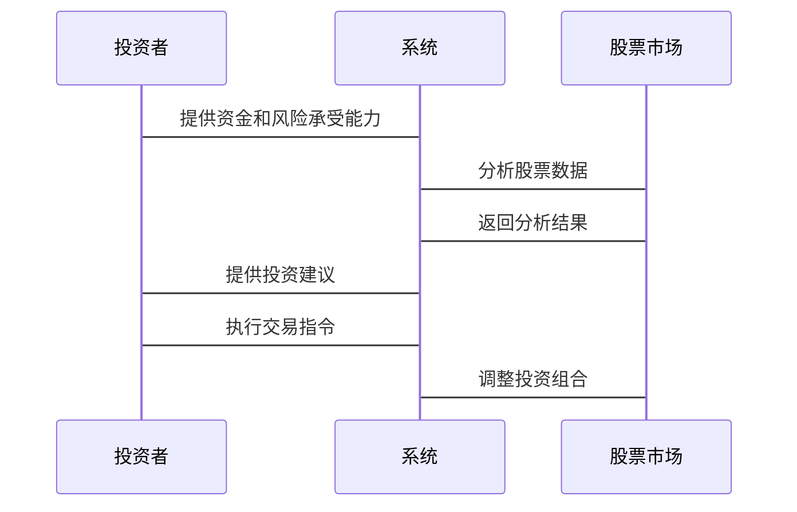

                 


# 如何利用特价股票策略进行逆向投资

> 关键词：逆向投资，特价股票，股票策略，基本面分析，技术面分析，风险管理

> 摘要：逆向投资是一种在市场低迷时买入，而在市场繁荣时卖出的投资策略。特价股票策略则是寻找被市场低估的股票进行投资。本文将详细探讨如何利用特价股票策略进行逆向投资，包括特价股票的识别方法、投资策略的制定、风险管理以及心理与纪律的重要性。

---

# 第一部分：逆向投资概述

## 第1章：逆向投资的定义与核心理念

### 1.1 逆向投资的定义

逆向投资是一种与市场趋势相反的投资策略，强调在市场低迷时买入，而在市场繁荣时卖出。其核心理念是基于市场情绪的反向思维，寻找被市场低估的资产进行投资。

- **逆向投资的定义**：逆向投资是指在市场恐慌或低迷时买入，而在市场乐观或繁荣时卖出的投资策略。
- **核心理念**：市场情绪的波动性为逆向投资提供了机会。当市场恐慌时，许多优质资产被低估，此时买入能够获得超额收益。

### 1.2 逆向投资的核心理念：市场反向思维

- **市场反向思维**：逆向投资的核心在于反市场情绪操作。当大多数投资者恐慌时，优质资产价格被压低，此时是买入的好时机。
- **逆向投资的优势**：逆向投资能够在市场底部捕获低估资产，在市场顶部卖出，从而在长期获得超额收益。

### 1.3 逆向投资的优势与适用场景

- **优势**：逆向投资能够在市场波动中捕获超额收益，尤其在市场恐慌时买入优质资产，能够在市场复苏时获得丰厚回报。
- **适用场景**：适用于股票、房地产等资产类别，尤其在市场周期性波动明显的领域。

---

## 第2章：特价股票策略的基本概念

### 2.1 特价股票的定义与特征

- **特价股票的定义**：特价股票是指市场价格显著低于其内在价值的股票，通常由于市场恐慌或投资者情绪导致价格被低估。
- **特征**：
  - 市场价格低于内在价值。
  - 公司基本面良好，但市场情绪消极。
  - 通常出现在市场底部区域。

### 2.2 特价股票与普通股票的区别

| **特征**       | **特价股票**       | **普通股票**       |
|----------------|--------------------|--------------------|
| 市场价格        | 显著低于内在价值    | 接近或高于内在价值  |
| 投资机会        | 高                 | 中或低             |
| 市场情绪        | 恐慌或悲观          | 乐观或中性          |
| 风险            | 低                 | 高                 |

### 2.3 逆向投资中的特价股票策略

- **策略目标**：通过识别特价股票，利用市场低估的机会进行投资。
- **策略优势**：能够在市场底部获得优质资产，长期获得超额收益。

---

## 第3章：逆向投资与特价股票策略的关系

### 3.1 逆向投资的核心理念

逆向投资强调在市场恐慌时买入，在市场乐观时卖出。特价股票策略则是逆向投资的一种具体实现方式，专注于寻找被低估的股票。

- **核心理念**：市场情绪的波动性为逆向投资提供了机会。
- **策略结合**：通过寻找特价股票，逆向投资者能够在市场底部捕获低估资产。

### 3.2 特价股票策略的背景与现状

- **背景**：市场波动性和投资者情绪波动为特价股票策略提供了基础。
- **现状**：随着市场波动加剧，特价股票策略越来越受到投资者的重视。

---

# 第二部分：特价股票策略的核心分析方法

## 第4章：基本面分析方法

### 4.1 基本面分析的核心要素

- **公司财务状况分析**：
  - 收入与利润趋势。
  - 资产负债表健康状况。
- **行业地位与竞争优势**：
  - 市场份额。
  - 核心竞争力。
- **管理团队与公司治理**：
  - 管理层稳定性。
  - 公司治理结构。

### 4.2 财务指标分析

- **常用财务指标**：
  - 市盈率（PE）：市盈率 = 股价 / 每股收益。
  - 市净率（PB）：市净率 = 股价 / 每股净资产。
  - 资产负债率：资产负债率 = 总负债 / 总资产。

### 4.3 公司内在价值的估算

- **内在价值公式**：
  $$ \text{内在价值} = \sum \frac{\text{现金流}}{(1 + r)^t} $$
  其中，r为折现率，t为年份。

---

## 第5章：技术面分析方法

### 5.1 技术分析的核心要素

- **价格与成交量**：
  - 价格走势。
  - 成交量变化。
- **技术指标**：
  - 移动平均线（MA）。
  - 相对强弱指数（RSI）。

### 5.2 技术指标的应用

- **移动平均线（MA）**：
  - MA(20)：20日移动平均线。
  - MA(60)：60日移动平均线。
- **相对强弱指数（RSI）**：
  - RSI < 30：超卖信号。
  - RSI > 70：超买信号。

### 5.3 技术面分析的实战案例

- **案例分析**：某股票价格从高位回落，成交量大幅萎缩，RSI进入超卖区域，MA(20)下穿MA(60)。
- **结论**：该股票可能进入底部区域，适合寻找特价股票。

---

## 第6章：投资策略的制定与执行

### 6.1 投资策略的制定

- **目标设定**：
  - 短期目标：捕捉市场波动带来的收益。
  - 长期目标：积累长期财富。
- **策略类型**：
  - 价值投资：寻找被低估的股票。
  - 股息投资：关注高股息收益率的股票。

### 6.2 投资策略的执行

- **分步建仓**：
  - 初期建仓：少量买入，试探市场反应。
  - 加仓：市场进一步下跌时，逐步增加仓位。
- **风险管理**：
  - 止损策略：设定止损点，避免重大损失。
  - 仓位管理：合理分配资金，避免过度集中。

---

## 第7章：心理与纪律

### 7.1 投资者心理分析

- **贪婪与恐惧**：
  - 股市上涨时，投资者容易贪婪。
  - 股市下跌时，投资者容易恐惧。
- **心理误区**：
  - 过度自信：认为自己能够准确预测市场。
  - 从众心理：跟随市场情绪做出决策。

### 7.2 纪律的重要性

- **坚持策略**：
  - 不因市场波动改变既定策略。
  - 严格执行买卖纪律。
- **定期复盘**：
  - 检查投资组合表现。
  - 总结经验教训。

---

## 第8章：风险管理与资金管理

### 8.1 风险管理策略

- **止损策略**：
  - 设置止损点，避免亏损扩大。
  - 根据市场波动调整止损位。
- **仓位管理**：
  - 分散投资，降低风险。
  - 根据市场环境调整仓位。

### 8.2 资金管理策略

- **固定比例**：
  - 将资金按比例分配到不同资产。
  - 根据市场变化调整比例。
- **动态调整**：
  - 根据市场波动动态调整仓位。

---

## 第9章：实战案例分析

### 9.1 案例背景

- **公司名称**：某科技公司。
- **行业分析**：科技行业处于周期性底部。
- **财务数据**：
  - 市盈率（PE）：15。
  - 市净率（PB）：2。
  - 股息收益率：5%。

### 9.2 分析过程

- **基本面分析**：
  - 公司收入稳步增长。
  - 利润率保持稳定。
  - 债务水平较低。
- **技术面分析**：
  - 价格走势：从高位回落，成交量萎缩。
  - 技术指标：RSI进入超卖区域。

### 9.3 投资决策

- **买入时机**：市场恐慌时，股价被低估。
- **建仓策略**：分批买入，逐步建仓。

---

## 第10章：系统分析与架构设计方案

### 10.1 项目介绍

- **项目名称**：逆向投资系统。
- **项目目标**：开发一个基于特价股票策略的逆向投资系统。

### 10.2 系统功能设计

- **领域模型**：
  ```mermaid
  classDiagram
    class 投资者 {
      资金
      投资组合
      风险承受能力
    }
    class 股票 {
      价格
      市盈率
      市净率
    }
    class 系统 {
      数据采集
      数据分析
      投资决策
    }
    投资者 --> 系统: 提供资金和风险承受能力
    系统 --> 股票: 分析股票数据
    系统 --> 投资者: 提供投资建议
  ```

---

## 第11章：项目实战

### 11.1 环境安装

- **工具安装**：
  - 数据分析工具：Python、Pandas、Matplotlib。
  - 投资分析工具：TradingView、AmiBroker。

### 11.2 核心实现

- **数据采集**：
  - 使用Python爬取股票数据。
  - 数据存储：使用Pandas进行数据清洗和处理。

### 11.3 应用解读

- **数据清洗**：
  - 去除异常数据。
  - 填补缺失值。

### 11.4 案例分析

- **具体案例**：某股票的历史数据分析。
- **结果展示**：通过图表展示分析结果。

---

## 第12章：小结与展望

### 12.1 小结

- **核心内容总结**：
  - 逆向投资的核心理念是市场反向思维。
  - 特价股票策略是寻找被低估的股票进行投资。
  - 投资者需要具备纪律和风险管理能力。

### 12.2 未来展望

- **技术创新**：
  - 利用人工智能技术进行股票分析。
  - 开发更复杂的量化交易策略。

### 12.3 最佳实践Tips

- **保持纪律**：严格执行投资策略。
- **控制风险**：合理设置止损点。
- **持续学习**：关注市场动态，不断优化投资策略。

---

## 第13章：心理与纪律

### 13.1 投资者心理分析

- **贪婪与恐惧**：
  - 股市上涨时，投资者容易贪婪。
  - 股市下跌时，投资者容易恐惧。

### 13.2 纪律的重要性

- **坚持策略**：
  - 不因市场波动改变策略。
  - 严格执行买卖纪律。

### 13.3 保持冷静

- **市场波动是常态**：
  - 保持冷静，避免情绪化决策。
  - 长期视角：关注公司基本面，而非短期波动。

---

## 第14章：风险管理

### 14.1 风险管理策略

- **止损策略**：
  - 设定止损点，避免亏损扩大。
  - 根据市场波动调整止损位。

### 14.2 仓位管理

- **分散投资**：
  - 将资金按比例分配到不同资产。
  - 根据市场环境调整仓位。

### 14.3 风险控制工具

- **止盈止损订单**：
  - 使用止损订单控制亏损。
  - 使用止盈订单锁定利润。

---

## 第15章：系统交互设计

### 15.1 系统交互流程

- **用户输入**：
  - 选择投资策略。
  - 设置止损点。
- **系统处理**：
  - 分析股票数据。
  - 提出投资建议。
- **用户反馈**：
  - 执行交易指令。
  - 调整投资组合。

### 15.2 序列图



---

## 第16章：数学模型与公式

### 16.1 内在价值公式

$$ \text{内在价值} = \sum_{t=1}^n \frac{\text{现金流}_t}{(1 + r)^t} $$

- **现金流**：公司未来现金流。
- **r**：折现率。

### 16.2 市盈率公式

$$ \text{市盈率} = \frac{\text{股价}}{\text{每股收益}} $$

### 16.3 市净率公式

$$ \text{市净率} = \frac{\text{股价}}{\text{每股净资产}} $$

---

## 第17章：小结与展望

### 17.1 小结

- **核心内容总结**：
  - 逆向投资的核心理念是市场反向思维。
  - 特价股票策略是寻找被低估的股票进行投资。
  - 投资者需要具备纪律和风险管理能力。

### 17.2 未来展望

- **技术创新**：
  - 利用人工智能技术进行股票分析。
  - 开发更复杂的量化交易策略。

---

## 第18章：最佳实践Tips

### 18.1 投资者心态

- **保持冷静**：市场波动是常态，避免情绪化决策。
- **长期视角**：关注公司基本面，而非短期波动。

### 18.2 风险管理

- **合理设置止损点**：避免重大损失。
- **分散投资**：降低投资风险。

### 18.3 持续学习

- **关注市场动态**：了解行业趋势和公司基本面。
- **优化投资策略**：根据市场变化调整策略。

---

## 第19章：总结

### 19.1 核心思想回顾

- 逆向投资的核心理念是市场反向思维，寻找被低估的资产进行投资。
- 特价股票策略是逆向投资的重要组成部分，通过基本面和技术面分析，识别被低估的股票。

### 19.2 未来展望

- 随着市场波动加剧，特价股票策略的重要性将更加凸显。
- 人工智能和大数据技术的应用将为逆向投资提供更强大的工具。

### 19.3 致谢

感谢读者的耐心阅读，希望本文对您在逆向投资和特价股票策略方面有所帮助。

---

通过以上详细的内容，我们希望能够为读者提供一个全面的视角，帮助您更好地理解如何利用特价股票策略进行逆向投资。

