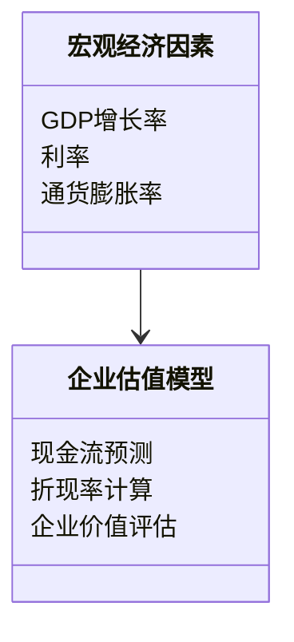
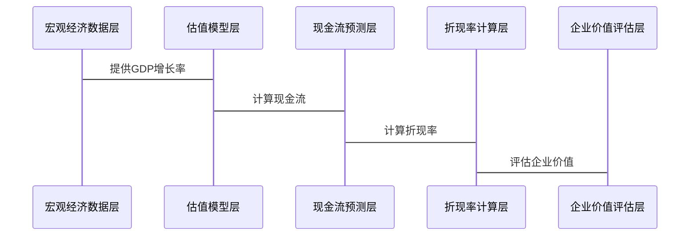

                 


# 如何在企业估值中考虑宏观经济因素

## 关键词：企业估值、宏观经济、GDP、利率、通货膨胀

## 摘要：本文详细探讨了在企业估值过程中如何考虑宏观经济因素。通过分析GDP、利率、通货膨胀等宏观经济指标，结合实际案例，讲解如何将这些因素纳入企业估值模型，帮助投资者更准确地评估企业价值。

---

### 第1章：宏观经济对企业估值的影响概述

#### 1.1 宏观经济对企业估值的核心作用

##### 1.1.1 宏观经济对企业估值的基本概念
企业估值是通过对企业未来现金流的折现来确定其当前价值的过程。宏观经济因素，如GDP增长率、利率、通货膨胀率等，直接影响企业的收入、成本和现金流，从而影响其估值。

##### 1.1.2 宏观经济因素对企业价值的影响路径
1. **收入影响**：GDP增长率直接影响企业的销售收入。
2. **成本影响**：通货膨胀会增加企业的运营成本。
3. **融资成本**：利率上升会增加企业的融资成本。

##### 1.1.3 宏观经济与企业估值的边界与外延
- 宏观经济因素是企业估值的重要外部因素，但并非唯一因素。
- 企业内部管理、市场竞争力等因素同样重要。

#### 1.2 宏观经济对企业估值的核心要素

##### 1.2.1 宏观经济指标与企业估值的关系
- **GDP**：反映整体经济状况，影响企业收入。
- **失业率**：影响消费能力，进而影响企业需求。
- **通货膨胀率**：影响企业成本和价格。
- **利率**：影响企业的融资成本和资本结构。
- **汇率**：影响出口企业的竞争力。

##### 1.2.2 宏观经济环境对企业估值的影响机制
- 宏观经济指标通过影响企业的收入、成本和现金流，进而影响其估值。

##### 1.2.3 宏观经济与企业估值的核心要素组成
- 宏观经济指标：GDP、利率、通货膨胀率等。
- 企业内部因素：成本、收入、管理效率等。

#### 1.3 宏观经济对企业估值的理论框架

##### 1.3.1 企业估值的基本理论
- 基于现金流的折现模型（DCF模型）。
- 市盈率（P/E）和市净率（P/B）等相对估值方法。

##### 1.3.2 宏观经济因素在企业估值中的位置
- 宏观经济因素是DCF模型中的重要因素，影响现金流和折现率。

##### 1.3.3 宏观经济与企业估值的综合模型
- 综合考虑宏观经济指标和企业内部因素，构建全面的估值模型。

---

### 第2章：宏观经济指标对企业估值的影响

#### 2.1 主要宏观经济指标及其定义

##### 2.1.1 国内生产总值（GDP）
GDP是衡量一个国家或地区经济总量的重要指标，直接影响企业的销售收入。

##### 2.1.2 失业率
失业率高，消费能力下降，影响企业的市场需求。

##### 2.1.3 通货膨胀率
通货膨胀率高，企业成本上升，利润减少。

##### 2.1.4 利率
利率上升，企业融资成本增加，影响资本结构。

##### 2.1.5 汇率
汇率波动影响出口企业的竞争力和收入。

#### 2.2 宏观经济指标对企业估值的具体影响

##### 2.2.1 GDP增长率对企业收益的影响
GDP增长率与企业收入呈正相关关系。例如，GDP增长3%，企业收入可能增长2%-4%。

##### 2.2.2 利率对企业融资成本的影响
利率上升，企业贷款成本增加，影响净利润。

##### 2.2.3 通货膨胀对企业利润的影响
通货膨胀导致成本上升，利润空间缩小。

##### 2.2.4 汇率对企业出口能力的影响
汇率贬值，出口产品价格下降，竞争力增强。

#### 2.3 宏观经济指标的相互关系与综合影响

##### 2.3.1 宏观经济指标之间的相互作用
- 利率和GDP：低利率可能刺激投资，提高GDP。
- 汇率和出口：汇率贬值，出口增加，可能影响GDP。

##### 2.3.2 综合宏观经济指标对企业估值的系统性影响
- 综合考虑GDP、利率、通货膨胀率等因素，构建全面的估值模型。

---

### 第3章：宏观经济因素在企业估值中的应用

#### 3.1 宏观经济因素对企业价值的具体计算

##### 3.1.1 宏观经济因素对企业收益的调整
- **公式**：调整后的收益 = 基础收益 × (1 + GDP增长率) × (1 - 通货膨胀率)
- **示例**：基础收益为100万元，GDP增长率为5%，通货膨胀率为3%，调整后的收益为100 × 1.05 × 0.97 = 101.85万元。

##### 3.1.2 宏观经济因素对收益的影响系数
- GDP增长率：直接影响收入。
- 通货膨胀率：间接影响成本。

##### 3.1.3 收益调整的数学模型
$$ \text{调整后的收益} = \text{基础收益} \times (1 + g) \times (1 - \pi) $$
其中，g为GDP增长率，π为通货膨胀率。

##### 3.1.4 利率对企业融资成本的影响
- **公式**：融资成本 = 贷款金额 × 利率
- **示例**：贷款金额为1000万元，利率为5%，融资成本为50万元。

##### 3.1.5 通货膨胀率对企业利润的影响
$$ \text{调整后的利润} = \text{基础利润} \times (1 - \pi) $$

#### 3.2 宏观经济因素对折现率的影响

##### 3.2.1 折现率的计算公式
$$ \text{折现率} = \text{无风险利率} + \text{风险溢价} $$

##### 3.2.2 宏观经济因素对折现率的影响机制
- 无风险利率受宏观经济政策影响，如央行的利率政策。
- 风险溢价受经济不确定性影响，如高失业率可能增加风险溢价。

##### 3.2.3 折现率调整的数学模型
$$ \text{调整后的折现率} = \text{基础折现率} + \text{宏观经济影响系数} \times (\text{GDP增长率} - \text{通货膨胀率}) $$

#### 3.3 宏观经济因素对企业现金流的影响

##### 3.3.1 现金流预测的宏观经济因素
- 销售收入受GDP影响。
- 成本受通货膨胀影响。

##### 3.3.2 现金流调整的数学模型
$$ \text{调整后的现金流} = \text{基础现金流} \times (1 + g) \times (1 - \pi) $$

##### 3.3.3 现金流调整的具体步骤
1. 预测GDP增长率。
2. 估计通货膨胀率。
3. 调整现金流。

---

### 第4章：系统分析与架构设计方案

#### 4.1 问题场景介绍
假设我们有一个制造企业，需要在当前宏观经济环境下进行估值。

#### 4.2 系统功能设计

##### 4.2.1 领域模型（Mermaid类图）


##### 4.2.2 系统架构设计（Mermaid架构图）


#### 4.3 系统接口设计
- 宏观经济数据接口：获取GDP、利率等数据。
- 估值模型接口：计算现金流和折现率。

#### 4.4 系统交互设计（Mermaid序列图）


---

### 第5章：项目实战

#### 5.1 环境安装
- 安装Python和相关库（如Pandas、NumPy）。

#### 5.2 核心实现源代码

##### 5.2.1 宏观经济因素调整代码
```python
import pandas as pd

def adjust_revenue(revenue, gdp_growth, inflation):
    return revenue * (1 + gdp_growth) * (1 - inflation)

# 示例数据
revenue = 1000000
gdp_growth = 0.05
inflation = 0.03
adjusted_revenue = adjust_revenue(revenue, gdp_growth, inflation)
print(f"调整后的收入为：{adjusted_revenue}")
```

##### 5.2.2 折现率调整代码
```python
def calculate_discount_rate(risk_free_rate, risk_premium, gdp_growth, inflation):
    macro_impact = (gdp_growth - inflation)
    return risk_free_rate + risk_premium * macro_impact

# 示例数据
risk_free_rate = 0.03
risk_premium = 0.02
gdp_growth = 0.05
inflation = 0.03
discount_rate = calculate_discount_rate(risk_free_rate, risk_premium, gdp_growth, inflation)
print(f"调整后的折现率为：{discount_rate}")
```

#### 5.3 实际案例分析

##### 5.3.1 案例背景
某制造企业，基础收益为1000万元，GDP增长率为5%，通货膨胀率为3%，无风险利率为3%，风险溢价为2%。

##### 5.3.2 调整后的收益
$$ \text{调整后的收益} = 1000 \times 1.05 \times 0.97 = 1018.5 \text{万元} $$

##### 5.3.3 调整后的折现率
$$ \text{调整后的折现率} = 0.03 + 0.02 \times (0.05 - 0.03) = 0.05 \text{或} 5\% $$

##### 5.3.4 企业价值评估
使用DCF模型计算企业价值，考虑调整后的收益和折现率。

---

### 第6章：最佳实践 tips、小结、注意事项、拓展阅读

#### 6.1 小结
宏观经济因素对企业估值至关重要，需综合考虑GDP、利率、通货膨胀率等指标的影响。

#### 6.2 注意事项
- 宏观经济因素是动态变化的，需定期更新。
- 结合企业内部因素进行综合分析。

#### 6.3 拓展阅读
- 《企业估值的高级方法》
- 《宏观经济分析与投资策略》

---

通过以上步骤，我们可以系统地将宏观经济因素纳入企业估值模型，帮助企业更准确地评估价值。

