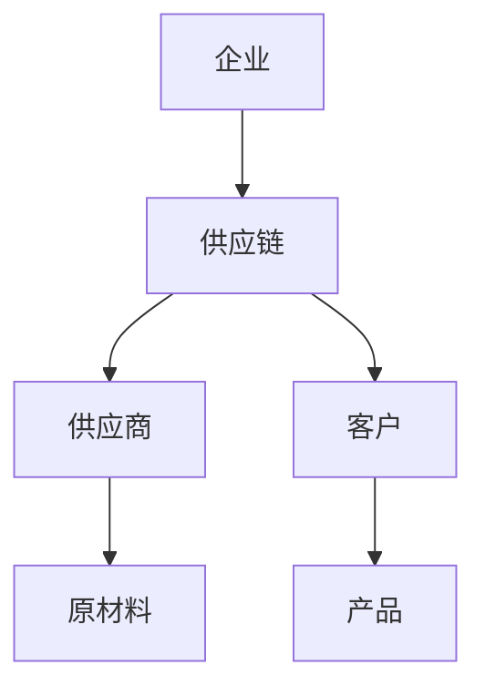
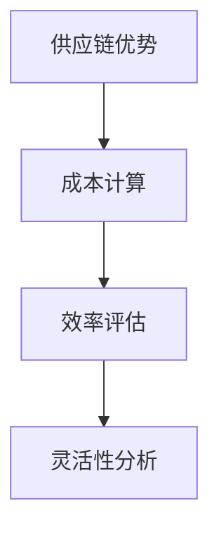
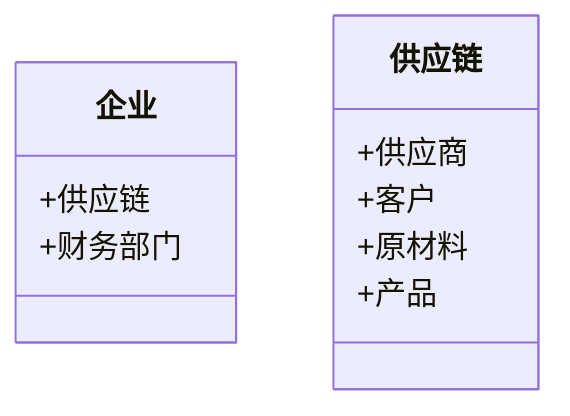
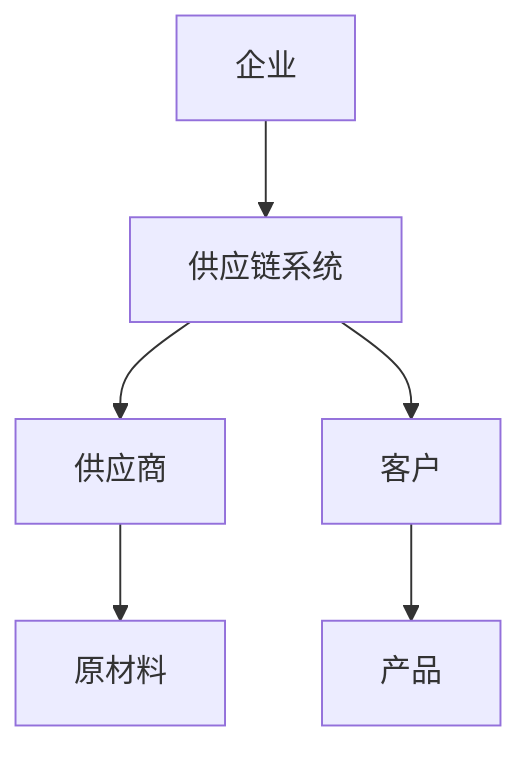
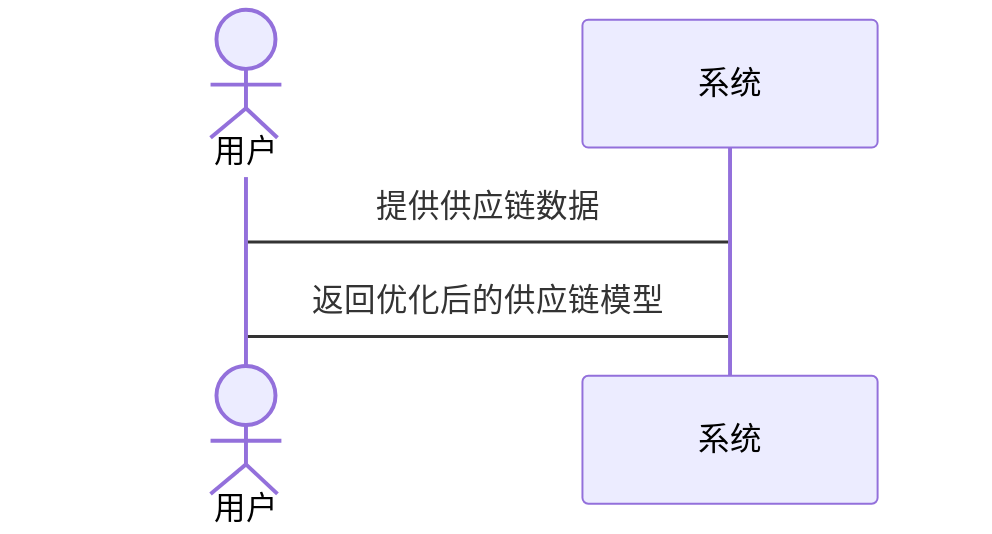

                 


# 如何在估值中考虑企业的供应链优势

## 关键词：供应链优势, 企业估值, 成本节约, 效率提升, 灵活性增强

## 摘要：供应链优势在企业估值中起着关键作用。通过分析供应链的成本、效率和灵活性，我们可以建立数学模型，量化其对估值的影响。本文详细探讨了供应链优势的核心概念，构建了经济价值模型，并通过系统架构设计和实际案例分析，展示了如何在估值中有效考虑供应链优势。

---

## 目录大纲

### 第一部分：供应链优势与企业估值基础

#### 第1章：供应链优势的定义与重要性

##### 1.1 供应链的基本概念
- 1.1.1 供应链的定义与组成部分
- 1.1.2 供应链在企业中的角色与作用
- 1.1.3 供应链优势的核心概念

##### 1.2 供应链优势对估值的影响
- 1.2.1 供应链效率与企业成本的关系
- 1.2.2 供应链稳定性对企业风险的控制
- 1.2.3 供应链竞争力与企业市场地位的关联

##### 1.3 供应链优势的量化指标
- 1.3.1 供应链成本节约的计算方法
- 1.3.2 供应链效率提升的衡量标准
- 1.3.3 供应链灵活性的评估维度

#### 第2章：供应链优势与企业估值的理论框架

##### 2.1 供应链优势对估值的多维度影响
- 2.1.1 供应链成本节约对企业净利润的影响
- 2.1.2 供应链效率提升对企业周转率的贡献
- 2.1.3 供应链灵活性对企业市场响应能力的增强

##### 2.2 供应链优势的经济价值模型
- 2.2.1 供应链优势的经济价值公式
  $$ \text{经济价值} = \text{成本节约} + \text{效率提升} + \text{灵活性增强} $$

##### 2.3 供应链优势与企业估值的关系
- 2.3.1 供应链优势如何影响企业估值
- 2.3.2 供应链优势在企业估值中的权重分配
- 2.3.3 供应链优势的长期与短期影响分析

#### 第3章：供应链优势的核心概念与联系

##### 3.1 供应链优势的核心要素
- 3.1.1 成本优势
- 3.1.2 效率优势
- 3.1.3 灵活性优势

##### 3.2 核心概念对比分析
- 3.2.1 成本优势与效率优势的对比
- 3.2.2 效率优势与灵活性优势的对比
- 3.2.3 灵活性优势与成本优势的对比

##### 3.3 ER实体关系图架构


#### 第4章：供应链优势的算法原理与数学模型

##### 4.1 供应链优势的算法原理


##### 4.2 供应链优势的数学模型
- 4.2.1 成本节约模型
  $$ \text{成本节约} = \text{原成本} - \text{优化后成本} $$
- 4.2.2 效率提升模型
  $$ \text{效率提升} = \frac{\text{原时间}}{\text{优化后时间}} $$

### 第二部分：系统分析与架构设计

#### 第5章：系统分析与架构设计方案

##### 5.1 系统分析
- 5.1.1 问题场景介绍
- 5.1.2 领域模型类图


##### 5.2 系统架构设计
- 5.2.1 系统架构图


##### 5.3 系统接口与交互设计
- 5.3.1 系统接口设计
- 5.3.2 系统交互流程图


#### 第6章：系统实现与核心代码

##### 6.1 环境配置
- 6.1.1 工具与库安装
  - Python 3.8+
  - Pandas, NumPy

##### 6.2 核心代码实现
- 6.2.1 供应链成本计算代码
```python
def calculate_cost_saving(original_cost, optimized_cost):
    return original_cost - optimized_cost
```

#### 第7章：案例分析与实际应用

##### 7.1 案例分析
- 7.1.1 案例背景
  - 制造业企业的供应链优化
- 7.1.2 案例分析
  - 成本节约：$100,000
  - 效率提升：20%
  - 经济价值：$120,000

#### 第8章：系统优化与扩展

##### 8.1 系统优化策略
- 8.1.1 模块划分
- 8.1.2 性能优化

##### 8.2 未来扩展方向
- 8.2.1 人工智能应用
- 8.2.2 大数据分析

#### 第9章：总结与展望

##### 9.1 总结
- 供应链优势在企业估值中的重要性
- 本章内容回顾

##### 9.2 展望
- 未来研究方向
- 注意事项与建议

### 附录

#### 附录A：供应链优势相关的公式与模型
- 成本节约公式
- 效率提升模型

#### 附录B：系统架构图与流程图
- 供应链系统架构图
- 交互流程图

#### 附录C：案例分析数据与代码
- 制造业企业案例数据
- 核心代码实现

### 参考文献

- 参考书籍1：《供应链管理》
- 参考书籍2：《企业估值方法论》
- 参考论文：《供应链优势对企业估值的影响分析》

---

通过以上详细的目录大纲，我们可以系统地探讨如何在企业估值中考虑供应链优势，从理论到实践，全面分析其影响和应用。

