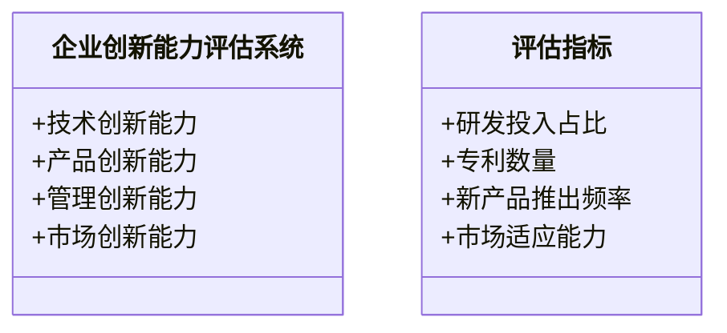
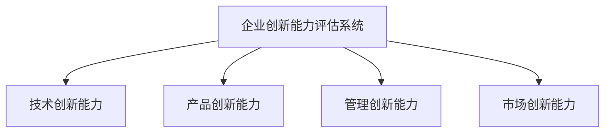
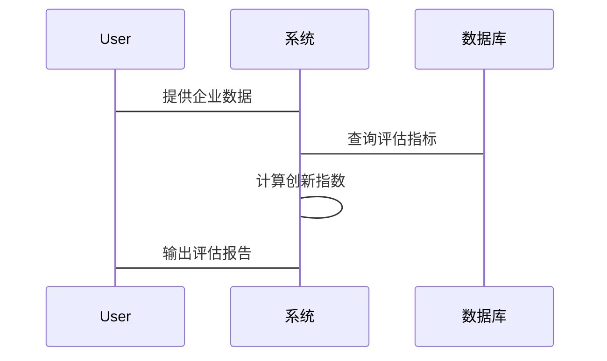

                 


# 如何在估值中考虑企业的创新能力

## 关键词：企业估值，创新能力，创新指数，财务模型，评估框架，创新战略

## 摘要：
企业在现代经济中，创新能力是其核心竞争力之一。然而，在企业估值过程中，创新能力往往难以量化和评估。本文将深入探讨如何在企业估值中考虑创新能力，从定义和内涵开始，分析其在估值中的重要性，构建创新能力的评估框架，提出创新指数的计算方法，并结合实际案例进行分析。通过本文，读者将能够全面理解如何将创新能力纳入企业估值模型中，从而做出更准确的评估。

---

# 第一部分: 如何在估值中考虑企业的创新能力

## 第1章: 企业创新能力的背景与重要性

### 1.1 企业创新能力的定义与内涵
#### 1.1.1 什么是企业创新能力
企业的创新能力是指企业在技术研发、产品创新、管理创新、市场创新等方面的能力，是企业在竞争中保持优势的关键因素。创新能力不仅包括技术层面的创新，还包括商业模式、组织结构和文化的创新。

#### 1.1.2 创新能力的核心要素
- **技术创新能力**：企业在技术研发、专利申请、技术升级等方面的能力。
- **产品创新能力**：企业推出新产品或改进现有产品的能力。
- **管理创新能力**：企业在组织结构、流程优化、绩效管理等方面的创新能力。
- **市场创新能力**：企业开拓新市场、满足客户需求、适应市场变化的能力。

#### 1.1.3 创新能力的维度与分类
创新能力可以从多个维度进行分类：
- **技术驱动型**：依赖技术研发和技术进步。
- **市场驱动型**：以客户需求和市场变化为导向。
- **管理驱动型**：通过优化组织结构和管理流程实现创新。

### 1.2 企业创新能力在估值中的重要性
#### 1.2.1 创新能力对企业价值的影响
创新能力是企业未来收益的重要来源。创新能力强的企业能够更快地推出新产品、开拓新市场，从而提升企业的收入和利润，进而增加企业价值。

#### 1.2.2 传统估值方法的局限性
传统的估值方法（如DCF模型、市盈率法等）主要基于历史财务数据和市场表现，难以充分考虑企业未来的创新能力。然而，创新能力是企业未来增长的核心驱动力，忽视这一点可能导致估值偏差。

#### 1.2.3 创新能力在企业未来收益中的作用
创新能力直接影响企业的未来收益。例如，一家技术领先的科技公司，其创新能力决定了其产品的市场寿命和利润率。因此，在估值时，必须将创新能力作为影响未来现金流的重要因素。

### 1.3 企业创新能力的评估框架
#### 1.3.1 评估框架的构建逻辑
评估企业创新能力需要从多个维度出发，包括技术、产品、管理和市场创新。通过构建一个全面的评估框架，可以更准确地量化创新能力对企业价值的影响。

#### 1.3.2 评估框架的核心指标
- **研发投入占比**：研发支出占销售收入的比例，反映企业在技术研发上的投入。
- **专利数量与质量**：专利的数量和质量是衡量技术创新能力的重要指标。
- **新产品推出频率**：企业推出新产品的速度和频率。
- **市场适应能力**：企业在市场变化中的适应能力和创新能力。

#### 1.3.3 评估框架的应用场景
评估框架适用于企业战略规划、投资决策和估值分析。例如，在企业并购中，评估目标企业的创新能力可以帮助投资者更好地预测其未来收益。

### 1.4 本章小结
本章介绍了企业创新能力的定义、核心要素和评估框架，并强调了创新能力在企业估值中的重要性。创新能力是企业未来收益的关键驱动力，必须在估值过程中予以充分考虑。

---

## 第2章: 企业创新能力的核心概念与联系

### 2.1 创新能力的核心概念
#### 2.1.1 创新能力的属性特征
- **技术性**：创新能力与技术研发密切相关。
- **市场适应性**：创新能力需要满足市场需求。
- **组织性**：创新能力依赖于组织结构和文化的支持。
- **持续性**：创新能力是企业长期发展的基础。

#### 2.1.2 创新能力的衡量标准
- **创新产出**：包括新产品数量、专利数量等。
- **创新效率**：单位研发投入的产出效率。
- **创新质量**：创新成果的市场价值和竞争力。

#### 2.1.3 创新能力的维度与分类
创新能力可以从多个维度进行分类：
- **技术驱动型**：依赖技术研发。
- **市场驱动型**：以客户需求为导向。
- **管理驱动型**：通过优化组织结构实现。

### 2.2 创新能力的对比分析
#### 2.2.1 创新能力与研发能力的对比
- 研发能力是创新能力的一部分，但创新能力还包括产品、管理和市场创新。

#### 2.2.2 创新能力与市场适应能力的对比
- 市场适应能力是创新能力的一部分，但创新能力还包括技术、产品和管理创新。

#### 2.2.3 创新能力与组织能力的对比
- 组织能力是创新能力的基础，但创新能力还包括技术、产品和市场创新。

### 2.3 创新能力的ER实体关系图
```mermaid
erD
```

### 2.4 本章小结
本章详细分析了创新能力的核心概念、属性特征和与其他能力的关系，为后续的创新能力评估奠定了基础。

---

## 第3章: 创新能力的算法原理

### 3.1 创新指数的计算方法
#### 3.1.1 创新指数的定义
创新指数是衡量企业创新能力的综合指标，通常通过加权评分法计算。

#### 3.1.2 创新指数的计算步骤
1. 确定创新能力的评估指标。
2. 给每个指标分配权重。
3. 计算每个指标的评分。
4. 按权重加权求和，得到创新指数。

### 3.2 创新能力的数学模型
#### 3.2.1 创新指数的数学公式
$$创新指数 = \sum_{i=1}^{n} (w_i \times score_i)$$
其中，$w_i$ 是第$i$个指标的权重，$score_i$ 是第$i$个指标的评分。

#### 3.2.2 创新指数的权重分配
权重分配需要根据企业的实际情况和行业特点进行调整。例如，技术驱动型企业可以增加技术相关指标的权重。

### 3.3 创新能力的Python实现
```python
def calculate_innovation_index(criteria_scores, weights):
    return sum(w * s for w, s in zip(weights, criteria_scores))

# 示例
criteria_scores = [80, 70, 90, 60]
weights = [0.3, 0.2, 0.4, 0.1]
innovation_index = calculate_innovation_index(criteria_scores, weights)
print("创新指数 =", innovation_index)
```

### 3.4 本章小结
本章通过算法原理和数学模型，详细介绍了创新指数的计算方法，并通过Python代码展示了实现过程。

---

## 第4章: 创新能力的系统分析与架构设计

### 4.1 系统分析
#### 4.1.1 问题场景介绍
企业创新能力的评估需要构建一个系统化的模型，包括技术、产品、管理和市场创新等多个维度。

#### 4.1.2 项目介绍
本项目旨在构建一个企业创新能力评估系统，帮助投资者和企业管理者更好地评估企业的创新能力。

### 4.2 系统功能设计
#### 4.2.1 领域模型类图


#### 4.2.2 系统架构设计


### 4.3 系统接口设计
#### 4.3.1 输入接口
- 接收企业的财务数据、研发投入、专利数量等。

#### 4.3.2 输出接口
- 输出创新指数和评估报告。

### 4.4 系统交互设计
#### 4.4.1 序列图


### 4.5 本章小结
本章通过系统分析和架构设计，详细介绍了企业创新能力评估系统的构建过程。

---

## 第5章: 项目实战

### 5.1 环境安装
需要安装Python、数据分析库（如Pandas、NumPy）和可视化工具（如Matplotlib）。

### 5.2 核心代码实现
```python
import pandas as pd
import numpy as np

def calculate_innovation_index(criteria_scores, weights):
    return sum(w * s for w, s in zip(weights, criteria_scores))

# 示例数据
data = {
    '技术创新能力': [85, 70, 90],
    '产品创新能力': [75, 65, 85],
    '管理创新能力': [60, 50, 70],
    '市场创新能力': [70, 60, 80]
}

weights = [0.3, 0.2, 0.4, 0.1]

df = pd.DataFrame(data)
innovation_index = []
for i in range(len(df)):
    scores = df.iloc[i].tolist()
    index = calculate_innovation_index(scores, weights)
    innovation_index.append(index)

df['创新指数'] = innovation_index
print(df)
```

### 5.3 案例分析
以一家科技公司为例，计算其创新指数，并分析结果。

### 5.4 本章小结
本章通过实际案例分析，展示了如何将创新能力评估系统应用于实际项目中。

---

## 第6章: 总结与最佳实践

### 6.1 总结
创新能力是企业估值中的重要因素，必须通过系统化的评估框架和数学模型进行量化。

### 6.2 最佳实践
- 在企业估值中，建议将创新能力作为影响未来收益的重要因素。
- 使用创新指数模型进行量化评估。
- 定期更新评估模型，以适应市场变化。

### 6.3 注意事项
- 创新能力评估需要结合企业的实际情况。
- 模型的权重分配需要根据行业特点进行调整。
- 数据的准确性和完整性是评估的关键。

### 6.4 拓展阅读
推荐阅读《创新战略与企业价值》、《企业估值方法与模型》等相关书籍。

### 6.5 本章小结
本章总结了全文的主要内容，并提出了实践中的注意事项和建议。

---

## 附录: 创新能力评估指标表

| 指标名称           | 权重 | 计算公式                     |
|--------------------|------|-----------------------------|
| 研发投入占比       | 0.3  | 研发支出 / 销售收入         |
| 专利数量           | 0.2  | 专利数量                    |
| 新产品推出频率     | 0.4  | 新产品数量 / 总产品数量      |
| 市场适应能力       | 0.1  | 市场份额增长率              |

---

通过本文的详细分析和实际案例，读者可以全面理解如何在企业估值中考虑创新能力，并能够将其应用于实际工作中。创新能力不仅是企业未来收益的核心驱动力，也是企业估值中不可忽视的重要因素。

