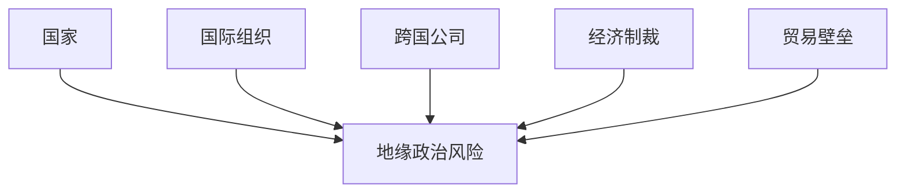
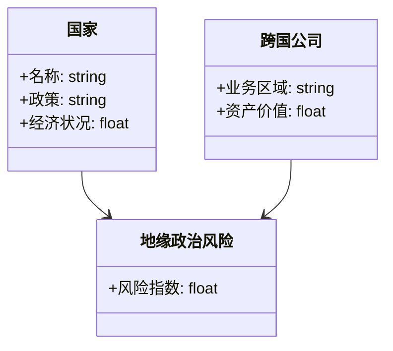

                 


# 如何处理企业估值中的地缘政治风险

## 关键词
地缘政治风险, 企业估值, 风险评估, 国际关系, 经济模型

## 摘要
地缘政治风险是影响企业估值的重要因素，尤其是在全球化和多极化的今天。本文通过分析地缘政治风险的定义、核心要素、与其他风险的关系，以及如何量化地缘政治风险，为企业提供一套系统的方法来评估和应对这些风险。通过实际案例分析和数学模型构建，本文展示了如何将地缘政治风险纳入企业估值模型，以帮助投资者和企业管理者做出更明智的决策。

---

## 第一部分：地缘政治风险与企业估值的背景介绍

### 第1章：地缘政治风险的基本概念

#### 1.1 地缘政治风险的定义与特征

地缘政治风险是指由于国家之间的政治、经济、军事和文化冲突，或者由于国际关系的变化对企业运营、资产价值或财务表现产生的负面影响。这种风险具有以下特征：

- **不确定性**：地缘政治事件的发生往往具有突发性和不可预测性。
- **复杂性**：地缘政治风险通常涉及多个利益相关者，且这些利益相关者之间的关系错综复杂。
- **长期性**：某些地缘政治风险可能会持续多年，甚至几十年，对企业的长期估值产生深远影响。

#### 1.2 地缘政治风险对企业估值的影响

地缘政治风险直接影响企业的经营环境，从而影响其估值。例如，贸易壁垒的增加可能导致企业的收入下降，进而影响其估值。此外，地缘政治风险还可能导致企业的资产贬值或流动性下降，从而影响其市场价值。

---

### 第2章：地缘政治风险的全球案例分析

#### 2.1 典型地缘政治风险案例

地缘政治风险在全球范围内广泛存在，以下是一些典型的案例：

- **中美贸易摩擦**：美国对中国的关税战和科技制裁对企业估值产生了深远影响，尤其是在高科技行业。
- **俄乌冲突**：能源价格的波动和供应链的中断对全球能源企业和制造业企业造成了重大影响。
- **中东地缘政治冲突**：该地区的冲突对企业在该地区的业务扩展和投资产生了负面影响。

#### 2.2 地缘政治风险的行业分布

不同行业对地缘政治风险的敏感性不同：

- **高科技行业**：依赖全球供应链，容易受到技术制裁的影响。
- **能源行业**：受到地缘政治冲突导致的能源价格波动和供应链中断的影响。
- **制造业**：受到贸易壁垒和供应链中断的影响。

---

## 第二部分：地缘政治风险的核心概念与联系

### 第3章：地缘政治风险的核心要素与属性

#### 3.1 地缘政治风险的核心要素

地缘政治风险的核心要素包括以下内容：

- **国家利益**：各国政府为了维护自身的利益，可能会采取各种措施，包括经济制裁、贸易限制等。
- **国际关系**：国际关系的变化，如盟友关系的变化、敌对关系的加剧，都会影响企业的经营环境。
- **经济制裁**：经济制裁是地缘政治风险的重要表现形式，包括贸易限制、外汇管制等。

#### 3.2 地缘政治风险的属性特征对比

以下是地缘政治风险与其他风险的对比：

| 风险类型       | 不确定性 | 可预测性 | 周期性 | 局部性 |
|----------------|----------|----------|--------|--------|
| 地缘政治风险   | 高       | 低       | 长     | 高     |
| 市场风险       | 中       | 高       | 短     | 低     |
| 信用风险       | 低       | 高       | 不定   | 中     |

#### 3.3 地缘政治风险的ER实体关系图

以下是地缘政治风险的ER实体关系图：



---

## 第三部分：地缘政治风险的算法原理

### 第4章：地缘政治风险的量化与评估

#### 4.1 地缘政治风险的量化方法

地缘政治风险的量化可以通过以下步骤进行：

1. **数据采集**：收集与地缘政治风险相关的数据，如贸易数据、政治事件数据等。
2. **特征提取**：从数据中提取关键特征，如贸易壁垒、经济制裁等。
3. **风险评估模型**：构建数学模型，计算地缘政治风险指数。

#### 4.2 地缘政治风险的数学模型

以下是地缘政治风险的数学模型：

$$
\text{地缘政治风险指数} = \sum_{i=1}^{n} w_i \cdot f_i
$$

其中，\( w_i \) 是第 \( i \) 个特征的权重，\( f_i \) 是第 \( i \) 个特征的值。

#### 4.3 地缘政治风险的Python实现

以下是地缘政治风险的Python实现示例：

```python
import pandas as pd
import numpy as np

# 数据采集
data = pd.read_csv('geopolitical_risk.csv')

# 特征提取
features = ['trade_barriers', 'economic_sanctions', 'political_events']

# 风险评估模型
weights = [0.4, 0.3, 0.3]
risk_index = np.dot(data[features].values, weights)

# 输出结果
print("地缘政治风险指数:", risk_index.mean())
```

---

## 第四部分：地缘政治风险的系统架构设计

### 第5章：地缘政治风险的系统架构

#### 5.1 系统功能设计

以下是地缘政治风险系统的功能设计：

- **数据采集模块**：负责采集与地缘政治风险相关的数据。
- **风险评估模块**：负责计算地缘政治风险指数。
- **结果展示模块**：负责展示地缘政治风险指数。

#### 5.2 地缘政治风险的领域模型

以下是地缘政治风险的领域模型：



#### 5.3 地缘政治风险的系统架构

以下是地缘政治风险的系统架构：


---

## 第五部分：地缘政治风险的项目实战

### 第6章：地缘政治风险的项目实战

#### 6.1 环境安装

以下是项目实战所需的环境安装步骤：

1. 安装Python
2. 安装Pandas和NumPy库
3. 下载地缘政治风险数据

#### 6.2 核心代码实现

以下是地缘政治风险的Python代码实现：

```python
import pandas as pd
import numpy as np

# 数据加载
data = pd.read_csv('geopolitical_risk.csv')

# 数据清洗
data = data.dropna()

# 特征提取
features = ['trade_barriers', 'economic_sanctions', 'political_events']

# 权重分配
weights = [0.4, 0.3, 0.3]

# 风险指数计算
risk_index = np.dot(data[features].values, weights)

# 结果展示
print("地缘政治风险指数:", risk_index.mean())
```

#### 6.3 案例分析

以下是地缘政治风险的案例分析：

- **华为制裁**：美国对华为的制裁导致华为的估值大幅下降。
- **俄罗斯经济制裁**：西方对俄罗斯的经济制裁导致俄罗斯企业的估值大幅下降。

---

## 第六部分：地缘政治风险的最佳实践

### 第7章：地缘政治风险的最佳实践

#### 7.1 小结

地缘政治风险是影响企业估值的重要因素。通过量化地缘政治风险，企业可以更好地应对这些风险，并做出更明智的决策。

#### 7.2 注意事项

- **数据质量**：确保数据的准确性和完整性。
- **模型选择**：选择合适的模型进行地缘政治风险的量化。
- **长期风险评估**：关注地缘政治风险的长期影响。

#### 7.3 拓展阅读

- 《The Power of Networks》
- 《Geopolitical Risk Management》

---

## 结语

地缘政治风险是影响企业估值的重要因素。通过量化地缘政治风险，企业可以更好地应对这些风险，并做出更明智的决策。本文通过分析地缘政治风险的定义、核心要素、与其他风险的关系，以及如何量化地缘政治风险，为企业提供了一套系统的方法来评估和应对这些风险。希望本文的内容能够帮助读者更好地理解和应对地缘政治风险，提升企业的估值和竞争力。

