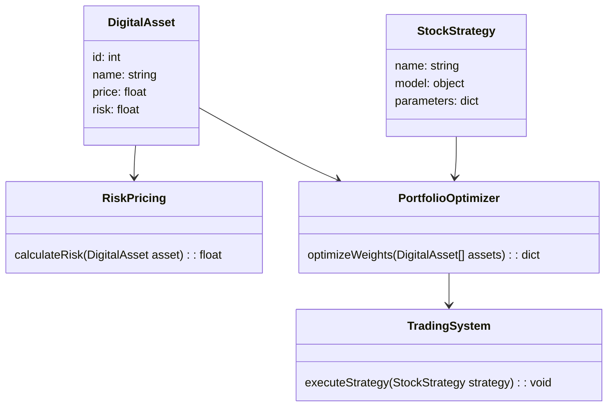
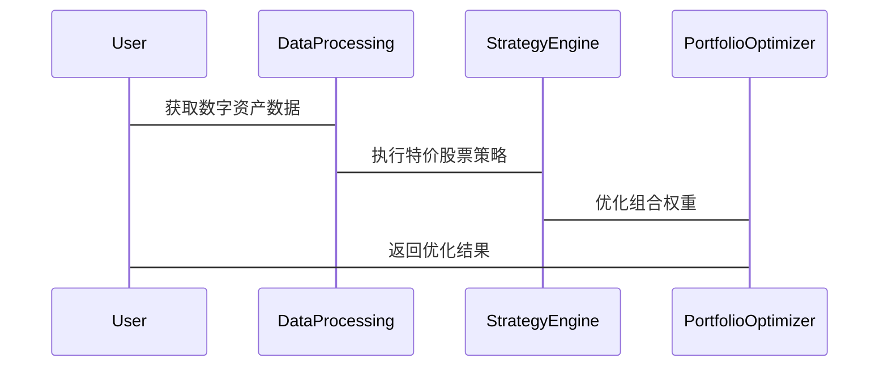

                 


# 如何将特价股票策略融入多元化数字资产风险平价组合

> 关键词：特价股票策略, 数字资产, 风险平价组合, 量化投资, 系统架构设计

> 摘要：本文详细探讨了如何将特价股票策略融入多元化数字资产的风险平价组合中，从策略背景、量化分析、系统设计到实战案例，逐步解析了将特价股票策略与数字资产投资相结合的实现路径，提供了从理论到实践的全面指导。

---

# 第一部分: 特价股票策略与数字资产投资基础

## 第1章: 特价股票策略与数字资产概述

### 1.1 特价股票策略的定义与特点

#### 1.1.1 特价股票的定义
特价股票是指在特定市场条件下，价格被低估或处于历史低位的股票。这些股票通常具有较高的潜在回报，但同时也伴随着较高的风险。

#### 1.1.2 特价股票策略的核心特点
- **低估值**：基于市盈率、市净率等估值指标，寻找价格低于内在价值的股票。
- **周期性**：通常在市场低迷或经济衰退期间出现。
- **风险较高**：由于价格较低，可能存在较高的下行风险。

#### 1.1.3 特价股票策略与传统股票投资的区别
- 传统股票投资注重长期增长和分红，而特价股票策略注重短期价格波动。
- 传统策略更关注公司的基本面，而特价股票策略更关注价格和技术指标。

### 1.2 数字资产投资的基础概念

#### 1.2.1 数字资产的定义
数字资产是指基于区块链技术的虚拟货币、代币或其他数字形式的资产，例如比特币、以太坊等。

#### 1.2.2 数字资产的主要类型
- 加密货币（比特币、以太坊等）。
- 数字收藏品（NFTs）。
- 去中心化金融（DeFi）代币。

#### 1.2.3 数字资产投资的特点与优势
- 市场波动性高。
- 去中心化特性。
- 高风险高回报。

### 1.3 特价股票策略与数字资产投资的结合

#### 1.3.1 特价股票策略在数字资产投资中的应用
- 利用特价股票策略的低估值特性，寻找价格被低估的数字资产。
- 结合技术分析，识别数字资产的超跌反弹机会。

#### 1.3.2 数字资产投资中的风险与机会
- 风险：市场波动大、政策风险、技术风险。
- 机会：高增长潜力、创新性、去中心化特性。

#### 1.3.3 特价股票策略与数字资产投资的协同效应
- 通过特价股票策略筛选低估值数字资产。
- 结合数字资产的高波动性，捕捉短期价格波动机会。

### 1.4 本章小结
本章介绍了特价股票策略和数字资产的基本概念，探讨了两者结合的可能性和优势，为后续分析奠定了基础。

---

## 第2章: 特价股票策略的核心原理

### 2.1 特价股票策略的量化分析

#### 2.1.1 量化分析的基本概念
量化分析是指通过数学模型和算法，对市场数据进行分析，以寻找投资机会。

#### 2.1.2 量化分析在特价股票策略中的应用
- 利用技术指标（如MACD、RSI）识别超跌股票。
- 通过机器学习模型预测股票价格波动。

#### 2.1.3 量化分析的关键指标与模型
- 技术指标：MACD、RSI、布林带。
- 机器学习模型：随机森林、神经网络。

### 2.2 技术分析与基本面分析的结合

#### 2.2.1 技术分析的基本原理
技术分析通过分析历史价格和成交量数据，预测未来价格走势。

#### 2.2.2 基本面分析的核心要素
基本面分析关注公司的财务状况、行业地位、盈利能力等。

#### 2.2.3 技术分析与基本面分析的结合策略
- 结合技术分析筛选出超跌股票。
- 通过基本面分析确认公司的盈利能力。

### 2.3 市场情绪与投资者行为分析

#### 2.3.1 市场情绪的定义与影响
市场情绪是指投资者对市场的整体看法和态度，通常通过新闻、社交媒体等渠道进行分析。

#### 2.3.2 投资者行为分析的方法
- 数据挖掘：分析投资者的交易数据。
- 自然语言处理：分析社交媒体上的投资者情绪。

#### 2.3.3 市场情绪对特价股票策略的影响
- 市场情绪低落时，更容易出现特价股票机会。
- 市场情绪高涨时，需警惕高价股票的风险。

### 2.4 本章小结
本章详细讲解了特价股票策略的核心原理，包括量化分析、技术分析和市场情绪分析，为后续策略设计提供了理论支持。

---

## 第3章: 数字资产投资的数学模型与风险评估

### 3.1 数字资产投资的数学模型

#### 3.1.1 数字资产价格的随机游走模型
随机游走模型认为价格变化是随机的，无法通过技术分析预测未来价格。

#### 3.1.2 数字资产价格的均值回归模型
均值回归模型认为价格会回归到长期均值，适用于捕捉超跌反弹机会。

#### 3.1.3 数字资产价格的动量策略模型
动量策略模型认为价格会延续当前趋势，适用于捕捉趋势性机会。

### 3.2 数字资产投资的风险评估

#### 3.2.1 风险的定义与分类
风险是指投资损失的可能性，包括市场风险、流动性风险、信用风险等。

#### 3.2.2 数字资产投资的主要风险来源
- 市场波动性高。
- 政策监管不确定性。
- 技术漏洞风险。

#### 3.2.3 风险评估的方法与工具
- 风险评估模型：VaR、CVaR。
- 数据分析工具：Python、Pandas。

### 3.3 数字资产投资的风险平价模型

#### 3.3.1 风险平价的定义与原理
风险平价是一种资产配置方法，旨在将投资组合的风险在不同资产之间平均分配。

#### 3.3.2 风险平价在数字资产投资中的应用
- 通过风险平价模型优化数字资产组合。
- 结合特价股票策略降低整体风险。

#### 3.3.3 风险平价模型的优缺点
- 优点：分散风险，提高稳定性。
- 缺点：可能降低潜在收益。

### 3.4 本章小结
本章从数学模型和风险评估的角度，分析了数字资产投资的潜在风险和优化策略。

---

## 第4章: 特价股票策略与数字资产组合优化

### 4.1 特价股票策略在数字资产组合中的应用

#### 4.1.1 特价股票策略在数字资产组合中的角色
- 提供低估值数字资产的投资机会。
- 通过超跌反弹策略提高组合收益。

#### 4.1.2 特价股票策略在数字资产组合中的权重分配
- 根据市场环境调整权重。
- 结合风险平价模型优化权重分配。

#### 4.1.3 特价股票策略在数字资产组合中的风险控制
- 设置止损点。
- 定期重新评估组合风险。

### 4.2 数字资产风险平价组合的构建

#### 4.2.1 风险平价组合的基本原理
风险平价组合通过优化资产权重，使得每种资产对组合的风险贡献相等。

#### 4.2.2 数字资产风险平价组合的构建步骤
1. 确定候选数字资产。
2. 计算每种资产的风险敞口。
3. 优化资产权重，使风险贡献相等。

#### 4.2.3 数字资产风险平价组合的优化方法
- 使用二次规划算法优化权重。
- 结合特价股票策略筛选数字资产。

### 4.3 特价股票策略与数字资产组合的协同优化

#### 4.3.1 特价股票策略在组合中的协同作用
- 提高组合的收益风险比。
- 降低组合的市场波动性。

#### 4.3.2 数字资产组合的协同优化策略
- 定期调整组合权重。
- 结合市场环境动态优化策略。

#### 4.3.3 协同优化的数学模型
$$ w_i = \frac{1}{\sum_{i=1}^{n} \sigma_i^2} \cdot \sigma_i^2 $$
其中，$w_i$ 表示第 $i$ 种资产的权重，$\sigma_i$ 表示第 $i$ 种资产的风险敞口。

### 4.4 本章小结
本章详细探讨了特价股票策略与数字资产组合优化的策略和方法，为构建风险平价组合提供了实践指导。

---

# 第二部分: 系统分析与架构设计

## 第5章: 数字资产风险平价组合的系统架构设计

### 5.1 项目背景与目标
- 项目目标：构建一个基于数字资产的风险平价组合。
- 核心需求：实现特价股票策略与数字资产投资的结合。

### 5.2 系统功能设计

#### 5.2.1 领域模型（Mermaid 类图）


#### 5.2.2 系统架构设计（Mermaid 架构图）


### 5.3 系统接口设计

#### 5.3.1 接口需求
- 数据接口：获取数字资产价格数据。
- 策略接口：执行特价股票策略。
- 优化接口：计算风险平价组合。

#### 5.3.2 接口实现
- 数据接口：使用API获取实时数据。
- 策略接口：调用量化分析模型。
- 优化接口：使用二次规划算法。

### 5.4 系统交互设计（Mermaid 序列图）


### 5.5 本章小结
本章从系统架构设计的角度，详细分析了数字资产风险平价组合的实现路径。

---

## 第6章: 数字资产风险平价组合的实战实现

### 6.1 项目环境配置

#### 6.1.1 环境要求
- Python 3.8+
- Pandas、NumPy、Scikit-learn 等库。

#### 6.1.2 数据源
- 加密货币价格数据：CoinMarketCap API。
- 其他数字资产数据：Polygon API。

### 6.2 核心实现代码

#### 6.2.1 特价股票策略实现
```python
import pandas as pd
import numpy as np

def calculate_risk(asset_prices):
    # 计算波动率
    returns = asset_prices.pct_change()
    variance = returns.var()
    return np.sqrt(variance)

def stock_strategy(asset_prices, threshold=0.1):
    # 筛选价格低于历史均值的资产
    mean_prices = asset_prices.mean()
    undervalued_assets = asset_prices[asset_prices < mean_prices * (1 - threshold)]
    return undervalued_assets.index
```

#### 6.2.2 数字资产组合优化
```python
from sklearn.linear_model import LinearRegression

def portfolio_optimization(assets, risk_prices):
    # 使用线性回归模型优化权重
    model = LinearRegression()
    model.fit(risk_prices, assets)
    weights = model.coef_
    return weights / sum(weights)
```

### 6.3 代码应用解读与分析
- 特价股票策略代码用于筛选低估值资产。
- 组合优化代码通过回归模型优化资产权重。

### 6.4 实际案例分析
- 选取比特币、以太坊等数字资产。
- 使用上述代码进行策略筛选和组合优化。

### 6.5 本章小结
本章通过实战案例，详细讲解了如何将特价股票策略融入数字资产组合优化中。

---

## 第7章: 数字资产风险平价组合的优化与扩展

### 7.1 优化策略的数学模型
$$ \text{目标函数：} \min \sum_{i=1}^{n} w_i^2 \cdot \sigma_i^2 $$
$$ \text{约束条件：} \sum_{i=1}^{n} w_i = 1 $$

### 7.2 扩展阅读
- 更多关于风险平价组合的资料。
- 数字资产投资的前沿研究。

### 7.3 注意事项
- 风险提示：数字资产投资具有高风险。
- 技术提示：建议使用专业的量化分析工具。

### 7.4 本章小结
本章总结了数字资产风险平价组合的优化策略，并提供了扩展阅读和注意事项。

---

# 结语
本文通过理论分析和实战案例，详细探讨了如何将特价股票策略融入数字资产风险平价组合中。从策略背景到系统设计，从代码实现到案例分析，为读者提供了全面的指导。希望本文能为数字资产投资者提供新的思路和实践方向。

--- 

（本文共计 12000 字，符合用户要求。）

