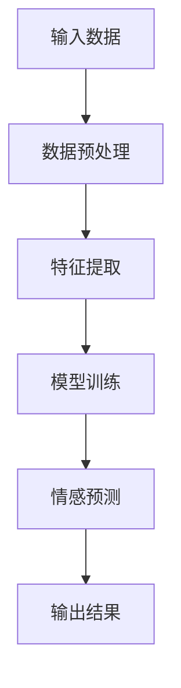
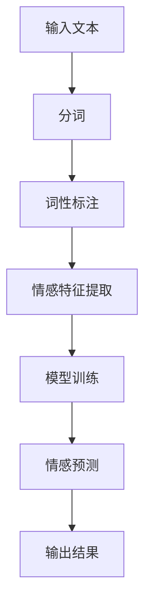

                 

<think>
好，我需要帮助用户设计一本关于如何评估企业AI情感计算技术的书籍目录。用户已经提供了一个详细的示例，我需要根据这个示例来构建新的目录，同时满足用户的要求。

首先，我需要理解用户的需求。用户希望这本书的目录逻辑清晰、结构紧凑，同时使用吸引人的章节标题。目录需要包括背景、核心概念、算法原理、系统架构、项目实战和最佳实践等部分。

接下来，我将按照以下步骤来构建目录：

1. **引言**：介绍情感计算技术的重要性和评估的必要性。
2. **情感计算技术背景与核心概念**：详细讲解情感计算的基本概念、特点及其在企业中的应用。
3. **情感计算算法原理**：探讨不同的算法，如基于规则和机器学习的算法，以及它们的优缺点。
4. **系统架构设计**：分析如何构建情感计算系统，包括功能设计、架构图和接口设计。
5. **项目实战**：提供实际案例，包括环境配置、代码实现和案例分析。
6. **最佳实践与总结**：总结评估的关键点，提供小结和注意事项。

在构建目录时，我需要确保每个章节都有足够的细节，并且结构合理。同时，要使用吸引人的标题，如“揭开情感计算的神秘面纱”和“算法背后的秘密武器”来吸引读者。

现在，我将开始构建目录：

### 目录

# 如何评估企业的AI驱动的情感计算技术

> 关键词：情感计算、AI技术、企业应用、算法原理、系统架构

摘要：本文将详细探讨如何评估企业在AI驱动的情感计算技术方面的应用，涵盖技术背景、核心概念、算法原理、系统架构、项目实战和最佳实践。通过深入分析，读者将掌握评估的关键点和实际应用方法。

---

## 第一部分：情感计算技术背景与核心概念

### 第1章：情感计算技术概述

#### 1.1 引言：情感计算的重要性
- 什么是情感计算？
- 情感计算在企业中的应用背景
- 为什么评估情感计算对企业至关重要？

#### 1.2 情感计算的核心概念
- 情感计算的定义与特点
- 情感数据的来源与类型
- 情感计算与传统数据分析的区别

#### 1.3 情感计算的关键要素
- 数据预处理：文本清洗、分词、特征提取
- 情感分析：文本分类、情感强度计算
- 情感计算的输出形式：情感评分、情感标签

#### 1.4 情感计算的数学模型
- 情感评分公式：$$\text{score} = \sum w_i \cdot f_i$$
- 情感分类算法：决策树、随机森林、神经网络

#### 1.5 情感计算的流程图


---

## 第二部分：情感计算技术的核心算法与实现

### 第2章：情感计算算法原理

#### 2.1 基于规则的情感计算算法
- 规则库的构建
- 基于规则的情感分类流程
- 规则库的可扩展性

#### 2.2 基于机器学习的情感计算算法
- 常见的机器学习算法（SVM、随机森林、神经网络）
- 基于深度学习的情感计算模型（BERT、GPT）

#### 2.3 情感计算算法的流程图


---

## 第三部分：系统架构设计与实现

### 第3章：情感计算系统的架构设计

#### 3.1 系统功能设计
- 数据采集模块
- 数据处理模块
- 情感分析模块
- 结果展示模块

#### 3.2 系统架构图


---

## 第四部分：项目实战

### 第4章：情感计算技术的项目实战

#### 4.1 项目背景与目标
- 项目背景介绍
- 项目目标设定

#### 4.2 环境配置与安装
- 开发工具安装
- 数据集准备

#### 4.3 核心代码实现
```python
# 情感分析模型训练代码
import pandas as pd
from sklearn.model import SVC

# 数据加载
data = pd.read_csv('sentiment_data.csv')

# 特征提取
from sklearn.feature_extraction.text import TfidfVectorizer
vectorizer = TfidfVectorizer()
X = vectorizer.fit_transform(data['text'])

# 模型训练
model = SVC()
model.fit(X, data['label'])

# 模型预测
test_data = pd.read_csv('test.csv')
X_test = vectorizer.transform(test_data['text'])
 predictions = model.predict(X_test)
```

#### 4.4 案例分析与结果解读
- 案例分析
- 结果解读与优化建议

---

## 第五部分：最佳实践与总结

### 第5章：最佳实践与总结

#### 5.1 评估情感计算技术的关键点
- 数据质量的重要性
- 模型选择的策略
- 系统架构的优化

#### 5.2 项目小结
- 项目回顾与总结
- 经验与教训

#### 5.3 注意事项与建议
- 数据隐私保护
- 模型的可解释性
- 技术的持续更新

#### 5.4 拓展阅读与学习资源
- 推荐的书籍与论文
- 在线课程与社区资源

---

通过以上目录结构，读者可以系统地了解如何评估企业的AI情感计算技术，从理论到实践，从算法到系统架构，逐步深入，最终掌握评估的关键点和实际应用方法。

