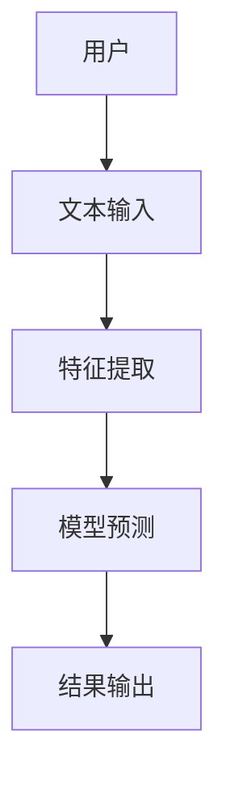
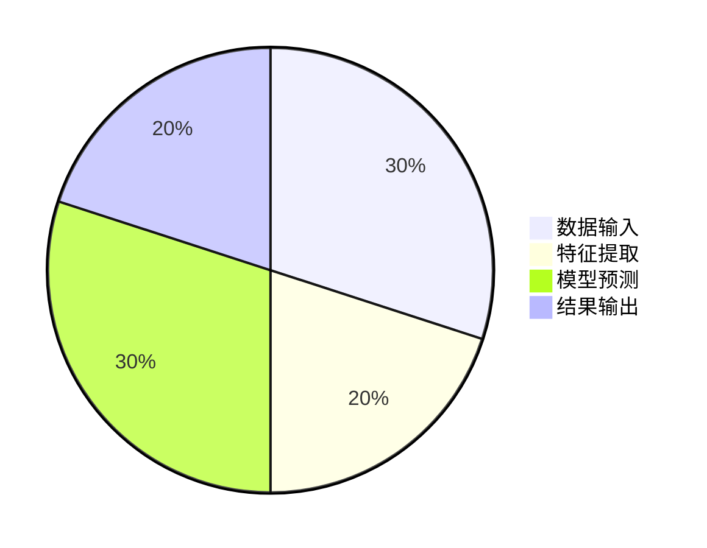
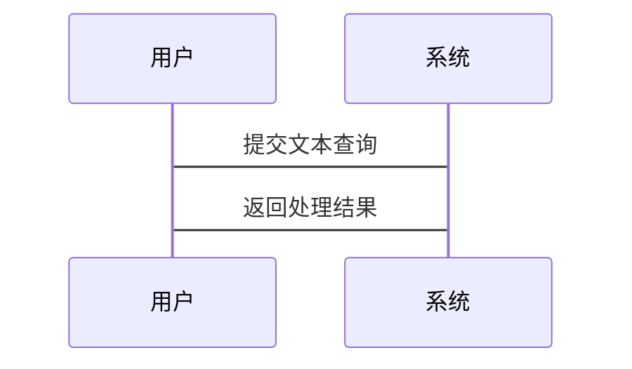

                 


# 如何评估企业的AI驱动的自然语言处理技术

> 关键词：自然语言处理，AI驱动，技术评估，企业应用，文本分析

> 摘要：本文旨在探讨如何系统性地评估企业中AI驱动的自然语言处理（NLP）技术。通过分析NLP的核心概念、评估指标、算法原理以及实际应用场景，本文为读者提供一个全面的视角，帮助他们理解并实施有效的NLP技术评估策略。

---

## 第1章: 自然语言处理技术的背景与现状

### 1.1 自然语言处理的定义与核心概念

#### 1.1.1 自然语言处理的定义
自然语言处理（NLP）是计算机科学与人工智能领域的重要分支，旨在使计算机能够理解和处理人类语言。NLP的目标是通过算法和技术，实现对文本数据的分析、理解和生成。

#### 1.1.2 自然语言处理的核心概念与组成部分
- **语言学知识**：包括语法、语义、语用学等，用于理解文本的结构和含义。
- **文本特征提取**：通过词袋模型、TF-IDF等方法，提取文本的关键特征。
- **机器学习模型**：如支持向量机（SVM）、随机森林和深度学习模型（如RNN、Transformer），用于文本分类、生成等任务。
- **预训练模型**：如BERT、GPT等，通过大规模数据预训练，提升模型的通用性和表现力。

#### 1.1.3 企业级自然语言处理技术的特点
- **数据量大**：企业通常拥有大量文本数据，包括客户咨询、内部文档等。
- **场景多样化**：NLP技术在企业中应用于客服、营销、舆情分析等多个场景。
- **对实时性要求高**：企业需要快速响应，因此对NLP技术的处理速度有较高要求。

### 1.2 AI驱动的自然语言处理技术发展

#### 1.2.1 自然语言处理技术的历史演变
- **传统NLP**：基于规则和统计方法，如早期的词性标注和句法分析。
- **深度学习驱动的NLP**：以深度学习模型（如RNN、LSTM、Transformer）为代表，显著提升了NLP技术的性能。
- **预训练模型的崛起**：如BERT、GPT-3等，通过大规模预训练，使模型具备更强的上下文理解和生成能力。

#### 1.2.2 AI技术对企业自然语言处理的推动作用
- **提升处理效率**：AI技术使得NLP模型能够快速处理大量文本数据。
- **增强模型性能**：预训练模型和深度学习技术显著提高了NLP任务的准确性和鲁棒性。
- **拓展应用场景**：AI驱动的NLP技术在企业中的应用从简单的文本分类扩展到复杂的对话系统和内容生成。

#### 1.2.3 当前企业级NLP技术的应用现状
- **客户服务**：智能客服系统通过NLP技术实现自动问答和意图识别。
- **内容分析**：对企业内外部文本数据（如社交媒体评论、市场报告）进行分析，提取关键信息。
- **流程自动化**：将NLP技术应用于文档处理、合同审查等企业内部流程，提高效率。

---

## 第2章: 企业AI驱动的自然语言处理技术评估背景

### 2.1 企业应用中的NLP技术需求

#### 2.1.1 企业对NLP技术的核心需求
- **准确性**：NLP模型需要准确理解用户意图或文本含义。
- **可解释性**：企业通常需要了解模型的决策过程，以便优化和调整。
- **可扩展性**：企业可能需要处理大量数据，因此模型必须具备良好的扩展性。

#### 2.1.2 NLP技术在企业中的应用场景
- **客户支持**：智能客服系统通过NLP技术处理客户咨询，提供快速响应。
- **市场分析**：通过分析社交媒体和市场报告，提取市场趋势和竞争对手信息。
- **内部管理**：对企业内部文档进行自动分类、摘要，优化管理效率。

#### 2.1.3 企业NLP技术评估的重要性
- **技术选型**：评估不同NLP技术的优劣，选择最适合企业需求的方案。
- **性能优化**：通过评估发现问题，优化模型性能，提升用户体验。
- **成本控制**：评估不同方案的成本效益，合理分配资源。

### 2.2 企业AI驱动NLP技术的挑战与机遇

#### 2.2.1 技术实现的挑战
- **数据质量**：企业数据可能存在噪声、缺失等问题，影响模型性能。
- **模型调优**：深度学习模型需要大量的计算资源和专业知识进行调优。
- **可解释性**：复杂的模型通常缺乏可解释性，影响企业的信任和应用。

#### 2.2.2 数据质量和隐私问题
- **数据隐私**：企业数据通常涉及敏感信息，如何在保证隐私的前提下进行NLP处理是一个重要挑战。
- **数据多样性**：企业内部数据可能不够多样化，导致模型在某些场景下表现不佳。

#### 2.2.3 企业级NLP技术的未来发展
- **多模态融合**：将NLP与计算机视觉等技术结合，提升模型的综合能力。
- **边缘计算**：在边缘设备上部署NLP模型，实现低延迟和高实时性。
- **持续学习**：通过在线学习和微调，使模型能够适应不断变化的业务需求。

---

## 第3章: 自然语言处理技术的核心概念

### 3.1 自然语言处理的数学模型与算法

#### 3.1.1 统计学方法在NLP中的应用
- **朴素贝叶斯**：常用于文本分类任务，基于概率论进行分类。
- **线性回归**：用于文本相似度计算，通过回归模型预测文本的相似性分数。

#### 3.1.2 深度学习在NLP中的应用
- **RNN（循环神经网络）**：适用于序列数据的处理，如机器翻译和文本生成。
- **Transformer模型**：通过自注意力机制，捕捉文本中的长距离依赖关系，性能优于RNN。
- **BERT模型**：基于Transformer的预训练模型，通过上下文理解实现文本表示。

#### 3.1.3 常见NLP算法的优缺点对比
| 算法         | 优点                           | 缺点                           |
|--------------|--------------------------------|--------------------------------|
| 朴素贝叶斯   | 计算简单，适合小数据集         | 对特征独立性假设严格           |
| RNN          | 能处理序列数据                 | �易发梯度消失或爆炸问题           |
| Transformer   | 捕捉长距离依赖，性能优越       | 计算资源消耗大，适合云端部署     |

### 3.2 自然语言处理中的数据特征

#### 3.2.1 文本数据的特征提取
- **词袋模型**：将文本表示为单词的集合，不考虑顺序。
- **TF-IDF**：通过计算词频-逆文档频率，提取文本中的重要特征。
- **词嵌入**：如Word2Vec、GloVe，将单词表示为低维向量，捕捉语义信息。

#### 3.2.2 词向量表示方法
- **Word2Vec**：通过上下文预测单词，生成连续的词向量表示。
- **GloVe**：基于全局词频统计，生成词向量，适用于大规模数据。
- **BERT**：通过预训练生成上下文相关的词向量。

#### 3.2.3 预训练模型在NLP中的作用
- **预训练模型的优势**：通过大规模数据预训练，模型能够理解多种语言和上下文关系。
- **微调模型的应用**：在特定任务上对预训练模型进行微调，提升任务相关性。

---

## 第4章: 自然语言处理技术的评估指标

### 4.1 分类任务的评估指标

#### 4.1.1 准确率、召回率与F1值
- **准确率（Accuracy）**：正确分类的样本数占总样本数的比例。
- **召回率（Recall）**：正确识别的正类样本数占所有正类样本数的比例。
- **F1值**：准确率和召回率的调和平均数，综合考虑分类的精确性和召回性。

#### 4.1.2 ROC-AUC曲线的定义与应用
- **ROC曲线**：通过将真实正类率（TPR）和真实负类率（FPR）绘制的曲线，评估分类器的性能。
- **AUC值**：ROC曲线下方的面积，表示分类器区分正负类的能力。

#### 4.1.3 常见分类任务的评估指标对比
| 指标   | 适用场景               | 优点                       | 缺点                       |
|--------|------------------------|----------------------------|----------------------------|
| 准确率 | 平衡类别的分类任务     | 简单易懂                   | 易受类别不平衡影响           |
| 召回率 | 正类样本较少的任务     | 更关注正类的识别能力         | 忽略了负类的准确性           |
| F1值   | 类别不平衡的任务       | 综合考虑准确率和召回率       | 对于类别不平衡任务仍有一定局限性 |

### 4.2 生成任务的评估指标

#### 4.2.1 BLEU评分的定义与计算
- **BLEU（双倍权重编辑距离）**：通过计算生成文本与参考文本之间的距离，评估生成结果的质量。
- **BLEU评分公式**：
  $$ \text{BLEU} = \exp\left(\text{log}(p_1) \times 0.1 + \text{log}(p_2) \times 0.2 + \text{log}(p_3) \times 0.3 + \text{log}(p_4) \times 0.4\right) $$
  其中，$p_n$ 表示n-gram的精度。

#### 4.2.2 ROUGE评分的定义与计算
- **ROUGE（Recall-Oriented Understudy for GEMEVAL’95 tasks）**：基于召回率的评估指标，常用于文本摘要任务。
- **ROUGE-L评分公式**：
  $$ \text{ROUGE-L} = \frac{\sum_{i=1}^{n} \min(r_i, c_i)}{\sum_{i=1}^{n} r_i} $$
  其中，$r_i$ 和 $c_i$ 分别表示参考摘要和生成摘要的i-th n-gram计数。

#### 4.2.3 生成任务的其他评估指标
- **困惑度（Perplexity）**：衡量模型生成文本的流畅性，值越低表示生成文本越流畅。
- **人类评价（Human Evaluation）**：通过人工评分评估生成文本的质量，常用于内容生成任务。

### 4.3 语义理解任务的评估指标

#### 4.3.1 意图识别的评估指标
- **准确率**：正确识别用户意图的比例。
- **混淆矩阵**：分析模型在不同意图之间的混淆情况，识别模型的误分类问题。

#### 4.3.2 实体识别的评估指标
- **精确率（Precision）**：正确识别的实体数占所有识别实体数的比例。
- **召回率（Recall）**：正确识别的实体数占所有真实实体数的比例。
- **F1值**：精确率和召回率的调和平均数。

#### 4.3.3 语义相似度的评估
- **余弦相似度**：通过计算文本向量的余弦相似度，评估文本的语义相似性。
- **BM25算法**：基于概率统计的检索算法，常用于信息检索任务。

---

## 第5章: 自然语言处理技术的系统分析与架构设计

### 5.1 系统功能设计

#### 5.1.1 领域模型（ER实体关系图）
通过Mermaid图展示系统中的实体及其关系：


#### 5.1.2 系统架构设计
系统架构图：


#### 5.1.3 系统接口设计
系统接口设计图：


### 5.2 系统架构设计方案

#### 5.2.1 系统功能模块划分
- **数据输入模块**：接收用户输入的文本数据。
- **特征提取模块**：对文本数据进行特征提取，生成模型输入向量。
- **模型预测模块**：基于预训练模型进行文本分类、生成或相似度计算。
- **结果输出模块**：将模型输出结果返回给用户或调用方。

#### 5.2.2 系统交互流程
1. 用户提交文本查询。
2. 系统接收文本数据并进行预处理。
3. 特征提取模块生成文本特征向量。
4. 模型预测模块基于特征向量进行预测。
5. 结果输出模块将预测结果返回给用户。

---

## 第6章: 自然语言处理技术的项目实战

### 6.1 环境安装与配置

#### 6.1.1 安装Python环境
```bash
python -m pip install --upgrade pip
pip install numpy
pip install scikit-learn
pip install transformers
pip install sentencepiece
```

#### 6.1.2 安装NLP相关库
```bash
pip install spacy
pip install pytorch
pip install torch
pip install transformers
```

### 6.2 核心实现源代码

#### 6.2.1 数据预处理代码
```python
import numpy as np
from sklearn.feature_extraction.text import TfidfVectorizer

# 示例文本数据
texts = ["This is a sample text.", "Another example text."]

# 创建TF-IDF向量器
vectorizer = TfidfVectorizer()
# 计算TF-IDF特征
tfidf = vectorizer.fit_transform(texts)
# 查看特征名称
print(vectorizer.get_feature_names_out())
```

#### 6.2.2 模型训练代码
```python
from sklearn.naive_bayes import MultinomialNB
from sklearn.metrics import accuracy_score

# 示例分类任务数据
X_train = ["This is a positive text.", "This is a negative text."]
y_train = ["positive", "negative"]

# 创建TF-IDF向量器
vectorizer = TfidfVectorizer()
X_train_vec = vectorizer.fit_transform(X_train)

# 训练朴素贝叶斯模型
model = MultinomialNB()
model.fit(X_train_vec, y_train)

# 预测测试样本
X_test = ["This is a test text.", "This is another test text."]
X_test_vec = vectorizer.transform(X_test)
y_pred = model.predict(X_test_vec)

# 计算准确率
print(accuracy_score(y_test, y_pred))
```

#### 6.2.3 评估指标计算代码
```python
from sklearn.metrics import classification_report

# 预测结果
print(classification_report(y_test, y_pred))
```

---

## 第7章: 自然语言处理技术的最佳实践

### 7.1 小结与总结

- **核心内容回顾**：本文详细介绍了如何评估企业中的AI驱动自然语言处理技术，涵盖核心概念、评估指标、算法原理、系统架构设计和项目实战。
- **关键点总结**：
  - 选择合适的评估指标，根据具体任务需求进行调整。
  - 注重数据质量，确保数据的完整性和代表性。
  - 通过模型调优和持续优化，提升NLP技术的性能和效果。

### 7.2 注意事项

- **数据隐私保护**：在处理企业内部数据时，需严格遵守数据隐私法规。
- **模型可解释性**：复杂的模型通常缺乏可解释性，建议在实际应用中选择适合业务需求的模型。
- **持续学习与优化**：定期对模型进行调优和更新，以适应不断变化的业务需求。

### 7.3 拓展阅读

- **推荐书籍**：
  - 《自然语言处理入门》
  - 《深度学习入门：基于Python的理论与实现》
- **推荐论文**：
  - “BERT: Pre-training of Deep Bidirectional Transformers for NLP”（BERT论文）
  - “Attention Is All You Need”（Transformer论文）

---

## 结语

通过本文的详细讲解，读者可以系统地了解如何评估企业中的AI驱动自然语言处理技术。从核心概念到实际应用，从算法原理到系统架构设计，本文为读者提供了一个全面的视角。希望本文能够帮助读者在实际工作中更好地理解和应用这些技术，推动企业的智能化发展。

