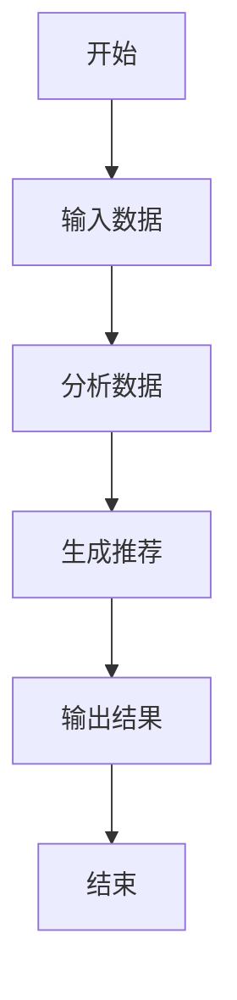
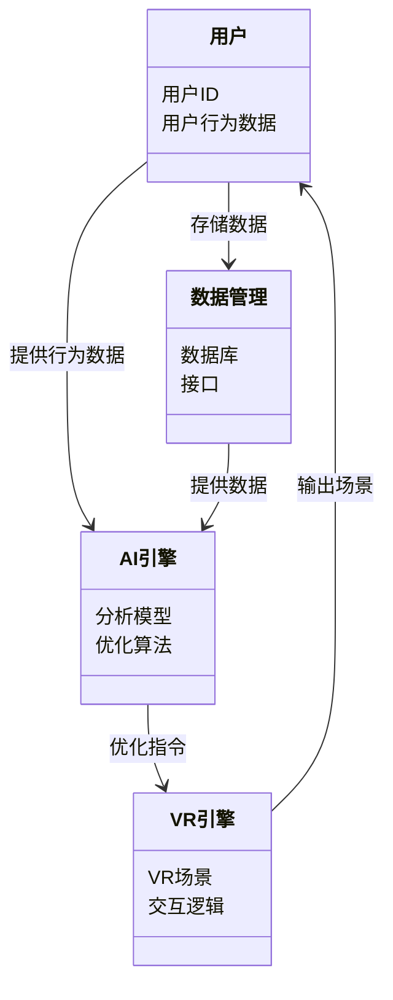

                 


# 如何评估企业的AI驱动的虚拟现实培训系统

**关键词**: AI, 虚拟现实, 企业培训, 系统评估, 技术实现

**摘要**: 本文将详细探讨如何评估企业中的AI驱动的虚拟现实培训系统。通过分析系统的背景、核心概念、算法原理、系统架构以及实际项目案例，本文提供了一套系统化的评估方法，帮助企业在选择和优化AI-VR培训系统时做出明智决策。

---

## 第一章: 背景介绍

### 1.1 问题背景
#### 1.1.1 企业培训的现状与挑战
企业培训是提升员工技能和企业竞争力的重要手段。然而，传统培训方式存在成本高、时间长、效果难评估等问题。

#### 1.1.2 虚拟现实技术在企业培训中的应用
虚拟现实（VR）技术通过提供沉浸式的体验，解决了传统培训的空间和时间限制。然而，VR系统的效果往往依赖于人工调整，缺乏智能化。

#### 1.1.3 AI技术如何赋能虚拟现实培训
人工智能（AI）可以通过数据分析和自动化优化，提升VR培训系统的个性化和效率。AI驱动的VR培训系统能够实时分析用户行为，动态调整培训内容。

### 1.2 问题描述
#### 1.2.1 传统企业培训的痛点
传统培训方式存在成本高、时间长、效果难评估等问题。

#### 1.2.2 虚拟现实培训系统的局限性
VR系统的效果往往依赖于人工调整，缺乏智能化。

#### 1.2.3 AI驱动的虚拟现实培训的优势
AI可以通过数据分析和自动化优化，提升VR培训系统的个性化和效率。

### 1.3 问题解决思路
#### 1.3.1 AI与虚拟现实的结合方式
AI与VR的结合可以通过数据驱动优化VR体验，例如实时调整难度、个性化推荐培训内容。

#### 1.3.2 系统化评估方法的必要性
为了确保AI-VR系统的有效性和可扩展性，需要一套系统化的评估方法。

#### 1.3.3 评估指标的初步框架
初步框架包括用户体验、系统性能、数据准确性等指标。

### 1.4 系统边界与外延
#### 1.4.1 系统的功能边界
系统功能包括用户行为分析、培训内容生成、实时反馈等。

#### 1.4.2 系统的外延部分
系统外延包括与企业现有系统的集成、数据存储与管理等。

#### 1.4.3 系统与外部环境的交互
系统与外部环境的交互包括用户输入、数据传输等。

### 1.5 核心要素与概念结构
#### 1.5.1 核心概念的定义
AI驱动的VR培训系统由用户、AI算法、VR环境、数据接口等核心要素组成。

#### 1.5.2 概念之间的关系
AI算法驱动VR环境，用户与VR环境交互，数据通过接口传输。

#### 1.5.3 系统架构的核心要素
系统架构包括用户端、AI引擎、VR引擎和数据管理模块。

---

## 第二章: 核心概念与联系

### 2.1 AI与虚拟现实的结合原理
#### 2.1.1 AI在虚拟现实中的应用
AI用于分析用户行为数据，优化VR体验。

#### 2.1.2 虚拟现实中的AI算法
AI算法通过数据驱动优化VR内容。

#### 2.1.3 AI与虚拟现实的协同作用
AI与VR的协同作用体现在个性化推荐和实时反馈上。

### 2.2 核心概念属性对比
| 核心概念 | 属性 |
|----------|------|
| AI算法 | 数据驱动、自适应 |
| 虚拟现实系统 | 沉浸式、交互式 |

### 2.3 ER实体关系图
```mermaid
erDiagram
    actor 评估者 {
        string 评估指标
        string 评估结果
    }
    actor 系统 {
        string 系统功能
        string 系统性能
    }
    actor 用户 {
        string 用户反馈
        string 用户行为数据
    }
    评估者 --> 系统 : 评估指标
    系统 --> 评估者 : 系统性能
    用户 --> 系统 : 用户反馈
    系统 --> 用户 : 系统功能
```

---

## 第三章: 算法原理讲解

### 3.1 算法原理概述
#### 3.1.1 算法的基本原理
AI算法通过分析用户行为数据，优化VR培训内容。

#### 3.1.2 算法的核心思想
数据驱动优化。

#### 3.1.3 算法的实现步骤
1. 收集用户行为数据。
2. 分析数据，生成个性化推荐。
3. 输出优化后的VR内容。

### 3.2 算法流程图


### 3.3 算法实现代码
```python
def analyze_data(user_behavior):
    # 数据分析代码
    return recommendation

def generate_recommendation(recommendation):
    # 生成推荐内容
    return optimized_content

# 示例代码
user_behavior = collect_data()
recommendation = analyze_data(user_behavior)
optimized_content = generate_recommendation(recommendation)
```

---

## 第四章: 系统分析与架构设计

### 4.1 系统分析
#### 4.1.1 项目场景介绍
企业希望通过AI-VR系统提升员工培训效果。

#### 4.1.2 系统功能设计
- 用户行为分析
- 培训内容生成
- 实时反馈

### 4.2 系统架构设计


---

## 第五章: 项目实战

### 5.1 环境安装
#### 5.1.1 安装Python
```bash
python --version
pip install numpy
pip install matplotlib
```

#### 5.1.2 安装VR开发工具
安装Unity或Unreal Engine。

### 5.2 系统核心实现
#### 5.2.1 数据收集模块
```python
def collect_data():
    # 数据收集代码
    return data
```

#### 5.2.2 AI算法实现
```python
def analyze_data(data):
    # 数据分析代码
    return result
```

#### 5.2.3 VR交互实现
在Unity中实现用户与VR场景的交互逻辑。

### 5.3 实际案例分析
#### 5.3.1 案例背景
某企业希望通过AI-VR系统培训新员工。

#### 5.3.2 系统实现
部署AI算法和VR场景，收集并分析用户行为数据，动态优化培训内容。

---

## 第六章: 最佳实践与小结

### 6.1 最佳实践
- 定期更新AI模型。
- 优化VR场景的交互体验。

### 6.2 小结
通过系统化的评估和优化，AI-VR培训系统能够显著提升企业培训效果。

### 6.3 注意事项
- 数据隐私保护。
- 系统兼容性问题。

### 6.4 拓展阅读
推荐阅读《AI在企业培训中的应用》和《虚拟现实技术详解》。

---

## 总结

本文详细探讨了如何评估企业中的AI驱动的虚拟现实培训系统。通过分析系统的背景、核心概念、算法原理、系统架构以及实际项目案例，本文提供了一套系统化的评估方法，帮助企业在选择和优化AI-VR培训系统时做出明智决策。

