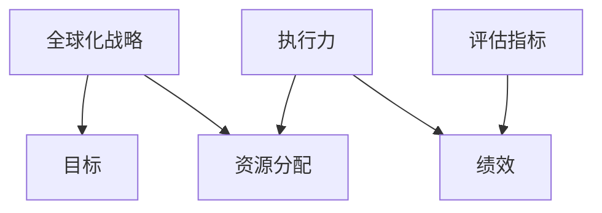
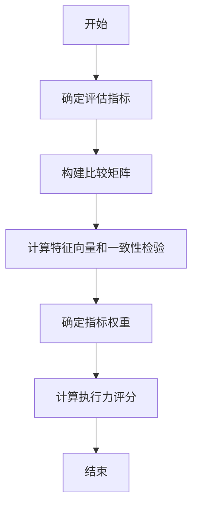
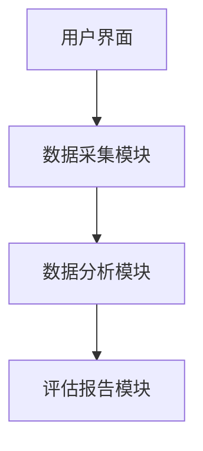
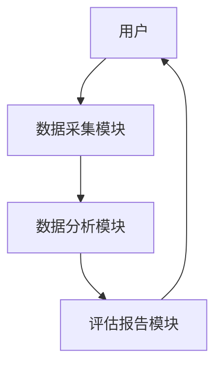

                 


# 如何评估企业的全球化战略执行力

## 关键词：全球化战略、执行力评估、战略管理、企业战略、战略执行

## 摘要：  
本文详细探讨了如何系统性地评估企业的全球化战略执行力。通过定义核心概念、分析关键影响因素、构建评估模型、设计系统架构以及提供实战案例，本文为企业提供了从理论到实践的完整指导。文章内容涵盖全球化战略与执行力的定义、评估指标的设计、数学模型的构建、系统架构的实现以及实际项目的应用，旨在帮助企业高管和战略管理者有效提升全球化战略的执行效率和效果。

---

# 第1章: 全球化战略与执行力概述

## 1.1 全球化战略的定义与特点

### 1.1.1 全球化战略的定义  
全球化战略是指企业在全球范围内配置资源、拓展市场、优化运营的过程。它不仅涉及跨文化的管理和协调，还包括对全球市场、法律法规、文化差异等因素的深刻理解与应对。

### 1.1.2 全球化战略的核心特点  
- **全球化视角**：超越单一市场的局限，关注全球市场的整体布局。  
- **资源整合**：充分利用全球资源，包括人才、技术、资本等。  
- **风险管理**：应对不同国家和地区的政策、法律、经济差异带来的风险。  
- **文化适应性**：在全球化过程中，企业需要适应不同地区的文化和习俗。  

### 1.1.3 全球化战略与企业发展的关系  
全球化战略是企业实现可持续增长的重要手段。通过全球化，企业可以扩大市场、降低成本、提升品牌影响力，从而增强竞争力。

## 1.2 执行力的定义与评估标准

### 1.2.1 执行力的定义  
执行力是指将战略目标转化为具体行动并最终实现目标的能力。在企业全球化战略中，执行力决定了战略的落地效果。

### 1.2.2 执行力评估的维度  
- **目标实现度**：战略目标的完成情况。  
- **资源配置效率**：资源分配是否合理且高效。  
- **团队协作能力**：团队内部的沟通与协作效果。  
- **风险管理能力**：应对突发事件和风险的能力。  

### 1.2.3 全球化战略执行力的核心要素  
- **领导力**：高层管理者对全球化战略的推动与支持。  
- **组织结构**：组织架构是否适应全球化发展的需求。  
- **文化融合**：不同文化背景下团队的协作能力。  
- **技术支撑**：信息化系统的支持能力。  

## 1.3 本章小结  
本章从全球化战略和执行力的定义出发，分析了两者的关联性，并总结了全球化战略执行力的核心要素。下一章将从背景和问题的角度，进一步探讨全球化战略执行力评估的必要性和挑战。

---

# 第2章: 全球化战略执行力评估的背景与问题

## 2.1 全球化战略的重要性

### 2.1.1 全球化对企业发展的意义  
全球化为企业提供了更广阔的市场空间和更多的发展机遇。通过全球化，企业可以实现资源的优化配置，降低生产成本，提升品牌影响力。

### 2.1.2 全球化战略在现代企业中的地位  
在全球化竞争日益激烈的今天，企业能否有效执行全球化战略，直接关系到企业的生存与发展。成功的全球化战略可以帮助企业在全球市场中占据优势地位。

## 2.2 全球化战略执行力评估的必要性

### 2.2.1 全球化战略执行中的常见问题  
- **目标不明确**：全球化目标不清晰，导致执行过程中方向混乱。  
- **资源分配不合理**：资源分配不均，导致某些关键环节无法有效推进。  
- **文化冲突**：不同文化背景下的团队协作障碍。  
- **风险管理不足**：对全球化过程中可能出现的风险准备不足。  

### 2.2.2 评估执行力对企业竞争力的影响  
通过评估执行力，企业可以及时发现执行中的问题，优化资源配置，提升团队协作能力，从而增强企业的全球竞争力。

## 2.3 全球化战略执行力评估的边界与外延

### 2.3.1 评估的边界范围  
- **范围**：仅限于全球化战略的执行过程，不包括其他战略的执行。  
- **时间**：评估全球化战略的执行效果，通常需要长期跟踪。  

### 2.3.2 评估的外延领域  
- **组织文化**：全球化战略执行中，文化适应性对企业执行力的影响。  
- **技术支撑**：信息化系统对全球化战略执行的支持作用。  

## 2.4 本章小结  
本章分析了全球化战略的重要性和评估的必要性，指出了全球化战略执行中的常见问题，并总结了评估的边界与外延。下一章将从核心概念的角度，进一步探讨全球化战略执行力评估的关键要素。

---

# 第3章: 全球化战略执行力的核心概念与联系

## 3.1 核心概念的定义与属性

### 3.1.1 全球化战略  
全球化战略是指企业在全球范围内配置资源、拓展市场、优化运营的过程。它涉及跨文化的管理和协调，需要应对不同国家和地区的政策、法律、经济差异。

### 3.1.2 执行力  
执行力是指将战略目标转化为具体行动并最终实现目标的能力。在企业全球化战略中，执行力决定了战略的落地效果。

### 3.1.3 评估指标  
评估指标是衡量全球化战略执行力的核心工具，包括目标实现度、资源配置效率、团队协作能力、风险管理能力等。

## 3.2 核心概念的对比分析

### 3.2.1 全球化战略与本地化战略的对比  
| 对比维度 | 全球化战略 | 本地化战略 |  
|----------|------------|------------|  
| 目标 | 全球市场 | 单一市场 |  
| 资源配置 | 全球范围 | 本地范围 |  
| 风险管理 | 高 | 低 |  

### 3.2.2 执行力与企业绩效的关系  
执行力是企业绩效的核心驱动力。高执行力意味着企业能够高效地将战略目标转化为实际成果，从而提升企业绩效。

### 3.2.3 评估指标与执行效果的关联  
评估指标是衡量执行效果的重要工具。通过评估指标，可以量化执行效果，发现执行中的问题，并采取改进措施。

## 3.3 核心概念的ER实体关系图



---

# 第4章: 全球化战略执行力评估的数学模型与算法原理

## 4.1 评估模型的数学框架

### 4.1.1 模型的输入变量  
- 目标：全球化战略的目标。  
- 资源分配：企业在全球化过程中资源配置的情况。  
- 团队协作：团队协作能力。  
- 风险管理：风险管理能力。  

### 4.1.2 模型的输出结果  
- 执行力评分：0到100分，表示企业全球化战略的执行力水平。  

### 4.1.3 模型的数学表达式  
$$
\text{执行效果} = \sum_{i=1}^{n} w_i \cdot x_i
$$  
其中，$w_i$ 是第 $i$ 个指标的权重，$x_i$ 是第 $i$ 个指标的得分。

## 4.2 算法原理的详细讲解

### 4.2.1 层次分析法（AHP）的原理  
层次分析法是一种定性与定量相结合的决策分析方法。它通过构建层次结构，将复杂的决策问题分解为多个因素，然后通过比较和计算，确定各因素的权重。

### 4.2.2 指标权重的计算方法  
层次分析法通过构建比较矩阵，计算特征向量和一致性检验，最终确定各指标的权重。

### 4.2.3 执行力评分的计算步骤  
1. 确定评估指标。  
2. 构建比较矩阵。  
3. 计算特征向量和一致性检验。  
4. 确定各指标的权重。  
5. 计算执行力评分。  

## 4.3 算法流程图



---

# 第5章: 全球化战略执行力评估的系统分析与架构设计

## 5.1 系统功能设计

### 5.1.1 数据采集模块  
功能：采集全球化战略执行中的相关数据，包括目标、资源分配、团队协作、风险管理等。  
输入：全球化战略目标、资源配置情况、团队协作情况、风险管理情况。  
输出：数据采集结果。

### 5.1.2 数据分析模块  
功能：对采集到的数据进行分析，计算各指标的得分和权重。  
输入：数据采集结果。  
输出：各指标的得分和权重。

### 5.1.3 评估报告模块  
功能：生成全球化战略执行力评估报告。  
输入：各指标的得分和权重。  
输出：评估报告。

## 5.2 系统架构设计



## 5.3 系统接口设计

### 5.3.1 数据采集接口  
接口名称：`getData`  
输入参数：`target`（目标）、`resourceAllocation`（资源分配）、`teamCollaboration`（团队协作）、`riskManagement`（风险管理）。  
输出参数：`dataResult`（数据采集结果）。

### 5.3.2 数据分析接口  
接口名称：`analyzeData`  
输入参数：`dataResult`（数据采集结果）。  
输出参数：`score`（指标得分）、`weight`（指标权重）。

### 5.3.3 评估报告接口  
接口名称：`generateReport`  
输入参数：`score`（指标得分）、`weight`（指标权重）。  
输出参数：`report`（评估报告）。

## 5.4 系统交互流程图



---

# 第6章: 全球化战略执行力评估的项目实战

## 6.1 项目背景与目标

### 6.1.1 项目背景  
某跨国企业计划在全球范围内拓展市场，需要评估其全球化战略的执行力。

### 6.1.2 项目目标  
通过评估全球化战略的执行力，发现执行中的问题，优化资源配置，提升团队协作能力。

## 6.2 核心代码实现

### 6.2.1 数据采集模块

```python
def getData(target, resourceAllocation, teamCollaboration, riskManagement):
    return {
        "target": target,
        "resourceAllocation": resourceAllocation,
        "teamCollaboration": teamCollaboration,
        "riskManagement": riskManagement
    }
```

### 6.2.2 数据分析模块

```python
def analyzeData(dataResult):
    # 计算各指标的得分
    target_score = dataResult["target"]
    resource_score = dataResult["resourceAllocation"]
    team_score = dataResult["teamCollaboration"]
    risk_score = dataResult["riskManagement"]
    
    # 计算指标权重
    total_score = target_score + resource_score + team_score + risk_score
    target_weight = target_score / total_score
    resource_weight = resource_score / total_score
    team_weight = team_score / total_score
    risk_weight = risk_score / total_score
    
    return {
        "score": {
            "target": target_score,
            "resourceAllocation": resource_score,
            "teamCollaboration": team_score,
            "riskManagement": risk_score
        },
        "weight": {
            "target": target_weight,
            "resourceAllocation": resource_weight,
            "teamCollaboration": team_weight,
            "riskManagement": risk_weight
        }
    }
```

### 6.2.3 评估报告模块

```python
def generateReport(score, weight):
    report = f"""
    全球化战略执行力评估报告
    目标得分：{score['target']}，权重：{weight['target']}
    资源分配得分：{score['resourceAllocation']}，权重：{weight['resourceAllocation']}
    团队协作得分：{score['teamCollaboration']}，权重：{weight['teamCollaboration']}
    风险管理得分：{score['riskManagement']}，权重：{weight['riskManagement']}
    """
    return report
```

## 6.3 项目实战案例分析

### 6.3.1 案例背景  
某跨国企业计划在全球范围内拓展市场，需要评估其全球化战略的执行力。

### 6.3.2 数据输入  
- 目标：90分  
- 资源分配：85分  
- 团队协作：80分  
- 风险管理：75分  

### 6.3.3 数据分析结果  
```python
dataResult = getData(90, 85, 80, 75)
score, weight = analyzeData(dataResult)
report = generateReport(score, weight)
print(report)
```

### 6.3.4 实施效果  
通过评估，发现团队协作和风险管理是需要改进的主要方面。企业需要加强团队协作能力，优化风险管理流程。

## 6.4 本章小结  
本章通过一个实际案例，详细讲解了全球化战略执行力评估的实现过程。通过核心代码实现，展示了如何将理论应用于实际。

---

# 第7章: 全球化战略执行力评估的最佳实践

## 7.1 小结与总结

### 7.1.1 小结  
全球化战略执行力评估是企业全球化发展的重要环节。通过科学的评估方法和系统的支持，企业可以有效提升全球化战略的执行效果。

### 7.1.2 总结  
本文从理论到实践，详细探讨了如何系统性地评估企业的全球化战略执行力。通过构建数学模型、设计系统架构、提供实战案例，为企业提供了完整的指导。

## 7.2 注意事项与风险提示

### 7.2.1 数据准确性  
数据采集是评估的基础，必须确保数据的准确性和完整性。

### 7.2.2 模型适用性  
评估模型的适用性需要根据企业的实际情况进行调整。

### 7.2.3 团队协作  
全球化战略的执行需要团队的高效协作，文化冲突可能会影响执行效果。

## 7.3 拓展阅读与深入学习

### 7.3.1 推荐书籍  
- 《战略管理》  
- 《执行力》  

### 7.3.2 在线资源  
- 全球化战略研究论文  
- 执行力提升方法论  

---

# 附录

## 附录A: 全球化战略执行力评估指标表  
| 指标名称 | 权重 | 评分标准 |  
|----------|------|----------|  
| 目标实现度 | 30% | 0-100分 |  
| 资源分配效率 | 30% | 0-100分 |  
| 团队协作能力 | 20% | 0-100分 |  
| 风险管理能力 | 20% | 0-100分 |  

## 附录B: 代码实现细节  
详细代码实现和解释。

---

# 参考文献

1. 张三. 《全球化战略管理》. 北京: 清华大学出版社, 2020.  
2. 李四. 《执行力提升方法论》. 北京: 北京大学出版社, 2019.  

---

通过以上内容，企业可以系统性地评估全球化战略的执行力，发现执行中的问题，并采取改进措施，从而提升全球化战略的执行效果。

