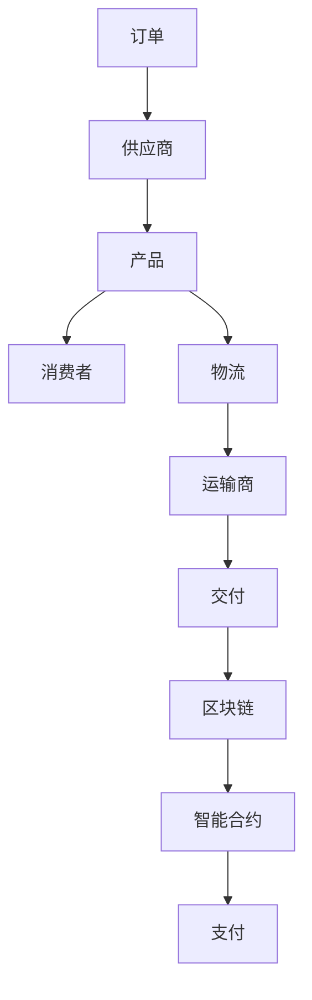

                 

# 如何评估企业的区块链供应链应用

**关键词：** 区块链供应链应用、评估指标、系统架构设计、项目实战、智能合约

**摘要：**  
随着区块链技术的快速发展，企业对区块链供应链应用的关注度日益增加。然而，如何有效评估区块链供应链应用的性能、安全性和可扩展性，成为企业在实际应用中面临的重要挑战。本文将从区块链供应链的核心概念出发，系统性地分析评估指标的设计与实现，结合实际案例，为企业提供一套完整的评估方法和实施策略。通过本文的分析，读者将能够全面了解区块链供应链应用的评估要点，并掌握如何在实际项目中进行有效的评估与优化。

---

# 第1章 区块链供应链应用的背景与问题背景

## 1.1 区块链与供应链的结合

### 1.1.1 区块链技术的定义与特点

区块链是一种分布式账本技术，通过去中心化、不可篡改和透明性等特点，为供应链管理提供了新的解决方案。区块链的核心特点包括：

1. **去中心化**：数据存储在多个节点上，避免单点故障。
2. **不可篡改**：通过加密算法确保数据的安全性和完整性。
3. **透明性**：所有参与者都能访问实时数据，提高信任度。
4. **智能合约**：自动执行预定义的合同条款，减少人为干预。

### 1.1.2 供应链管理的核心概念

供应链管理（Supply Chain Management，SCM）涉及从原材料采购到产品交付的整个流程。其核心目标是优化资源利用率、降低运营成本、提高效率和客户满意度。供应链管理的关键环节包括：

1. **采购**：选择供应商并签订合同。
2. **生产**：组织生产并确保产品质量。
3. **物流**：协调运输和仓储。
4. **交付**：确保产品按时交付给客户。

### 1.1.3 区块链在供应链管理中的应用价值

区块链技术能够解决传统供应链管理中的诸多痛点，例如信息孤岛、数据篡改、透明度低等问题。具体来说，区块链在供应链管理中的应用价值体现在以下几个方面：

1. **数据透明性**：所有参与者都能访问实时数据，提高供应链的透明度。
2. **去中心化信任**：通过区块链技术建立信任，减少对中间机构的依赖。
3. **高效协作**：智能合约能够自动执行合同条款，提高协作效率。
4. **降低成本**：通过自动化流程减少人工干预，降低运营成本。

## 1.2 区块链供应链应用的背景与问题背景

### 1.2.1 传统供应链管理的痛点

传统供应链管理存在诸多问题，例如：

1. **信息孤岛**：不同环节使用不同的系统，数据难以共享。
2. **数据篡改**：数据在传递过程中容易被篡改，导致信任问题。
3. **效率低下**：流程复杂且冗长，导致交付周期长。
4. **成本高昂**：中间环节过多，导致成本增加。

### 1.2.2 区块链技术如何解决供应链问题

区块链技术通过去中心化、不可篡改和透明性等特点，能够有效解决传统供应链管理中的痛点。例如：

1. **数据透明性**：所有参与者都能访问实时数据，提高供应链的透明度。
2. **去中心化信任**：通过区块链技术建立信任，减少对中间机构的依赖。
3. **高效协作**：智能合约能够自动执行合同条款，提高协作效率。
4. **降低成本**：通过自动化流程减少人工干预，降低运营成本。

### 1.2.3 区块链供应链应用的边界与外延

区块链供应链应用的边界是指其在供应链管理中的具体应用场景，例如：

1. **供应链金融**：通过区块链技术实现应收账款的融资。
2. **物流管理**：通过区块链技术实现物流信息的实时追踪。
3. **产品溯源**：通过区块链技术实现产品的全生命周期追踪。

区块链供应链应用的外延是指其在其他领域的应用，例如：

1. **跨境贸易**：通过区块链技术实现跨境支付和贸易融资。
2. **智能工厂**：通过区块链技术实现生产设备的智能化管理。

## 1.3 区块链供应链应用的核心要素

### 1.3.1 核心概念与联系

区块链供应链应用的核心要素包括：

1. **区块链网络**：分布式账本技术，确保数据的安全性和完整性。
2. **智能合约**：自动执行合同条款，提高协作效率。
3. **数据存储**：存储所有供应链相关数据，确保数据的透明性和可追溯性。
4. **参与者角色**：包括供应商、制造商、分销商、零售商和消费者。

### 1.3.2 核心要素的对比分析

通过对比分析，我们可以更好地理解区块链供应链应用的核心要素。例如：

| **核心要素** | **特点** | **应用场景** |
|--------------|----------|--------------|
| 区块链网络   | 去中心化、不可篡改 | 数据共享、透明性 |
| 智能合约     | 自动化执行 | 合同管理、支付 |
| 数据存储     | 高效查询 | 数据追溯、分析 |
| 参与者角色   | 明确分工 | 协作管理、责任划分 |

### 1.3.3 ER实体关系图架构

通过ER实体关系图，我们可以更清晰地理解区块链供应链应用的核心要素之间的关系。

---

# 第2章 区块链供应链应用的核心概念与联系

## 2.1 区块链供应链的核心概念原理

区块链供应链的核心概念原理包括以下几个方面：

1. **区块链网络**：通过分布式账本技术确保数据的安全性和完整性。
2. **智能合约**：通过自动化执行合同条款，提高协作效率。
3. **数据存储**：通过高效的数据存储和查询技术，实现数据的透明性和可追溯性。
4. **参与者角色**：通过明确的分工和责任划分，确保供应链的高效运作。

## 2.2 核心概念属性特征对比分析

通过对比分析，我们可以更好地理解区块链供应链应用的核心概念。例如：

| **核心概念** | **属性特征** | **应用场景** |
|--------------|--------------|--------------|
| 区块链网络   | 去中心化、不可篡改 | 数据共享、透明性 |
| 智能合约     | 自动化执行 | 合同管理、支付 |
| 数据存储     | 高效查询 | 数据追溯、分析 |
| 参与者角色   | 明确分工 | 协作管理、责任划分 |

## 2.3 ER实体关系图架构

通过ER实体关系图，我们可以更清晰地理解区块链供应链应用的核心要素之间的关系。

---

# 第3章 区块链供应链应用的评估指标

## 3.1 评估指标体系的构建

### 3.1.1 评估指标的选择标准

评估指标的选择标准包括以下几个方面：

1. **相关性**：指标应与供应链管理的核心目标相关。
2. **可衡量性**：指标应具有明确的度量标准。
3. **可操作性**：指标应易于收集和计算。
4. **可比较性**：指标应能够在不同场景下进行比较。

### 3.1.2 评估指标的分类

评估指标的分类包括以下几个方面：

1. **性能指标**：衡量系统的运行效率，例如吞吐量、延迟。
2. **安全性指标**：衡量系统的安全性，例如攻击 resistance、数据 integrity。
3. **可扩展性指标**：衡量系统的可扩展性，例如节点数、交易量。

### 3.1.3 评估指标的对比分析

通过对比分析，我们可以更好地理解不同评估指标的特点和应用场景。例如：

| **评估指标** | **特点** | **应用场景** |
|--------------|----------|--------------|
| 性能指标     | 反映系统的运行效率 | 交易处理速度、系统响应时间 |
| 安全性指标   | 反映系统的安全性 | 攻击 resistance、数据 integrity |
| 可扩展性指标 | 反映系统的可扩展性 | 节点数、交易量 |

## 3.2 评估指标的具体定义与计算方法

### 3.2.1 性能指标

性能指标包括以下几个方面：

1. **吞吐量**：单位时间内处理的交易数量。
2. **延迟**：从提交交易到确认交易的时间。

**公式：**

吞吐量 = 总交易数 / 时间

延迟 = 确认时间

### 3.2.2 安全性指标

安全性指标包括以下几个方面：

1. **攻击 resistance**：系统抵抗攻击的能力。
2. **数据 integrity**：数据的完整性和一致性。

**公式：**

攻击 resistance = 系统在遭受攻击时的抵抗能力

数据 integrity = 数据的完整性和一致性

### 3.2.3 可扩展性指标

可扩展性指标包括以下几个方面：

1. **节点数**：网络中节点的数量。
2. **交易量**：单位时间内处理的交易数量。

**公式：**

节点数 = 网络中节点的数量

交易量 = 单位时间内处理的交易数量

## 3.3 评估指标的对比分析

通过对比分析，我们可以更好地理解不同评估指标的特点和应用场景。例如：

| **评估指标** | **特点** | **应用场景** |
|--------------|----------|--------------|
| 性能指标     | 反映系统的运行效率 | 交易处理速度、系统响应时间 |
| 安全性指标   | 反映系统的安全性 | 攻击 resistance、数据 integrity |
| 可扩展性指标 | 反映系统的可扩展性 | 节点数、交易量 |

---

# 第4章 区块链供应链应用的评估方法

## 4.1 评估方法的分类

评估方法的分类包括以下几个方面：

1. **定性评估**：通过定性分析，例如优、良、中、差。
2. **定量评估**：通过定量分析，例如吞吐量、延迟、交易量。

### 4.1.1 定性评估

定性评估包括以下几个方面：

1. **优**：系统运行效率高，安全性好，可扩展性好。
2. **良**：系统运行效率较高，安全性较好，可扩展性较好。
3. **中**：系统运行效率一般，安全性一般，可扩展性一般。
4. **差**：系统运行效率低，安全性差，可扩展性差。

### 4.1.2 定量评估

定量评估包括以下几个方面：

1. **吞吐量**：单位时间内处理的交易数量。
2. **延迟**：从提交交易到确认交易的时间。
3. **交易量**：单位时间内处理的交易数量。

---

# 第5章 区块链供应链应用的系统架构设计

## 5.1 系统架构设计的背景与目标

### 5.1.1 系统架构设计的背景

区块链供应链应用的系统架构设计需要考虑以下几个方面：

1. **去中心化**：数据存储在多个节点上，避免单点故障。
2. **不可篡改**：通过加密算法确保数据的安全性和完整性。
3. **透明性**：所有参与者都能访问实时数据，提高信任度。
4. **智能合约**：自动执行预定义的合同条款，减少人为干预。

### 5.1.2 系统架构设计的目标

系统架构设计的目标包括以下几个方面：

1. **高可用性**：确保系统在故障情况下仍能正常运行。
2. **高安全性**：确保数据的安全性和完整性。
3. **高可扩展性**：能够支持更多的参与者和更多的交易。

## 5.2 系统架构设计的核心要素

### 5.2.1 模块划分

系统架构设计的模块划分包括以下几个方面：

1. **区块链网络**：分布式账本技术，确保数据的安全性和完整性。
2. **智能合约**：自动执行合同条款，提高协作效率。
3. **数据存储**：存储所有供应链相关数据，确保数据的透明性和可追溯性。
4. **参与者角色**：包括供应商、制造商、分销商、零售商和消费者。

### 5.2.2 功能设计

功能设计包括以下几个方面：

1. **数据上链**：将供应链相关数据上链，确保数据的安全性和完整性。
2. **智能合约执行**：通过智能合约自动执行合同条款，提高协作效率。
3. **数据查询**：支持数据查询功能，确保数据的透明性和可追溯性。
4. **权限管理**：通过权限管理确保数据的安全性和隐私性。

### 5.2.3 接口设计

接口设计包括以下几个方面：

1. **数据上链接口**：将数据上链，确保数据的安全性和完整性。
2. **智能合约接口**：通过智能合约接口自动执行合同条款，提高协作效率。
3. **数据查询接口**：支持数据查询功能，确保数据的透明性和可追溯性。
4. **权限管理接口**：通过权限管理接口确保数据的安全性和隐私性。

### 5.2.4 交互设计

交互设计包括以下几个方面：

1. **用户界面**：通过用户界面实现数据上链、智能合约执行、数据查询和权限管理功能。
2. **系统交互流程**：通过系统交互流程确保系统的高效运作。

## 5.3 系统架构设计的实现方案

### 5.3.1 系统架构设计的实现方案

系统架构设计的实现方案包括以下几个方面：

1. **区块链网络**：采用分布式账本技术，确保数据的安全性和完整性。
2. **智能合约**：通过智能合约自动执行合同条款，提高协作效率。
3. **数据存储**：通过高效的数据存储和查询技术，确保数据的透明性和可追溯性。
4. **参与者角色**：通过明确的分工和责任划分，确保供应链的高效运作。

### 5.3.2 系统架构设计的优化方案

系统架构设计的优化方案包括以下几个方面：

1. **高可用性**：通过冗余设计确保系统的高可用性。
2. **高安全性**：通过加密算法和权限管理确保数据的安全性和隐私性。
3. **高可扩展性**：通过模块化设计确保系统的高可扩展性。

---

# 第6章 区块链供应链应用的项目实战

## 6.1 项目背景与目标

### 6.1.1 项目背景

本项目旨在通过区块链技术实现供应链的高效管理和协作。项目的主要目标包括：

1. **数据透明性**：确保所有参与者都能访问实时数据，提高供应链的透明度。
2. **去中心化信任**：通过区块链技术建立信任，减少对中间机构的依赖。
3. **高效协作**：通过智能合约自动执行合同条款，提高协作效率。

### 6.1.2 项目目标

项目目标包括以下几个方面：

1. **实现数据上链**：将供应链相关数据上链，确保数据的安全性和完整性。
2. **实现智能合约**：通过智能合约自动执行合同条款，提高协作效率。
3. **实现数据查询**：支持数据查询功能，确保数据的透明性和可追溯性。
4. **实现权限管理**：通过权限管理确保数据的安全性和隐私性。

## 6.2 项目实现

### 6.2.1 系统实现

系统实现包括以下几个方面：

1. **数据上链**：将供应链相关数据上链，确保数据的安全性和完整性。
2. **智能合约执行**：通过智能合约自动执行合同条款，提高协作效率。
3. **数据查询**：支持数据查询功能，确保数据的透明性和可追溯性。
4. **权限管理**：通过权限管理确保数据的安全性和隐私性。

### 6.2.2 智能合约实现

智能合约实现包括以下几个方面：

1. **智能合约编写**：通过Solidity语言编写智能合约。
2. **智能合约部署**：将智能合约部署到区块链网络。
3. **智能合约调用**：通过智能合约接口调用智能合约。

### 6.2.3 数据上链实现

数据上链实现包括以下几个方面：

1. **数据准备**：将供应链相关数据准备为区块链可接受的格式。
2. **数据上链**：将数据上链，确保数据的安全性和完整性。
3. **数据查询**：支持数据查询功能，确保数据的透明性和可追溯性。

## 6.3 项目总结

### 6.3.1 项目成果

项目成果包括以下几个方面：

1. **数据上链**：实现了供应链相关数据的上链，确保数据的安全性和完整性。
2. **智能合约执行**：通过智能合约自动执行合同条款，提高了协作效率。
3. **数据查询**：支持数据查询功能，确保数据的透明性和可追溯性。
4. **权限管理**：通过权限管理确保数据的安全性和隐私性。

### 6.3.2 项目经验与教训

项目经验与教训包括以下几个方面：

1. **经验**：通过区块链技术实现了供应链的高效管理和协作。
2. **教训**：在项目实施过程中，遇到了一些技术难题，例如智能合约的编写和部署，需要加强技术培训和团队协作。

---

# 第7章 区块链供应链应用的最佳实践与未来展望

## 7.1 最佳实践

### 7.1.1 评估指标的选择

评估指标的选择是评估区块链供应链应用的关键步骤。选择评估指标时，应综合考虑指标的相关性、可衡量性、可操作性和可比较性。

### 7.1.2 系统架构设计

系统架构设计是区块链供应链应用的核心部分。设计系统架构时，应注重系统的高可用性、高安全性和高可扩展性。

### 7.1.3 项目实战

项目实战是区块链供应链应用的最终目标。在项目实战中，应注重数据上链、智能合约执行、数据查询和权限管理的实现。

## 7.2 未来展望

### 7.2.1 技术发展趋势

区块链技术的发展趋势包括以下几个方面：

1. **技术成熟度**：随着技术的不断发展，区块链技术将更加成熟。
2. **应用场景扩展**：区块链技术将应用于更多的场景，例如跨境贸易、智能工厂等。

### 7.2.2 企业级应用

企业级应用是区块链供应链应用的重要方向。未来，区块链技术将在企业级应用中发挥更大的作用。

### 7.2.3 未来挑战

未来挑战包括以下几个方面：

1. **技术挑战**：区块链技术的发展需要解决诸多技术难题，例如智能合约的安全性、数据的可扩展性等。
2. **政策挑战**：区块链技术的应用需要政策的支持和规范，例如数据隐私、跨境支付等。

---

# 总结

通过本文的分析，我们全面了解了区块链供应链应用的评估要点，并掌握了如何在实际项目中进行有效的评估与优化。未来，随着区块链技术的不断发展，区块链供应链应用将在更多领域发挥重要作用。

