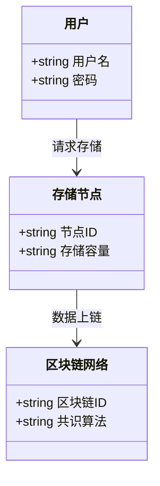
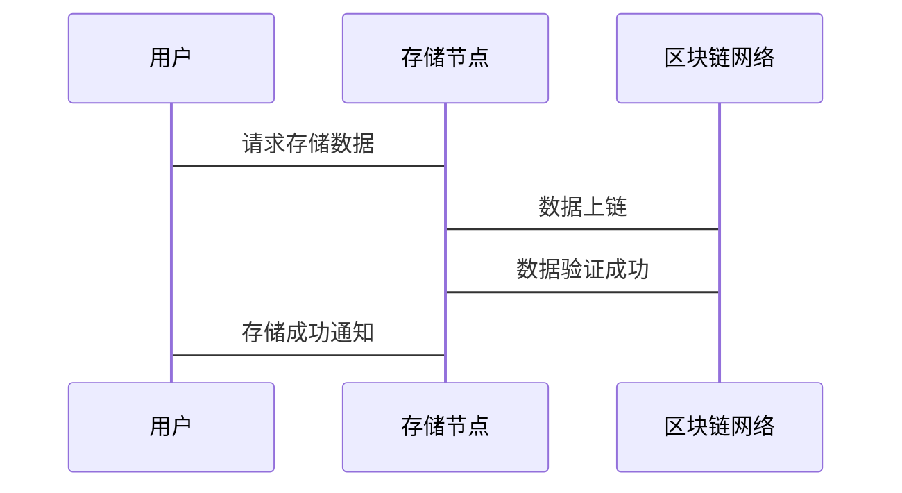

                 


# 如何评估企业的区块链去中心化云存储平台

## 关键词：区块链，去中心化，云存储，评估标准，企业存储解决方案

## 摘要：区块链去中心化云存储平台为企业提供了高效、安全、可靠的存储解决方案。本文从技术架构、安全性、可扩展性、性能指标、成本效益、治理机制和合规性等多个维度，详细分析如何评估这类平台，帮助企业做出明智的选择。

---

# 第1章: 区块链与去中心化云存储的背景

## 1.1 区块链技术的基本概念

### 1.1.1 区块链的定义与核心原理

区块链是一种分布式账本技术，通过去中心化的共识机制确保数据的安全性和不可篡改性。它由多个节点共同维护，每个节点都有一份完整的数据副本，数据通过密码学加密，确保数据的完整性和一致性。

### 1.1.2 区块链的类型与特点

区块链主要分为公有链、私有链和联盟链三种类型。公有链是完全去中心化的，如比特币和以太坊；私有链由单一组织控制，适合企业内部使用；联盟链由多个机构共同维护，适用于特定行业。

### 1.1.3 区块链在企业中的应用价值

区块链在企业中的应用包括供应链管理、数据共享、支付清算、身份认证等。它能够提高数据透明度，降低信任成本，增强数据安全性。

## 1.2 去中心化云存储的定义与特点

### 1.2.1 去中心化存储的基本概念

去中心化存储是一种将数据分散存储在多个节点上的存储方式，避免了传统云存储的单点故障问题。它通过分布式网络实现数据的冗余存储和快速访问。

### 1.2.2 去中心化存储与传统云存储的区别

传统云存储依赖于中心化的服务器，存在单点故障和数据被篡改的风险。而去中心化存储通过分布在网络中的多个节点存储数据，提高了数据的安全性和可用性。

### 1.2.3 去中心化存储的优势与挑战

优势包括高可用性、抗审查性、数据隐私保护等。挑战则包括网络延迟、存储成本、节点管理和数据检索效率等问题。

## 1.3 区块链去中心化云存储的结合

### 1.3.1 区块链与去中心化存储的整合方式

区块链通过提供数据的不可篡改性和分布式存储特性，为去中心化云存储提供信任机制和数据完整性保障。两者结合可以实现数据的安全存储和高效访问。

### 1.3.2 区块链去中心化云存储的核心优势

- 数据不可篡改：区块链确保存储的数据无法被修改，保证数据的真实性。
- 高可用性：分布式存储架构避免了单点故障，提高了系统的可用性。
- 数据隐私：通过加密技术保护数据隐私，防止未经授权的访问。

### 1.3.3 区块链去中心化云存储的应用场景

区块链去中心化云存储适用于数据备份、文件共享、医疗数据存储、金融数据管理等领域。它能够满足企业对数据安全性和可靠性的高要求。

## 1.4 本章小结

本章介绍了区块链和去中心化存储的基本概念，分析了它们的特点和优势，最后探讨了两者结合的应用场景。这为后续的评估提供了理论基础。

---

# 第2章: 区块链去中心化云存储的核心概念与联系

## 2.1 区块链的核心原理

### 2.1.1 区块链的共识机制

共识机制是区块链的核心，确保所有节点达成一致。常见的共识机制包括PoW（工作量证明）、PoS（权益证明）、RAFT等。每种机制都有其优缺点，适用于不同的场景。

### 2.1.2 区块链的分布式账本

区块链的分布式账本通过链式结构存储数据，每个区块包含交易信息和时间戳，通过哈希值连接，确保数据的不可篡改性。

### 2.1.3 区块链的智能合约

智能合约是区块链上的自动化程序，用于自动执行预设的条件。它可以实现自动化的业务流程，提高效率和减少人为干预。

## 2.2 去中心化存储的核心原理

### 2.2.1 去中心化存储的分布式文件系统

去中心化存储使用分布式文件系统将数据分散存储在多个节点上，每个节点存储部分数据，通过分布式哈希表进行定位和访问。

### 2.2.2 去中心化存储的激励机制

为了确保节点的可靠性和积极性，去中心化存储平台通常会采用激励机制，如token奖励，鼓励节点提供存储资源。

### 2.2.3 去中心化存储的安全性保障

通过加密算法和访问控制机制，确保只有授权用户能够访问特定数据，防止数据泄露和未授权访问。

## 2.3 区块链与去中心化存储的结合原理

### 2.3.1 数据存储的区块链化

数据通过区块链技术实现不可篡改和分布式存储，确保数据的完整性和安全性。

### 2.3.2 数据访问的权限控制

通过智能合约和权限管理，实现数据的细粒度访问控制，确保数据的安全性和隐私性。

### 2.3.3 数据完整性的验证机制

区块链通过区块哈希和 Merkel 树等技术，确保数据在存储和传输过程中的完整性，防止数据被篡改或丢失。

## 2.4 核心概念对比与ER实体关系图

### 2.4.1 核心概念对比表格

| **特性**       | **区块链**          | **去中心化存储**      |
|----------------|---------------------|-----------------------|
| 数据存储方式   | 分布式账本         | 分布式文件系统       |
| 共识机制       | 各种共识算法       | 无                   |
| 数据完整性     | 高                 | 高                   |
| 可扩展性       | 依赖共识算法性能   | 依赖网络带宽和节点数量 |

### 2.4.2 ER实体关系图（Mermaid）

```mermaid
erDiagram
    actor 用户 {
        +string 用户名
        +string 密码
    }
    actor 存储节点 {
        +string 节点ID
        +string 存储容量
    }
    actor 区块链网络 {
        +string 区块链ID
        +string 共识算法
    }
    用户 --> 存储节点 : 请求存储
    存储节点 --> 区块链网络 : 数据上链
```

## 2.5 本章小结

本章详细分析了区块链和去中心化存储的核心概念，并通过对比和实体关系图展示了它们之间的联系，为后续评估提供了理论依据。

---

# 第3章: 评估标准

## 3.1 技术标准

### 3.1.1 区块链的共识算法

评估区块链平台的共识算法，选择适合企业需求的算法。例如，对于高吞吐量需求，可以选择RAFT或Gossip协议；对于安全性要求高，可以选择PoW或PoS。

### 3.1.2 数据存储的安全性

评估平台的加密算法和访问控制机制，确保数据在存储和传输过程中的安全性，防止数据泄露和篡改。

### 3.1.3 网络的可扩展性

评估平台的网络架构，是否支持水平扩展，能否通过增加节点来提高存储容量和处理能力。

## 3.2 安全性标准

### 3.2.1 数据完整性

评估平台的数据完整性保障机制，如区块链的 Merkel 树和哈希值验证。

### 3.2.2 抗攻击能力

评估平台是否具备抗 DDoS 攻击、恶意节点攻击等能力，确保系统的安全性。

### 3.2.3 访问控制

评估平台的权限管理机制，是否能够实现细粒度的访问控制，确保数据的安全性和隐私性。

## 3.3 可扩展性标准

### 3.3.1 网络架构

评估平台的网络架构是否支持水平扩展，能否通过增加节点来提高存储容量和处理能力。

### 3.3.2 节点数量

评估平台支持的最大节点数量，以及节点的加入和退出机制是否灵活。

### 3.3.3 网络带宽

评估平台的网络带宽和延迟，确保在高并发场景下的性能表现。

## 3.4 性能指标

### 3.4.1 存储效率

评估单位存储成本和数据检索速度，确保在成本和性能之间取得平衡。

### 3.4.2 吞吐量

评估平台的吞吐量，即每秒处理的交易数量，确保在高并发场景下的性能表现。

### 3.4.3 响应时间

评估平台的数据检索和存储响应时间，确保用户体验的流畅性。

## 3.5 成本效益

### 3.5.1 存储费用

评估平台的存储费用，包括基本费用和额外的存储扩展费用。

### 3.5.2 带宽费用

评估平台的网络带宽费用，特别是在数据传输量较大的场景下。

### 3.5.3 维护费用

评估平台的维护费用，包括节点维护、软件升级等费用。

## 3.6 治理机制

### 3.6.1 节点管理

评估平台的节点管理机制，包括节点的加入、退出和激励机制，确保节点的可靠性和积极性。

### 3.6.2 系统升级

评估平台的系统升级机制，包括升级的频率、方式和对业务的影响。

### 3.6.3 合规性

评估平台是否符合相关法律法规，特别是在数据隐私和跨境数据传输方面。

## 3.7 合规性

### 3.7.1 数据隐私

评估平台是否符合数据隐私保护法规，如GDPR（通用数据保护条例）等。

### 3.7.2 跨境数据传输

评估平台是否符合跨境数据传输的法律法规，特别是在数据存储和传输的地理位置和合规性方面。

### 3.7.3 行业标准

评估平台是否符合行业标准和最佳实践，确保在特定行业中的合规性和适用性。

---

# 第4章: 评估方法

## 4.1 定性评估

### 4.1.1 技术架构分析

分析平台的技术架构，评估其合理性、可扩展性和安全性。

### 4.1.2 安全性评估

通过安全审计和漏洞测试，评估平台的安全性，发现潜在的安全隐患。

### 4.1.3 治理机制评估

评估平台的治理机制，包括节点管理、系统升级和合规性等方面。

## 4.2 定量评估

### 4.2.1 性能测试

通过负载测试和压力测试，评估平台的吞吐量、响应时间和可扩展性。

### 4.2.2 成本效益分析

通过成本分析和收益预测，评估平台的经济可行性。

### 4.2.3 数据完整性验证

通过数据完整性验证，确保数据在存储和传输过程中的完整性。

## 4.3 综合评估

### 4.3.1 综合评分

根据定性和定量评估的结果，对平台进行综合评分，确定其在市场中的竞争力。

### 4.3.2 比较分析

将平台与其他竞争对手进行比较分析，找出其优劣势，为企业的选择提供依据。

### 4.3.3 最终建议

根据评估结果，为企业提供最终的建议，包括平台的优缺点、适用场景和改进建议。

---

# 第5章: 系统分析与架构设计

## 5.1 问题场景介绍

假设我们是一家电子商务公司，需要存储大量的交易数据和用户信息。我们希望选择一个安全、可靠、成本效益高的区块链去中心化云存储平台。

## 5.2 系统功能设计

### 5.2.1 领域模型



### 5.2.2 系统架构设计


### 5.2.3 系统交互设计



---

# 第6章: 项目实战

## 6.1 环境安装

### 6.1.1 安装区块链平台

选择一个适合的区块链平台，如Hyperledger Fabric，安装并配置环境。

### 6.1.2 安装去中心化存储系统

选择一个去中心化存储解决方案，如IPFS，安装并配置存储节点。

## 6.2 系统核心实现源代码

### 6.2.1 区块链节点代码

```python
class BlockchainNode:
    def __init__(self, node_id):
        self.node_id = node_id
        self.consensus_algorithm = "PoW"  # 可以根据需要选择不同的共识算法
        self.chain = []  # 区块链数据结构

    def add_block(self, block):
        self.chain.append(block)
        # 通过共识算法验证区块
        self.consensus_algorithm.consensus(self.chain)
```

### 6.2.2 去中心化存储节点代码

```python
class StorageNode:
    def __init__(self, node_id, storage_capacity):
        self.node_id = node_id
        self.storage_capacity = storage_capacity
        self.data = {}  # 存储数据

    def store_data(self, data_hash, data):
        if len(self.data) < self.storage_capacity:
            self.data[data_hash] = data
            return "存储成功"
        else:
            return "存储空间已满"
```

## 6.3 代码应用解读与分析

### 6.3.1 区块链节点的共识算法实现

```python
class ConsensusAlgorithm:
    def __init__(self, chain):
        self.chain = chain

    def validate_block(self, block):
        # 具体实现根据不同的共识算法而定
        pass
```

### 6.3.2 去中心化存储的访问控制

```python
class AccessControl:
    def __init__(self, user, permissions):
        self.user = user
        self.permissions = permissions

    def check_permission(self, action):
        if action in self.permissions:
            return True
        else:
            return False
```

## 6.4 实际案例分析

### 6.4.1 案例背景

假设我们有一个电子商务平台，需要存储大量的交易数据和用户信息。我们选择了某区块链去中心化云存储平台进行评估。

### 6.4.2 评估过程

1. 技术架构评估：分析平台的技术架构，包括共识算法、存储机制等。
2. 安全性评估：通过安全审计和漏洞测试，评估数据的安全性。
3. 可扩展性评估：通过负载测试和压力测试，评估平台的可扩展性。
4. 成本效益分析：比较平台的存储费用、带宽费用和维护费用，评估其经济可行性。
5. 治理机制评估：评估平台的节点管理、系统升级和合规性等方面。

### 6.4.3 评估结果

根据评估结果，平台的技术架构合理，安全性高，可扩展性良好，成本效益较高，治理机制完善，符合企业的需求。

---

# 第7章: 最佳实践与小结

## 7.1 最佳实践

### 7.1.1 选择合适的平台

根据企业的具体需求，选择适合的区块链去中心化云存储平台，确保其技术架构、安全性、可扩展性等符合要求。

### 7.1.2 定期评估与优化

定期对平台进行评估，发现潜在的问题和改进的空间，及时进行优化。

### 7.1.3 关注行业动态

关注区块链和去中心化存储领域的最新技术和发展趋势，及时调整和更新存储方案。

## 7.2 小结

区块链去中心化云存储平台为企业提供了高效、安全、可靠的存储解决方案。通过全面的评估，企业可以选择适合的平台，确保数据的安全性和系统的稳定性。同时，企业需要定期评估和优化存储方案，以应对不断变化的业务需求和技术挑战。

---

# 第8章: 注意事项与拓展阅读

## 8.1 注意事项

### 8.1.1 数据备份

在选择区块链去中心化云存储平台时，企业需要确保数据的备份和恢复机制，防止数据丢失。

### 8.1.2 合规性检查

企业需要确保平台符合相关法律法规，特别是在数据隐私和跨境数据传输方面。

### 8.1.3 安全性维护

企业需要定期进行安全检查和漏洞修复，确保系统的安全性。

## 8.2 拓展阅读

### 8.2.1 区块链技术的最新发展

了解区块链技术的最新发展，如Layer 2解决方案、零知识证明等，提升存储平台的性能和安全性。

### 8.2.2 去中心化存储的未来趋势

关注去中心化存储的未来发展趋势，如去中心化文件系统（IPFS）、分布式云存储（如Arweave）等，为企业提供更多的选择和优化空间。

---

# 第9章: 总结

## 9.1 总结全文

区块链去中心化云存储平台为企业提供了高效、安全、可靠的存储解决方案。通过全面的评估，企业可以选择适合的平台，确保数据的安全性和系统的稳定性。同时，企业需要定期评估和优化存储方案，以应对不断变化的业务需求和技术挑战。

## 9.2 展望未来

随着区块链技术和去中心化存储的不断发展，区块链去中心化云存储平台将在更多领域得到应用，为企业提供更加智能化、高效的存储解决方案。

---

通过以上步骤，我详细分析了如何评估企业的区块链去中心化云存储平台，从背景介绍到实际案例分析，为读者提供了全面的指导和参考。

