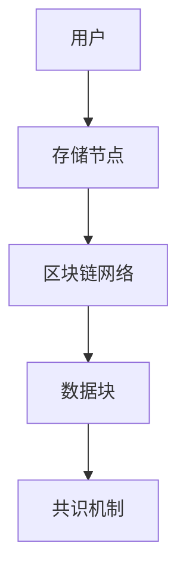
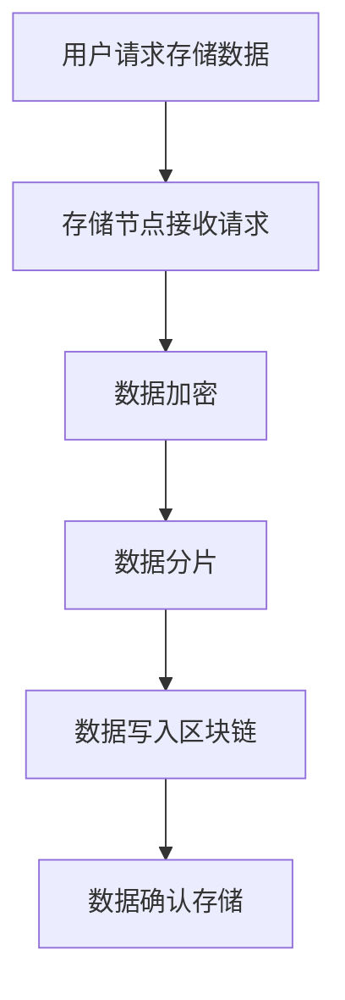
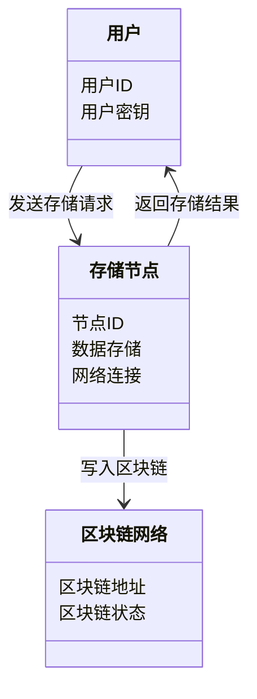

                 


# 如何评估企业的区块链去中心化存储平台

> 关键词：区块链，去中心化存储，评估，企业存储，数据安全，分布式系统

> 摘要：本文将详细探讨如何评估企业的区块链去中心化存储平台。通过分析区块链技术的基本原理、去中心化存储的核心概念，以及实际项目中的系统架构设计和算法实现，本文旨在为企业提供一套全面的评估方法。从背景介绍、核心概念到算法原理、系统分析，再到项目实战和案例分析，本文将逐步引导读者深入了解如何有效评估和优化区块链去中心化存储平台。

---

# 第一部分: 区块链去中心化存储平台概述

## 第1章: 区块链与去中心化存储的背景与意义

### 1.1 区块链技术的背景与发展

#### 1.1.1 区块链的基本概念

- 区块链是一种去中心化的分布式账本技术，通过密码学和共识算法实现数据的安全存储和传输。
- 区块链的核心特点包括去中心化、不可篡改、透明性和可追溯性。

#### 1.1.2 区块链的分类与应用场景

- **公有链**：如比特币、以太坊，适用于金融、供应链等领域。
- **联盟链**：适用于企业内部或特定机构之间的协作，如金融联盟、医疗数据共享。
- **私有链**：适用于企业内部数据管理，如内部供应链管理。

#### 1.1.3 区块链技术的核心优势

- 去中心化：避免单点故障，提高系统抗攻击能力。
- 数据不可篡改：通过哈希函数和共识机制确保数据完整性。
- 可追溯性：数据记录可追溯，便于审计和追踪。

### 1.2 去中心化存储的背景与意义

#### 1.2.1 去中心化存储的定义

- 去中心化存储是指将数据分散存储在多个节点上，而不是集中在单一中心服务器上。

#### 1.2.2 去中心化存储的核心特点

- **分布式**：数据分布在多个节点上，避免单点故障。
- **抗审查性**：数据无法被单一机构删除或修改。
- **隐私保护**：通过加密技术保护数据隐私。

#### 1.2.3 区块链与去中心化存储的结合

- 区块链提供了去中心化存储的可信环境，确保数据的安全性和不可篡改性。

### 1.3 区块链去中心化存储的背景与意义

#### 1.3.1 区块链去中心化存储的背景

- 随着数据量的爆炸式增长，传统中心化存储面临安全性、可靠性和扩展性问题。
- 区块链技术的出现，为去中心化存储提供了新的解决方案。

#### 1.3.2 区块链去中心化存储的意义

- 提高数据安全性：通过区块链技术，数据难以被篡改或删除。
- 增强系统可靠性：分布式存储架构抗歴辑攻击和单点故障。
- 降低运营成本：去中心化存储减少了对中心服务器的依赖，降低了运营成本。

#### 1.3.3 区块链去中心化存储的现状与发展趋势

- 现状：区块链去中心化存储技术逐步成熟，应用场景不断扩大。
- 发展趋势：随着技术的进步，去中心化存储将更加普及，并与人工智能、物联网等技术深度融合。

## 1.4 本章小结

本章通过介绍区块链技术的基本原理和去中心化存储的核心概念，阐述了区块链去中心化存储的背景和意义。接下来将深入探讨区块链去中心化存储的核心概念与联系，包括数据存储与检索、共识机制、加密算法等。

---

# 第二部分: 区块链去中心化存储的核心概念与联系

## 第2章: 区块链去中心化存储的核心概念

### 2.1 区块链去中心化存储的原理

#### 2.1.1 区块链去中心化存储的实现机制

- 数据分片：将数据分割成多个片段，分别存储在不同的节点上。
- 加密技术：通过加密算法保护数据隐私。
- 共识机制：确保所有节点的数据一致性。

#### 2.1.2 区块链去中心化存储的核心算法

- 数据分片算法：将数据分割成多个部分，分别存储在不同的节点上。
- 加密算法：如AES、RSA等，用于保护数据隐私。
- 共识算法：如PoW、PoS、BFT等，用于确保数据一致性。

#### 2.1.3 区块链去中心化存储的安全性保障

- 数据完整性：通过哈希函数确保数据在传输和存储过程中不被篡改。
- 数据隐私性：通过加密技术保护数据隐私。
- 数据可用性：通过分布式存储保证数据的高可用性。

### 2.2 区块链去中心化存储的关键技术

#### 2.2.1 分布式存储技术

- 分布式存储技术将数据分散存储在多个节点上，确保数据的高可用性和抗攻击性。
- 数据分片：将数据分割成多个片段，分别存储在不同的节点上。

#### 2.2.2 加密技术

- 加密技术用于保护数据隐私，防止数据被未经授权的访问。
- 常见加密算法包括AES、RSA、椭圆曲线加密等。

#### 2.2.3 共识机制

- 共识机制用于确保所有节点的数据一致性。
- 常见共识机制包括PoW、PoS、BFT等。

### 2.3 区块链去中心化存储的实体关系图



### 2.4 区块链去中心化存储的流程图



## 2.5 本章小结

本章详细介绍了区块链去中心化存储的核心概念，包括数据存储与检索、共识机制、加密算法等。同时，通过实体关系图和流程图，展示了区块链去中心化存储的整体架构和实现流程。接下来将深入探讨区块链去中心化存储的算法原理，包括共识机制、数据分片算法等。

---

# 第三部分: 区块链去中心化存储的算法原理

## 第3章: 区块链去中心化存储的算法原理

### 3.1 共识机制的实现

#### 3.1.1 工作量证明（PoW）

- **定义**：PoW是一种通过计算哈希函数来证明工作量的共识机制。
- **实现流程**：
  1. 每个节点生成一个随机数，计算哈希值。
  2. 比较哈希值是否满足目标值，若满足则获得记账权。
  3. 将数据打包成区块，广播给其他节点。
  4. 其他节点验证区块的合法性，若合法则将区块添加到区块链中。

#### 3.1.2 权益证明（PoS）

- **定义**：PoS是一种基于节点持有的代币数量来决定记账权的共识机制。
- **实现流程**：
  1. 节点根据持有的代币数量分配记账权。
  2. 节点随机被选中进行区块打包。
  3. 其他节点验证区块的合法性，若合法则将区块添加到区块链中。

#### 3.1.3 拜占庭容错（BFT）

- **定义**：BFT是一种适用于小规模网络的共识机制，通过投票机制确保数据一致性。
- **实现流程**：
  1. 节点接收到请求后，生成候选区块。
  2. 节点之间进行投票，超过半数节点同意后，区块被确认。
  3. 区块被添加到区块链中，数据被存储。

### 3.2 数据存储与检索算法

#### 3.2.1 数据分片算法

- **定义**：数据分片算法将数据分割成多个片段，分别存储在不同的节点上。
- **实现流程**：
  1. 数据被分割成多个片段。
  2. 每个片段被加密后，存储在不同的节点上。
  3. 数据检索时，从各个节点获取片段，解密后合并成完整数据。

#### 3.2.2 数据加密算法

- **定义**：数据加密算法用于保护数据隐私，防止未经授权的访问。
- **实现流程**：
  1. 数据被加密后存储在节点上。
  2. 数据检索时，使用密钥解密数据。

#### 3.2.3 数据一致性算法

- **定义**：数据一致性算法用于确保所有节点的数据一致性。
- **实现流程**：
  1. 节点之间定期同步数据。
  2. 使用共识机制确保数据一致性。

### 3.3 算法实现的Python代码示例

#### 3.3.1 共识机制实现

```python
import hashlib
import random

def hash_function(data):
    return hashlib.sha256(data.encode()).hexdigest()

def proof_of_work(data):
    target = '0000'
    while True:
        nonce = random.randint(0, 9999)
        hash_value = hash_function(data + str(nonce))
        if hash_value.startswith(target):
            return nonce

def proof_of_stake(data):
    stakeholders = [...]  # 股权池
    selected = random.choice(stakeholders)
    return selected
```

#### 3.3.2 数据分片与加密实现

```python
def data_sharding(data, num_shards):
    shards = []
    for i in range(num_shards):
        shards.append(data[i::num_shards])
    return shards

def data_encryption(data, key):
    cipher = AES.new(key, AES.MODE_ECB)
    return cipher.encrypt(data)
```

### 3.4 算法原理的数学模型与公式

#### 3.4.1 哈希函数的数学模型

$$ H(x) = \sum_{i=0}^{n} x_i \times k_i \mod p $$

其中：
- $x_i$ 表示数据块中的第 $i$ 个元素。
- $k_i$ 表示哈希函数的密钥。
- $p$ 表示模数。

#### 3.4.2 共识机制的数学模型

$$ C = \sum_{i=1}^{n} w_i \times v_i \mod p $$

其中：
- $w_i$ 表示第 $i$ 个节点的权重。
- $v_i$ 表示第 $i$ 个节点的投票值。
- $p$ 表示模数。

## 3.5 本章小结

本章详细介绍了区块链去中心化存储的核心算法原理，包括共识机制、数据分片算法和加密算法等。通过Python代码示例和数学公式，深入讲解了算法的实现细节和工作原理。接下来将结合实际项目，分析如何设计和实现区块链去中心化存储系统。

---

# 第四部分: 区块链去中心化存储的系统分析与架构设计

## 第4章: 区块链去中心化存储的系统分析

### 4.1 项目背景与目标

#### 4.1.1 项目背景

- 随着企业数据量的快速增长，传统的中心化存储方式面临安全性、可靠性和扩展性问题。
- 区块链技术的出现，为去中心化存储提供了新的解决方案。

#### 4.1.2 项目目标

- 实现一个基于区块链的去中心化存储平台。
- 提供高安全、高可用、高扩展性的数据存储服务。
- 为企业提供数据共享和协作的可信环境。

### 4.2 系统功能设计

#### 4.2.1 领域模型设计



#### 4.2.2 系统功能模块

- **用户模块**：用户发起存储请求，管理存储权限。
- **存储节点模块**：负责数据的存储和检索。
- **区块链网络模块**：负责数据的共识和存储。

### 4.3 系统架构设计

#### 4.3.1 系统架构图


#### 4.3.2 模块交互流程图


### 4.4 系统接口设计

#### 4.4.1 存储接口

- 接口名称：`storeData`
- 请求参数：`data`（待存储的数据）
- 返回值：`receipt`（存储收据）

#### 4.4.2 检索接口

- 接口名称：`retrieveData`
- 请求参数：`receipt`（存储收据）
- 返回值：`data`（存储数据）

### 4.5 本章小结

本章通过系统分析和架构设计，详细阐述了区块链去中心化存储平台的实现方案。从项目背景到系统功能设计，再到系统架构图和模块交互流程图，全面展示了系统的实现细节。接下来将结合实际项目，详细讲解如何实现区块链去中心化存储平台。

---

# 第五部分: 区块链去中心化存储的项目实战

## 第5章: 区块链去中心化存储的项目实战

### 5.1 环境搭建

#### 5.1.1 安装必要的软件

- **Python**：用于编写和运行代码。
- **区块链框架**：如Ethereum、Hyperledger Fabric等。
- **数据库**：如MongoDB，用于存储数据。

#### 5.1.2 安装依赖库

```bash
pip install hashlib
pip install mermaid
pip install aes-cipher
```

### 5.2 系统核心实现

#### 5.2.1 存储节点实现

```python
import hashlib
import random

def hash_function(data):
    return hashlib.sha256(data.encode()).hexdigest()

def proof_of_work(data):
    target = '0000'
    while True:
        nonce = random.randint(0, 9999)
        hash_value = hash_function(data + str(nonce))
        if hash_value.startswith(target):
            return nonce

def data_storage(data):
    receipt = proof_of_work(data)
    return receipt
```

#### 5.2.2 区块链网络实现

```python
class Blockchain:
    def __init__(self):
        self.chain = []
        self.transactions = []

    def add_transaction(self, transaction):
        self.transactions.append(transaction)

    def mine_block(self):
        block = {
            'index': len(self.chain) + 1,
            'timestamp': datetime.datetime.now().strftime("%Y-%m-%d %H:%M:%S"),
            'transactions': self.transactions
        }
        self.chain.append(block)
        self.transactions = []
```

### 5.3 代码应用解读与分析

#### 5.3.1 存储节点代码解读

- `hash_function`：用于计算数据的哈希值。
- `proof_of_work`：用于实现工作量证明机制。
- `data_storage`：用于数据存储，返回存储收据。

#### 5.3.2 区块链网络代码解读

- `Blockchain` 类：管理区块链的状态和交易。
- `add_transaction` 方法：添加新的交易到区块链。
- `mine_block` 方法：打包交易成区块，添加到区块链中。

### 5.4 案例分析与详细讲解

#### 5.4.1 案例背景

- 企业A需要存储大量的敏感数据，希望通过区块链去中心化存储技术实现数据的安全存储和共享。

#### 5.4.2 实施步骤

1. **环境搭建**：安装必要的软件和依赖库。
2. **数据存储**：用户发起存储请求，存储节点接收请求，计算哈希值和 nonce。
3. **数据分片**：将数据分割成多个片段，分别存储在不同的节点上。
4. **数据加密**：对数据进行加密，确保数据隐私。
5. **数据写入区块链**：将数据打包成区块，通过共识机制确认数据存储。
6. **数据检索**：用户发起检索请求，存储节点返回数据。

### 5.5 项目小结

本章通过实际项目实战，详细讲解了如何实现区块链去中心化存储平台。从环境搭建到系统核心实现，再到案例分析，全面展示了项目的实现过程。通过本章的学习，读者可以掌握区块链去中心化存储的核心技术，并能够独立完成简单的区块链去中心化存储平台的开发。

---

# 第六部分: 区块链去中心化存储的案例分析

## 第6章: 区块链去中心化存储的案例分析

### 6.1 案例背景介绍

#### 6.1.1 案例目标

- 企业希望通过区块链去中心化存储技术实现数据的安全存储和共享。

#### 6.1.2 案例需求

- 数据安全性：确保数据在存储和传输过程中不被篡改或泄露。
- 数据可用性：确保数据的高可用性和快速检索。
- 数据一致性：确保所有节点的数据一致性。

### 6.2 系统功能设计

#### 6.2.1 数据存储与检索

- 用户发起存储请求，存储节点接收请求，计算哈希值和 nonce。
- 数据分片和加密后，存储在区块链网络中。
- 用户发起检索请求，存储节点返回数据。

#### 6.2.2 系统架构设计

- 用户模块：负责发起存储和检索请求。
- 存储节点模块：负责数据的存储和检索。
- 区块链网络模块：负责数据的共识和存储。

### 6.3 系统实现与分析

#### 6.3.1 实现过程

1. **环境搭建**：安装必要的软件和依赖库。
2. **数据存储**：用户发起存储请求，存储节点接收请求，计算哈希值和 nonce。
3. **数据分片**：将数据分割成多个片段，分别存储在不同的节点上。
4. **数据加密**：对数据进行加密，确保数据隐私。
5. **数据写入区块链**：将数据打包成区块，通过共识机制确认数据存储。
6. **数据检索**：用户发起检索请求，存储节点返回数据。

#### 6.3.2 系统分析

- 数据安全性：通过哈希函数和加密技术，确保数据的安全性和不可篡改性。
- 数据可用性：通过分布式存储和高可用架构，确保数据的高可用性。
- 数据一致性：通过共识机制，确保所有节点的数据一致性。

### 6.4 案例总结与启示

- 区块链去中心化存储技术能够有效提高数据安全性、可用性和一致性。
- 通过实际案例分析，可以更好地理解区块链去中心化存储的核心技术和实现流程。
- 未来，随着技术的进步，区块链去中心化存储将更加普及，并与人工智能、物联网等技术深度融合。

## 6.5 本章小结

本章通过实际案例分析，详细展示了区块链去中心化存储平台的实现过程和应用效果。通过案例分析，读者可以更好地理解区块链去中心化存储的核心技术和实际应用。接下来将结合实际项目，总结最佳实践和注意事项。

---

# 第七部分: 区块链去中心化存储的总结与展望

## 第7章: 总结与展望

### 7.1 本章小结

- 本章总结了区块链去中心化存储的核心技术和实现流程。
- 通过实际案例分析，展示了区块链去中心化存储的应用效果。
- 强调了区块链去中心化存储在企业中的重要性和未来发展趋势。

### 7.2 未来展望

- **技术发展**：随着技术的进步，区块链去中心化存储将更加普及，并与人工智能、物联网等技术深度融合。
- **应用场景**：区块链去中心化存储将在金融、医疗、教育等领域得到广泛应用。
- **挑战与机遇**：区块链去中心化存储技术面临技术挑战和商业机遇，需要进一步研究和探索。

### 7.3 最佳实践

- **安全性**：确保数据的高安全性，通过哈希函数和加密技术保护数据隐私。
- **可用性**：通过分布式存储和高可用架构，确保数据的高可用性。
- **一致性**：通过共识机制，确保所有节点的数据一致性。

### 7.4 注意事项

- **数据隐私**：在实现区块链去中心化存储时，必须高度重视数据隐私保护。
- **系统性能**：分布式存储和共识机制可能会影响系统的性能，需要进行优化和调优。
- **法律法规**：在实际应用中，需要遵守相关的法律法规，确保数据的合法性和合规性。

### 7.5 拓展阅读

- **区块链技术**：深入学习区块链技术的核心原理和实现方法。
- **去中心化存储**：研究去中心化存储的最新技术和应用案例。
- **分布式系统**：学习分布式系统的理论和实践，提升系统的可扩展性和可用性。

## 7.6 本章小结

本章总结了区块链去中心化存储的核心技术和实现流程，展望了未来的发展趋势，并提出了最佳实践和注意事项。通过本章的学习，读者可以更好地理解和应用区块链去中心化存储技术，为企业提供更加安全、可靠、高效的存储解决方案。

---

# 结语

区块链去中心化存储技术为企业提供了新的数据存储和管理方式，通过去中心化、不可篡改和高可用性的特点，解决了传统中心化存储的安全性和可靠性问题。通过本文的详细讲解和实际案例分析，读者可以全面掌握区块链去中心化存储的核心技术和实现流程，为企业提供更加安全、可靠、高效的存储解决方案。未来，随着技术的不断发展，区块链去中心化存储将在更多领域得到广泛应用，为企业和社会创造更大的价值。

