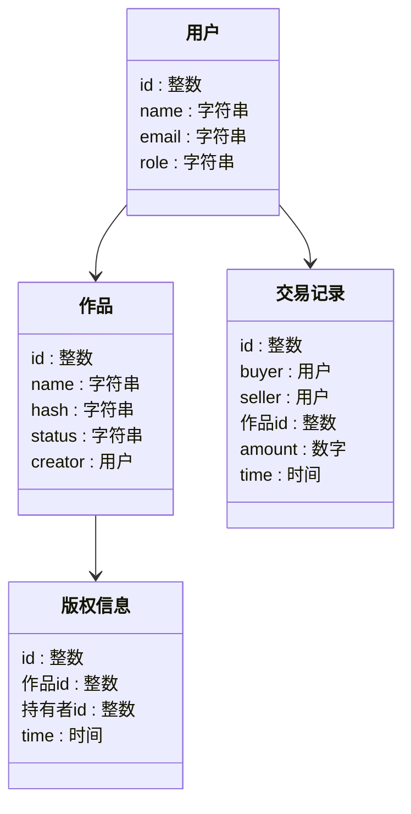
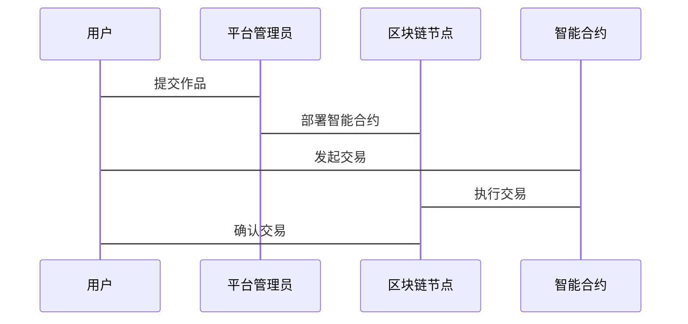

                 


```markdown
# 如何评估企业的区块链数字版权交易平台

> 关键词：区块链数字版权，交易平台，评估标准，系统架构，智能合约，共识机制

> 摘要：本文详细探讨如何评估企业的区块链数字版权交易平台。从技术实现、系统架构、算法原理到项目实战，逐步分析并提供评估方法和工具。通过实际案例，展示如何选择合适的解决方案，确保平台的安全性、可靠性和高效性。

## 第1章: 区块链数字版权交易平台的背景介绍

### 1.1 数字版权的重要性与挑战
#### 1.1.1 数字版权的定义与特征
数字版权是指对数字化作品的法律权利，包括著作权、复制权、发行权等。其特征包括唯一性、不可篡改性和可追溯性。

#### 1.1.2 数字版权保护的痛点与难点
传统的数字版权保护存在以下问题：
1. **盗版问题**：数字内容易于复制和传播，导致盗版泛滥。
2. **权属不清**：作品的创作者和版权持有者难以有效证明。
3. **交易复杂**：数字版权交易涉及多方，流程繁琐且信任缺失。

#### 1.1.3 区块链技术在数字版权保护中的作用
区块链通过去中心化、不可篡改和可追溯的特性，解决了数字版权保护中的信任和安全问题。

### 1.2 区块链技术的核心优势
#### 1.2.1 区块链的基本概念与技术特点
区块链是一种分布式账本技术，通过去中心化、共识机制、加密算法和智能合约实现数据的安全性和可靠性。

#### 1.2.2 区块链在数字版权保护中的应用场景
区块链可以用于版权登记、交易、分发和保护，确保版权信息的透明性和不可篡改性。

#### 1.2.3 区块链如何解决数字版权交易中的信任问题
通过区块链技术，数字版权交易的参与者可以实现信任和透明，避免中间机构的干预，降低交易成本。

## 第2章: 区块链数字版权交易平台的核心概念与联系

### 2.1 区块链数字版权交易平台的定义与构成
#### 2.1.1 平台的定义
区块链数字版权交易平台是一个基于区块链技术的在线平台，用于数字内容的版权登记、交易和分发。

#### 2.1.2 平台的核心构成要素
1. **用户身份认证**：确保用户身份的真实性和唯一性。
2. **版权登记与验证**：通过区块链实现版权信息的登记和验证。
3. **智能合约**：自动化执行交易和支付流程。
4. **交易记录与审计**：记录所有交易行为，便于审计和追溯。

#### 2.1.3 平台的业务流程与价值主张
1. **用户注册**：用户通过身份认证后，可以在平台创建账户。
2. **版权登记**：用户上传作品，平台生成哈希值并记录在区块链上。
3. **版权交易**：通过智能合约实现作品的买卖和授权。
4. **收益分配**：根据智能合约的设定，自动分配收益。

### 2.2 核心概念的ER实体关系图
```mermaid
erDiagram
    actor 用户 {
        +id : 整数
        +name : 字符串
        +email : 字符串
    }
    actor 创作者 {
        +id : 整数
        +name : 字符串
        +作品 : 文件
    }
    actor 版权持有者 {
        +id : 整数
        +name : 字符串
        +作品 : 文件
    }
    actor 平台管理员 {
        +id : 整数
        +name : 字符串
    }
    entity 作品 {
        +id : 整数
        +name : 字符串
        +hash : 字符串
        +状态 : 字符串
    }
    entity 版权信息 {
        +id : 整数
        +作品id : 整数
        +持有者id : 整数
        +时间戳 : 时间
    }
    entity 交易记录 {
        +id : 整数
        +买家id : 整数
        +卖家id : 整数
        +作品id : 整数
        +交易金额 : 数字
        +时间戳 : 时间
    }
    user 创作者 -->+ 作品
    user 版权持有者 -->+ 作品
    user 用户 -->+ 交易记录
    user 平台管理员 -->+ 版权信息
```

## 第3章: 区块链数字版权交易平台的算法原理

### 3.1 共识机制的选择与实现
#### 3.1.1 共识机制的基本概念
共识机制是区块链的核心技术之一，用于确保所有节点达成一致。

#### 3.1.2 常见共识机制对比
| 共识机制 | 特点 | 适用场景 |
|----------|------|-----------|
| PoW      | 安全性高，去中心化强 | 适用于比特币等加密货币 |
| PoS      | 节能，环保 | 适用于以太坊等项目 |
| DPoS      | 高效，适合企业级应用 | 适用于企业区块链 |

#### 3.1.3 选择共识机制的考虑因素
1. **安全性**：确保数据的安全性和不可篡改性。
2. **效率**：确保交易的快速确认和处理。
3. **可扩展性**：支持高并发和大规模应用。

### 3.2 智能合约的实现与验证
#### 3.2.1 智能合约的基本概念
智能合约是区块链上的自动执行程序，用于自动执行交易和支付。

#### 3.2.2 智能合约的实现步骤
1. **需求分析**：明确智能合约的功能需求。
2. **合约设计**：设计智能合约的逻辑和流程。
3. **代码实现**：使用Solidity等编程语言编写智能合约代码。
4. **合约部署**：将智能合约部署到区块链网络。
5. **合约测试**：通过测试用例验证智能合约的功能。

#### 3.2.3 智能合约的数学模型与公式
智能合约的执行逻辑可以用状态机模型来描述，如下：
$$
\text{状态转移} = \text{输入} \rightarrow \text{处理逻辑} \rightarrow \text{输出}
$$

### 3.3 加密算法的实现与安全性评估
#### 3.3.1 加密算法的基本概念
加密算法用于保护数据的 confidentiality、integrity 和 availability。

#### 3.3.2 常见加密算法对比
| 加密算法 | 类型 | 特点 |
|----------|------|------|
| SHA-256  | 哈希函数 | 不可逆，用于数据完整性验证 |
| AES      | 对称加密 | 高效，适合数据加密 |
| RSA      | 非对称加密 | 安全性高，用于数字签名 |

#### 3.3.3 加密算法在数字版权交易中的应用
1. **哈希函数**：用于生成作品的唯一标识。
2. **数字签名**：用于验证交易的合法性和真实性。

## 第4章: 区块链数字版权交易平台的系统分析与架构设计

### 4.1 系统分析
#### 4.1.1 问题场景介绍
数字版权交易平台需要解决以下问题：
1. **作品的唯一性验证**：确保作品的真实性和唯一性。
2. **交易的安全性**：防止交易中的欺诈和篡改。
3. **收益的透明分配**：确保收益的公平分配和透明化。

#### 4.1.2 项目介绍
本文将设计一个基于区块链的数字版权交易平台，涵盖作品登记、交易、收益分配等功能。

### 4.2 系统功能设计
#### 4.2.1 领域模型设计


#### 4.2.2 系统架构设计


#### 4.2.3 接口设计
平台需要以下接口：
1. **用户注册与登录**：实现用户身份认证。
2. **作品上传与验证**：上传作品并生成哈希值。
3. **版权信息查询**：查询作品的版权信息。
4. **交易发起与确认**：发起交易并自动确认。

#### 4.2.4 交互流程设计


## 第5章: 区块链数字版权交易平台的项目实战

### 5.1 环境安装与配置
#### 5.1.1 系统环境要求
- 操作系统：Linux/Windows/MacOS
- 区块链框架：以太坊、fabric等
- 开发工具：IDE（如VS Code）、Solidity编译器

#### 5.1.2 安装步骤
1. 安装Node.js和npm。
2. 安装以太坊钱包（如MetaMask）。
3. 安装Solidity编译器。
4. 配置以太坊测试网络。

### 5.2 系统核心实现
#### 5.2.1 智能合约实现
```solidity
// SPDX-License-Identifier: MIT
pragma solidity ^0.8.0;

contract Copyright {
    struct Work {
        uint id;
        string name;
        bytes32 hash;
        address creator;
        address owner;
        uint price;
    }

    mapping(uint => Work) private works;

    function register(uint id, string memory name, bytes32 hash) public {
        Work storage work = works[id];
        work.id = id;
        work.name = name;
        work.hash = hash;
        work.creator = msg.sender;
        work.owner = msg.sender;
        work.price = 0;
    }

    function transfer(uint id, address buyer) public payable {
        Work storage work = works[id];
        require(work.owner == msg.sender, "Not the owner");
        require(msg.value >= work.price, "Insufficient funds");
        work.owner = buyer;
        payable(work.creator).transfer(msg.value);
    }
}
```

#### 5.2.2 后端实现
```python
from web3 import Web3, HTTPProvider
import json

class CopyrightPlatform:
    def __init__(self, provider):
        self.web3 = Web3(provider)
        self.copyright_contract = self.web3.eth.contract(
            address="智能合约地址",
            abi=ABI
        )

    def register_work(self, work_id, name, file_hash):
        tx_hash = self.copyright_contract.functions.register(work_id, name, file_hash).transact()
        receipt = self.web3.eth.waitForTransactionReceipt(tx_hash)
        return receipt

    def transfer_work(self, work_id, buyer_address, amount):
        tx_hash = self.copyright_contract.functions.transfer(work_id, buyer_address, amount).transact()
        receipt = self.web3.eth.waitForTransactionReceipt(tx_hash)
        return receipt

    def get_work_info(self, work_id):
        work_info = self.copyright_contract.functions.get_work_info(work_id).call()
        return work_info
```

### 5.3 项目实战与案例分析
#### 5.3.1 实际案例分析
1. **案例背景**：一位创作者在平台上上传了他的音乐作品，并设置价格为1美元。
2. **交易流程**：一位用户购买该音乐作品，支付1美元，智能合约自动完成交易并分配收益。
3. **结果验证**：通过区块链浏览器验证交易记录和版权信息。

#### 5.3.2 项目小结
通过实际案例，我们验证了平台的可行性，并展示了区块链技术在数字版权交易中的巨大潜力。

## 第6章: 区块链数字版权交易平台的最佳实践

### 6.1 评估与优化
#### 6.1.1 评估标准
1. **技术实现**：区块链技术的选择和实现。
2. **系统性能**：平台的响应速度和处理能力。
3. **安全性**：系统的安全性和抗攻击能力。
4. **用户体验**：平台的易用性和用户友好性。

#### 6.1.2 优化建议
1. **选择合适的共识机制**：根据需求选择PoW、PoS或DPoS。
2. **优化智能合约**：减少gas消耗，提高交易效率。
3. **提升用户体验**：优化界面设计，简化操作流程。

### 6.2 注意事项
1. **法律法规**：遵守相关法律法规，确保平台的合法性。
2. **数据隐私**：保护用户数据和作品隐私。
3. **平台维护**：定期更新和维护平台，确保系统的稳定运行。

### 6.3 未来展望
区块链技术在数字版权领域的应用前景广阔，未来将更加智能化、高效化和便捷化。

### 6.4 拓展阅读
1. **《区块链技术与应用》**：深入理解区块链技术的核心原理。
2. **《智能合约开发指南》**：掌握智能合约的开发和部署技巧。
3. **《数字版权保护》**：了解数字版权保护的最新技术和实践。

## 第7章: 总结

### 7.1 本文总结
本文详细探讨了如何评估企业的区块链数字版权交易平台，从技术实现、系统架构到项目实战，全面分析了平台的各个方面。

### 7.2 展望未来
随着区块链技术的不断发展，数字版权交易平台将更加智能化和高效化，为企业和个人提供更好的服务。

### 7.3 感谢
感谢读者的耐心阅读，希望本文能为企业的区块链数字版权交易平台的评估提供有价值的参考。
```

