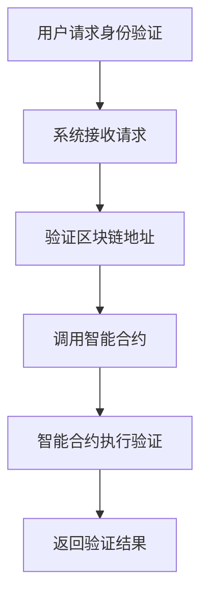
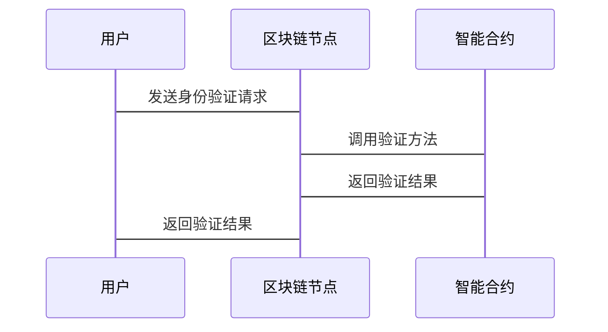

                 


# 如何评估企业的区块链数字身份系统

## 关键词：区块链，数字身份，身份验证，企业系统，安全

## 摘要：本文将详细探讨如何评估企业的区块链数字身份系统。从区块链技术的基本概念到数字身份系统的实际应用，从算法原理到系统架构，再到项目实战与最佳实践，为您提供全面的评估指南。通过深入分析，帮助企业在数字化转型中确保身份安全与合规性。

---

## 第一部分: 区块链数字身份系统的背景与核心概念

### 第1章: 区块链数字身份系统概述

#### 1.1 区块链与数字身份的基本概念

- 1.1.1 区块链技术的定义与特点
  - 区块链是一种去中心化的分布式账本技术，具有去中心化、不可篡改、可追溯等特点。
  - 区块链通过共识机制确保数据的一致性和完整性，支持智能合约自动执行。

- 1.1.2 数字身份的定义与属性
  - 数字身份是用户在数字世界中的唯一标识，通常包括用户ID、公私钥对、数字证书等。
  - 数字身份需要具备唯一性、可验证性和安全性。

- 1.1.3 区块链在数字身份中的作用
  - 区块链提供了一种去中心化的身份验证方式，能够实现跨机构、跨平台的身份互信。
  - 区块链通过智能合约自动执行验证逻辑，简化身份认证流程。

#### 1.2 企业区块链数字身份系统的背景

- 1.2.1 传统身份认证的局限性
  - 传统身份认证存在中心化风险，容易被攻击和篡改。
  - 跨机构身份认证复杂，成本高，效率低。

- 1.2.2 区块链技术如何解决身份认证问题
  - 区块链去中心化特性降低了身份被篡改的风险。
  - 智能合约自动执行验证逻辑，提高了身份认证的效率和安全性。

- 1.2.3 企业数字化转型中的身份管理需求
  - 数字化转型要求企业实现更高效、安全的身份管理。
  - 区块链数字身份系统能够支持多机构协作，提升企业生态系统的互信能力。

### 第2章: 区块链数字身份系统的核心概念与联系

#### 2.1 核心概念原理

- 身份标识与区块链地址的关系
  - 每个用户拥有唯一的身份标识，对应区块链上的一个地址。
  - 区块链地址通过公私钥对进行加密，确保身份的安全性。

- 分布式账本与身份数据的存储
  - 身份数据存储在区块链的分布式账本中，确保数据的不可篡改性和可追溯性。
  - 每个节点都保存完整的账本副本，支持去中心化的身份验证。

- 智能合约在身份验证中的应用
  - 智能合约自动执行预定义的身份验证逻辑，例如验证用户权限、签名等。
  - 智能合约通过区块链的去中心化特性，确保验证过程的透明性和公正性。

#### 2.2 核心概念属性对比表

| 概念       | 唯一性 | 可验证性 | 可追溯性 |
|------------|-------|----------|----------|
| 身份标识    | 是    | 是       | 是       |
| 区块链地址  | 是    | 是       | 是       |
| 智能合约    | 否    | 是       | 是       |

#### 2.3 ER实体关系图

```mermaid
er
    actor 用户
    actor 系统管理员
    actor 第三方服务
    database 身份数据
    database 区块链账本
    relationship 用户 -> 身份数据: 拥有
    relationship 用户 -> 区块链账本: 验证
    relationship 系统管理员 -> 身份数据: 管理
    relationship 第三方服务 -> 区块链账本: 授权
```

---

## 第二部分: 区块链数字身份系统的算法原理

### 第3章: 区块链共识机制与身份验证

#### 3.1 共识机制在身份验证中的应用

- 工作量证明（PoW）的原理
  - PoW通过计算哈希值的难度来确保区块的正确性，防止恶意节点的攻击。
  - 在身份验证中，PoW用于验证用户提交的信息是否符合预期。

- 权益证明（PoS）的原理
  - PoS通过持有代币的数量来决定验证权，降低能源消耗。
  - 在身份验证中，PoS用于验证用户是否有足够的权限进行操作。

- 拜占庭容错（BFT）的原理
  - BFT通过选举主节点来达成共识，适用于节点数量较少的场景。
  - 在身份验证中，BFT用于确保多个节点之间的一致性。

#### 3.2 身份验证的算法流程



#### 3.3 加密算法与签名验证

- 加密算法的数学模型
  - 哈希函数：$H(x) = y$，其中$x$是输入数据，$y$是哈希值。
  - 签名验证：$S = \text{sign}(k, x)$，其中$k$是私钥，$x$是待签名数据，$S$是签名。

- Python实现示例
  ```python
  import hashlib

  def compute_hash(data):
      return hashlib.sha256(data.encode()).hexdigest()

  def verify_signature(public_key, signature, data):
      try:
          # 使用RSA算法进行签名验证
          key = rsa.PublicKey.from_hex(public_key)
          verifier = rsa.newVerifier(key)
          verifier.update(data.encode())
          if verifier.verify(signature):
              return True
          else:
              return False
      except:
          return False
  ```

---

## 第三部分: 区块链数字身份系统的系统分析与架构设计

### 第4章: 系统分析与架构设计

#### 4.1 问题场景介绍

- 传统身份认证系统存在单点故障风险，容易被攻击。
- 跨机构身份认证复杂，成本高，效率低。

#### 4.2 系统功能设计

- 领域模型类图
  ```mermaid
  classDiagram
      class 用户 {
          姓名
          身份标识
          区块链地址
      }
      class 区块链账本 {
          区块
          交易记录
      }
      class 智能合约 {
          合约代码
          合约状态
      }
      用户 --> 区块链账本: 验证
      用户 --> 智能合约: 调用
  ```

- 系统架构设计
  ```mermaid
  architecture
      client --> blockchain-node: 发送身份验证请求
      blockchain-node --> smart-contract: 调用智能合约
      smart-contract --> blockchain-node: 返回验证结果
      blockchain-node --> client: 返回验证结果
  ```

#### 4.3 接口设计与交互流程图



---

## 第四部分: 项目实战

### 第5章: 项目实战

#### 5.1 环境安装与配置

- 安装以太坊节点：`npm install -g ethereumjs-testrpc`
- 配置智能合约：编写Solidity代码，部署到以太坊测试网络。

#### 5.2 核心功能实现

- 智能合约实现：编写验证逻辑，部署到区块链网络。
  ```solidity
  pragma solidity ^0.8.0;

  contract IdentityValidator {
      mapping(address => bytes32) public userIdentities;

      function setIdentity(address _address, bytes32 _identity) public {
          userIdentities[_address] = _identity;
      }

      function verify(address _address, bytes32 _identity) public view returns (bool) {
          return userIdentities[_address] == _identity;
      }
  }
  ```

- 调用智能合约进行验证：
  ```python
  from web3 import Web3

  w3 = Web3(Web3.HTTPProvider('http://localhost:8545'))

  contract_address = '0x12345...'
  abi = [{'constant': True, 'inputs': [{'name': 'address', 'type': 'address'}, {'name': 'identity', 'type': 'bytes32'}], 'name': 'verify', 'outputs': [{'name': '', 'type': 'bool'}], 'payable': False, 'stateMutability': 'view', 'type': 'function'}]

  contract = w3.eth.contract(address=contract_address, abi=abi)
  result = contract.functions.verify('0x...', '...').call()
  ```

#### 5.3 案例分析与解读

- 实际案例：企业A通过区块链数字身份系统实现了跨机构的身份验证，提高了效率和安全性。
- 代码解读：通过Solidity和Python代码实现智能合约部署和验证，详细分析每一步的操作和结果。

---

## 第五部分: 最佳实践与小结

### 第6章: 最佳实践

#### 6.1 小结

- 区块链数字身份系统通过去中心化和智能合约实现了高效、安全的身份验证。
- 企业在评估系统时需要考虑安全性、可扩展性和合规性。

#### 6.2 注意事项

- 确保系统的安全性，防止私钥泄露。
- 定期更新智能合约，应对潜在的安全漏洞。
- 遵守相关法律法规，确保合规性。

#### 6.3 拓展阅读

- 推荐阅读《区块链技术及应用》、《智能合约开发指南》等书籍。
- 参加区块链技术社区活动，了解最新动态和最佳实践。

---

## 结语

评估企业的区块链数字身份系统需要从多个方面进行综合考量。通过理解区块链技术的核心原理、数字身份系统的设计与实现，以及实际项目的部署与维护，企业能够构建高效、安全的身份验证机制，为数字化转型提供坚实的技术支持。

