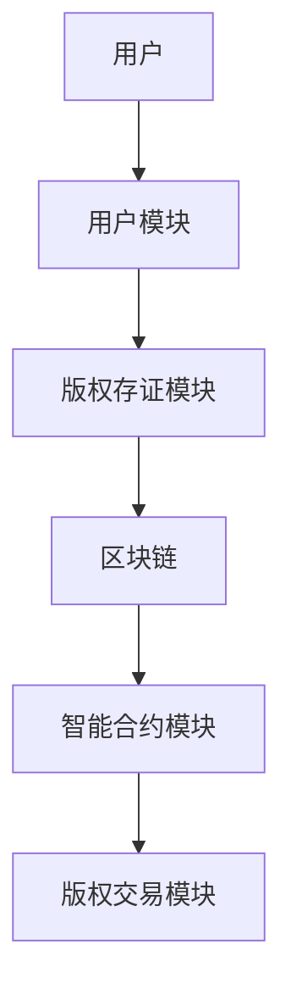
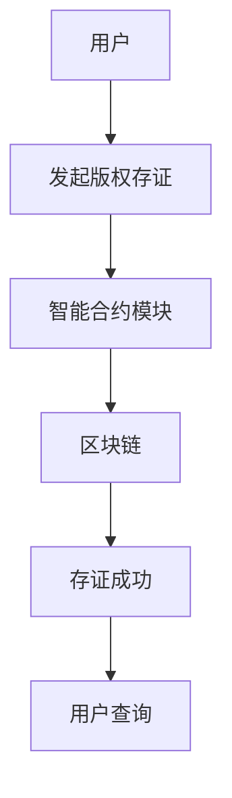

                 


# 如何评估企业的区块链版权保护平台

> **关键词**：区块链、版权保护、智能合约、去中心化、共识机制、系统架构

> **摘要**：本文旨在深入探讨如何评估企业级的区块链版权保护平台。通过分析区块链技术的核心概念、算法原理、系统架构以及实际案例，本文将提供一套全面的评估指标体系，帮助读者理解如何选择和优化适合的区块链版权保护解决方案。

---

## 第一部分: 区块链与版权保护平台概述

### 第1章: 区块链与版权保护的核心概念

#### 1.1 区块链技术基础

- **1.1.1 区块链的基本概念**
  区块链是一种分布式账本技术，通过去中心化的方式记录数据，确保数据的安全性和不可篡改性。它由区块、链式结构、共识机制、哈希函数等核心组件组成。

  ```mermaid
  graph TD
    A[区块链] --> B[区块]
    B --> C[链式结构]
    B --> D[共识机制]
    B --> E[哈希函数]
  ```

- **1.1.2 区块链的核心特性**
  区块链的去中心化、不可篡改性和透明性使其在版权保护中具有独特优势。去中心化避免了单点故障，不可篡改性确保数据的真实性，透明性增强了信任机制。

- **1.1.3 区块链的共识机制**
  共识机制如PoW（工作量证明）、PoS（权益证明）等，确保所有节点达成一致，保证了区块链的安全性和高效性。

#### 1.2 版权保护的挑战与需求

- **1.2.1 版权保护的传统模式**
  传统版权保护依赖法律手段，存在成本高、效率低、难以确权等问题。

- **1.2.2 数字化时代的版权保护痛点**
  在数字化时代，数字内容易被复制和传播，导致版权难以保护，创作者和企业的利益受损。

- **1.2.3 区块链在版权保护中的独特优势**
  区块链通过去中心化和不可篡改性，解决了传统版权保护的痛点，提供了高效、低成本的解决方案。

#### 1.3 区块链版权保护平台的定义与目标

- **1.3.1 平台的核心功能**
  包括版权存证、智能合约管理、版权交易与分发、侵权监测等。

- **1.3.2 平台的目标与价值**
  平台旨在通过区块链技术，确保版权的确权、流转和保护，促进数字内容产业的健康发展。

- **1.3.3 平台的边界与外延**
  平台专注于版权保护，但可能与法律、支付等系统集成，形成完整的生态系统。

---

## 第二部分: 区块链版权保护平台的核心技术

### 第2章: 区块链在版权保护中的核心机制

#### 2.1 智能合约在版权保护中的应用

- **2.1.1 智能合约的定义与特点**
  智能合约是区块链上的自动执行程序，具备自动执行、不可篡改、透明性等特性。

- **2.1.2 智能合约在版权授权中的作用**
  智能合约可以自动执行版权授权、分成等流程，确保利益相关方的权益。

- **2.1.3 智能合约的安全性与可靠性**
  智能合约的安全性依赖于区块链的共识机制和代码的严谨性，但需防范代码漏洞。

#### 2.2 区块链的去中心化与版权确权

- **2.2.1 去中心化对版权确权的意义**
  去中心化避免了中心机构的干预，确保确权的公正性和不可篡改性。

- **2.2.2 区块链如何实现版权的确权与存证**
  通过将版权信息哈希存入区块链，确保数据的真实性和唯一性。

- **2.2.3 去中心化对平台信任机制的影响**
  去中心化增强了平台的信任机制，减少了对中心机构的依赖。

#### 2.3 区块链的不可篡改性与版权保护

- **2.3.1 区块链的不可篡改性原理**
  每个区块包含前一个区块的哈希值，形成链式结构，确保数据不可篡改。

- **2.3.2 不可篡改性对版权保护的价值**
  通过区块链存证，版权信息具有法律效力，便于维权。

- **2.3.3 区块链存证的法律效力**
  区块链存证已被部分司法机构认可，为版权保护提供了法律依据。

---

## 第三部分: 区块链版权保护平台的评估指标

### 第3章: 评估指标体系的构建

#### 3.1 评估指标的核心维度

- **3.1.1 技术维度**
  包括区块链的技术架构、性能指标、扩展性等。

- **3.1.2 安全维度**
  包括数据安全性、抗攻击能力、漏洞风险等。

- **3.1.3 可扩展性维度**
  包括平台的用户容量、交易处理能力、数据存储能力等。

#### 3.2 评估指标的具体定义

- **3.2.1 技术维度的评估指标**
  包括区块链类型（如PoW、PoS）、节点分布、共识机制等。

- **3.2.2 安全维度的评估指标**
  包括加密算法强度、智能合约的安全性、访问控制机制等。

- **3.2.3 可扩展性维度的评估指标**
  包括TPS（每秒交易数）、响应时间、节点扩展能力等。

#### 3.3 评估指标的权重分配

- **3.3.1 技术维度的权重**
  技术维度权重较高，因平台的技术架构直接影响性能和安全性。

- **3.3.2 安全维度的权重**
  安全维度权重次之，因平台的安全性直接关系到数据的完整性。

- **3.3.3 可扩展性维度的权重**
  可扩展性维度权重较低，但随着用户增长，其重要性会逐步提升。

---

## 第四部分: 区块链版权保护平台的系统架构与实现

### 第4章: 系统架构设计

#### 4.1 系统功能模块划分

- **4.1.1 用户模块**
  包括用户注册、登录、版权存证、查询等功能。

- **4.1.2 版权存证模块**
  负责将版权信息哈希存入区块链，确保数据不可篡改。

- **4.1.3 智能合约模块**
  执行版权授权、交易等智能合约，确保自动化的流程。

#### 4.2 系统架构设计图



#### 4.3 系统接口设计

- **4.3.1 用户接口**
  提供Web或移动端界面，供用户进行操作。

- **4.3.2 后台接口**
  包括数据存储、区块链交互等后台功能。

- **4.3.3 第三方接口**
  与法律机构、支付平台等第三方系统集成。

#### 4.4 系统交互流程图



---

## 第五部分: 项目实战与总结

### 第5章: 项目实战

#### 5.1 环境安装

- 安装区块链开发环境，如Solidity、Node.js、Ganache等。

#### 5.2 核心代码实现

```javascript
// 版权存证智能合约示例
function main() {
    const Web3 = require('web3');
    const web3 = new Web3(new web3.providers.HttpProvider('http://localhost:8545'));
    const contractABI = [...]; // 替换为实际ABI
    const contractAddress = '...'; // 替换为实际地址
    const contract = new web3.eth.Contract(contractABI, contractAddress);
    
    async function saveCopyright(copyrightData) {
        try {
            const result = await contract.methods.saveCopyright(copyrightData).send();
            console.log('存证成功，交易哈希:', result.transactionHash);
        } catch (error) {
            console.error('存证失败:', error);
        }
    }
}
```

#### 5.3 案例分析与解读

- 分析一个实际的版权保护案例，如音乐版权保护，说明区块链如何实现确权和分发。

### 第5章小结

通过实际项目的实现，我们可以看到区块链技术在版权保护中的强大能力，但也需要注意技术细节和安全性。

---

## 第六部分: 最佳实践与总结

### 第6章: 最佳实践

#### 6.1 评估与优化

- 定期评估平台性能，优化系统架构，确保可扩展性和安全性。

#### 6.2 小结

区块链技术为版权保护提供了革命性的解决方案，但需要结合实际需求，选择合适的平台和架构。

#### 6.3 注意事项

- 注意数据隐私保护，确保用户信息的安全。
- 定期更新智能合约，防范漏洞风险。

#### 6.4 拓展阅读

推荐相关书籍和资源，帮助读者深入理解区块链技术及其在版权保护中的应用。

---

## 总结

本文通过系统的分析和详细的讲解，为读者提供了如何评估企业区块链版权保护平台的全面指南。从技术基础到实际应用，从系统架构到项目实战，本文旨在帮助读者理解并优化其区块链版权保护解决方案。

