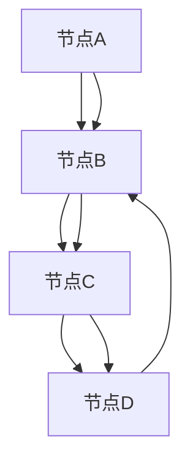
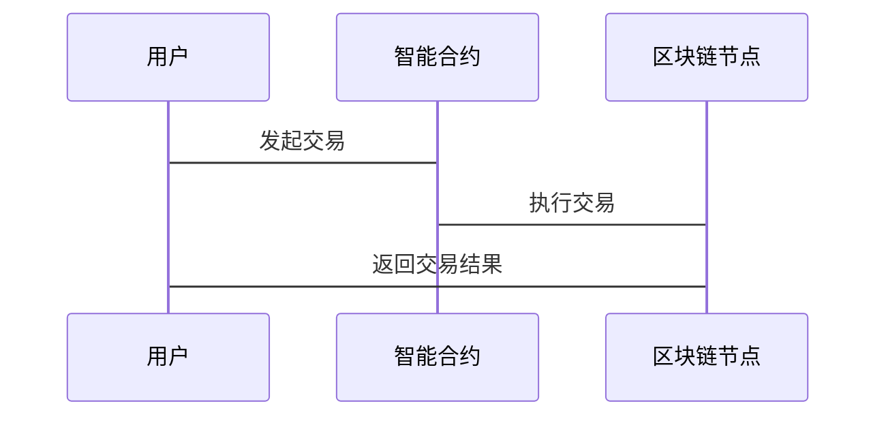
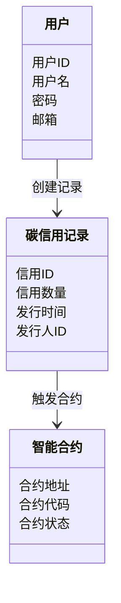
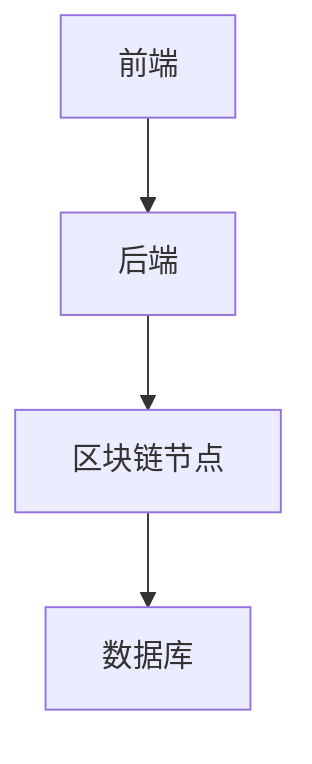
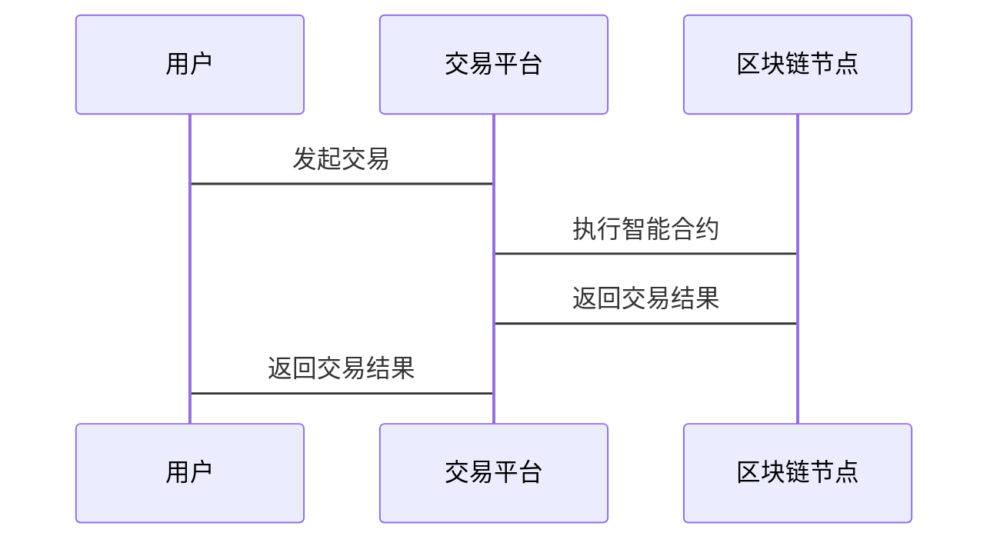

                 


# 如何评估企业的区块链碳信用交易平台

## 关键词：区块链、碳信用、交易平台、智能合约、去中心化

## 摘要：本文详细探讨了如何评估企业中的区块链碳信用交易平台，从核心概念、算法原理到系统架构、项目实战，再到最佳实践，为读者提供了全面的评估框架和方法。通过分析区块链技术在碳信用交易中的应用，本文旨在帮助企业理解如何利用区块链提升碳信用交易的透明度、安全性和效率。

---

# 第1章：区块链碳信用交易平台的背景与问题背景

## 1.1 区块链碳信用交易平台的背景介绍

### 1.1.1 碳信用交易的背景与现状

碳信用交易是一种用于减少温室气体排放的市场机制。企业通过购买碳信用额度，抵消自身产生的碳排放，从而达到减排目标。传统的碳信用交易市场存在信息不对称、交易流程复杂、透明度低等问题。区块链技术的引入，为解决这些问题提供了新的可能性。

### 1.1.2 区块链技术的兴起与应用

区块链作为一种分布式账本技术，以其去中心化、不可篡改和透明性等特点，逐渐在金融、供应链等领域得到广泛应用。区块链的核心优势在于其信任机制，能够有效降低交易中的信任成本。

### 1.1.3 区块链在碳信用交易中的潜力

区块链技术可以为碳信用交易提供一个透明、高效和安全的平台。通过区块链，碳信用的发行、交易和结算可以实现全流程的透明化，确保数据的真实性和可追溯性。

---

## 1.2 区块链碳信用交易平台的核心问题

### 1.2.1 碳信用交易中的信任问题

传统的碳信用交易市场存在信息不对称问题，买卖双方难以信任对方的数据真实性。区块链通过去中心化的方式，确保数据的不可篡改性，从而建立信任。

### 1.2.2 传统碳信用交易的痛点与挑战

- **信息不对称**：碳信用数据的真实性和来源难以验证。
- **交易效率低**：交易流程复杂，涉及多个中间环节，效率低下。
- **监管难度大**：传统交易难以实现全流程监管，容易出现造假行为。

### 1.2.3 区块链技术如何解决这些问题

- **数据透明化**：区块链记录的交易数据可以供所有参与者查看，确保数据真实。
- **提高效率**：通过智能合约自动执行交易，减少人工干预，提高效率。
- **增强监管能力**：区块链的可追溯性为监管机构提供了便利，便于追踪和审计。

---

## 1.3 区块链碳信用交易平台的目标与边界

### 1.3.1 平台的目标与核心功能

区块链碳信用交易平台的目标是通过区块链技术，实现碳信用的发行、交易和结算的全流程数字化，确保数据的真实性和交易的透明性。

核心功能包括：
- 碳信用的发行与登记。
- 碳信用的交易撮合。
- 智能合约的自动执行。
- 交易数据的记录与查询。

### 1.3.2 平台的边界与外延

区块链碳信用交易平台的边界主要集中在碳信用的发行、交易和结算环节。平台不涉及碳信用的实际使用和碳项目的开发，而是专注于交易过程的数字化和透明化。

### 1.3.3 核心概念与关键要素的对比分析

- **对比分析**：区块链技术与传统数据库在数据存储、访问权限和数据修改等方面的对比。

---

# 第2章：区块链碳信用交易平台的核心概念与联系

## 2.1 区块链技术的核心原理

### 2.1.1 区块链的基本概念与核心原理

区块链是一种分布式账本技术，通过多个节点协作，实现数据的分布式存储和同步。每个区块包含一定数量的交易记录，并通过哈希指针链接形成链式结构。

### 2.1.2 分布式账本与去中心化的特点

- **分布式账本**：数据存储在多个节点上，确保数据的高可用性和抗单点故障。
- **去中心化**：通过去中心化的结构，避免单个机构对数据的控制，减少数据篡改的可能性。

### 2.1.3 共识机制与智能合约的原理

- **共识机制**：通过共识算法（如PoW、PoS）确保所有节点达成一致，保证数据的准确性和一致性。
- **智能合约**：智能合约是一种自动执行的脚本，根据预设条件自动触发交易或操作。

---

## 2.2 碳信用交易的定义与流程

### 2.2.1 碳信用的基本概念与分类

碳信用是一种用于抵消碳排放的虚拟货币，通常以吨为单位，代表减少的二氧化碳排放量。碳信用可以分为自愿碳抵消和合规碳抵消两种类型。

### 2.2.2 碳信用交易的流程与参与者

- **流程**：碳信用的发行、登记、交易、结算。
- **参与者**：碳信用发行人、买方、监管机构、交易平台。

### 2.2.3 碳信用交易平台的模式与特点

- **模式**：线上交易、智能合约自动执行、去中心化管理。
- **特点**：透明性、高效性、安全性。

---

## 2.3 区块链与碳信用交易的结合

### 2.3.1 区块链在碳信用交易中的应用场景

- **发行与登记**：通过区块链记录碳信用的发行信息，确保数据的真实性和可追溯性。
- **交易撮合**：通过智能合约自动匹配买卖双方，简化交易流程。
- **结算与支付**：通过区块链实现碳信用的自动结算，减少人工干预。

### 2.3.2 区块链技术如何提升碳信用交易的效率与安全性

- **效率提升**：通过自动化流程减少人工干预，提高交易效率。
- **安全性增强**：区块链的不可篡改性确保交易数据的安全性。

### 2.3.3 区块链在碳信用交易中的优势与挑战

- **优势**：透明性、高效性、安全性。
- **挑战**：技术复杂性、合规性问题、用户接受度。

---

## 2.4 核心概念的对比分析

### 2.4.1 区块链与传统数据库的对比

| 特性       | 区块链               | 传统数据库       |
|------------|----------------------|------------------|
| 数据存储   | 分布式存储           | 集中式存储       |
| 数据修改   | 需要共识机制         | 单点控制         |
| 数据透明性   | 高透明性             | 低透明性         |

### 2.4.2 智能合约与传统合同的对比

| 特性       | 智能合约               | 传统合同       |
|------------|------------------------|----------------|
| 执行方式   | 自动执行               | 人工执行       |
| 可编程性   | 高可编程性             | 低可编程性     |
| 可追溯性   | 高可追溯性             | 低可追溯性     |

### 2.4.3 碳信用交易与传统金融交易的对比

| 特性       | 碳信用交易             | 传统金融交易   |
|------------|------------------------|----------------|
| 交易对象   | 碳信用额度             | 金融资产       |
| 交易场所   | 区块链交易平台         | 传统交易所     |
| 交易效率   | 高效率                 | 较低效率       |

---

## 2.5 核心概念的ER实体关系图

```mermaid
erDiagram
    actor 用户
    actor 监管机构
    actor 碳信用发行人
    actor 碳信用买方
    class 碳信用交易平台
    class 碳信用记录
    class 智能合约
    用户 --> 碳信用交易平台 : 登录/注册
    碳信用发行人 --> 碳信用交易平台 : 发行碳信用
    碳信用买方 --> 碳信用交易平台 : 购买碳信用
    碳信用交易平台 --> 碳信用记录 : 记录交易信息
    碳信用交易平台 --> 智能合约 : 执行合约
    监管机构 --> 碳信用交易平台 : 监管交易
```

---

# 第3章：区块链碳信用交易平台的算法原理

## 3.1 区块链共识机制的算法原理

### 3.1.1 共识机制的作用与分类

共识机制是区块链的核心算法，用于确保所有节点达成一致。常见的共识机制包括PoW、PoS、DPoS等。

### 3.1.2 PoW共识机制的实现原理



### 3.1.3 共识机制的数学模型

$$
f(n) = \begin{cases}
    n & \text{如果 } n \leq 10 \\
    f(n-1) + f(n-2) & \text{其他情况}
\end{cases}
$$

---

## 3.2 智能合约的执行流程

### 3.2.1 智能合约的定义与作用

智能合约是一种自动执行的脚本，基于预设条件触发交易或操作。

### 3.2.2 智能合约的执行流程



### 3.2.3 智能合约的数学模型

$$
\text{如果 } a + b > c \text{，则触发合约}
$$

---

## 3.3 区块链网络中的数据传输与加密

### 3.3.1 数据传输的加密算法

- **加密算法**：使用AES加密算法对数据进行加密。

### 3.3.2 数据验证的哈希函数

$$
H(x) = \text{SHA-256}(x)
$$

---

# 第4章：区块链碳信用交易平台的系统分析与架构设计

## 4.1 系统分析

### 4.1.1 问题场景介绍

碳信用交易的全流程包括发行、交易、结算，需要通过区块链平台实现。

### 4.1.2 系统功能设计

- **用户管理**：包括注册、登录、信息管理。
- **碳信用管理**：包括发行、转移、注销。
- **交易管理**：包括订单管理、交易撮合、结算。

### 4.1.3 领域模型Mermaid类图



---

## 4.2 系统架构设计

### 4.2.1 系统架构Mermaid架构图



---

## 4.3 系统接口设计

### 4.3.1 接口设计

- **API接口**：提供RESTful API，支持用户注册、登录、交易查询等功能。

### 4.3.2 接口交互Mermaid序列图



---

## 4.4 系统交互流程

### 4.4.1 交易流程

用户发起交易请求，交易平台调用智能合约，区块链节点执行交易，完成交易后通知用户。

---

# 第5章：区块链碳信用交易平台的项目实战

## 5.1 环境安装与配置

### 5.1.1 安装以太坊节点

```bash
npm install -g ethereumjs-testrpc
```

### 5.1.2 配置智能合约环境

```bash
npm install web3 solc
```

---

## 5.2 系统核心实现

### 5.2.1 智能合约实现

```solidity
// SPDX-License-Identifier: MIT
pragma solidity ^0.8.0;

contract CarbonCredit {
    mapping(address => uint) public balances;

    function issueCredit(address to, uint amount) public {
        balances[to] += amount;
    }

    function transfer(address from, address to, uint amount) public {
        require(balances[from] >= amount, "Insufficient balance");
        balances[from] -= amount;
        balances[to] += amount;
    }
}
```

---

## 5.3 代码应用解读

### 5.3.1 智能合约部署

```javascript
const Contract = require('web3-eth-contract');
const contractABI = [...]; // 替换为实际ABI
const contractAddress = '0x...'; // 替换为实际合约地址

const contract = new Contract(contractABI, contractAddress);
```

### 5.3.2 交易记录查询

```javascript
async function getTransactionReceipt(txHash) {
    const web3 = new Web3(provider);
    const receipt = await web3.eth.getTransactionReceipt(txHash);
    return receipt;
}
```

---

## 5.4 实际案例分析与详细讲解

### 5.4.1 案例背景

某企业购买1000吨碳信用额度，通过区块链平台完成交易。

### 5.4.2 实施步骤

1. 用户登录平台。
2. 发起购买请求。
3. 智能合约自动执行交易。
4. 交易完成，用户收到碳信用额度。

---

## 5.5 项目小结

通过区块链技术，企业可以实现碳信用交易的全流程数字化，提高交易效率和透明度。

---

# 第6章：区块链碳信用交易平台的最佳实践

## 6.1 小结与总结

区块链技术为碳信用交易提供了新的可能性，通过去中心化和智能合约实现高效、透明的交易。

---

## 6.2 注意事项

- **安全性**：确保智能合约的安全性，防止漏洞被利用。
- **合规性**：遵守相关法律法规，确保平台的合法性。
- **用户教育**：加强对用户的教育，提高用户对区块链技术的认知。

---

## 6.3 未来趋势与技术展望

- **技术进步**：区块链技术的不断进步将推动碳信用交易的发展。
- **行业应用**：碳信用交易将广泛应用于各个行业。

---

## 6.4 拓展阅读

推荐阅读以下书籍和文章：
- 《区块链： hype beyond bitcoin》
- 《智能合约：法律与技术的碰撞》
- 《碳中和：企业与个人的行动指南》

---

# 第7章：总结与展望

## 7.1 总结

区块链技术为碳信用交易提供了高效、透明和安全的解决方案。通过区块链平台，企业可以实现碳信用交易的全流程数字化，提高交易效率和信任度。

## 7.2 展望

随着区块链技术的不断发展，碳信用交易将在更多领域得到应用，推动全球碳中和目标的实现。

---

# 结语

通过本文的详细讲解，读者可以全面了解如何评估企业的区块链碳信用交易平台。从核心概念到系统架构，再到项目实战和最佳实践，为读者提供了完整的评估框架和方法。希望本文能够为企业的区块链碳信用交易平台的建设和优化提供有价值的参考。

