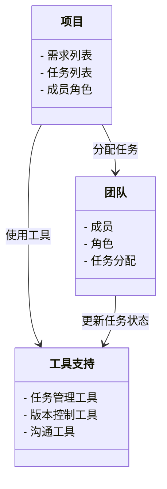

                 


# 如何评估企业的敏捷管理能力

> 关键词：企业敏捷管理、管理能力评估、敏捷管理模型、系统架构设计、项目实战

> 摘要：本文详细介绍了如何评估企业的敏捷管理能力，从基本概念到评估模型，从系统分析到项目实战，结合具体案例和数学模型，为企业管理者提供实用的评估方法和工具。

---

# 第一部分: 企业敏捷管理能力概述

## 第1章: 敏捷管理的基本概念

### 1.1 敏捷管理的起源与背景

#### 1.1.1 敏捷管理的起源
敏捷管理起源于软件开发领域，最早由Kent Beck等人在2001年提出的《敏捷宣言》中定义。敏捷管理强调快速响应变化、迭代开发和团队协作，其核心理念是“增量式交付”和“客户合作”。

#### 1.1.2 敏捷管理的核心理念
敏捷管理的核心理念包括：
1. **用户参与**：客户和开发团队紧密合作，确保产品符合需求。
2. **迭代开发**：将项目分解为小的、可管理的迭代周期（如Sprint），每个周期结束时交付可用的增量。
3. **持续改进**：通过回顾和调整不断优化过程和结果。
4. **适应性**：能够快速应对需求和技术的变化。

#### 1.1.3 敏捷管理与传统管理的区别
敏捷管理与传统管理的区别主要体现在以下几个方面：
- **目标**：敏捷管理注重快速交付和适应变化，传统管理注重计划和控制。
- **组织结构**：敏捷管理强调扁平化和自组织团队，传统管理强调严格的层级结构。
- **沟通方式**：敏捷管理强调持续的客户参与和团队协作，传统管理强调正式的报告和层级汇报。

### 1.2 企业敏捷管理能力的定义

#### 1.2.1 敏捷管理能力的内涵
敏捷管理能力是指企业在复杂多变的环境中，通过快速响应、迭代开发和团队协作，实现高效交付和持续改进的能力。

#### 1.2.2 敏捷管理能力的外延
敏捷管理能力不仅包括软件开发过程，还涉及组织架构、团队文化、技术工具等多个方面。

#### 1.2.3 敏捷管理能力的核心要素
敏捷管理能力的核心要素包括：
1. **组织架构**：扁平化、跨职能的团队结构。
2. **团队协作**：强调沟通、信任和自组织。
3. **技术工具**：支持敏捷开发的工具和流程（如Jira、Trello、Git等）。
4. **文化**：鼓励创新、快速学习和持续改进的文化氛围。

## 第2章: 敏捷管理能力的背景与问题背景

### 2.1 当前企业面临的管理挑战

#### 2.1.1 传统管理的局限性
传统管理方法在面对快速变化的市场环境时，往往显得不够灵活，难以快速响应客户需求和技术变革。

#### 2.1.2 数字化转型对企业管理的新要求
数字化转型要求企业具备快速迭代、数据驱动和高度协作的能力，这些能力是传统管理方法难以满足的。

#### 2.1.3 敏捷管理的必要性
在数字化转型的背景下，企业需要一种更加灵活、高效的管理方式来应对复杂的变化，敏捷管理因此成为必要选择。

### 2.2 问题描述与解决思路

#### 2.2.1 问题背景分析
企业在传统管理下常常面临以下问题：
- 项目交付周期长，难以快速响应市场变化。
- 团队协作效率低，存在信息孤岛。
- 需求变更时，调整成本高，难以快速适应。

#### 2.2.2 问题解决的思路
敏捷管理通过以下方式解决上述问题：
- **快速迭代**：将项目分解为小的、可管理的增量，快速交付和调整。
- **持续反馈**：通过客户参与和持续反馈优化产品和流程。
- **灵活调整**：在每个迭代周期结束时评估进展，快速调整计划。

#### 2.2.3 敏捷管理能力提升的必要性
提升敏捷管理能力是企业在数字化转型中保持竞争力的关键，能够帮助企业更快地响应市场需求，提高效率和客户满意度。

---

# 第二部分: 企业敏捷管理能力的评估模型

## 第3章: 敏捷管理能力评估的核心概念

### 3.1 敏捷管理能力的评估维度

#### 3.1.1 流程与组织架构
- **流程优化**：评估企业是否采用敏捷开发流程，如Scrum、Kanban等。
- **组织结构**：评估团队是否扁平化，是否支持跨职能协作。

#### 3.1.2 团队协作与沟通
- **团队协作效率**：评估团队成员之间的沟通是否顺畅，是否能够快速响应需求变化。
- **信任与自组织**：评估团队是否具备自组织能力，是否信任团队成员。

#### 3.1.3 技术与工具支持
- **工具支持**：评估企业是否采用支持敏捷开发的工具，如Jira、Trello、Git等。
- **技术架构**：评估技术架构是否支持快速迭代和灵活调整。

### 3.2 评估模型的构建与分析

#### 3.2.1 评估模型的构建方法
敏捷管理能力评估模型的构建方法包括：
1. **确定评估维度**：如流程、组织、团队、技术等。
2. **定义评估指标**：为每个维度定义具体的评估指标。
3. **权重分配**：根据每个维度的重要程度分配权重。

#### 3.2.2 评估模型的属性特征对比
以下是敏捷管理能力评估模型的属性特征对比表：

| 维度         | 特性                     | 重要性 |
|--------------|--------------------------|--------|
| 流程与组织   | 是否采用敏捷流程         | 高     |
|              | 是否支持快速迭代         | 高     |
| 团队协作     | 团队成员之间的沟通效率   | 中高   |
|              | 团队的自组织能力         | 中高   |
| 技术与工具   | 是否采用支持敏捷的工具     | 高     |
|              | 技术架构的灵活性         | 中高   |

#### 3.2.3 实体关系图（ER图）架构

```mermaid
erDiagram
    actor 顾客
    actor 开发团队
    actor 产品负责人
    actor 敏捷教练
    class 项目
    class 敏捷流程
    class 工具支持
    class 技术架构
    顾客 --> 项目: 提出需求
    开发团队 --> 项目: 执行开发
    产品负责人 --> 项目: 确定需求优先级
    敏捷教练 --> 项目: 指导敏捷流程
    项目 --> 敏捷流程: 采用敏捷流程
    项目 --> 工具支持: 使用工具支持
    项目 --> 技术架构: 采用技术架构
```

## 第4章: 敏捷管理能力评估的数学模型与公式

### 4.1 数学模型的建立

#### 4.1.1 模型的假设与约束条件
- 假设：企业采用敏捷开发流程。
- 约束条件：评估维度包括流程、团队、技术和工具支持。

#### 4.1.2 模型的数学表达式
敏捷管理能力评估模型可以表示为：
$$
\text{敏捷管理能力} = \sum_{i=1}^{n} w_i \times s_i
$$
其中，$w_i$ 是第$i$个评估维度的权重，$s_i$ 是第$i$个评估维度的评分。

#### 4.1.3 模型的验证与优化
通过实际案例验证模型的有效性，并根据反馈调整权重和评估指标。

### 4.2 评估指标的权重分配

#### 4.2.1 指标的权重计算方法
权重计算方法包括：
1. **层次分析法（AHP）**：通过比较判断矩阵计算权重。
2. **专家评分法**：邀请专家对各维度的重要性进行评分，计算平均值。

#### 4.2.2 指标的权重分配案例
假设评估维度为流程（权重0.4）、团队协作（权重0.3）、技术和工具支持（权重0.3）。

---

## 第5章: 敏捷管理能力评估的算法原理

### 5.1 算法原理的概述

#### 5.1.1 算法的基本原理
敏捷管理能力评估算法的基本原理是通过多维度评估和加权计算，得出企业的敏捷管理能力评分。

#### 5.1.2 算法的输入与输出
- 输入：各评估维度的评分和权重。
- 输出：企业的敏捷管理能力总评分。

#### 5.1.3 算法的流程图

```mermaid
graph TD
    A[开始] --> B[初始化评估维度]
    B --> C[输入各维度评分]
    C --> D[计算各维度加权得分]
    D --> E[总评分 = Σ(权重 × 评分)]
    E --> F[输出总评分]
    F --> G[结束]
```

### 5.2 算法的实现与代码

#### 5.2.1 算法的Python实现

```python
def agile_management_capability(assessment_dimensions, weights):
    # 计算加权得分
    weighted_scores = {dim: score * weight for dim, score, weight in zip(
        assessment_dimensions.keys(), 
        assessment_dimensions.values(), 
        weights
    )}
    # 计算总评分
    total_score = sum(weighted_scores.values())
    return total_score

# 示例用法
assessment_dimensions = {
    '流程': 0.8,
    '团队协作': 0.7,
    '技术和工具支持': 0.6
}
weights = [0.4, 0.3, 0.3]
print(agile_management_capability(assessment_dimensions, weights))
```

#### 5.2.2 代码的详细解读
上述代码定义了一个计算敏捷管理能力评分的函数，输入为评估维度的评分和权重，输出为总评分。代码首先计算每个维度的加权得分，然后求和得到总评分。

---

# 第三部分: 企业敏捷管理能力的系统分析与架构设计

## 第6章: 系统分析与架构设计

### 6.1 项目背景与目标

#### 6.1.1 项目背景介绍
假设某企业希望评估其敏捷管理能力，以便优化现有的管理流程和技术架构。

#### 6.1.2 项目目标
- 评估现有敏捷管理能力。
- 找出存在的问题和改进点。
- 制定改进计划。

### 6.2 系统功能设计

#### 6.2.1 领域模型设计



---

## 第7章: 项目实战

### 7.1 环境安装与配置

#### 7.1.1 环境要求
- 操作系统：Windows/Mac/Linux
- 开发工具：Jira、Git、Docker等
- 语言与框架：Python、Django等

#### 7.1.2 工具安装
安装Jira、Git、Docker等工具，并配置好环境变量。

### 7.2 系统核心实现源代码

#### 7.2.1 核心代码实现

```python
# 评估维度和权重
assessment_dimensions = {
    '流程': 0.8,
    '团队协作': 0.7,
    '技术和工具支持': 0.6
}
weights = [0.4, 0.3, 0.3]

# 计算总评分
total_score = sum([dim * weight for dim, weight in zip(assessment_dimensions.values(), weights)])
print(f"敏捷管理能力总评分：{total_score:.2f}")
```

---

## 第8章: 最佳实践与总结

### 8.1 最佳实践 tips

#### 8.1.1 评估过程中的注意事项
- 确保评估维度和权重的合理性。
- 通过实际案例验证模型的有效性。
- 定期回顾和优化评估模型。

#### 8.1.2 提升敏捷管理能力的建议
- 引入敏捷开发工具和流程。
- 培训团队成员，提升敏捷意识。
- 建立持续改进的文化。

### 8.2 总结

通过本文的详细讲解，我们了解了如何评估企业的敏捷管理能力，并掌握了具体的评估模型和方法。希望这些内容能够帮助企业更好地提升敏捷管理能力，应对数字化转型的挑战。

---

以上是文章的完整目录和内容框架，涵盖了从基本概念到具体实现的全过程，结合了理论与实践，为企业管理者提供了实用的评估方法和工具。

