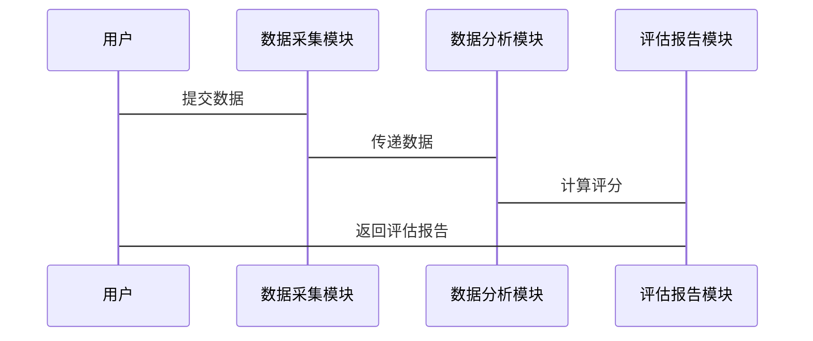

                 


# 如何评估企业的数据安全能力

## 关键词：
数据安全、企业安全、安全评估、风险管理、能力评估、安全框架、安全策略

## 摘要：
企业数据安全能力评估是保障企业数据资产安全的重要手段。本文从数据安全的基本概念出发，分析了企业数据安全面临的主要挑战，并提出了数据安全能力评估的核心框架与方法。通过理论与实践相结合的方式，详细讲解了数据安全能力评估的数学模型、算法原理、系统架构设计以及实际项目案例。本文旨在帮助企业全面了解自身数据安全能力，识别潜在风险，并采取有效的改进措施，从而构建一个安全可靠的数据防护体系。

---

## 第一部分：数据安全能力评估背景与核心概念

### 第1章：数据安全能力评估的背景与重要性

#### 1.1 数据安全的基本概念
##### 1.1.1 数据安全的定义
数据安全是指通过技术手段和管理措施，保护数据的机密性、完整性、可用性，防止数据被未经授权的访问、泄露、篡改或破坏。

##### 1.1.2 数据安全的核心要素
- **机密性（Confidentiality）**：确保只有授权人员能够访问数据。
- **完整性（Integrity）**：保证数据在存储和传输过程中不被篡改。
- **可用性（Availability）**：确保数据在需要时可以被访问。

##### 1.1.3 数据安全的重要性
随着企业数字化转型的推进，数据成为企业的核心资产。数据泄露、黑客攻击等安全事件频发，对企业声誉、经济损失和法律责任造成严重影响。数据安全能力评估是企业防范数据风险、保障数据资产安全的基础。

#### 1.2 企业数据安全面临的挑战
##### 1.2.1 数据泄露的现状与趋势
近年来，数据泄露事件频发，尤其是大型企业数据 breaches 对社会和经济造成的影响日益显著。

##### 1.2.2 数据安全威胁的多样化
- **外部威胁**：黑客攻击、钓鱼邮件、恶意软件等。
- **内部威胁**：员工误操作或恶意泄露数据。
- **供应链风险**：第三方供应商的安全漏洞可能影响企业数据安全。

##### 1.2.3 数据安全治理的复杂性
- 数据分布广泛，涉及多个部门和系统。
- 数据分类和分级标准不统一。
- 安全策略和制度执行不力。

#### 1.3 数据安全能力评估的意义
##### 1.3.1 企业数据安全能力评估的目标
- 识别数据安全风险。
- 量化数据安全能力水平。
- 制定改进计划，提升数据安全能力。

##### 1.3.2 评估数据安全能力的必要性
- 保障企业核心资产的安全。
- 符合监管要求，避免法律风险。
- 提高企业竞争力和客户信任度。

##### 1.3.3 数据安全能力评估的边界与外延
- 数据安全能力评估的范围包括数据生命周期的各个阶段（收集、存储、处理、传输、销毁）。
- 外延涉及技术、管理、人员等多个方面。

---

## 第2章：数据安全能力评估的核心概念与框架

### 2.1 数据安全能力评估的框架
#### 2.1.1 数据安全能力评估的模型
- **数据生命周期模型**：从数据的产生到销毁，评估每个阶段的安全能力。
- **风险管理模型**：基于风险评估的结果，制定相应的安全策略。

#### 2.1.2 数据安全能力评估的维度
- **技术维度**：包括数据加密、访问控制、安全检测等技术能力。
- **管理维度**：包括安全政策、制度、人员培训等管理能力。
- **人员维度**：包括员工的安全意识、技能水平等。

#### 2.1.3 数据安全能力评估的流程
1. 确定评估目标和范围。
2. 收集数据和相关信息。
3. 识别和分析风险。
4. 评估数据安全能力。
5. 制定改进计划。

### 2.2 数据安全能力评估的核心要素
#### 2.2.1 数据分类与分级
- **数据分类**：根据数据的类型（如个人信息、商业机密）进行分类。
- **数据分级**：根据数据的重要性（如低、中、高）进行分级。
- **分类与分级的意义**：明确数据的保护级别，制定差异化的安全策略。

#### 2.2.2 安全策略与制度
- **安全策略**：企业层面的安全管理制度和规范。
- **制度执行**：确保安全策略的有效执行，建立奖惩机制。

#### 2.2.3 技术防护能力
- **加密技术**：数据在存储和传输过程中的加密保护。
- **访问控制**：基于角色的访问控制（RBAC）和最小权限原则。
- **安全检测**：实时监控数据安全事件，及时发现和响应。

#### 2.2.4 员工安全意识
- **培训与教育**：定期开展安全培训，提高员工的安全意识。
- **模拟演练**：通过模拟攻击场景，检验员工的安全应对能力。

#### 2.2.5 应急响应能力
- **应急预案**：制定数据泄露、系统瘫痪等突发事件的应对方案。
- **应急演练**：定期进行应急演练，确保团队能够快速响应。

---

## 第3章：数据安全能力评估的理论基础

### 3.1 数据安全风险评估理论
#### 3.1.1 风险评估的基本概念
- **风险**：数据可能遭受的威胁或损失。
- **风险评估**：识别、分析和量化数据安全风险的过程。

#### 3.1.2 风险评估的方法与模型
##### 3.1.2.1 基于概率的威胁评估模型
$$ P = P(T) \times P(A) $$
其中，\( P \) 是风险发生的概率，\( P(T) \) 是威胁发生的概率，\( P(A) \) 是攻击成功的概率。

##### 3.1.2.2 基于影响的威胁评估模型
$$ I = CV \times L $$
其中，\( I \) 是风险的影响，\( CV \) 是漏洞的存在性，\( L \) 是损失的严重程度。

#### 3.1.3 数据安全风险的量化方法
- **CVSS（通用漏洞评分系统）**：量化漏洞的严重性，帮助企业优先处理高风险漏洞。
- ** monetary loss estimation（损失估算）**：根据历史数据和风险模型，估算潜在的经济损失。

### 3.2 数据安全能力评估的数学模型
#### 3.2.1 数据安全能力评估的数学公式
$$ S = \sum_{i=1}^{n} w_i \times c_i $$
其中，\( S \) 是数据安全能力评分，\( w_i \) 是第 \( i \) 项的权重，\( c_i \) 是第 \( i \) 项的能力评分。

#### 3.2.2 数据安全能力评估的指标体系
- **技术指标**：加密算法强度、访问控制能力等。
- **管理指标**：安全策略完善性、制度执行情况等。
- **人员指标**：员工安全意识、培训覆盖率等。

#### 3.2.3 数据安全能力评估的权重分配
- **权重计算方法**：基于专家意见或历史数据，确定各项指标的权重。
- **权重调整**：根据企业的实际情况，动态调整各项指标的权重。

---

## 第4章：数据安全能力评估的算法原理

### 4.1 数据安全风险评估算法
#### 4.1.1 基于概率论的威胁评估算法
- **算法步骤**：
  1. 确定威胁源（如黑客、内部员工）。
  2. 评估威胁发生的概率。
  3. 计算攻击成功的概率。
  4. 结合威胁和漏洞，计算风险值。

- **示例代码**：
  ```python
  def calculate_risk(threats, vulnerabilities):
      risk = 0
      for threat in threats:
          prob_threat = threat['probability']
          prob_vulnerability = threat['vulnerability_probability']
          risk += prob_threat * prob_vulnerability
      return risk
  ```

#### 4.1.2 基于模糊逻辑的安全状态评估算法
- **模糊逻辑的基本概念**：将数据安全状态分为多个等级（如低、中、高），并根据模糊规则进行评估。
- **算法步骤**：
  1. 确定模糊规则。
  2. 计算每个规则的隶属度。
  3. 综合各规则的隶属度，得到最终的安全状态。

- **示例代码**：
  ```python
  def fuzzy_assessment(rules):
      assessment = 0
      for rule in rules:
          membership = rule['membership']
          assessment += membership
      return assessment / len(rules)
  ```

#### 4.1.3 基于机器学习的异常检测算法
- **算法步骤**：
  1. 数据预处理：清洗数据，提取特征。
  2. 训练模型：使用监督或无监督学习方法训练模型。
  3. 模型评估：测试模型的准确率、召回率等指标。
  4. 部署模型：实时监控数据流，发现异常行为。

- **示例代码**：
  ```python
  from sklearn.ensemble import IsolationForest

  # 训练模型
  model = IsolationForest(n_estimators=100, random_state=42)
  model.fit(X_train)

  # 预测异常
  y_pred = model.predict(X_test)
  ```

### 4.2 数据安全能力评估的实现步骤
#### 4.2.1 数据收集与预处理
- 数据来源：日志文件、安全设备、人员反馈等。
- 数据清洗：去除噪声数据，填补缺失值。

#### 4.2.2 数据特征提取
- 提取关键特征：如访问频率、登录地点、操作类型等。
- 特征选择：使用统计方法或机器学习方法选择重要特征。

#### 4.2.3 数据安全风险计算
- 使用数学模型计算数据安全风险。
- 结合权重分配，得到各项指标的风险值。

#### 4.2.4 数据安全能力评分
- 根据风险计算结果，综合各项指标的能力评分。
- 输出数据安全能力的整体评分。

---

## 第5章：数据安全能力评估的系统架构设计

### 5.1 数据安全能力评估系统概述
#### 5.1.1 系统目标与功能
- 目标：帮助企业全面评估数据安全能力，识别潜在风险。
- 功能：数据采集、风险评估、能力评分、报告生成。

#### 5.1.2 系统架构设计
- **分层架构**：数据采集层、数据处理层、用户界面层。
- **模块划分**：数据采集模块、数据分析模块、评估报告模块。

#### 5.1.3 系统模块划分
- 数据采集模块：负责收集数据。
- 数据分析模块：负责数据处理和评估计算。
- 评估报告模块：生成评估报告并输出结果。

### 5.2 数据安全能力评估系统的功能设计
#### 5.2.1 数据采集模块
- **功能**：采集企业内外部数据。
- **实现**：通过API接口或日志采集工具获取数据。

#### 5.2.2 数据分析模块
- **功能**：分析数据，计算风险和能力评分。
- **实现**：使用机器学习算法或统计方法进行分析。

#### 5.2.3 评估报告模块
- **功能**：生成评估报告，提供改进建议。
- **实现**：将评估结果以图表和文字形式展示。

#### 5.2.4 可视化展示模块
- **功能**：以图表形式展示数据安全能力评估结果。
- **实现**：使用数据可视化工具（如Tableau、Python的matplotlib库）。

### 5.3 数据安全能力评估系统的接口设计
#### 5.3.1 数据输入接口
- **输入格式**：支持CSV、JSON等格式。
- **接口描述**：通过API接收数据。

#### 5.3.2 数据处理接口
- **处理逻辑**：数据清洗、特征提取。
- **接口描述**：内部调用数据处理模块。

#### 5.3.3 评估结果输出接口
- **输出格式**：评估报告（PDF、Word）。
- **接口描述**：通过API返回评估结果。

### 5.4 数据安全能力评估系统的交互设计
#### 5.4.1 系统交互流程
1. 用户提交数据。
2. 系统接收数据并进行处理。
3. 系统计算数据安全能力评分。
4. 系统生成评估报告并反馈给用户。

#### 5.4.2 交互流程图（Mermaid）


---

## 第6章：数据安全能力评估的项目实战

### 6.1 项目背景与目标
#### 6.1.1 项目需求分析
- 某中型互联网企业，数据分布广泛，面临数据泄露风险。
- 需要评估数据安全能力，制定改进计划。

#### 6.1.2 项目目标设定
- 识别数据安全风险。
- 评估数据安全能力。
- 制定并实施改进措施。

#### 6.1.3 项目范围界定
- 数据范围：用户数据、业务数据、系统日志。
- 时间范围：3个月。

### 6.2 项目实施步骤
#### 6.2.1 数据收集与清洗
- **数据来源**：用户登录日志、交易记录、系统日志。
- **数据清洗**：去除重复数据、填补缺失值。

#### 6.2.2 数据分析与建模
- **数据分析**：使用Python进行数据清洗和特征提取。
- **建模**：基于机器学习算法，训练风险评估模型。

#### 6.2.3 评估结果输出
- **风险评估报告**：包括高、中、低风险的分布情况。
- **能力评分报告**：各项指标的能力评分及整体评分。

#### 6.2.4 评估报告撰写
- **报告内容**：风险分析、能力评估、改进建议。
- **报告格式**：PDF格式，附带图表说明。

### 6.3 项目案例分析
#### 6.3.1 某企业数据安全能力评估案例
- **案例背景**：某互联网企业，用户数据量大，面临数据泄露风险。
- **评估过程**：
  1. 数据分类与分级。
  2. 数据安全风险评估。
  3. 数据安全能力评分。
- **评估结果**：整体评分75分（满分100分），其中技术能力较强，但员工安全意识和应急响应能力较弱。

#### 6.3.2 改进建议
- **技术方面**：加强数据加密和访问控制。
- **管理方面**：完善安全制度，加强员工培训。
- **人员方面**：定期开展安全演练，提高员工安全意识。

### 6.4 项目小结
通过实际案例分析，验证了数据安全能力评估模型的有效性。企业可以根据评估结果，制定针对性的改进措施，提升整体数据安全能力。

---

## 第7章：总结与展望

### 7.1 总结
数据安全能力评估是企业数据安全管理的重要基础。本文从理论到实践，详细讲解了数据安全能力评估的核心概念、算法原理、系统架构设计以及项目实战。通过科学的方法和工具，企业可以准确识别数据安全风险，量化数据安全能力，制定有效的改进计划。

### 7.2 展望
随着数据安全威胁的不断演变，数据安全能力评估需要与时俱进，结合新的技术手段和管理方法。未来，可以探索以下方向：
- **人工智能技术**：利用AI技术提高风险评估的准确性。
- **区块链技术**：探索区块链在数据安全中的应用。
- **零信任架构**：采用零信任模型，提升数据访问控制能力。

---

通过以上章节内容，企业可以系统地评估自身的数据安全能力，识别潜在风险，并采取有效的改进措施，从而构建一个安全可靠的数据防护体系。

