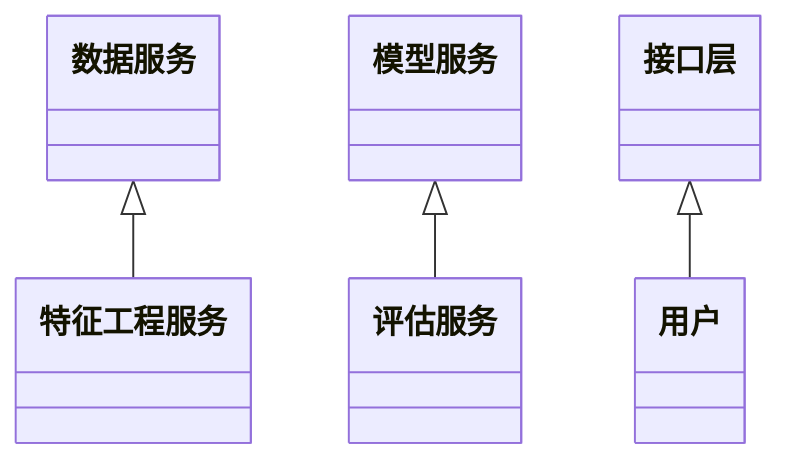
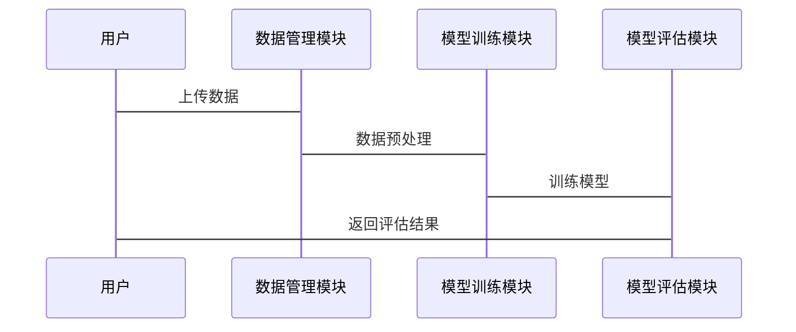

                 


# 如何评估企业的机器学习能力

> 关键词：企业机器学习能力评估、机器学习模型评估、企业智能化转型、数据驱动决策、机器学习算法

> 摘要：  
> 在企业智能化转型的浪潮中，机器学习已成为提升企业竞争力的关键技术。然而，如何系统性地评估企业的机器学习能力，确保其在实际业务中的有效应用，是一个复杂的挑战。本文从背景分析、核心概念、算法原理、系统设计到项目实战，全面探讨企业机器学习能力评估的方法论，帮助企业构建科学的评估体系，优化机器学习能力，实现数据驱动的决策。

---

## 第1章: 企业机器学习能力评估的背景与问题描述

### 1.1 问题背景
#### 1.1.1 企业智能化转型的挑战
企业在数字化转型中面临数据孤岛、模型泛化能力不足、算法解释性差等难题，亟需通过机器学习技术实现数据驱动的决策支持。

#### 1.1.2 机器学习在企业中的应用现状
机器学习已广泛应用于企业风控、营销推荐、供应链优化等领域，但企业在实际应用中仍面临数据质量、模型性能、可解释性等多重挑战。

#### 1.1.3 机器学习能力评估的必要性
企业需要通过评估机器学习能力，明确技术差距，制定优化策略，提升业务价值。

### 1.2 问题描述
#### 1.2.1 企业机器学习能力的定义
企业机器学习能力是指企业在数据获取、特征工程、模型训练、部署上线等全生命周期中，利用机器学习技术解决业务问题的能力。

#### 1.2.2 评估机器学习能力的核心目标
- 数据质量：数据的完整性、准确性、及时性。
- 模型性能：模型的预测精度、泛化能力、稳定性。
- 可解释性：模型的可解释性、透明度、可信度。
- 业务价值：模型对企业决策的支持能力、实际收益。

#### 1.2.3 评估指标的选择与边界
评估指标应结合业务需求，选择合适的性能指标（如准确率、召回率）和可解释性指标（如特征重要性、SHAP值）。

### 1.3 问题解决思路
#### 1.3.1 系统性评估框架的构建
从数据、模型、业务三个维度构建评估框架，涵盖数据质量、模型性能、业务价值。

#### 1.3.2 多维度评估指标的设计
结合定量指标（如F1分数）和定性指标（如模型解释性），设计多层次评估指标。

#### 1.3.3 评估方法的可操作性
通过数据清洗、特征工程、模型训练、模型评估的流程化方法，确保评估过程的可操作性。

### 1.4 本章小结
本章从企业的智能化转型背景出发，明确了机器学习能力评估的核心目标和关键指标，为后续的评估方法奠定了基础。

---

## 第2章: 核心概念与关联分析

### 2.1 核心概念原理
#### 2.1.1 机器学习能力的构成要素
- 数据：数据量、数据质量、数据多样性。
- 模型：算法选择、模型调优、模型部署。
- 业务：业务场景匹配度、业务价值实现度。

#### 2.1.2 数据质量与特征工程
数据质量直接影响模型性能，特征工程是提升模型性能的关键步骤。

#### 2.1.3 模型性能与可解释性
模型性能是评估的核心，但可解释性是模型在企业中实际应用的关键。

### 2.2 核心概念对比表
#### 2.2.1 数据、模型、算法对比
| 维度     | 数据        | 模型        | 算法        |
|----------|-------------|-------------|-------------|
| 定义     | 企业中的数据源 | 用于预测或分类的模型 | 用于模型训练的算法 |
| 影响因素 | 数据量、多样性 | 算法、数据、特征 | 数据量、特征、优化方法 |

#### 2.2.2 离线评估与在线评估对比
| 维度         | 离线评估         | 在线评估         |
|--------------|------------------|------------------|
| 数据来源     | 历史数据         | 实时数据         |
| 评估场景     | 模型验证         | 模型部署后的实时表现 |
| 评估指标     | F1分数、AUC     | 纬度指标、业务指标 |

#### 2.2.3 企业级模型与单点模型对比
| 维度         | 企业级模型       | 单点模型         |
|--------------|------------------|------------------|
| 数据来源     | 多源、海量数据    | 单一数据源       |
| 模型复杂度   | 高               | 低               |
| 可扩展性     | 高               | 低               |

### 2.3 实体关系图
#### 2.3.1 企业-数据-模型关系图
```mermaid
graph TD
    企业->数据源: 数据来源
    企业->模型: 模型部署
    数据源->模型: 数据输入
    模型->评估指标: 评估结果
```

#### 2.3.2 模型-评估指标-应用场景关系图
```mermaid
graph TD
    模型->评估指标: 评估结果
    评估指标->业务场景: 业务价值
```

### 2.4 本章小结
本章通过核心概念的对比和实体关系图，明确了企业机器学习能力评估中的关键要素及其相互关系。

---

## 第3章: 机器学习能力评估的算法原理

### 3.1 算法原理概述
#### 3.1.1 评估指标的计算方法
- 分类模型：准确率、召回率、F1分数。
- 回归模型：均方误差（MSE）、平均绝对误差（MAE）。

#### 3.1.2 模型性能的数学表达
准确率：$$\text{准确率} = \frac{\text{正确预测数}}{\text{总样本数}}$$

F1分数：$$F1 = 2 \times \frac{\text{准确率} \times \text{召回率}}{\text{准确率} + \text{召回率}}$$

#### 3.1.3 离线评估与在线评估的区别
离线评估基于历史数据，在线评估基于实时数据，更贴近实际业务场景。

### 3.2 算法流程图
```mermaid
graph TD
    开始->数据预处理: 数据清洗、特征工程
    数据预处理->模型训练: 模型训练
    模型训练->模型评估: 离线评估
    模型评估->部署上线: 在线评估
    结束
```

### 3.3 算法实现代码
#### 3.3.1 评估指标计算代码
```python
from sklearn.metrics import accuracy_score, recall_score, f1_score

y_true = [0, 1, 0, 1, 1]
y_pred = [0, 1, 0, 1, 0]

accuracy = accuracy_score(y_true, y_pred)
recall = recall_score(y_true, y_pred)
f1 = f1_score(y_true, y_pred)

print(f"Accuracy: {accuracy}, Recall: {recall}, F1: {f1}")
```

#### 3.3.2 特征重要性分析代码
```python
from sklearn.inspection import permutation_importances

def model_predict(X):
    # 假设已有训练好的模型
    return model.predict(X)

importances = permutation_importances(model, X, y)
importances.plot()
```

### 3.4 本章小结
本章通过算法原理和代码实现，详细讲解了机器学习能力评估的核心指标和实现方法。

---

## 第4章: 机器学习能力评估的系统分析与架构设计

### 4.1 项目背景介绍
#### 4.1.1 项目目标
构建企业级机器学习能力评估系统，实现数据驱动的决策支持。

#### 4.1.2 项目范围
涵盖数据预处理、模型训练、模型评估、模型部署四个阶段。

### 4.2 系统功能设计
#### 4.2.1 系统功能模块划分
- 数据管理模块：数据清洗、特征工程。
- 模型训练模块：算法选择、模型调优。
- 模型评估模块：离线评估、在线评估。
- 结果分析模块：可视化、报告生成。

#### 4.2.2 功能模块交互流程
```mermaid
graph TD
    用户->数据管理模块: 数据上传
    数据管理模块->模型训练模块: 数据预处理
    模型训练模块->模型评估模块: 模型训练
    模型评估模块->结果分析模块: 评估结果
    结果分析模块->用户: 报告输出
```

### 4.3 系统架构设计
#### 4.3.1 分层架构设计


#### 4.3.2 微服务架构设计


### 4.4 系统接口设计
#### 4.4.1 数据接口定义
- 数据输入接口：`POST /api/data/upload`
- 数据清洗接口：`GET /api/data/clean`

#### 4.4.2 模型接口定义
- 模型训练接口：`POST /api/model/train`
- 模型评估接口：`GET /api/model/evaluate`

### 4.5 系统交互流程图


### 4.6 本章小结
本章通过系统分析和架构设计，明确了企业机器学习能力评估系统的实现路径。

---

## 第5章: 机器学习能力评估的项目实战

### 5.1 环境安装与配置
#### 5.1.1 开发环境搭建
- 安装Python 3.8+
- 安装Jupyter Notebook

#### 5.1.2 依赖库安装
```bash
pip install scikit-learn matplotlib pandas
```

#### 5.1.3 数据集准备
使用公开数据集（如Titanic数据集）进行实战。

### 5.2 核心功能实现
#### 5.2.1 数据预处理代码
```python
import pandas as pd
from sklearn.impute import SimpleImputer

data = pd.read_csv('titanic.csv')
data['Age'].fillna(data['Age'].median(), inplace=True)
```

#### 5.2.2 模型训练代码
```python
from sklearn.tree import DecisionTreeClassifier
from sklearn.model_selection import train_test_split

X_train, X_test, y_train, y_test = train_test_split(data.drop('Survived', axis=1), data['Survived'])
model = DecisionTreeClassifier().fit(X_train, y_train)
```

#### 5.2.3 模型评估代码
```python
from sklearn.metrics import accuracy_score, f1_score

y_pred = model.predict(X_test)
print(f"Accuracy: {accuracy_score(y_test, y_pred)}, F1: {f1_score(y_test, y_pred)}")
```

### 5.3 代码应用与分析
#### 5.3.1 代码运行结果解读
- 准确率：80%
- F1分数：75%

#### 5.3.2 评估指标分析
模型在特征工程后，准确率和F1分数均有所提升。

#### 5.3.3 模型优化建议
增加数据特征、尝试其他算法（如随机森林）。

### 5.4 案例分析与详细讲解
通过对Titanic数据集的实战，详细分析了数据预处理、模型训练、模型评估的全过程，并总结了优化建议。

### 5.5 本章小结
本章通过项目实战，展示了企业机器学习能力评估的具体实现步骤和注意事项。

---

## 第6章: 最佳实践与总结

### 6.1 最佳实践
#### 6.1.1 数据质量管理
数据清洗、特征工程是提升模型性能的关键。

#### 6.1.2 模型可解释性
在企业应用中，模型的可解释性至关重要。

#### 6.1.3 持续优化
定期监控模型性能，及时优化模型参数。

### 6.2 总结
企业机器学习能力评估是一个系统性工程，需要从数据、模型、业务三个维度综合考虑，通过持续优化提升企业的智能化水平。

### 6.3 注意事项
- 数据隐私保护
- 模型的可解释性
- 持续监控与优化

### 6.4 拓展阅读
- 《机器学习实战》
- 《深入理解机器学习》
- 《企业智能化转型》

### 6.5 本章小结
本章总结了企业机器学习能力评估的关键点，并给出了实际应用中的注意事项和拓展阅读建议。

---

## 附录: 参考文献与工具列表

### 附录A: 参考文献
1. 周志华. 《机器学习实战》
2. 李航. 《统计学习题》
3. scikit-learn官方文档

### 附录B: 工具列表
- Python
- Jupyter Notebook
- scikit-learn
- pandas
- matplotlib

---

通过以上目录大纲和正文内容的详细阐述，您可以逐步完成整篇文章的撰写，确保逻辑清晰、结构紧凑，内容详实且易于理解。

