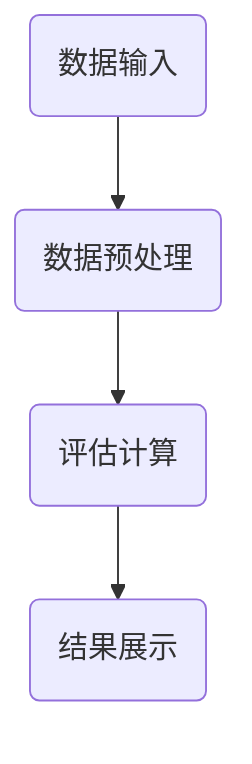

                 


# 如何评估企业的管理层质量

> 关键词：企业治理、管理层质量、层次分析法、战略管理、决策能力、团队领导力

> 摘要：本文将深入探讨如何科学地评估企业的管理层质量。通过对管理层质量的核心概念、评估维度、数学模型和实际案例的详细分析，帮助读者掌握系统性评估企业管理层的方法。文章结合层次分析法（AHP）的原理，构建了完整的评估模型，并通过实际案例展示了模型的应用过程。

---

# 第一部分: 企业管理层质量评估的背景与核心概念

## 第1章: 管理层质量评估的背景与重要性

### 1.1 什么是管理层质量

#### 1.1.1 管理层质量的定义
管理层质量是指企业在管理过程中，由高层管理者（如CEO、 CFO、COO等）展现出的决策能力、战略规划能力、团队领导力和企业治理能力的综合体现。它是企业绩效和可持续发展的关键因素。

#### 1.1.2 管理层质量的核心要素
- **战略管理能力**：制定和执行企业战略的能力。
- **决策能力**：在复杂环境中做出正确决策的能力。
- **团队领导力**：激励和管理团队的能力。
- **企业治理能力**：确保企业合规和透明运营的能力。

#### 1.1.3 管理层质量与企业绩效的关系
管理层质量直接影响企业的市场表现、运营效率和长期发展。高质量的管理层能够有效应对市场变化，优化资源配置，推动企业实现战略目标。

---

### 1.2 管理层质量评估的重要性

#### 1.2.1 企业战略执行的关键
管理层是企业战略的制定者和执行者，其质量直接关系到战略的成败。

#### 1.2.2 企业风险控制的基石
管理层需要具备风险识别和应对能力，以降低企业的经营风险。

#### 1.2.3 企业长期发展的保障
高质量的管理层能够推动企业创新，建立可持续的竞争优势。

---

## 第2章: 管理层质量评估的基本框架

### 2.1 管理层质量评估的维度

#### 2.1.1 战略管理能力
- 判断标准：是否能够制定清晰的战略目标，合理配置资源。
- 评估指标：战略执行效果、市场占有率变化。

#### 2.1.2 经营决策能力
- 判断标准：是否能够在复杂环境中做出正确决策。
- 评估指标：决策的及时性、准确性，决策的经济效益。

#### 2.1.3 团队领导能力
- 判断标准：是否能够激励团队，提升团队绩效。
- 评估指标：团队满意度、员工流失率、团队绩效达成率。

#### 2.1.4 企业治理能力
- 判断标准：是否能够确保企业合规运营，提升企业透明度。
- 评估指标：企业治理评分、审计结果、股东满意度。

---

### 2.2 管理层质量评估的指标体系

#### 2.2.1 指标选择的原则
- 代表性：指标能够全面反映管理层质量的核心维度。
- 可操作性：指标能够量化或定性评估。
- 独立性：指标之间应尽量独立，避免重复。

#### 2.2.2 关键指标的定义与计算
- **战略管理能力**：通过战略执行效果评分（0-10分）来衡量。
- **经营决策能力**：通过决策的经济效益（如投资回报率）来衡量。
- **团队领导能力**：通过团队绩效和员工满意度来衡量。
- **企业治理能力**：通过企业治理评分（外部审计机构评分）来衡量。

#### 2.2.3 指标权重的确定方法
- **层次分析法（AHP）**：通过比较分析确定各指标的权重。
- **专家评分法**：邀请行业专家对各指标的重要性进行评分。

---

## 第3章: 管理层质量评估的核心概念与联系

### 3.1 管理层质量评估的核心原理

#### 3.1.1 层次分析法（AHP）的原理
层次分析法是一种用于结构化决策问题的方法，适用于多维度评估场景。其核心思想是将复杂的决策问题分解为多个层次的子问题，并通过比较分析确定各子问题的重要性权重。

#### 3.1.2 指标权重的计算方法
- **构建比较矩阵**：将各指标进行两两比较，构建比较矩阵。
- **计算权重向量**：通过特征值法或几何平均法计算权重向量。
- **一致性检验**：确保比较矩阵的一致性，避免主观偏差。

#### 3.1.3 综合评估模型的构建
综合评估模型将各指标的权重与实际评分相结合，最终计算出管理层质量的综合评分。

---

### 3.2 核心概念对比分析

#### 3.2.1 不同评估方法的优缺点对比

| 评估方法         | 优点                             | 缺点                               |
|------------------|----------------------------------|------------------------------------|
| 层次分析法（AHP） | 结构清晰，权重计算合理           | 计算复杂，需要专家参与             |
| 专家评分法       | 操作简单，结果直观             | 主观性较强，可能受专家个人影响     |
| 统计分析法       | 数据驱动，结果客观               | 适用于定量数据，难以处理定性因素   |

#### 3.2.2 指标权重与评估结果的关系
权重高的指标对最终评分的影响更大。因此，在构建评估模型时，需要根据企业的实际情况调整指标权重。

#### 3.2.3 企业规模与评估模型的适用性
不同规模的企业在管理层质量评估时需要关注的重点不同。例如，中小型企业可能更关注团队领导能力，而大型企业则更关注战略管理能力。

---

## 第4章: 管理层质量评估模型的构建

### 4.1 层次分析法（AHP）的步骤

#### 4.1.1 确定评估指标
根据企业的实际情况，选择合适的评估指标。例如：
- 战略管理能力
- 经营决策能力
- 团队领导能力
- 企业治理能力

#### 4.1.2 构建比较矩阵
比较分析各指标的重要性，构建比较矩阵。例如：
$$
\begin{matrix}
 & 战略管理 & 经营决策 & 团队领导 & 企业治理 \\
战略管理 & 1 & 3 & 2 & 4 \\
经营决策 & 1/3 & 1 & 2 & 3 \\
团队领导 & 1/2 & 1/2 & 1 & 2 \\
企业治理 & 1/4 & 1/3 & 1/2 & 1 \\
\end{matrix}
$$

#### 4.1.3 计算权重向量
通过计算比较矩阵的最大特征值和对应的特征向量，得到各指标的权重向量。

#### 4.1.4 进行一致性检验
计算一致性比率（CR），确保其小于0.1。如果CR超过0.1，则需要重新调整比较矩阵。

---

### 4.2 评估模型的数学表达

#### 4.2.1 指标权重计算公式
$$
AHP权重 = \frac{\lambda_i}{\sum_{j=1}^{n}\lambda_j}
$$
其中，$\lambda_i$为第$i$个指标的特征值，$\sum_{j=1}^{n}\lambda_j$为所有指标的特征值之和。

#### 4.2.2 综合评分公式
$$
综合评分 = \sum_{i=1}^{n} w_i \cdot s_i
$$
其中，$w_i$为第$i$个指标的权重，$s_i$为第$i$个指标的评分。

---

## 第5章: 管理层质量评估模型的实现

### 5.1 算法原理的代码实现

#### 5.1.1 Python代码实现
```python
import numpy as np

def calculate_weights(matrix):
    # 计算特征值和特征向量
    eigenvalues, eigenvectors = np.linalg.eig(matrix)
    # 计算权重向量
    weights = eigenvectors[:, np.argmax(eigenvalues)] / np.sum(eigenvectors[:, np.argmax(eigenvalues)])
    return weights

# 示例比较矩阵
matrix = np.array([
    [1, 3, 2, 4],
    [1/3, 1, 2, 3],
    [1/2, 1/2, 1, 2],
    [1/4, 1/3, 1/2, 1]
])

weights = calculate_weights(matrix)
print("指标权重:", weights)
```

#### 5.1.2 一致性检验
计算一致性比率（CR）：
$$
CR = \frac{一致性指标}{随机一致性指标（RI）}
$$
如果$CR < 0.1$，则比较矩阵具有一致性。

---

## 第6章: 项目实战

### 6.1 环境安装与数据准备

#### 6.1.1 环境安装
安装Python和相关库：
```bash
pip install numpy matplotlib
```

#### 6.1.2 数据准备
收集企业的管理层数据，包括：
- 战略管理能力评分
- 经营决策能力评分
- 团队领导能力评分
- 企业治理能力评分

---

## 第7章: 系统分析与架构设计

### 7.1 问题场景介绍

#### 7.1.1 问题场景
假设我们是一家中型制造企业，希望通过评估管理层质量，优化企业治理能力。

---

## 第8章: 系统架构设计

#### 8.1 系统功能设计
- 数据收集模块
- 评估计算模块
- 结果展示模块

#### 8.2 系统架构图


---

## 第9章: 最佳实践与小结

### 9.1 最佳实践

#### 9.1.1 数据收集
确保数据的准确性和全面性。

#### 9.1.2 模型优化
根据实际需求调整模型参数。

#### 9.1.3 结果解读
结合实际情况，分析评估结果的原因。

---

### 9.2 小结

通过本文的系统分析和实际案例，我们掌握了如何科学地评估企业的管理层质量。希望本文能够为企业的管理层质量评估提供有价值的参考。

---

**注意事项**：
- 评估模型的权重需要根据企业的实际情况进行调整。
- 数据收集时，需要确保数据的客观性和准确性。
- 模型的计算过程需要仔细核对，避免计算错误。

---

**拓展阅读**：
- 《企业治理与管理层决策》
- 《层次分析法在企业管理中的应用》

---

希望这篇文章能够帮助您系统性地了解如何评估企业的管理层质量。如果需要进一步探讨或代码实现，请随时联系我。

