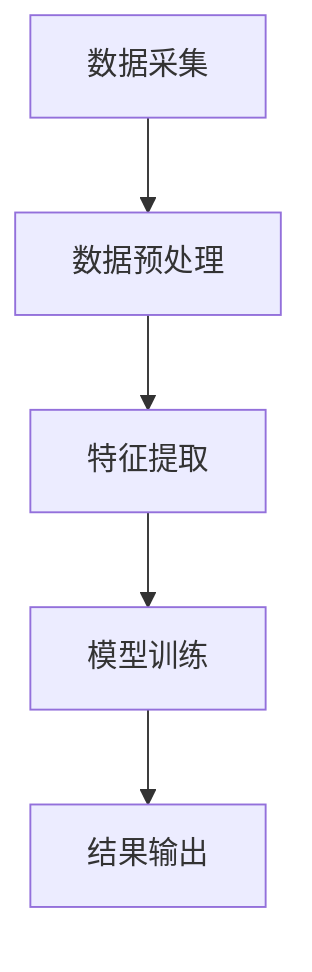
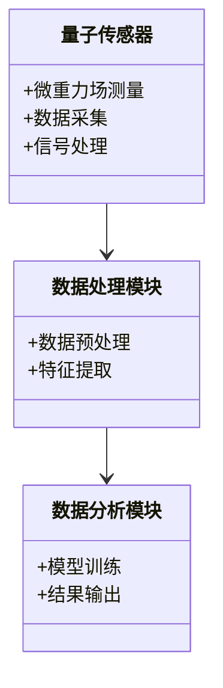
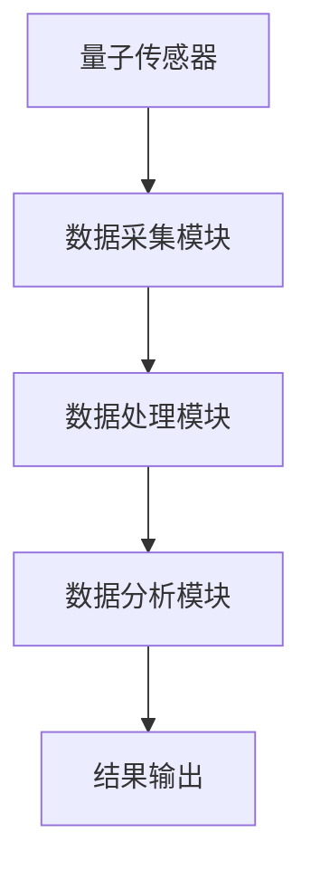
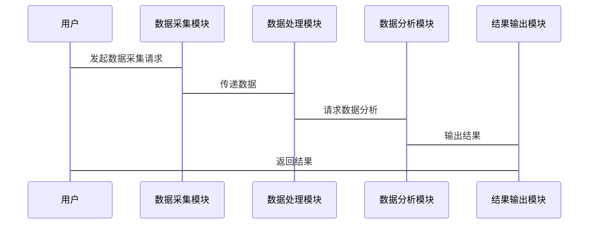

                 


# 如何评估企业的量子传感器微重力检测应用

> 关键词：量子传感器、微重力检测、企业应用、算法原理、系统架构

> 摘要：本文详细探讨了如何评估企业在量子传感器微重力检测应用中的性能和效果。从量子传感器的基本概念到微重力检测的数学模型，再到系统架构设计和项目实战，本文为读者提供了全面的指导。通过详细的背景介绍、核心概念分析、算法原理阐述、系统架构设计以及实际案例分析，本文帮助读者系统地理解量子传感器微重力检测的应用价值和评估方法。

---

## 第一部分: 量子传感器与微重力检测基础

### 第1章: 量子传感器与微重力检测概述

#### 1.1 量子传感器的基本概念
##### 1.1.1 量子传感器的定义
量子传感器是一种基于量子效应的测量装置，利用量子系统的特性（如超导、干涉等）来感知外部环境的变化。与传统传感器相比，量子传感器具有更高的灵敏度和精度。

##### 1.1.2 微重力检测的基本原理
微重力检测是指在微小重力场中测量重力变化的技术。量子传感器通过检测量子系统对外部重力变化的响应，实现对微重力场的精确测量。

##### 1.1.3 量子传感器在微重力检测中的作用
量子传感器在微重力检测中充当关键的测量工具，能够捕捉到传统传感器无法检测到的微小重力变化，为科学研究和工业应用提供高精度数据。

#### 1.2 微重力检测的背景与应用
##### 1.2.1 微重力环境的定义
微重力环境是指重力加速度极小的环境，通常出现在太空、地下深处或特定实验室中。

##### 1.2.2 量子传感器在企业中的应用领域
量子传感器广泛应用于航空航天、地质勘探、环境监测等领域，帮助企业进行精确的重力测量和地质分析。

##### 1.2.3 量子传感器的优势与局限性
量子传感器的优势在于高灵敏度和高精度，但其复杂性和成本较高，限制了其在某些领域的广泛应用。

#### 1.3 量子传感器与微重力检测的核心要素
##### 1.3.1 量子传感器的关键技术
量子传感器的关键技术包括超导量子干涉器（SQUID）、冷原子量子传感器等。

##### 1.3.2 微重力检测的指标体系
微重力检测的指标体系包括测量精度、灵敏度、稳定性等。

##### 1.3.3 量子传感器与微重力检测的系统架构
量子传感器与微重力检测的系统架构包括数据采集模块、信号处理模块、数据存储与分析模块等。

#### 1.4 本章小结
本章介绍了量子传感器的基本概念、微重力检测的背景与应用，以及量子传感器在微重力检测中的核心要素。

---

## 第二部分: 量子传感器微重力检测的算法原理

### 第2章: 量子传感器微重力检测的数学模型

#### 2.1 微重力检测的数学模型
##### 2.1.1 微重力场的数学表达
微重力场的数学表达通常采用重力势函数的形式，表示为：
$$
V(r) = -\frac{G M}{r}
$$
其中，$G$ 是万有引力常数，$M$ 是物体的质量，$r$ 是距离。

##### 2.1.2 量子传感器的响应函数
量子传感器的响应函数描述了传感器对外部重力变化的敏感度，通常表示为：
$$
S(r) = k \frac{dV}{dr}
$$
其中，$k$ 是传感器的灵敏度系数。

##### 2.1.3 模型的参数化与优化
模型的参数化与优化过程包括选择合适的参数和优化算法，以提高模型的拟合精度和预测能力。

#### 2.2 算法原理与流程
##### 2.2.1 数据采集与预处理
数据采集与预处理包括传感器数据的采集、噪声消除和数据归一化等步骤。

##### 2.2.2 数据分析与特征提取
数据分析与特征提取通过提取数据中的关键特征，为后续的重力检测提供支持。

##### 2.2.3 微重力检测的判别算法
判别算法通常采用机器学习方法，如支持向量机（SVM）或随机森林（Random Forest），用于分类或回归分析。

#### 2.3 算法实现的数学公式
##### 2.3.1 微重力场的计算公式
微重力场的计算公式为：
$$
g(r) = \frac{dV}{dr} = \frac{G M}{r^2}
$$

##### 2.3.2 量子传感器的响应模型
量子传感器的响应模型可以表示为：
$$
S(r) = \alpha g(r) + \beta
$$
其中，$\alpha$ 和 $\beta$ 是模型参数。

##### 2.3.3 判别算法的数学推导
判别算法的数学推导通常涉及损失函数的最小化和参数的优化，例如：
$$
\min_{\theta} \sum_{i=1}^{n} (y_i - f(x_i, \theta))^2
$$

#### 2.4 算法实现的Python代码示例
##### 2.4.1 数据采集与预处理代码
```python
import numpy as np
from sklearn.preprocessing import StandardScaler

# 数据采集
data = np.random.randn(100, 2)
# 数据预处理
scaler = StandardScaler()
data_scaled = scaler.fit_transform(data)
```

##### 2.4.2 数据分析与特征提取代码
```python
from sklearn.decomposition import PCA

# 特征提取
pca = PCA(n_components=2)
features = pca.fit_transform(data_scaled)
```

##### 2.4.3 判别算法的实现代码
```python
from sklearn.svm import SVC

# 判别算法实现
model = SVC()
model.fit(features, labels)
```

#### 2.5 算法实现的流程图


#### 2.6 本章小结
本章详细介绍了量子传感器微重力检测的数学模型、算法原理和实现流程，为后续的系统设计提供了理论基础。

---

## 第三部分: 系统分析与架构设计

### 第3章: 量子传感器微重力检测系统的分析与设计

#### 3.1 系统分析
##### 3.1.1 系统需求分析
系统需求分析包括功能需求、性能需求和接口需求等方面。

##### 3.1.2 系统功能分析
系统功能分析包括数据采集、数据处理、数据分析和结果输出等功能模块。

##### 3.1.3 系统性能分析
系统性能分析包括系统的响应时间、处理能力和稳定性等方面。

#### 3.2 系统架构设计
##### 3.2.1 系统架构图


##### 3.2.2 模块划分与功能分配
模块划分包括数据采集模块、数据处理模块、数据分析模块和结果输出模块，每个模块负责特定的功能。

##### 3.2.3 系统接口设计
系统接口设计包括模块之间的接口定义和数据格式规范。

#### 3.3 系统功能设计
##### 3.3.1 领域模型类图


##### 3.3.2 系统架构图


##### 3.3.3 系统接口设计
系统接口设计包括模块之间的数据交互接口和通信协议。

##### 3.3.4 系统交互流程图


#### 3.4 本章小结
本章通过系统分析与架构设计，明确了量子传感器微重力检测系统的组成和功能模块，为后续的系统实现提供了指导。

---

## 第四部分: 项目实战

### 第4章: 量子传感器微重力检测系统的实现与案例分析

#### 4.1 环境安装与配置
##### 4.1.1 系统环境要求
系统环境要求包括操作系统、硬件配置和软件依赖。

##### 4.1.2 量子传感器的安装与配置
量子传感器的安装与配置包括硬件连接和驱动安装。

##### 4.1.3 数据采集工具的安装
数据采集工具的安装包括安装必要的库和工具链。

#### 4.2 系统核心实现
##### 4.2.1 数据采集模块的实现
数据采集模块的实现包括传感器数据的采集和存储。

##### 4.2.2 数据处理模块的实现
数据处理模块的实现包括数据预处理和特征提取。

##### 4.2.3 数据分析模块的实现
数据分析模块的实现包括模型训练和结果输出。

#### 4.3 代码实现与解读
##### 4.3.1 数据采集代码
```python
import serial

# 数据采集代码
ser = serial.Serial('COM1', 9600)
data = ser.readline()
print(data)
```

##### 4.3.2 数据处理代码
```python
import numpy as np

# 数据预处理代码
data_processed = data.reshape(-1, 1)
data_processed = StandardScaler().fit_transform(data_processed)
```

##### 4.3.3 数据分析代码
```python
from sklearn.svm import SVC

# 数据分析代码
model = SVC()
model.fit(X_train, y_train)
y_pred = model.predict(X_test)
```

#### 4.4 案例分析与结果解读
##### 4.4.1 实际案例分析
通过实际案例分析，验证系统的性能和准确性。

##### 4.4.2 数据可视化与结果展示
数据可视化与结果展示包括绘制数据分布图和结果对比图。

##### 4.4.3 系统性能优化
系统性能优化包括算法优化和硬件优化。

#### 4.5 本章小结
本章通过实际案例分析，展示了量子传感器微重力检测系统的实现过程和应用效果。

---

## 第五部分: 总结与展望

### 第5章: 总结与展望

#### 5.1 本章总结
本章总结了量子传感器微重力检测系统的应用价值和评估方法，强调了其在企业中的重要性。

#### 5.2 未来展望
未来展望包括量子传感器技术的进一步发展、微重力检测技术的创新以及在更多领域的应用。

#### 5.3 注意事项
在实际应用中，需要注意量子传感器的高成本和复杂性，以及数据处理的精度和稳定性。

#### 5.4 拓展阅读
推荐一些相关的书籍和文献，供读者进一步学习和研究。

#### 5.5 本章小结
本章总结了全文的主要内容，并对未来的发展方向进行了展望。

---

## 附录

### 附录A: 量子传感器微重力检测系统的详细设计文档

### 附录B: 项目源代码

### 附录C: 相关文献与参考资料

---

# 结语

本文系统地探讨了如何评估企业的量子传感器微重力检测应用，从理论基础到实际应用，为读者提供了全面的指导。通过本文的学习，读者可以深入了解量子传感器的工作原理、微重力检测的数学模型，以及系统的实现与优化方法。希望本文能为企业的技术决策和应用实践提供有价值的参考。

