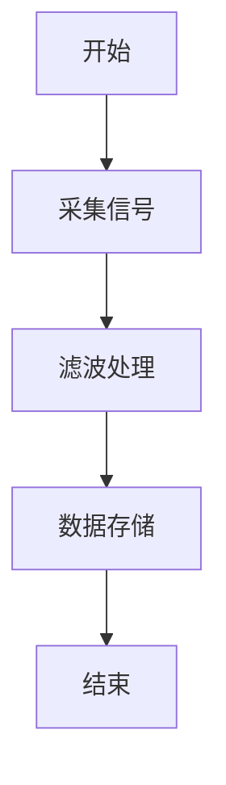
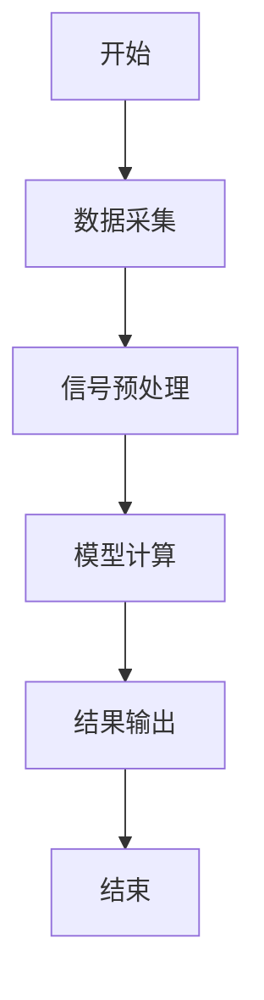
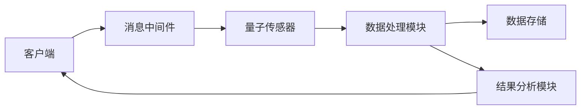
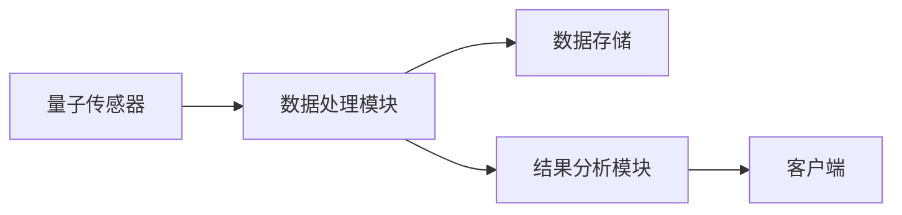
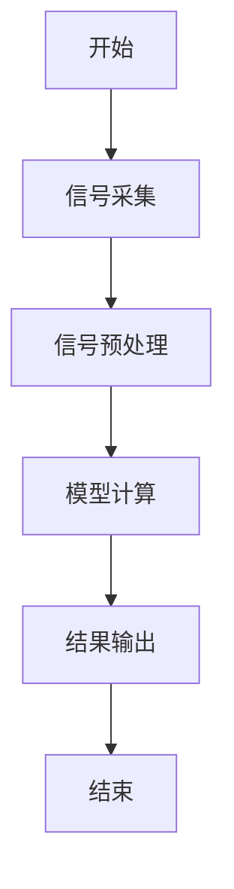

                 


# 如何评估企业的量子传感器微重力检测应用

## 关键词：
- 量子传感器
- 微重力检测
- 企业应用
- 技术评估
- 数据分析

## 摘要：
本文将详细探讨如何评估企业在量子传感器微重力检测中的应用。通过介绍量子传感器的基本原理、分析微重力检测的数学模型、设计系统架构，并结合实际案例，本文将为企业提供一套完整的评估方法，帮助企业在复杂环境中优化传感器性能，确保数据的准确性和可靠性。

---

## 目录大纲

### 第一部分：量子传感器微重力检测应用概述

#### 第1章：量子传感器与微重力检测背景介绍

- **1.1 量子传感器的基本概念**
  - 量子传感器的定义
  - 微重力检测的重要性
  - 企业的应用挑战与机遇

- **1.2 量子传感器在微重力检测中的重要性**
  - 微重力环境的特征与挑战
  - 量子传感器的优势分析
  - 企业应用的潜在价值

- **1.3 量子传感器与传统传感器的对比**
  - 传感器分类与基本原理
  - 性能对比分析
  - 微重力检测中的传感器选择标准

#### 第2章：量子传感器微重力检测的核心概念与联系

- **2.1 量子传感器的原理与数学模型**
  - 量子传感器的基本原理
  - 微重力检测的数学模型
  - 传感器信号与微重力的关系

- **2.2 核心概念的对比分析**
  - 量子传感器与经典传感器的对比表格
  - 微重力检测中的关键参数分析
  - 传感器性能与环境条件的关系

- **2.3 实体关系图与流程图**
  - 量子传感器的实体关系图（ER图）
  - 微重力检测的流程图（Mermaid）

### 第二部分：量子传感器微重力检测的算法原理

#### 第3章：数据采集与预处理

- **3.1 数据采集流程（Mermaid）**
  - 数据采集的步骤与流程图
  - 数据预处理方法

- **3.2 信号滤波算法**
  - 常用滤波算法的原理与实现
  - 代码示例（Python）

#### 第4章：微重力计算模型

- **4.1 模型建立与优化**
  - 数学模型的建立
  - 模型优化策略

- **4.2 算法实现与优化**
  - 算法实现流程（Mermaid）
  - 算法优化策略

#### 第5章：算法实现与优化

- **5.1 算法实现流程（Mermaid）**
  - 数据处理到结果输出的完整流程

- **5.2 算法优化策略**
  - 提高计算效率的方法
  - 优化后的实验结果与分析

### 第三部分：系统分析与架构设计

#### 第6章：系统功能设计

- **6.1 系统功能模块划分**
  - 数据采集、处理、分析模块

- **6.2 功能模块的交互流程（Mermaid）**
  - 各模块之间的交互关系

#### 第7章：系统架构设计

- **7.1 系统架构图（Mermaid）**
  - 整体架构的设计与展示

- **7.2 系统组件的交互关系**
  - 各组件的功能与交互方式

#### 第8章：系统接口设计

- **8.1 系统接口定义**
  - 接口的功能与定义

- **8.2 接口交互流程（Mermaid）**
  - 接口之间的交互流程

### 第四部分：项目实战与总结

#### 第9章：项目实战

- **9.1 环境安装与配置**
  - 系统环境要求
  - 软件工具安装

- **9.2 核心代码实现**
  - 核心代码的编写与解读
  - 代码实现的步骤与细节

#### 第10章：总结与展望

- **10.1 总结**
  - 本文的核心内容与主要结论

- **10.2 未来展望**
  - 量子传感器技术的发展方向
  - 企业的潜在应用机会

### 第五部分：附录

#### 附录A：常用算法与代码示例

- 详细列出常用的算法及其代码实现

#### 附录B：系统架构图与流程图

- 所有涉及的Mermaid图表的详细展示

---

## 章节内容详细说明

### 第1章：量子传感器与微重力检测背景介绍

#### 1.1 量子传感器的基本概念

- **量子传感器的定义**  
  量子传感器是一种利用量子效应来检测物理量（如加速度、磁场、重力）的装置。它基于量子纠缠、超低温冷却等原理，具有高灵敏度和高精度的特点。

- **微重力检测的重要性**  
  微重力环境是指接近零重力的环境，常见于卫星、航天器或地面实验室中。精确检测微重力变化对导航、地质勘探、空间科学等领域至关重要。

- **企业的应用挑战与机遇**  
  企业可能面临技术复杂性、成本高昂等挑战，但通过量子传感器可以提升测量精度，优化生产流程，提高产品质量。

---

### 第2章：量子传感器微重力检测的核心概念与联系

#### 2.1 量子传感器的原理与数学模型

- **量子传感器的基本原理**  
  量子传感器通过测量量子系统的状态变化来间接测量外界物理量。例如，利用原子干涉仪测量微小的重力变化。

- **微重力检测的数学模型**  
  设重力加速度为$g$，量子传感器测量的信号与$g$成正比。数学模型可以表示为：
  $$ g = k \cdot S $$
  其中，$S$是传感器输出信号，$k$是灵敏度系数。

---

### 第3章：数据采集与预处理

#### 3.1 数据采集流程（Mermaid）



- **数据预处理方法**  
  常用的预处理方法包括低通滤波、均值归一化等，以消除噪声和漂移。

#### 3.2 信号滤波算法

- **代码示例（Python）**

```python
import numpy as np
from scipy.signal import butterworth

def apply_filter(signal, cutoff, fs):
    # 设计滤波器
    nyq = 0.5 * fs
    normal_cutoff = cutoff / nyq
    order = 2
    b, a = butterworth(order, normal_cutoff, btype='low', analog=False)
    # 应用滤波器
    filtered_signal = butterworth(order, normal_cutoff, btype='low', analog=False)(signal)
    return filtered_signal

# 示例数据
signal = np.random.randn(1000)
fs = 1000
cutoff = 10

filtered = apply_filter(signal, cutoff, fs)
print(filtered)
```

---

### 第4章：微重力计算模型

#### 4.1 模型建立与优化

- **数学模型的建立**  
  通过传感器信号$S$和实际重力$g$的关系：
  $$ g = k \cdot S + \epsilon $$
  其中，$\epsilon$是误差项。

- **模型优化策略**  
  使用最小二乘法拟合$k$，以最小化误差平方和。

---

### 第5章：算法实现与优化

#### 5.1 算法实现流程（Mermaid）



---

### 第6章：系统功能设计

#### 6.1 系统功能模块划分

- **模块划分**  
  - 数据采集模块
  - 数据处理模块
  - 结果分析模块

---

### 第7章：系统架构设计

#### 7.1 系统架构图（Mermaid）



---

### 第9章：项目实战

#### 9.1 环境安装与配置

- **系统环境要求**  
  - 操作系统：Linux/Windows
  - 内存：8GB以上
  - 处理器：支持多线程

- **软件工具安装**  
  - Python 3.8+
  - NumPy, SciPy, Mermaid CLI

---

### 第10章：总结与展望

- **总结**  
  本文详细介绍了量子传感器在微重力检测中的应用，从原理到系统设计，再到实际项目，为企业提供了全面的评估方法。

- **未来展望**  
  随着量子技术的进步，传感器的精度和灵敏度将进一步提升，企业可以探索更多的应用场景，如空间科学、地质勘探等。

---

### 附录B：系统架构图与流程图

- **量子传感器系统架构图**



- **数据处理流程图**



---

通过以上目录和内容的详细说明，您将能够系统地评估企业在量子传感器微重力检测中的应用，掌握从理论到实践的完整过程。

