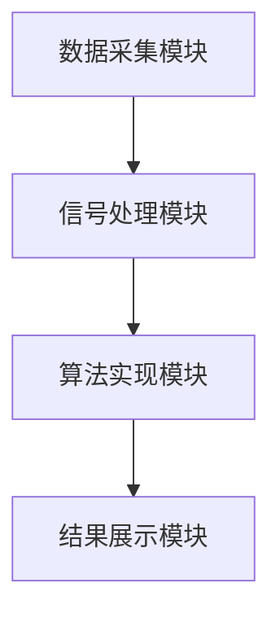

                 

# 如何评估企业的量子传感器磁场探测应用

---

## 关键词

量子传感器, 磁场探测, 企业应用, 算法原理, 系统架构

---

## 摘要

随着量子技术的快速发展，量子传感器在磁场探测领域的应用越来越广泛。本文从量子传感器的基本原理出发，详细分析了磁场探测的核心概念、算法原理、系统架构设计以及实际的企业应用场景。通过定性和定量评估方法，结合具体的项目实战案例，为读者提供了一套完整的量子传感器磁场探测应用评估体系。同时，本文还探讨了系统架构设计中的关键问题，包括功能模块划分、系统交互设计以及算法实现的优化策略。

---

# 目录

1. 量子传感器磁场探测应用的背景与意义  
   1.1 量子传感器的基本概念  
   1.2 磁场探测的背景与应用领域  
   1.3 企业为何需要评估量子传感器磁场探测应用  

2. 量子传感器磁场探测的核心概念与联系  
   2.1 量子传感器的物理原理  
   2.2 磁场探测的数学模型与公式  
   2.3 量子传感器与磁场探测的关系  

3. 量子传感器磁场探测的算法原理  
   3.1 磁场探测的基本算法  
   3.2 量子传感器的信号处理算法  
   3.3 算法的性能评估与对比  

4. 量子传感器磁场探测的系统架构设计  
   4.1 系统架构概述  
   4.2 系统功能设计  
   4.3 系统架构的Mermaid图  
   4.4 本章小结  

5. 量子传感器磁场探测的评估方法  
   5.1 评估指标体系  
   5.2 定性评估与定量评估  
   5.3 评估方法的实现与应用  

6. 量子传感器磁场探测的项目实战  
   6.1 环境搭建与数据采集  
   6.2 算法实现与优化  
   6.3 实际案例分析  
   6.4 项目小结  

7. 总结与展望  
   7.1 本文总结  
   7.2 未来研究方向  

---

## 第1章: 量子传感器磁场探测应用的背景与意义

### 1.1 量子传感器的基本概念

#### 1.1.1 量子传感器的定义

量子传感器是一种基于量子效应的测量装置，能够以极高的精度检测物理量，如磁场、重力、温度等。与传统传感器相比，量子传感器具有更高的灵敏度和分辨率。

#### 1.1.2 量子传感器的核心原理

量子传感器的核心原理是利用量子系统的特性，如量子干涉、量子叠加和量子纠缠，来实现对物理量的测量。例如，基于超导量子干涉器（SQUID）的量子传感器能够以极高的灵敏度检测磁场的变化。

#### 1.1.3 量子传感器在磁场探测中的应用

磁场探测是量子传感器的重要应用之一。在企业中，磁场探测技术广泛应用于地球物理学勘探、医疗设备、导航系统等领域。例如，在地球物理学勘探中，量子传感器可以用于探测地下矿藏的位置和分布。

---

### 1.2 磁场探测的背景与应用领域

#### 1.2.1 磁场探测的基本原理

磁场探测是通过测量空间中磁场的强度和方向来获取信息。磁场强度的单位是特斯拉（T），而磁场方向则由磁感线的方向决定。

#### 1.2.2 磁场探测在企业中的应用场景

在企业中，磁场探测技术的应用场景包括：

- **地球物理学勘探**：用于探测地下矿藏、石油天然气储层等。
- **医疗设备**：用于磁共振成像（MRI）技术。
- **导航系统**：用于卫星导航和水下定位。
- **工业检测**：用于检测设备的磁场特性，如电机、变压器等。

#### 1.2.3 磁场探测技术的发展历程

磁场探测技术经历了从传统传感器到量子传感器的演变。随着量子技术的发展，量子传感器在磁场探测中的应用越来越广泛，尤其是在高精度和高灵敏度的场景中。

---

### 1.3 企业为何需要评估量子传感器磁场探测应用

#### 1.3.1 企业数字化转型的需求

在数字化转型的背景下，企业需要利用先进的技术手段提高生产效率和产品质量。量子传感器作为一种高精度的测量工具，能够为企业提供更精确的数据支持。

#### 1.3.2 磁场探测技术对企业竞争力的影响

磁场探测技术的应用能够帮助企业提升产品性能、优化生产流程。例如，在医疗设备领域，高精度的磁场探测技术能够提高MRI设备的成像质量，从而提升企业的市场竞争力。

#### 1.3.3 量子传感器的优势与挑战

量子传感器的优势在于其高灵敏度和高精度，但其成本较高，技术复杂性也较高。因此，企业需要对量子传感器的应用进行全面评估，以确定其是否适合自身的业务需求。

---

## 第2章: 量子传感器磁场探测的核心概念与联系

### 2.1 量子传感器的物理原理

#### 2.1.1 量子力学基础

量子力学是量子传感器的理论基础。量子系统具有波粒二象性、不确定性原理和量子纠缠等特性，这些特性为量子传感器的设计提供了理论依据。

#### 2.1.2 量子传感器的测量原理

量子传感器通过测量量子系统的状态变化来实现对物理量的测量。例如，基于SQUID的量子传感器通过测量超导环路中的磁通量变化来实现磁场探测。

#### 2.1.3 量子传感器在磁场探测中的应用

量子传感器在磁场探测中的应用基于其对磁场变化的高度敏感性。通过测量磁场的变化，量子传感器能够实现对目标物体的精确定位和识别。

---

### 2.2 磁场探测的数学模型与公式

#### 2.2.1 磁场强度的数学表达式

磁场强度可以用矢量形式表示为：
$$
\mathbf{B} = \nabla \times \mathbf{A} + \frac{\partial \mathbf{E}}{\partial t}
$$

其中，$\mathbf{A}$是磁矢势，$\mathbf{E}$是电场强度。

#### 2.2.2 量子传感器的信号处理模型

量子传感器的信号处理模型可以通过以下公式表示：
$$
S = \int_{\mathbb{R}^3} \mathbf{B} \cdot d\mathbf{A}
$$

其中，$S$是传感器输出的信号，$\mathbf{B}$是磁场强度，$d\mathbf{A}$是面积元素。

---

### 2.3 量子传感器与磁场探测的关系

#### 2.3.1 量子传感器在磁场探测中的作用

量子传感器通过其高灵敏度和高精度，能够实现对微弱磁场的检测。这种能力在地球物理学勘探和医疗设备中具有重要意义。

#### 2.3.2 磁场探测对量子传感器性能的影响

磁场探测的环境条件（如温度、湿度、磁场干扰等）会影响量子传感器的性能。因此，企业在评估量子传感器时需要考虑这些因素。

#### 2.3.3 量子传感器与其他传感器的对比

与其他传感器相比，量子传感器在磁场探测中的优势在于其高灵敏度和高精度。然而，其成本较高，技术复杂性也较高。

---

## 第3章: 量子传感器磁场探测的算法原理

### 3.1 磁场探测的基本算法

#### 3.1.1 基于磁场梯度的探测算法

基于磁场梯度的探测算法通过测量磁场梯度的变化来确定目标物体的位置和形状。其算法流程如下：

1. 采集磁场数据。
2. 计算磁场梯度。
3. 根据梯度变化确定目标物体的位置。

#### 3.1.2 基于磁场强度的探测算法

基于磁场强度的探测算法通过测量磁场强度的变化来实现目标物体的识别。其算法流程如下：

1. 采集磁场数据。
2. 计算磁场强度。
3. 根据强度变化确定目标物体的性质。

---

### 3.2 量子传感器的信号处理算法

#### 3.2.1 信号采集与预处理

信号采集与预处理是量子传感器信号处理的第一步。预处理步骤包括噪声消除、信号放大和数据滤波。

#### 3.2.2 基于滤波器的信号处理

基于滤波器的信号处理算法可以通过以下步骤实现：

1. 对采集到的信号进行低通滤波。
2. 对滤波后的信号进行高通滤波。
3. 对最终信号进行模数转换。

#### 3.2.3 算法的优化与实现

为了提高信号处理的效率和精度，可以采用自适应滤波算法。例如，基于最小二乘法的自适应滤波算法可以通过以下公式实现：
$$
\hat{B}(t) = \sum_{i=1}^{n} w_i B_i(t)
$$

其中，$\hat{B}(t)$是估计的磁场强度，$w_i$是权重系数，$B_i(t)$是测量的磁场强度。

---

### 3.3 算法的性能评估与对比

#### 3.3.1 算法的准确性评估

算法的准确性可以通过测量结果与真实值的偏差来评估。例如，假设测量结果为$B_{\text{measured}}$，真实值为$B_{\text{true}}$，则准确度可以表示为：
$$
\text{准确度} = \frac{|B_{\text{measured}} - B_{\text{true}}|}{B_{\text{true}}}
$$

#### 3.3.2 算法的鲁棒性评估

算法的鲁棒性可以通过其对噪声和干扰的抵抗能力来评估。例如，可以通过加入不同水平的噪声信号，测试算法的性能变化。

#### 3.3.3 不同算法的性能对比

通过对比不同算法的准确度、响应时间和计算复杂度，可以确定最适合特定应用场景的算法。

---

## 第4章: 量子传感器磁场探测的系统架构设计

### 4.1 系统架构概述

量子传感器磁场探测系统的总体架构包括数据采集模块、信号处理模块、算法实现模块和结果展示模块。

---

### 4.2 系统功能设计

#### 4.2.1 数据采集模块

数据采集模块负责采集磁场数据。其功能包括：

- 与量子传感器硬件接口通信。
- 采集并存储原始数据。

#### 4.2.2 信号处理模块

信号处理模块负责对采集到的信号进行预处理。其功能包括：

- 去噪和滤波。
- 信号放大和转换。

#### 4.2.3 算法实现模块

算法实现模块负责对预处理后的信号进行分析。其功能包括：

- 选择合适的算法进行计算。
- 输出初步的磁场探测结果。

#### 4.2.4 结果展示模块

结果展示模块负责将最终的探测结果以可视化的方式呈现给用户。其功能包括：

- 显示磁场分布图。
- 输出探测报告。

---

### 4.3 系统架构的Mermaid图

---

### 4.4 本章小结

本章详细介绍了量子传感器磁场探测系统的架构设计，包括功能模块划分和系统交互流程。通过合理的设计，可以实现高效的磁场探测和数据处理。

---

## 第5章: 量子传感器磁场探测的评估方法

### 5.1 评估指标体系

#### 5.1.1 精度指标

精度指标用于衡量量子传感器的测量精度。例如，磁场探测的相对误差可以通过以下公式计算：
$$
\text{相对误差} = \frac{|B_{\text{measured}} - B_{\text{true}}|}{B_{\text{true}}} \times 100\%
$$

#### 5.1.2 响应时间指标

响应时间指标用于衡量量子传感器的测量速度。例如，可以从测量开始到结果输出的时间来评估响应时间。

#### 5.1.3 稳定性指标

稳定性指标用于衡量量子传感器在不同环境条件下的性能。例如，可以通过长时间连续测量的结果一致性来评估稳定性。

#### 5.1.4 成本效益指标

成本效益指标用于衡量量子传感器的经济性。例如，可以通过测量成本与探测精度的比值来评估成本效益。

---

### 5.2 定性评估与定量评估

#### 5.2.1 定性评估方法

定性评估方法包括专家评审和功能测试。专家评审可以评估系统的可行性和创新性，而功能测试可以验证系统的实际性能。

#### 5.2.2 定量评估方法

定量评估方法包括性能测试和成本分析。性能测试可以评估系统的响应时间和测量精度，而成本分析可以评估系统的经济性。

#### 5.2.3 评估方法的综合应用

通过结合定性和定量评估方法，可以全面评估量子传感器磁场探测应用的性能和价值。

---

## 第6章: 量子传感器磁场探测的项目实战

### 6.1 环境搭建与数据采集

#### 6.1.1 环境搭建

环境搭建包括硬件设备和软件环境的配置。硬件设备包括量子传感器和数据采集卡，软件环境包括操作系统和相关开发工具。

#### 6.1.2 数据采集

数据采集可以通过编写采集程序实现。例如，可以使用Python的pyqt库编写一个简单的数据采集界面。

---

### 6.2 算法实现与优化

#### 6.2.1 算法实现

算法实现包括选择合适的算法和编写相应的代码。例如，可以使用Python的numpy库进行矩阵运算，实现磁场探测算法。

#### 6.2.2 算法优化

算法优化可以通过改进算法结构和参数调整实现。例如，可以采用并行计算和自适应滤波算法来提高算法效率和精度。

---

### 6.3 实际案例分析

#### 6.3.1 案例背景

案例背景包括项目的背景和目标。例如，可以是一个地球物理学勘探项目，目标是探测地下矿藏的位置和分布。

#### 6.3.2 数据分析

数据分析包括对采集到的数据进行处理和分析。例如，可以通过绘制磁场分布图来分析目标物体的位置和形状。

#### 6.3.3 结果解读

结果解读包括对分析结果的解释和应用。例如，可以通过磁场分布图确定矿藏的位置和储量。

---

### 6.4 项目小结

本章通过一个实际案例展示了量子传感器磁场探测应用的实现过程，包括环境搭建、算法实现和结果分析。

---

## 第7章: 总结与展望

### 7.1 本文总结

本文详细介绍了量子传感器磁场探测应用的背景、核心概念、算法原理、系统架构设计以及评估方法。通过实际案例分析，展示了量子传感器在企业中的应用潜力。

### 7.2 未来研究方向

未来的研究方向包括：

- 优化量子传感器的性能，提高其灵敏度和稳定性。
- 开发新的算法，提高磁场探测的精度和效率。
- 探索量子传感器在更多领域的应用，如量子计算和量子通信。

---

## 结语

量子传感器磁场探测应用的评估是一个复杂但重要的过程。通过本文的分析和实践，读者可以全面了解量子传感器的应用潜力，并为企业的技术决策提供参考。

--- 

# END

