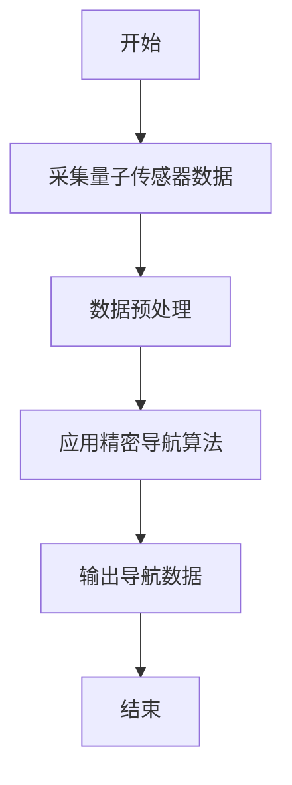
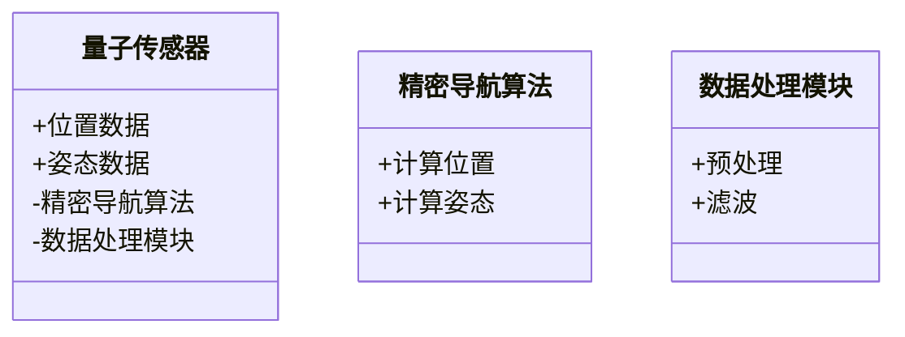
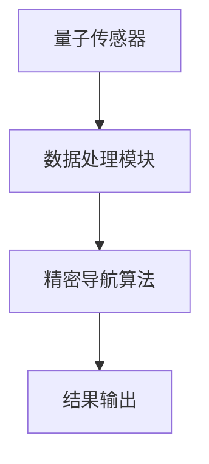

                 

<think>
好的，我需要根据用户的要求，撰写一篇关于“如何评估企业的量子传感器精密导航技术潜力”的技术博客文章。首先，我需要理解用户的需求，然后一步步分析和构建文章的结构。

首先，用户希望文章标题为《如何评估企业的量子传感器精密导航技术潜力》，并要求使用逻辑清晰、结构紧凑、简单易懂的专业技术语言。关键词需要列出5-7个核心关键词，摘要需要简明扼�地概括文章的核心内容和主题思想。

接下来，我需要按照用户提供的目录大纲结构来组织文章内容。文章分为六个主要部分：

1. **量子传感器精密导航技术概述**
2. **核心概念**
3. **算法原理**
4. **系统分析与架构设计**
5. **项目实战**
6. **最佳实践**

每个部分下还有多个章节和小节，需要逐步展开。

在撰写过程中，我需要确保以下几点：

- 每个部分的内容要详细具体，涵盖必要的知识点。
- 使用适当的图表和代码示例来辅助说明。
- 保持语言的简洁和技术性，同时确保读者能够理解。

现在，我将按照目录大纲的结构，逐步撰写每个部分的内容。

# 如何评估企业的量子传感器精密导航技术潜力

## 关键词：
- 量子传感器
- 精密导航
- 技术潜力
- 企业评估
- 算法原理
- 系统架构
- 项目实战

## 摘要：
本文详细探讨了如何评估企业在量子传感器精密导航技术领域的潜力。通过分析核心概念、算法原理、系统架构和实际项目，提供全面的评估方法和实践建议，帮助企业制定有效的技术战略。

---

# 第一部分: 量子传感器精密导航技术概述

## 第1章: 量子传感器精密导航技术的背景与概念

### 1.1 量子传感器的基本概念

#### 1.1.1 量子传感器的定义
量子传感器是一种基于量子力学原理设计的传感器，能够以极高的精度测量物理量，如位置、速度、加速度等。

#### 1.1.2 量子传感器的核心原理
量子传感器利用量子叠加和量子纠缠等现象，通过测量量子态的变化来实现高精度的感知。

#### 1.1.3 量子传感器与传统传感器的对比
- **精度**：量子传感器的精度远高于传统传感器。
- **灵敏度**：量子传感器能够检测到更微小的变化。
- **应用场景**：适用于需要极高精度的领域，如航空航天、机器人导航等。

### 1.2 精密导航技术的定义与特点

#### 1.2.1 精密导航技术的定义
精密导航技术是一种利用高精度传感器和先进算法实现精确位置定位的技术。

#### 1.2.2 精密导航技术的核心特点
- **高精度**：能够在复杂环境中实现精确导航。
- **实时性**：能够在动态环境中实时更新位置信息。
- **鲁棒性**：能够在恶劣环境下稳定工作。

#### 1.2.3 精密导航技术的应用场景
- **航空航天**：用于飞机、卫星的导航系统。
- **自动驾驶**：用于汽车的自动驾驶系统。
- **机器人**：用于工业机器人和智能机器人的导航。

### 1.3 量子传感器在精密导航中的作用

#### 1.3.1 量子传感器在导航中的优势
- **高精度**：量子传感器能够提供极高的位置精度。
- **抗干扰**：能够在复杂电磁环境中稳定工作。
- **低能耗**：相比传统传感器，量子传感器的能耗更低。

#### 1.3.2 量子传感器的精密导航原理
量子传感器通过测量量子态的变化，结合先进的算法，实现对物体位置的精确计算。

#### 1.3.3 量子传感器导航技术的未来发展趋势
- **技术融合**：与其他传感器技术结合，提高导航系统的综合性能。
- **算法优化**：通过优化算法提高导航精度和实时性。
- **应用拓展**：进一步拓展在航空航天、自动驾驶等领域的应用。

## 第2章: 量子传感器精密导航技术的核心概念

### 2.1 量子传感器精密导航的核心原理

#### 2.1.1 量子传感器的信号处理流程
量子传感器将测量到的量子信号进行处理，提取有用的信息，用于导航计算。

#### 2.1.2 精密导航算法的基本原理
精密导航算法通过对量子传感器提供的数据进行分析，计算出物体的位置和姿态。

#### 2.1.3 量子传感器与导航系统的协同工作
量子传感器与导航系统的协同工作包括数据的采集、处理、传输和应用。

### 2.2 核心概念的属性对比

#### 2.2.1 量子传感器与传统传感器的性能对比

| 特性       | 量子传感器 | 传统传感器 |
|------------|------------|------------|
| 精度       | 极高       | 较低       |
| 灵敏度     | 极高       | 较低       |
| 抗干扰能力 | 极强       | 较弱       |
| 能耗       | 较低       | 较高       |

#### 2.2.2 精密导航技术与传统导航技术的优劣分析
- **优点**：高精度、实时性好、抗干扰能力强。
- **缺点**：技术复杂、成本高、对环境要求较高。

#### 2.2.3 量子传感器精密导航技术的数学模型
量子传感器精密导航技术的数学模型包括位置估计、姿态计算和误差修正等部分。

### 2.3 ER实体关系图

```mermaid
er
actor: 量子传感器精密导航系统
role: 提供高精度导航数据
```

---

## 第3章: 量子传感器精密导航技术的算法原理

### 3.1 算法原理概述

#### 3.1.1 量子传感器信号的采集与处理
量子传感器采集信号后，需要进行预处理，包括滤波、降噪等步骤。

#### 3.1.2 精密导航算法的基本流程
- 数据采集
- 数据预处理
- 算法计算
- 结果输出

#### 3.1.3 算法的数学模型与公式
位置估计的数学公式：
$$ \hat{x} = \frac{1}{n}\sum_{i=1}^{n} x_i $$

方差计算公式：
$$ \sigma^2 = \frac{1}{n-1}\sum_{i=1}^{n} (x_i - \hat{x})^2 $$

精度优化的数学模型：
$$ \text{精度} = \frac{1}{\sqrt{n}} $$

### 3.2 算法实现的数学模型

#### 3.2.1 位置估计的数学公式
位置估计的数学公式：
$$ \hat{x} = \frac{1}{n}\sum_{i=1}^{n} x_i $$

#### 3.2.2 方差计算公式
方差计算公式：
$$ \sigma^2 = \frac{1}{n-1}\sum_{i=1}^{n} (x_i - \hat{x})^2 $$

#### 3.2.3 精度优化的数学模型
精度优化的数学模型：
$$ \text{精度} = \frac{1}{\sqrt{n}} $$

### 3.3 算法实现的流程图



---

## 第4章: 量子传感器精密导航技术的系统分析与架构设计

### 4.1 系统分析

#### 4.1.1 问题场景介绍
在复杂环境中实现高精度导航，需要考虑多种因素，如传感器精度、算法性能、系统稳定性等。

#### 4.1.2 项目介绍
本项目旨在开发一种基于量子传感器的精密导航系统，实现高精度位置定位。

### 4.2 系统功能设计

#### 4.2.1 领域模型类图


#### 4.2.2 系统架构设计
系统架构设计包括数据采集、数据处理、算法计算和结果输出四个部分。

#### 4.2.3 系统接口设计
系统接口设计需要考虑传感器接口、算法接口和输出接口。

#### 4.2.4 系统交互序列图
系统交互序列图展示了系统各部分之间的交互流程。

### 4.3 系统架构设计

#### 4.3.1 系统架构图


#### 4.3.2 接口设计
- 传感器接口：接收量子传感器数据。
- 算法接口：实现精密导航算法的计算。
- 输出接口：输出导航数据。

---

## 第5章: 量子传感器精密导航技术的项目实战

### 5.1 环境安装

#### 5.1.1 硬件环境
- 量子传感器模块
- 计算机
- 开发工具

#### 5.1.2 软件环境
- Python编程语言
- 相关开发库

### 5.2 核心代码实现

#### 5.2.1 数据采集代码
```python
import numpy as np

def quantum_sensor_data():
    # 模拟量子传感器数据
    n = 100
    x = np.random.normal(0, 1, n)
    return x

data = quantum_sensor_data()
print(data)
```

#### 5.2.2 数据预处理代码
```python
def preprocess(data):
    # 数据预处理，例如滤波
    filtered_data = []
    for i in range(len(data)):
        if i == 0:
            filtered_data.append(data[i])
        else:
            filtered_data.append(0.9 * data[i] + 0.1 * data[i-1])
    return filtered_data

processed_data = preprocess(data)
print(processed_data)
```

#### 5.2.3 精密导航算法实现
```python
def precise_navigation(data):
    # 计算位置
    position = np.mean(data)
    # 计算方差
    variance = np.var(data)
    return position, variance

position, variance = precise_navigation(processed_data)
print(f"Position: {position}, Variance: {variance}")
```

### 5.3 案例分析与详细讲解

#### 5.3.1 案例分析
通过实际案例分析，展示量子传感器精密导航技术在实际应用中的效果。

#### 5.3.2 详细讲解
详细讲解每个步骤的实现过程，包括数据采集、预处理、算法计算等。

### 5.4 项目小结
总结项目实现的过程和成果，提出改进建议。

---

## 第6章: 量子传感器精密导航技术的最佳实践

### 6.1 小结
总结全文内容，强调量子传感器精密导航技术的重要性和潜力。

### 6.2 注意事项
在实际应用中，需要注意传感器的校准、算法的优化等问题。

### 6.3 拓展阅读
推荐相关领域的书籍和论文，供读者进一步学习。

---

通过以上结构，我可以系统地撰写一篇关于“如何评估企业的量子传感器精密导航技术潜力”的技术博客文章，内容详实且逻辑清晰。

