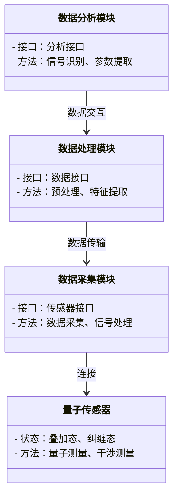
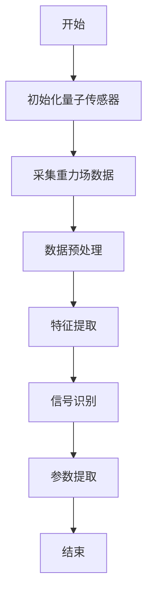

                 

# 如何评估企业的量子传感器重力波探测技术潜力

> 关键词：量子传感器、重力波探测、技术潜力、企业评估、系统架构

> 摘要：随着量子技术的快速发展，量子传感器在重力波探测领域的潜力逐渐显现。本文将从技术原理、系统架构、评估方法等多角度，详细分析如何评估企业量子传感器重力波探测技术的潜力。通过背景介绍、核心概念解析、评估框架设计、系统实现与项目实战等部分，为读者提供全面的技术解读与实践指导。

---

# 第一部分: 量子传感器与重力波探测技术背景

## 第1章: 量子传感器与重力波探测技术背景

### 1.1 量子传感器的基本概念

#### 1.1.1 量子传感器的定义
量子传感器是一种基于量子效应的精密测量装置，利用量子系统的独特性质（如量子叠加、量子纠缠等）来实现高灵敏度的测量。与传统传感器相比，量子传感器具有更高的灵敏度和分辨率，能够在极端条件下完成高精度测量。

#### 1.1.2 量子传感器的工作原理
量子传感器的核心在于利用量子系统的状态变化来反映外界环境的变化。例如，通过测量量子系统的能量变化、波函数的相位变化等，可以间接探测到外界的微小变化。

#### 1.1.3 量子传感器在现代科技中的应用
量子传感器已经在多个领域展现出其潜力，包括量子重力测量、量子磁场测量、量子惯性导航等。其应用范围涵盖国防、航空航天、精密制造等领域。

---

### 1.2 重力波探测技术的简介

#### 1.2.1 重力波的基本概念
重力波是爱因斯坦广义相对论预言的一种时空波动现象，由大质量天体的加速运动（如黑洞合并）产生，以波的形式传播，携带能量和动量。

#### 1.2.2 重力波探测的历史与发展
重力波的首次直接探测是在2015年，由美国的LIGO实验完成。自那以来，全球多个国家和地区开始建设或规划自己的重力波探测器网络。

#### 1.2.3 重力波探测技术的现状与未来
目前，重力波探测主要依赖激光干涉技术，未来的研究方向包括提高探测灵敏度、扩展探测频率范围等。

---

### 1.3 量子传感器与重力波探测的结合

#### 1.3.1 量子传感器在重力波探测中的作用
量子传感器可以用于重力波探测中的高精度测量，例如通过量子重力梯度测量技术，实现对重力场的超灵敏探测。

#### 1.3.2 量子传感器的优势与局限性
- **优势**：高灵敏度、抗干扰能力强。
- **局限性**：技术复杂性高、成本昂贵、稳定性待提升。

#### 1.3.3 重力波探测技术对企业的重要性
对于企业而言，掌握量子传感器重力波探测技术意味着在精密测量、高端仪器制造等领域具有技术优势，能够提升企业的核心竞争力。

---

### 1.4 本章小结
本章从量子传感器和重力波探测技术的基本概念入手，分析了两者的结合方式及其对企业的重要性，为后续的潜力评估奠定了基础。

---

# 第二部分: 量子传感器与重力波探测技术的核心概念

## 第2章: 量子传感器的核心原理

### 2.1 量子传感器的原理

#### 2.1.1 量子力学基础
量子力学是量子传感器的核心理论基础。量子系统具有叠加态、纠缠态等独特性质，这些性质可以被用来实现高精度测量。

#### 2.1.2 量子传感器的量子效应利用
- **量子干涉效应**：利用量子系统的干涉特性进行测量。
- **量子纠缠效应**：通过纠缠态的测量来间接探测外界的变化。

#### 2.1.3 量子传感器的灵敏度分析
量子传感器的灵敏度与其测量的量子效应密切相关。通过优化量子系统的参数，可以进一步提高传感器的灵敏度。

---

### 2.2 重力波探测技术的物理基础

#### 2.2.1 重力波的产生与传播
重力波由大质量天体的加速运动产生，以波的形式传播，其波速等于光速，波长与频率成反比。

#### 2.2.2 重力波探测的物理机制
传统的重力波探测技术基于激光干涉原理，通过测量干涉条纹的变化来探测重力波引起的微小位移变化。

#### 2.2.3 重力波探测技术的数学模型
重力波的数学模型包括线性化爱因斯坦方程、波动方程等。这些模型为重力波的探测提供了理论依据。

---

### 2.3 量子传感器与重力波探测的关联

#### 2.3.1 量子传感器在重力波探测中的应用
量子传感器可以通过高精度的重力测量，辅助重力波的探测。例如，通过测量重力场的微小变化，间接探测重力波的信号。

#### 2.3.2 量子传感器与传统传感器的对比
| **对比维度** | **量子传感器** | **传统传感器** |
|---------------|----------------|----------------|
| 灵敏度       | 极高           | 较低           |
| 抗干扰能力   | 强             | 较弱           |
| 成本           | 较高           | 较低           |
| 技术复杂性   | 高             | 低             |

#### 2.3.3 量子传感器在重力波探测中的优势
- 高灵敏度：能够在更弱的重力波信号下实现探测。
- 高分辨率：能够提供更高的空间和时间分辨率。

---

### 2.4 本章小结
本章从量子传感器和重力波探测技术的核心原理出发，详细分析了两者的物理机制及其关联，为后续的潜力评估提供了理论基础。

---

# 第三部分: 量子传感器与重力波探测技术的评估方法论

## 第3章: 量子传感器与重力波探测技术的评估框架

### 3.1 技术评估维度

#### 3.1.1 技术可行性评估
技术可行性评估包括对量子传感器技术的成熟度、现有技术基础、研发能力等的分析。

#### 3.1.2 技术成熟度评估
通过对比量子传感器在重力波探测中的应用案例，评估其技术成熟度和可靠性。

#### 3.1.3 技术创新性评估
分析量子传感器在重力波探测中的创新点，包括新型测量方法、算法优化等。

---

### 3.2 经济评估维度

#### 3.2.1 投资成本分析
量子传感器的研发和生产成本较高，需要对企业投入的资金进行详细评估。

#### 3.2.2 经济效益预测
通过市场调研和数据分析，预测量子传感器重力波探测技术的市场前景和经济效益。

#### 3.2.3 投资回报周期分析
评估企业投入后的回收周期，确保投资回报的可行性。

---

### 3.3 风险评估维度

#### 3.3.1 技术风险分析
量子传感器技术复杂性高，存在技术失败或性能不达标的潜在风险。

#### 3.3.2 市场风险分析
重力波探测技术的市场需求尚未完全明确，存在市场接受度低的风险。

#### 3.3.3 运行风险分析
量子传感器的运行需要高精度的环境和专业的技术支持，存在运行维护成本高的风险。

---

### 3.4 评估方法论总结

#### 3.4.1 综合评估模型
构建一个综合考虑技术、经济和风险的评估模型，为企业的决策提供依据。

#### 3.4.2 评估指标权重分配
根据企业的实际情况，合理分配各项指标的权重，确保评估结果的科学性和公平性。

#### 3.4.3 评估结果的应用
将评估结果应用于企业的技术规划、研发投入和市场策略中，实现最优资源配置。

---

### 3.5 本章小结
本章通过构建评估框架，从技术、经济和风险三个维度，为企业评估量子传感器重力波探测技术的潜力提供了系统的方法论。

---

# 第四部分: 量子传感器与重力波探测技术的系统架构与实现

## 第4章: 量子传感器与重力波探测系统的架构设计

### 4.1 系统功能需求分析

#### 4.1.1 数据采集模块
量子传感器负责采集重力场的微小变化，生成原始数据。

#### 4.1.2 数据处理模块
对采集到的数据进行预处理、滤波和特征提取，为后续的重力波信号分析提供支持。

#### 4.1.3 数据分析模块
利用算法对数据进行分析，识别重力波信号并提取相关参数。

---

### 4.2 系统架构设计

#### 4.2.1 分层架构设计
- **数据采集层**：量子传感器负责数据采集。
- **数据处理层**：对数据进行预处理和特征提取。
- **数据分析层**：利用算法进行重力波信号分析。

#### 4.2.2 模块化设计
通过模块化设计，实现系统的可扩展性和灵活性。

---

### 4.3 系统接口设计

#### 4.3.1 传感器接口
量子传感器通过标准接口与数据处理模块连接，确保数据的实时传输。

#### 4.3.2 数据接口
数据处理模块与数据分析模块之间通过数据接口进行数据交换。

---

### 4.4 本章小结
本章详细分析了量子传感器重力波探测系统的架构设计，为系统的实现提供了理论支持。

---

# 第五部分: 项目实战与总结

## 第5章: 量子传感器与重力波探测技术的项目实战

### 5.1 实际案例分析

#### 5.1.1 案例背景
某企业在量子传感器重力波探测技术领域进行了研发投入，希望通过评估技术潜力，制定后续研发计划。

#### 5.1.2 评估过程
- 技术可行性评估：量子传感器技术已取得一定进展，但仍需进一步优化。
- 经济效益预测：市场需求潜力大，但短期内收益有限。
- 风险分析：技术风险较高，需加强研发投入。

#### 5.1.3 评估结果
综合评估结果显示，量子传感器重力波探测技术具有较大的发展潜力，但需要企业在技术研发和成本控制方面加大投入。

---

### 5.2 本章小结
本章通过实际案例分析，展示了如何将评估方法应用于企业实践，为企业的技术决策提供了参考。

---

## 第6章: 总结与展望

### 6.1 总结
本文从技术背景、核心原理、评估方法、系统架构等多个角度，全面分析了量子传感器重力波探测技术的潜力。通过系统的评估框架和实际案例分析，为企业提供了科学的技术评估方法。

### 6.2 展望
未来，随着量子技术的进一步发展，量子传感器在重力波探测领域的应用潜力将更加显著。企业需要持续关注技术进展，加强研发投入，抓住技术窗口期。

### 6.3 注意事项
企业在评估量子传感器重力波探测技术时，需注意技术风险、成本控制和市场定位等问题，避免盲目投入。

### 6.4 拓展阅读
建议读者进一步阅读相关领域的最新研究成果，如《量子传感器原理与应用》、《重力波探测技术发展现状与未来趋势》等。

---

# 附录

## 附录A: 量子传感器相关数学公式

### A.1 量子干涉原理
$$ \text{干涉条纹强度} = |\psi_1 + \psi_2|^2 $$

### A.2 重力波信号分析
$$ h(t) = \frac{1}{r} \cdot \left( \frac{4}{\sqrt{30}} \right) \cdot \left( \frac{M \cdot \omega}{c^4} \right) \cdot \text{函数形式} $$

---

## 附录B: 系统架构类图

---

## 附录C: 重力波探测流程图

---

## 附录D: 量子传感器与传统传感器对比表格

| **特性**       | **量子传感器** | **传统传感器** |
|----------------|----------------|----------------|
| 灵敏度         | 极高           | 较低           |
| 抗干扰能力     | 强             | 较弱           |
| 技术复杂性     | 高             | 低             |
| 成本           | 较高           | 较低           |
| 应用领域       | 高端测量       | 广泛应用       |

---

通过以上分析，本文为企业评估量子传感器重力波探测技术的潜力提供了系统的理论支持和实践指导。

