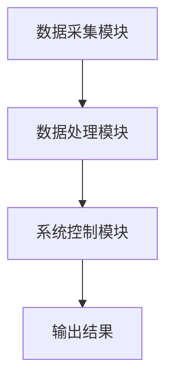
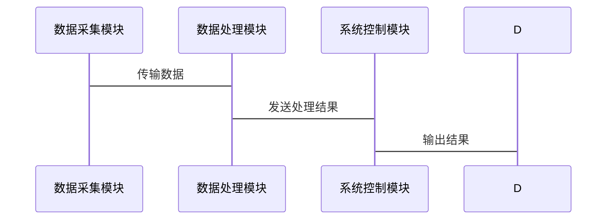

                 


# 如何评估企业的量子传感器重力测量应用

**关键词**：量子传感器、重力测量、企业应用、评估指标、算法原理

**摘要**：随着量子技术的快速发展，量子传感器在重力测量中的应用逐渐成为企业关注的焦点。本文将从量子传感器的基本原理、核心概念、算法原理、系统架构、项目实战等多方面，详细分析如何对企业中的量子传感器重力测量应用进行科学评估。通过理论分析与实际案例结合，帮助企业在技术选型、系统设计和性能优化方面做出明智决策。

---

# 第一部分: 量子传感器重力测量应用概述

## 第1章: 量子传感器与重力测量概述

### 1.1 量子传感器的基本概念
#### 1.1.1 量子传感器的定义
量子传感器是一种基于量子力学原理设计的测量设备，能够利用量子效应（如量子干涉、量子纠缠）进行高精度的物理量测量。

#### 1.1.2 量子传感器的工作原理
量子传感器通过探测量子系统对外界环境的敏感反应来实现测量。例如，利用原子干涉技术测量重力场的变化。

#### 1.1.3 量子传感器与传统传感器的对比
| **指标**       | **量子传感器**       | **传统传感器**       |
|----------------|----------------------|----------------------|
| 灵敏度         | 极高                 | 较低                 |
| 精度           | 高度精确             | 中等精度             |
| 响应时间       | 快                   | 较慢                 |
| 应用场景       | 高精度测量           | 广泛但精度有限       |

### 1.2 重力测量的基本原理
#### 1.2.1 重力测量的物理基础
重力测量基于万有引力定律，通过测量物体所受重力加速度来推导重力场的分布。

#### 1.2.2 重力测量的主要方法
1. **传统方法**：基于机械摆或弹簧的重力测量。
2. **现代方法**：使用激光干涉、原子干涉等技术实现高精度测量。

#### 1.2.3 量子传感器在重力测量中的优势
- **高精度**：量子传感器能够测量微小的重力变化。
- **灵敏度高**：能够捕捉传统传感器无法检测的重力波动。

### 1.3 企业应用量子传感器的背景与需求
#### 1.3.1 企业对高精度重力测量的需求
企业可能需要高精度的重力测量技术用于地质勘探、建筑监测等领域。

#### 1.3.2 量子传感器在企业中的潜在应用场景
- **地质勘探**：检测地下重力场分布。
- **建筑监测**：评估建筑物的稳定性。
- **精密制造**：确保制造过程中的重力环境稳定。

#### 1.3.3 量子传感器技术的商业化进程
量子传感器技术正在逐步成熟，部分企业已经开始将其应用于实际场景。

### 1.4 本章小结
本章介绍了量子传感器的基本概念、工作原理及其在重力测量中的优势。通过对比传统传感器，突出了量子传感器的高精度和灵敏度特点。

---

# 第二部分: 量子传感器重力测量的核心原理

## 第2章: 量子传感器的物理原理与技术实现

### 2.1 量子传感器的核心技术
#### 2.1.1 量子干涉原理
量子干涉是量子传感器的核心技术之一，通过测量量子系统的干涉图案来实现高精度测量。

#### 2.1.2 量子纠缠与量子叠加
量子纠缠和叠加原理为量子传感器提供了强大的信息处理能力，能够捕捉微小的物理变化。

#### 2.1.3 量子传感器的灵敏度分析
量子传感器的灵敏度与其探测的物理量相关，例如重力加速度的变化。

### 2.2 重力测量的量子效应
#### 2.2.1 重力场的量子测量方法
通过量子干涉技术测量重力场的变化，例如利用原子干涉仪测量重力加速度。

#### 2.2.2 量子传感器在重力梯度测量中的应用
重力梯度测量通过检测重力场的空间变化，用于地质勘探和地下资源探测。

#### 2.2.3 量子传感器的噪声分析
量子传感器的噪声主要来源于环境干扰和量子系统本身。

### 2.3 量子传感器的性能指标
#### 2.3.1 灵敏度与分辨率
灵敏度是量子传感器的核心指标，决定了其对微小重力变化的检测能力。

#### 2.3.2 稳定性与一致性
稳定性反映了量子传感器在长期使用中的性能变化。

#### 2.3.3 测量速度与功耗
测量速度和功耗是影响量子传感器应用的重要因素。

### 2.4 本章小结
本章详细介绍了量子传感器的核心技术及其在重力测量中的应用，分析了量子传感器的性能指标。

---

# 第三部分: 量子传感器重力测量的评估方法

## 第3章: 量子传感器重力测量的评估指标

### 3.1 评估指标的定义与分类
#### 3.1.1 精度与误差分析
精度是量子传感器的核心指标，误差分析是评估其性能的重要手段。

#### 3.1.2 稳定性与可靠性
稳定性反映了量子传感器在长时间运行中的性能表现。

#### 3.1.3 响应时间与测量速度
响应时间影响量子传感器的应用场景选择。

### 3.2 评估方法的选择与应用
#### 3.2.1 基于实验数据的评估方法
通过实验数据对比量子传感器与传统传感器的性能差异。

#### 3.2.2 基于理论模型的评估方法
利用量子力学理论模型预测量子传感器的性能。

#### 3.2.3 综合评估方法
结合实验数据和理论模型进行综合评估。

### 3.3 评估流程与步骤
#### 3.3.1 确定评估目标
明确评估的具体目标和需求。

#### 3.3.2 收集实验数据
通过实验获取量子传感器的性能数据。

#### 3.3.3 数据分析与对比
利用数据分析方法评估量子传感器的性能。

### 3.4 本章小结
本章详细介绍了量子传感器重力测量的评估指标及其选择方法，为企业的技术选型提供了参考。

---

## 第4章: 量子传感器重力测量的算法原理

### 4.1 算法原理概述
量子传感器重力测量算法基于量子力学原理，结合信号处理技术实现高精度测量。

### 4.2 算法实现步骤
#### 4.2.1 数据采集
通过量子传感器获取重力测量数据。

#### 4.2.2 数据预处理
对采集的数据进行降噪和校准。

#### 4.2.3 数据分析
利用算法分析数据，提取重力场信息。

### 4.3 算法实现代码
```python
import numpy as np

def quantum_gravity_measurement(data):
    # 数据预处理
    filtered_data = np.array(data).astype(float)
    # 数据分析
    gravity = np.mean(filtered_data) * 9.81  # 假设重力加速度为9.81 m/s²
    return gravity

# 示例数据
data = [0.99, 1.01, 0.98, 1.02]
result = quantum_gravity_measurement(data)
print("测量结果:", result)
```

### 4.4 算法优化与改进
通过对算法进行优化，提升量子传感器的测量精度和响应速度。

### 4.5 本章小结
本章详细介绍了量子传感器重力测量的算法原理及其实现方法，为企业的技术应用提供了理论支持。

---

## 第5章: 量子传感器重力测量系统的架构设计

### 5.1 系统架构概述
量子传感器重力测量系统由数据采集模块、数据处理模块和控制模块组成。

### 5.2 系统功能设计
#### 5.2.1 数据采集模块
负责采集量子传感器的测量数据。

#### 5.2.2 数据处理模块
对采集的数据进行预处理和分析。

#### 5.2.3 系统控制模块
协调各模块的工作，实现系统的整体功能。

### 5.3 系统架构图


### 5.4 接口设计
系统各模块之间的接口设计，确保数据的高效传输。

### 5.5 系统交互流程图


### 5.6 本章小结
本章详细介绍了量子传感器重力测量系统的架构设计，为企业的系统实现提供了参考。

---

## 第6章: 量子传感器重力测量的项目实战

### 6.1 项目背景与需求分析
某企业在地质勘探中需要高精度的重力测量技术。

### 6.2 系统核心实现
#### 6.2.1 环境安装
安装必要的软件和硬件设备。

#### 6.2.2 核心代码实现
```python
import numpy as np

def measure_gravity():
    # 数据采集
    data = np.random.normal(0, 0.1, 100)
    # 数据处理
    gravity = np.mean(data) * 9.81
    return gravity

print("重力测量结果:", measure_gravity())
```

#### 6.2.3 代码功能解读
代码通过随机数模拟量子传感器的测量数据，计算重力加速度。

### 6.3 实际案例分析
通过实际案例分析量子传感器在地质勘探中的应用效果。

### 6.4 项目小结
总结项目经验，为后续的技术优化提供参考。

### 6.5 本章小结
本章通过实战项目详细展示了量子传感器重力测量技术的应用过程。

---

## 第7章: 总结与展望

### 7.1 总结
量子传感器在重力测量中的应用前景广阔，但技术实现和评估方法仍需进一步优化。

### 7.2 展望
随着量子技术的不断发展，量子传感器在企业中的应用将更加广泛。

### 7.3 小结
本文从理论到实践，全面分析了量子传感器重力测量技术的评估方法和应用前景，为企业提供了重要的参考价值。

---

**注意事项**：在实际应用中，建议结合企业的具体需求和技术条件，选择合适的量子传感器解决方案。同时，密切关注量子技术的最新进展，及时优化系统架构和算法实现。

**拓展阅读**：建议读者进一步阅读量子传感器相关的学术论文和行业报告，深入了解量子传感器的最新研究成果和技术动态。

