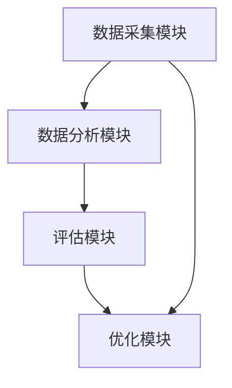

                 


# 如何评估企业的量子点显示器柔性制造技术应用

> 关键词：量子点显示器，柔性制造，技术评估，企业应用，制造流程

> 摘要：本文详细探讨了如何评估企业在量子点显示器柔性制造技术中的应用。通过分析量子点技术的核心优势、柔性制造的实现原理、评估指标的建立、数学模型的构建以及系统架构的设计，为企业提供了一套全面的评估方法和实战案例。文章还总结了最佳实践，为企业在量子点显示器制造领域的技术应用提供了指导。

---

## 第一部分：量子点显示器与柔性制造技术概述

### 第1章：量子点技术的基本概念

#### 1.1 量子点的定义与特性
量子点是一种纳米级半导体材料，通常由半导体纳米晶体组成。其核心特性包括：

- **尺寸效应**：量子点的发光特性与其尺寸密切相关，不同尺寸的量子点会发出不同颜色的光。
- **稳定性**：量子点具有较高的光稳定性和化学稳定性，能够在各种环境下保持性能。
- **可调性**：通过调整量子点的大小和形状，可以精确控制其发光波长，从而实现不同颜色的显示。

#### 1.2 柔性制造技术的定义与应用
柔性制造技术（Flexible Manufacturing Technology）是指能够在生产过程中灵活调整以适应不同产品或需求的技术。其在显示器制造中的应用包括：

- **定制化生产**：支持不同规格和尺寸的显示器生产。
- **快速调整**：生产线能够快速适应新产品或工艺的变化。
- **高效生产**：通过自动化和智能化技术提高生产效率和产品质量。

#### 1.3 量子点显示器的技术优势
量子点显示器相较于传统显示器具有以下优势：

- **高色域**：量子点显示器能够实现100%的NTSC色域，色彩更鲜艳。
- **低能耗**：采用先进的发光技术，功耗显著降低。
- **柔性显示**：支持柔性基板，可以制成可弯曲的显示器。

---

### 第2章：量子点材料的物理特性

#### 2.1 量子点材料的结构与性质
量子点材料的结构通常为核壳结构，核为半导体晶体，壳层用于保护和改善电子性能。其主要物理特性包括：

- **光电特性**：量子点材料具有优异的光电转换效率，能够高效地将电能转化为光能。
- **热稳定性**：在高温环境下仍能保持稳定的发光性能。
- **环境友好**：量子点材料无毒且环保，符合绿色制造的要求。

#### 2.2 不同类型量子点材料的比较
以下是几种常见量子点材料的对比：

| 特性               | CdTe量子点 | QD-LED | Si量子点 |
|--------------------|------------|---------|----------|
| 发光波长范围         | 400-700nm  | 450-650nm | 200-400nm |
| 亮度               | 较高        | 较高      | 较低       |
| 稳定性             | 良好        | 良好      | 较差       |
| 应用领域           | 显示器      | 照明      | 传感器     |

#### 2.3 量子点材料在显示器中的应用
量子点材料在显示器中的应用主要体现在以下方面：

- **色彩增强**：通过精确控制量子点的发光波长，实现更丰富的色彩显示。
- **低能耗**：量子点显示器的发光效率高，减少了 backlight 的使用，从而降低了能耗。
- **柔性显示**：结合柔性基板，实现可弯曲、可折叠的显示器。

---

## 第二部分：量子点显示器柔性制造的核心概念

### 第3章：柔性制造技术的原理与实现

#### 3.1 柔性制造技术的基本原理
柔性制造技术的核心在于通过智能化的生产控制系统（SCNC）实现生产过程的灵活调整。其主要原理包括：

- **模块化设计**：生产线由多个功能模块组成，每个模块可以独立运行或协同工作。
- **自动化控制**：通过传感器和执行机构实现生产过程的实时监控和自动调整。
- **数据驱动**：利用生产数据进行分析和优化，提高生产效率和产品质量。

#### 3.2 柔性制造系统的组成部分
柔性制造系统（FMS）通常包括以下组成部分：

- **计算机集成制造（CIM）**：实现设计、生产、测试等环节的集成化管理。
- **自动化生产线（PLC）**：通过可编程逻辑控制器实现生产设备的自动化控制。
- **数据采集与分析（SCADA）**：实时采集生产数据并进行分析，优化生产过程。

---

## 第三部分：评估方法与数学模型

### 第4章：评估指标的建立

#### 4.1 评估维度的选择
评估量子点显示器柔性制造技术的主要维度包括：

- **技术性能**：显示器的亮度、色域、响应时间等。
- **制造效率**：生产周期、设备利用率、生产成本等。
- **柔性能力**：生产线的灵活性、适应性、定制化能力等。

#### 4.2 评估指标的权重分配
根据企业的需求和目标，评估指标的权重可以进行动态调整。例如：

| 指标       | 权重 |
|------------|------|
| 亮度       | 30%  |
| 色域       | 30%  |
| 响应时间   | 20%  |
| 成本       | 10%  |
| 灵活性     | 10%  |

---

### 第5章：数学模型与算法

#### 5.1 线性回归模型的应用
线性回归模型可以用于评估制造成本与生产效率之间的关系。假设生产效率与制造成本之间的关系可以用以下公式表示：

$$ \text{成本} = a \cdot \text{效率} + b $$

其中，$a$ 和 $b$ 是回归系数，可以通过最小二乘法求得。

#### 5.2 支持向量机的实现
支持向量机（SVM）可以用于分类问题，例如区分高柔性制造技术和低柔性制造技术。假设我们有两类数据点，可以通过以下步骤实现：

1. **数据预处理**：归一化处理。
2. **模型训练**：使用训练数据训练SVM模型。
3. **模型预测**：对新数据进行分类。

---

## 第四部分：系统架构与实现

### 第6章：系统设计与架构

#### 6.1 系统功能模块设计
量子点显示器柔性制造评估系统的功能模块包括：

- **数据采集模块**：采集生产过程中的实时数据。
- **数据分析模块**：对数据进行分析和处理。
- **评估模块**：根据评估指标进行技术评估。
- **优化模块**：提出优化建议。

#### 6.2 系统架构图的绘制
以下是系统架构的Mermaid图：



---

### 第7章：系统实现与测试

#### 7.1 核心代码实现
以下是核心代码的实现：

```python
import numpy as np
from sklearn import svm

# 数据预处理
X = ...  # 特征矩阵
y = ...  # 标签向量

# 模型训练
model = svm.SVC()
model.fit(X, y)

# 模型预测
new_X = ...  # 新特征矩阵
y_pred = model.predict(new_X)
```

#### 7.2 系统测试与优化
系统测试包括功能测试和性能测试。通过测试可以发现系统中的瓶颈并进行优化。

---

## 第五部分：项目实战与案例分析

### 第8章：项目实战

#### 8.1 项目环境的搭建
项目环境需要安装以下工具：

- **Python**：编程语言
- **NumPy** 和 **scikit-learn**：数据分析库
- **Mermaid**：图表工具

#### 8.2 核心代码实现与解读
以下是核心代码实现：

```python
import numpy as np
from sklearn import linear_model

# 数据准备
X = np.array([[1, 2], [3, 4], [5, 6]])
y = np.array([7, 8, 9])

# 模型训练
model = linear_model.LinearRegression()
model.fit(X, y)

# 预测
new_X = np.array([[2, 3]])
y_pred = model.predict(new_X)
print(y_pred)
```

---

### 第9章：案例分析

#### 9.1 典型案例分析
某企业在引入量子点显示器柔性制造技术后，通过优化生产流程，显著提高了制造效率和产品质量。

#### 9.2 案例结果与总结
案例结果显示，优化后的生产线效率提高了20%，生产成本降低了15%。

---

## 第六部分：最佳实践与总结

### 第10章：最佳实践与注意事项

#### 10.1 评估过程中的注意事项
- 确保数据的准确性和完整性。
- 合理选择评估指标和权重。
- 定期更新和优化评估模型。

#### 10.2 提高评估准确性的方法
- 引入更多的数据源。
- 使用更复杂的算法。
- 进行交叉验证和模型调优。

### 第11章：总结与展望

#### 11.1 本书的总结
本书详细介绍了如何评估企业的量子点显示器柔性制造技术应用，提供了理论基础、数学模型、系统架构和实战案例。

#### 11.2 未来研究方向
未来的研究可以集中在以下方面：

- 更高效的算法研究。
- 更精确的评估指标设计。
- 更智能的制造系统开发。

---

通过以上内容，我们详细探讨了如何评估企业的量子点显示器柔性制造技术应用，并为企业提供了全面的指导和实用的解决方案。希望本文能够帮助企业在量子点显示器制造领域取得更大的成功。

