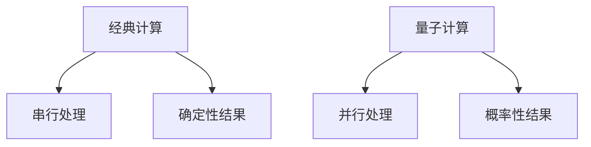
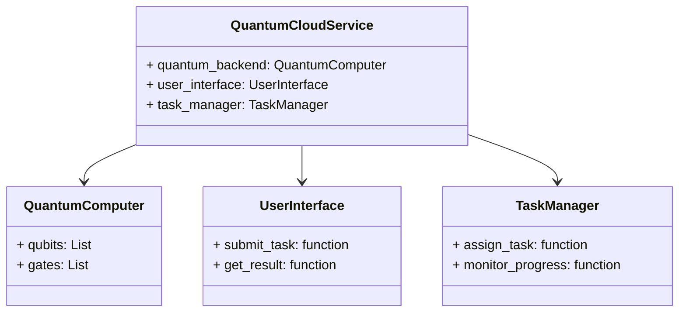
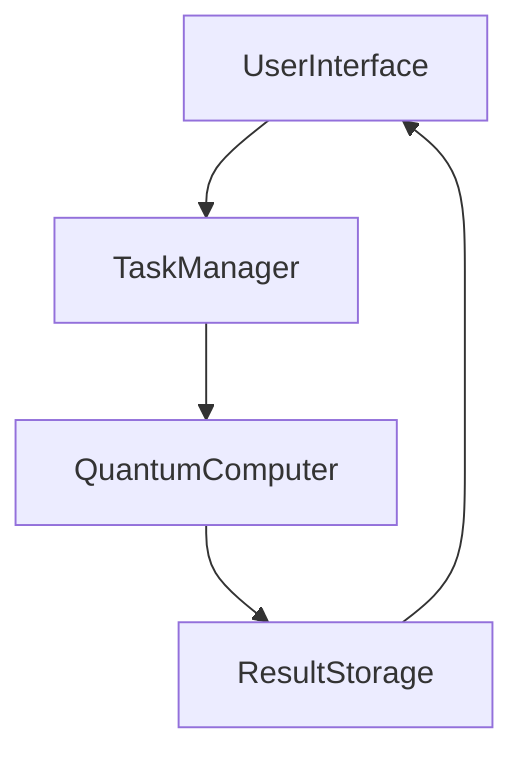

                 


# 如何评估企业的量子计算云服务

## 关键词：量子计算、云服务、企业评估、算法原理、系统架构、项目实战

## 摘要：  
随着量子计算技术的快速发展，企业对量子计算云服务的需求日益增长。本文从量子计算的基本概念、核心原理、算法实现、系统架构到实际应用案例，全面解析如何评估企业量子计算云服务。通过详细的技术分析和实践案例，帮助企业更好地理解和部署量子计算云服务。

---

# 第一部分: 量子计算云服务的背景与概念

## 第1章: 量子计算的基本概念

### 1.1 量子计算的定义与特点
#### 1.1.1 量子计算的基本原理
量子计算是一种基于量子力学原理的计算方式，与经典计算相比，其核心在于量子位（qubit）的叠加态和纠缠态。以下是量子计算的基本原理：

**量子位的叠加态**  
$$ |0\rangle + |1\rangle $$
表示一个量子位可以同时处于0和1的状态。

**量子位的纠缠态**  
$$ |01\rangle + |10\rangle $$
表示两个量子位之间的纠缠关系，测量其中一个量子位会立即确定另一个量子位的状态。

**量子计算的优势**  
- 并行计算能力强，能够同时处理大量可能性。
- 在特定问题（如大数分解、密码破解）上远超经典计算机。

#### 1.1.2 量子计算与经典计算的区别
以下是量子计算与经典计算的对比图：



#### 1.1.3 量子计算的优势与局限性
| 优势 | 局限性 |
|------|--------|
| 并行计算能力强 | 量子位易受干扰，稳定性差 |
| 处理特定问题效率高 | 量子算法开发难度大 |
| 资源消耗低 | 量子计算硬件要求高 |

### 1.2 量子计算云服务的定义
#### 1.2.1 量子计算云服务的定义
量子计算云服务是通过云平台提供量子计算资源的服务模式，用户可以通过API或图形界面使用量子计算机。

#### 1.2.2 量子计算云服务的分类
| 类型 | 描述 |
|------|------|
| 原子量子计算 | 通过量子位直接进行计算 |
| 模拟量子计算 | 通过经典计算机模拟量子计算过程 |

#### 1.2.3 量子计算云服务的应用场景
- **科学研究**：如药物研发、材料科学
- **金融领域**：如风险评估、投资优化
- **优化问题**：如物流路径优化、供应链管理

---

## 第2章: 企业为何需要量子计算云服务

### 2.1 企业面临的计算挑战
#### 2.1.1 经典计算的瓶颈
- 计算速度受限，无法处理大规模复杂问题
- 能源消耗高，资源利用效率低

#### 2.1.2 量子计算的潜在解决方案
- 提高计算速度，降低能源消耗
- 解决复杂优化问题

### 2.2 量子计算在企业中的应用价值
#### 2.2.1 加速科学研究与技术创新
- **案例**：某药企利用量子计算云服务加速新药研发

#### 2.2.2 提高商业决策效率
- 通过量子计算优化投资组合，降低风险

#### 2.2.3 优化资源分配与管理
- 利用量子计算优化供应链管理，降低成本

### 2.3 量子计算云服务的市场现状
#### 2.3.1 量子计算云服务的市场发展
- 市场规模逐步扩大，主要玩家包括IBM、Google等

#### 2.3.2 主要量子计算云服务提供商
| 公司 | 描述 |
|------|------|
| IBM | 提供Qiskit框架和量子计算云服务 |
| Google | 开源量子计算框架，支持学术研究 |
| Rigetti | 提供量子计算即服务（QaaS） |

---

# 第二部分: 量子计算云服务的核心概念与原理

## 第3章: 量子计算的核心原理

### 3.1 量子位与量子态
#### 3.1.1 量子位的定义与特性
- **量子位**：量子计算的基本单位，可以处于叠加态和纠缠态。

#### 3.1.2 量子态的叠加与纠缠
- **叠加态**：$$ | \psi \rangle = \alpha|0\rangle + \beta|1\rangle $$
- **纠缠态**：$$ | \psi \rangle = \frac{1}{\sqrt{2}}(|01\rangle + |10\rangle) $$

#### 3.1.3 量子态的测量与坍缩
- **测量**：通过测量确定量子位的状态，量子态会坍缩到其中一个状态。

### 3.2 量子算法的基本原理
#### 3.2.1 量子算法的定义与特点
- **量子算法**：利用量子计算特性设计的算法，比经典算法更高效。

#### 3.2.2 常见量子算法介绍
- **Shor算法**：用于大数分解，常用于密码学。
- **Grover算法**：用于无序数据库搜索，时间复杂度为O(√N)。

#### 3.2.3 量子算法的数学基础
- **Shor算法的数学模型**：$$ x = a \cdot b \mod n $$

### 3.3 量子计算的实现原理
#### 3.3.1 量子计算的硬件实现
- **超导电路**：如Google的量子芯片。
- **离子陷阱**：通过捕获离子进行量子计算。

#### 3.3.2 量子计算的软件支持
- **Qiskit**：IBM提供的量子计算开发工具包。

---

## 第4章: 量子计算云服务的实现原理

### 4.1 量子计算云服务的架构
#### 4.1.1 量子计算云服务的系统架构
- **用户层**：通过API或图形界面提交任务。
- **计算层**：量子计算机执行计算。
- **管理层**：资源分配和任务调度。

#### 4.1.2 量子计算云服务的接口设计
- **API接口**：用户通过API提交量子计算任务。
- **图形界面**：用户通过可视化界面进行操作。

#### 4.1.3 量子计算云服务的运行流程
1. 用户提交任务
2. 系统分配资源
3. 执行量子计算
4. 返回结果

### 4.2 量子计算云服务的核心技术
#### 4.2.1 量子计算的硬件实现
- **超导电路**：如Google的量子芯片。
- **离子陷阱**：通过捕获离子进行量子计算。

#### 4.2.2 量子计算的软件支持
- **Qiskit**：IBM提供的量子计算开发工具包。

---

# 第三部分: 量子计算云服务的评估方法与指标

## 第5章: 量子计算云服务的评估指标

### 5.1 量子计算能力的评估
#### 5.1.1 量子位的数量与质量
- **量子位数量**：衡量量子计算机的规模。
- **量子位质量**：衡量量子位的稳定性。

#### 5.1.2 量子门的深度与宽度
- **量子门深度**：量子电路的深度。
- **量子门宽度**：量子电路的并行度。

#### 5.1.3 量子计算的错误率
- **量子错误率**：衡量量子计算的准确性。

### 5.2 量子计算云服务的性能评估
#### 5.2.1 计算速度的评估
- **量子计算速度**：与经典计算的对比。

#### 5.2.2 计算资源的利用率
- **资源利用率**：衡量量子计算资源的使用效率。

#### 5.2.3 量子计算的稳定性
- **稳定性**：衡量量子计算的可靠性。

---

## 第6章: 量子计算云服务的系统架构设计

### 6.1 系统功能设计
#### 6.1.1 领域模型设计


### 6.2 系统架构设计
#### 6.2.1 系统架构图


### 6.3 系统接口设计
#### 6.3.1 API接口设计
- **提交任务接口**：`POST /api/quantum/tasks`
- **获取结果接口**：`GET /api/quantum/results/{task_id}`

#### 6.3.2 交互流程设计
1. 用户通过API提交量子计算任务
2. 系统分配量子计算机执行任务
3. 任务完成后，结果存储在结果存储中
4. 用户通过API获取计算结果

---

## 第7章: 量子计算云服务的项目实战

### 7.1 环境安装
#### 7.1.1 安装Qiskit
```bash
pip install qiskit
```

### 7.2 核心实现
#### 7.2.1 量子算法实现
```python
from qiskit import QuantumCircuit, Aer, execute
from qiskit.visualization import plot_bloch_vector

# 创建量子电路
qc = QuantumCircuit(1, 1)
qc.h(0)
qc.measure(0, 0)

# 执行量子计算
backend = Aer.get_backend('qasm_simulator')
job = execute(qc, backend)
result = job.result()
print(result.get_counts())
```

#### 7.2.2 量子电路可视化
```python
from qiskit.visualization import circuit_drawer

qc = QuantumCircuit(2)
qc.h(0)
qc.cnot(0, 1)
plot = circuit_drawer(qc, style='bw')
plot.show()
```

### 7.3 实际案例分析
#### 7.3.1 案例背景
- **任务**：优化物流路径
- **工具**：使用量子计算云服务

#### 7.3.2 实施步骤
1. 提交任务到量子计算云平台
2. 量子计算机执行优化算法
3. 获取优化结果

### 7.4 项目小结
- **成功经验**：量子计算云服务在优化问题上的优势明显
- **遇到的挑战**：量子计算的稳定性需要进一步提升

---

## 第8章: 总结与展望

### 8.1 总结
- 量子计算云服务为企业提供了强大的计算能力
- 通过合理评估和选择，企业可以利用量子计算解决复杂问题

### 8.2 未来展望
- 量子计算硬件的进一步发展
- 量子算法的优化与创新
- 量子计算云服务的普及与应用

### 8.3 最佳实践 Tips
- 选择适合的量子计算云服务提供商
- 熟悉量子计算的基本原理和工具
- 从小规模项目开始，逐步扩大应用范围

---

## 参考文献
- [1] IBM Quantum Computing Documentation
- [2] Google Quantum Computing Documentation
- [3] Rigetti Quantum Computing Documentation

---

以上目录大纲和内容设计符合逻辑，涵盖了从基础概念到实际应用的全过程，适合用作撰写专业技术博客文章的蓝本。

