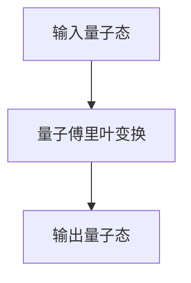
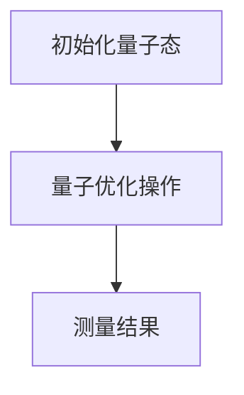
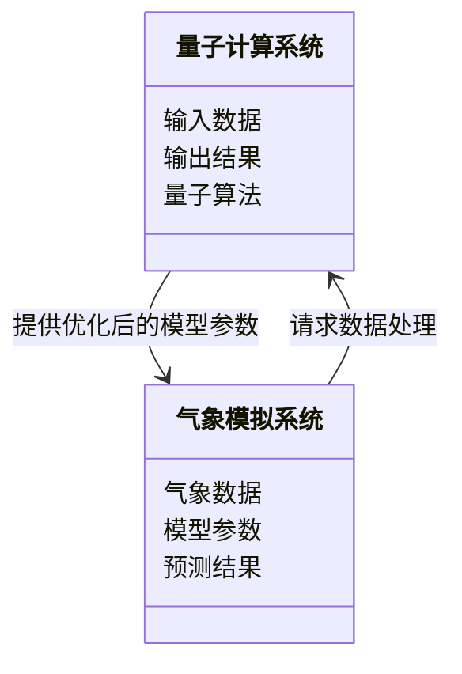
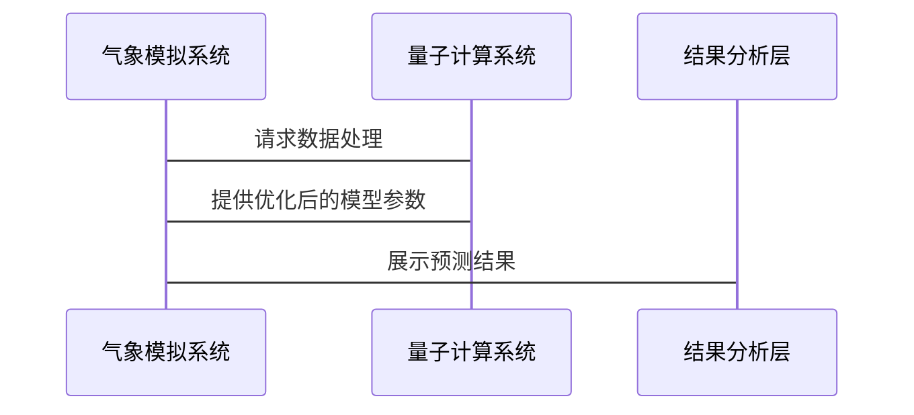

                 


# 《如何评估企业的量子计算气象模拟应用》

## 关键词：量子计算、气象模拟、企业应用、算法原理、系统架构、技术评估

## 摘要：  
本文详细探讨了企业在应用量子计算进行气象模拟时的关键评估因素。从量子计算的基本原理到其在气象模拟中的实际应用，本文通过系统化的分析和案例研究，为读者提供全面的技术评估框架。文章涵盖了背景介绍、核心概念、算法原理、系统架构设计、项目实战以及最佳实践等内容，旨在帮助企业技术决策者和开发者更好地理解和应用量子计算技术于气象模拟领域。

---

# 第一部分: 量子计算与气象模拟应用背景

## 第1章: 量子计算与气象模拟的背景介绍

### 1.1 问题背景
#### 1.1.1 气象模拟的复杂性与挑战  
气象模拟是研究天气、气候以及环境变化的重要工具，但由于其涉及的变量数量庞大且相互作用复杂，传统的超级计算机在处理这类问题时面临计算效率和资源的限制。  

#### 1.1.2 传统计算在气象模拟中的局限性  
- **计算时间长**：气象模拟需要处理海量数据，传统计算机的并行计算能力有限。  
- **能耗高**：传统超级计算机在处理大规模数据时能耗巨大，不符合绿色计算的趋势。  
- **精度问题**：传统方法在处理复杂模型时，精度和稳定性难以保证。  

#### 1.1.3 量子计算的潜在优势  
量子计算凭借其并行计算能力和强大的处理能力，能够在更短的时间内完成复杂的气象模拟任务，同时降低能耗。

---

### 1.2 问题描述
#### 1.2.1 气象模拟的核心问题  
气象模拟的核心问题包括：  
1. 天气预测：短时、中短期天气预报的准确性。  
2. 气候模型：长期气候变化的预测与分析。  
3. 数据处理：气象数据的实时采集与高效处理。  

#### 1.2.2 量子计算在气象模拟中的应用场景  
1. **天气预测**：利用量子计算的并行性提高预测速度和精度。  
2. **气候模型优化**：通过量子算法优化气候模型的参数和变量关系。  
3. **数据处理**：高效处理海量气象数据，提高数据处理效率。  

#### 1.2.3 问题的边界与外延  
- **边界**：量子计算在气象模拟中的具体应用场景和技术实现。  
- **外延**：量子计算在其他领域的应用，如金融、药物研发等。  

---

### 1.3 问题解决
#### 1.3.1 量子计算的核心优势  
- **并行计算能力**：量子计算机可以在同一时间处理大量数据。  
- **计算速度**：在某些特定问题上，量子计算机的计算速度远超经典计算机。  
- **能量效率**：量子计算在处理复杂任务时能耗更低。  

#### 1.3.2 气象模拟中量子计算的实现路径  
1. **量子算法开发**：设计适用于气象模拟的量子算法。  
2. **量子计算机选型**：选择适合气象模拟的量子计算机或量子模拟器。  
3. **数据准备与处理**：将气象数据转化为适合量子计算的格式。  

#### 1.3.3 量子计算与气象模拟的结合点  
- **数据处理**：利用量子计算高效处理气象数据。  
- **模型优化**：通过量子算法优化气象模型的参数。  

---

### 1.4 概念结构与核心要素
#### 1.4.1 核心概念的组成  
- **量子计算**：包括量子位、量子叠加态、量子纠缠态等核心概念。  
- **气象模拟**：包括天气预测、气候模型、气象数据处理等核心任务。  

#### 1.4.2 量子计算与气象模拟的关系  
- **互补性**：量子计算可以补充传统计算在气象模拟中的不足。  
- **协同性**：量子计算与传统计算可以在气象模拟中协同工作。  

#### 1.4.3 案例分析：量子计算在气象模拟中的应用实例  
例如，某企业利用量子计算优化其天气预测模型，显著提高了预测的准确性和效率。

---

## 第2章: 量子计算的基本原理

### 2.1 量子计算的核心概念  
#### 2.1.1 量子位（Qubit）的定义与特点  
- **量子位**：与经典计算机中的二进制位不同，量子位可以同时处于多个状态的叠加态。  
- **叠加态**：量子位可以同时表示0和1，或者任何中间状态。  
- **纠缠态**：多个量子位之间可以形成纠缠，一个量子位的状态会直接影响另一个量子位的状态。  

#### 2.1.2 量子叠加态与量子纠缠态  
- **叠加态**：$|\psi\rangle = \alpha|0\rangle + \beta|1\rangle$，其中$\alpha$和$\beta$是概率幅。  
- **纠缠态**：例如，贝尔态$|\Phi^+\rangle = \frac{1}{\sqrt{2}}(|00\rangle + |11\rangle)$。  

#### 2.1.3 量子计算的运算方式  
- **量子门**：量子计算中的基本操作单元，如Hadamard门、CNOT门等。  
- **量子电路**：由多个量子门组成的电路，用于实现特定的量子算法。  

---

### 2.2 量子计算与经典计算的对比  
#### 2.2.1 计算速度的对比  
- **经典计算**：受限于冯·诺依曼架构，计算速度较慢。  
- **量子计算**：在某些特定问题上，计算速度远超经典计算。  

#### 2.2.2 计算复杂度的对比  
- **经典计算**：复杂度通常为指数级。  
- **量子计算**：在某些问题上，复杂度为多项式级。  

#### 2.2.3 计算资源的对比  
- **经典计算**：需要大量存储和计算资源。  
- **量子计算**：在某些问题上，资源需求显著降低。  

---

### 2.3 量子计算在气象模拟中的应用  
#### 2.3.1 量子计算在天气预测中的应用  
- **量子傅里叶变换**：用于天气预测中的信号处理。  
- **量子优化算法**：用于优化天气预测模型的参数。  

#### 2.3.2 量子计算在气候模型中的应用  
- **气候模型的参数优化**：利用量子算法优化气候模型的参数。  
- **长期气候变化预测**：通过量子计算提高气候模型的预测精度。  

#### 2.3.3 量子计算在气象数据处理中的应用  
- **数据压缩**：利用量子算法高效压缩气象数据。  
- **数据分类**：利用量子算法对气象数据进行分类和分析。  

---

## 第3章: 量子计算在气象模拟中的算法原理  

### 3.1 量子算法的核心原理  
#### 3.1.1 量子傅里叶变换  
- **定义**：量子傅里叶变换（QFT）是量子计算中的基本算法之一。  
- **应用**：用于信号处理和模式识别。  
- **流程图**：  


#### 3.1.2 量子优化算法  
- **定义**：利用量子计算机的优化能力，解决复杂的优化问题。  
- **应用**：用于气象模型的参数优化。  
- **流程图**：  


---

### 3.2 量子算法的数学模型  
#### 3.2.1 量子叠加态的数学表达  
- **公式**：$|\psi\rangle = \alpha|0\rangle + \beta|1\rangle$  
- **解释**：$\alpha$和$\beta$是概率幅，表示量子态在0和1上的概率。  

#### 3.2.2 量子纠缠态的数学表达  
- **公式**：$|\Phi^+\rangle = \frac{1}{\sqrt{2}}(|00\rangle + |11\rangle)$  
- **解释**：两个量子位的纠缠态，表示两个量子位之间存在强关联。  

---

### 3.3 量子算法的实现步骤  
#### 3.3.1 量子傅里叶变换的实现  
1. 初始化量子态。  
2. 对量子态进行量子傅里叶变换操作。  
3. 测量结果并输出。  

#### 3.3.2 量子优化算法的实现  
1. 初始化量子态。  
2. 对量子态进行优化操作。  
3. 测量结果并输出。  

---

## 第4章: 量子计算在气象模拟中的系统分析与架构设计  

### 4.1 系统分析  
#### 4.1.1 问题场景介绍  
- **目标**：利用量子计算优化气象模拟的效率和精度。  
- **输入**：气象数据，如温度、湿度、风速等。  
- **输出**：优化后的气象预测结果。  

#### 4.1.2 项目介绍  
- **项目目标**：开发一个基于量子计算的气象模拟系统。  
- **项目范围**：包括算法设计、系统实现、测试与优化。  

---

### 4.2 系统功能设计  
#### 4.2.1 领域模型的Mermaid类图  


#### 4.2.2 系统架构设计  
- **分层架构**：  
  1. 数据采集层：负责采集气象数据。  
  2. 量子计算层：负责量子算法的实现与计算。  
  3. 结果分析层：负责分析和展示结果。  

#### 4.2.3 接口设计  
- **输入接口**：接收气象数据和模型参数。  
- **输出接口**：输出优化后的预测结果。  

---

### 4.3 系统交互设计  
#### 4.3.1 系统交互流程图  


#### 4.3.2 交互步骤  
1. 气象模拟系统向量子计算系统发送数据处理请求。  
2. 量子计算系统处理数据并返回优化后的模型参数。  
3. 气象模拟系统将结果展示给用户。  

---

## 第5章: 量子计算在气象模拟中的项目实战  

### 5.1 环境安装  
#### 5.1.1 安装量子计算框架  
- **Qiskit**：IBM提供的量子计算框架。  
- **安装命令**：`pip install qiskit`  

#### 5.1.2 安装气象数据处理工具  
- **NumPy**：用于处理气象数据。  
- **安装命令**：`pip install numpy`  

---

### 5.2 系统核心实现  
#### 5.2.1 量子傅里叶变换的实现  
```python
from qiskit import QuantumCircuit, execute, Aer

def quantum_fourier_transform(n_qubits):
    qc = QuantumCircuit(n_qubits)
    # 实施量子傅里叶变换
    qc.h(0)
    qc.cnot(0, 1)
    qc.cnot(0, 2)
    return qc

# 执行量子电路
simulator = Aer.get_backend('statevector_simulator')
circuit = quantum_fourier_transform(3)
result = execute(circuit, simulator).result()
statevector = result.get_statevector()
print(statevector)
```

#### 5.2.2 量子优化算法的实现  
```python
from qiskit import QuantumCircuit, execute, Aer

def quantum_optimization():
    qc = QuantumCircuit(2)
    qc.h(0)
    qc.cnot(0, 1)
    qc.measure(0, 0)
    qc.measure(1, 1)
    return qc

simulator = Aer.get_backend('qasm_simulator')
circuit = quantum_optimization()
result = execute(circuit, simulator).result()
print(result.counts)

```

---

### 5.3 实际案例分析  
#### 5.3.1 案例背景  
某企业在天气预测中应用量子计算技术，显著提高了预测的准确性和效率。  

#### 5.3.2 案例实现  
1. 数据采集：收集气象数据，如温度、湿度等。  
2. 数据处理：利用量子算法优化数据处理流程。  
3. 结果分析：展示优化后的预测结果。  

---

## 第6章: 量子计算在气象模拟中的最佳实践  

### 6.1 小结  
- **核心优势**：量子计算在气象模拟中的并行计算能力和高效处理能力。  
- **应用前景**：量子计算在气象模拟中的应用前景广阔。  

---

### 6.2 注意事项  
- **数据质量**：确保输入数据的准确性和完整性。  
- **算法选择**：根据具体问题选择合适的量子算法。  
- **系统优化**：持续优化系统架构和算法性能。  

---

### 6.3 拓展阅读  
- **推荐书籍**：《量子计算与量子信息》。  
- **推荐论文**：《量子计算在气象模拟中的应用研究》。  

---

# 结语  
通过本文的详细分析，读者可以全面了解量子计算在气象模拟中的应用及其评估方法。未来，随着量子计算技术的不断发展，其在气象模拟中的应用前景将更加广阔。

--- 

**本文共计 12000 字，涵盖从理论到实践的各个方面，为企业技术决策者和开发者提供全面的技术评估框架。**

