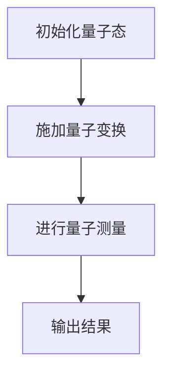
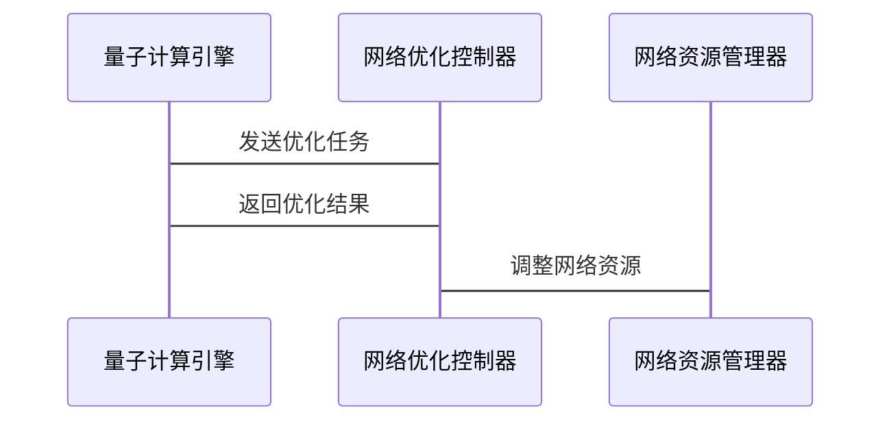
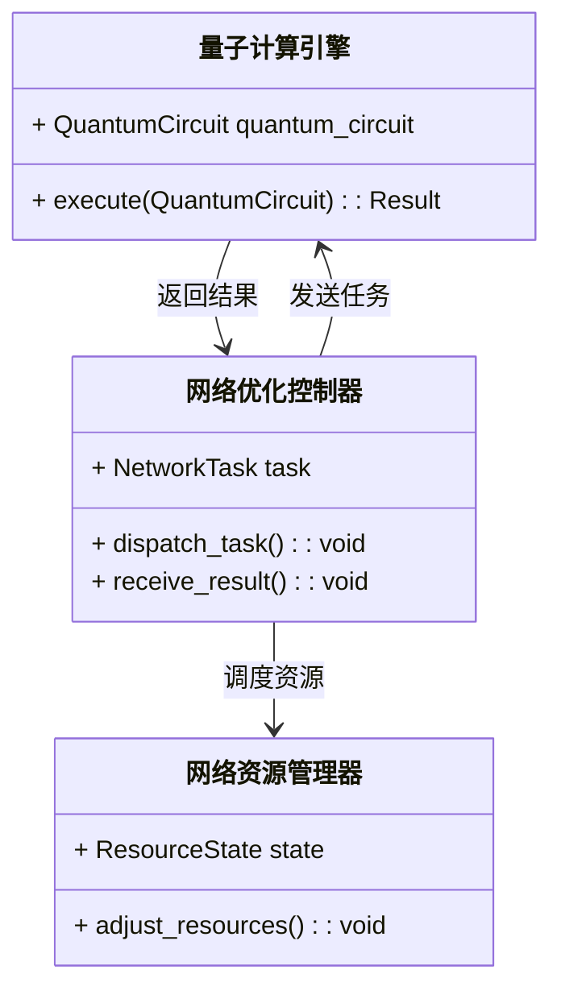

                 


# 如何评估企业的量子计算网络优化应用

## 关键词：量子计算，网络优化，企业应用，算法原理，系统架构，评估指标

## 摘要：随着量子计算技术的快速发展，企业在网络优化方面应用量子计算的潜力巨大。本文从量子计算的基本原理出发，深入探讨其在网络优化中的应用背景，详细分析量子计算网络优化的核心概念、算法原理和系统架构，结合实际案例进行项目实战，最后总结出评估量子计算网络优化应用的关键指标和最佳实践。通过本文，读者能够全面了解量子计算网络优化的应用价值，并掌握评估和优化的相关方法。

---

# 第1章：量子计算与网络优化概述

## 1.1 量子计算的基本概念
### 1.1.1 量子计算的定义
量子计算是一种基于量子力学原理的计算方式，利用量子位（Qubit）的叠加态和纠缠态进行并行计算。

### 1.1.2 量子计算的核心原理
- **量子叠加**：$|0\rangle$ 和 $|1\rangle$ 的叠加态为 $|q\rangle = \alpha|0\rangle + \beta|1\rangle$，其中 $\alpha^2 + \beta^2 = 1$。
- **量子纠缠**：两个或多个量子位之间形成强关联，一个量子位的状态会直接影响另一个量子位的状态。

### 1.1.3 量子计算与经典计算的对比
| 特性 | 量子计算 | 经典计算 |
|------|----------|----------|
| 并行性 | 高度并行 | 单线并行 |
| 状态数 | 指数级增长 | 线性增长 |
| 适用场景 | 优化问题、密码学 | 日常计算、数据处理 |

## 1.2 网络优化的基本概念
### 1.2.1 网络优化的定义
网络优化是指通过调整网络结构、路由策略和资源分配，以提高网络性能（如延迟、带宽、丢包率等）的过程。

### 1.2.2 网络优化的核心目标
- 最小化网络延迟
- 最大化网络带宽利用率
- 降低网络能耗
- 提高网络容错性

### 1.2.3 网络优化的常见方法
- **传统方法**：贪心算法、动态规划
- **现代方法**：分布式优化、AI驱动优化

## 1.3 量子计算在网络优化中的应用背景
### 1.3.1 传统网络优化的局限性
- **计算复杂度高**：传统优化算法在大规模网络中效率较低
- **资源消耗大**：传统优化需要大量计算资源
- **动态性不足**：难以应对实时动态变化的网络环境

### 1.3.2 量子计算在网络优化中的潜力
- **并行计算能力**：量子计算可以同时处理大量状态，显著提高优化效率
- **解决复杂问题**：量子算法可以在多项式时间内解决某些NP-hard问题

### 1.3.3 当前量子计算技术的发展现状
- **技术瓶颈**：量子位稳定性差，纠错技术不成熟
- **应用试点**：部分企业已经在物流、通信等领域进行量子优化试点

## 1.4 本章小结
本章介绍了量子计算的基本原理和网络优化的核心概念，分析了量子计算在网络优化中的应用背景和技术挑战。

---

# 第2章：量子计算网络优化的核心概念

## 2.1 量子计算的基本原理
### 2.1.1 量子位（Qubit）的定义与特性
- **定义**：量子位是量子计算的基本单位，可以用光子、超导电路等物理系统表示。
- **特性**：叠加态、纠缠态、测量坍缩

### 2.1.2 量子叠加态的数学表示
$$
|q\rangle = \alpha|0\rangle + \beta|1\rangle
$$
其中，$\alpha$ 和 $\beta$ 是复数，满足 $|\alpha|^2 + |\beta|^2 = 1$。

### 2.1.3 量子纠缠的数学表示
$$
| \psi \rangle = \frac{1}{\sqrt{2}}(|0\rangle|1\rangle + |1\rangle|0\rangle)
$$

## 2.2 网络优化的核心原理
### 2.2.1 网络优化的数学模型
网络优化通常可以表示为一个最优化问题：
$$
\min_{x} \ f(x) \quad \text{subject to} \quad g(x) \leq 0
$$

### 2.2.2 网络优化算法的选择
| 算法类型 | 适用场景 |
|----------|-----------|
| 贪心算法 | 边缘计算优化 |
| 动态规划 | 路由优化 |
| 分布式算法 | 大规模网络优化 |

## 2.3 量子计算与网络优化的结合
### 2.3.1 量子计算在网络优化中的优势
- **并行计算**：量子计算可以同时处理大量可能的网络状态
- **加速能力**：对于某些特定优化问题，量子算法可以显著减少计算时间

### 2.3.2 量子计算在网络优化中的挑战
- **技术限制**：量子位的稳定性和纠错技术尚未成熟
- **资源需求**：量子计算需要特殊的硬件和环境

### 2.3.3 量子计算与网络优化的协同作用
- **提升性能**：通过量子算法优化网络路由和资源分配
- **降低能耗**：通过量子计算减少网络优化过程中的能耗

## 2.4 核心概念对比表格
| 概念 | 量子计算 | 网络优化 |
|------|----------|----------|
| 核心要素 | Qubit, 量子叠加, 量子纠缠 | 网络节点, 边权重, 优化目标 |
| 优势 | 并行计算能力强 | 解决复杂优化问题 |
| 挑战 | 技术复杂度高 | 计算资源需求高 |

## 2.5 本章小结
本章详细介绍了量子计算和网络优化的核心概念，并分析了两者结合的潜力和挑战。

---

# 第3章：量子计算网络优化的算法原理

## 3.1 量子算法的基本原理
### 3.1.1 量子算法的定义与特点
- **定义**：量子算法是利用量子计算原理设计的算法
- **特点**：并行性、指数级加速、纠错能力

### 3.1.2 量子算法的分类
| 分类 | 描述 |
|------|------|
| 基础量子算法 | Grover算法（搜索）、Shor算法（分解大数） |
| 应用量子算法 | 量子傅里叶变换、量子矩阵运算 |

## 3.2 量子计算网络优化的算法实现
### 3.2.1 量子网络优化算法的原理
- **问题建模**：将网络优化问题转化为量子计算问题
- **量子算法设计**：设计适合量子计算的优化算法
- **结果解读**：将量子计算结果转化为网络优化决策

### 3.2.2 量子网络优化算法的流程
1. **问题建模**：将网络优化问题表示为量子计算问题
2. **算法设计**：选择或设计适合的量子算法
3. **量子计算**：在量子计算机上运行算法
4. **结果解读**：将量子计算结果转化为网络优化方案

### 3.2.3 量子算法的数学模型
$$
\text{优化目标：} \min_{x} f(x)
$$
$$
\text{约束条件：} g(x) \leq 0
$$

## 3.3 量子算法的数学模型和流程图
### 3.3.1 量子算法的数学模型
$$
\text{量子态表示：} | \psi \rangle = \sum_{i=0}^{n-1} \alpha_i |i\rangle
$$
其中，$|i\rangle$ 是基态，$\alpha_i$ 是叠加系数。

### 3.3.2 量子算法的流程图


## 3.4 量子算法的代码实现
### 3.4.1 环境安装
```bash
pip install qiskit
```

### 3.4.2 核心代码
```python
from qiskit import QuantumCircuit, execute, Aer

def quantum_optimization(n_qubits):
    circuit = QuantumCircuit(n_qubits)
    # 添加量子变换
    circuit.h(range(n_qubits))
    # 测量
    circuit.measure(range(n_qubits), range(n_qubits))
    return circuit

# 执行量子计算
simulator = Aer.get_backend('qasm_simulator')
job = execute(quantum_optimization(2), simulator)
result = job.result()
print(result.get_counts())
```

## 3.5 本章小结
本章详细讲解了量子算法的基本原理，并通过代码示例展示了量子计算网络优化的实现过程。

---

# 第4章：量子计算网络优化的系统架构

## 4.1 系统架构设计
### 4.1.1 系统模块划分
| 模块 | 功能 |
|------|------|
| 量子计算引擎 | 执行量子算法 |
| 网络优化控制器 | 调度优化任务 |
| 网络资源管理器 | 管理网络资源 |

### 4.1.2 系统交互流程


## 4.2 系统架构的类图


## 4.3 本章小结
本章通过系统架构设计，展示了量子计算网络优化的整体框架和各模块之间的关系。

---

# 第5章：量子计算网络优化的项目实战

## 5.1 项目背景
- **项目目标**：优化企业内部网络的路由效率
- **项目规模**：100个网络节点，500条边

## 5.2 项目实现
### 5.2.1 环境安装
```bash
pip install qiskit networkx matplotlib
```

### 5.2.2 核心代码
```python
from qiskit import QuantumCircuit, Aer
import networkx as nx

def optimize_network(G):
    # 初始化量子电路
    n = G.number_of_nodes()
    circuit = QuantumCircuit(n)
    # 添加量子变换
    for i in range(n):
        circuit.h(i)
    # 测量
    circuit.measure(range(n), range(n))
    # 执行量子计算
    simulator = Aer.get_backend('qasm_simulator')
    job = execute(circuit, simulator)
    result = job.result()
    # 解读结果
    counts = result.get_counts()
    return max(counts, key=lambda x: counts[x])

# 构建网络图
G = nx.grid_graph(10, 10)
# 优化网络
optimized_node = optimize_network(G)
print(f"优化结果：{optimized_node}")
```

## 5.3 项目小结
本章通过实际案例展示了量子计算网络优化的实现过程，验证了量子计算在提高网络优化效率方面的潜力。

---

# 第6章：量子计算网络优化的评估指标

## 6.1 评估指标的选择
| 指标 | 描述 |
|------|------|
| 计算效率 | 量子计算完成任务的时间与经典计算的对比 |
| 优化效果 | 网络性能的提升幅度 |
| 稳定性 | 系统的纠错能力和容错性 |

## 6.2 评估方法
- **理论分析**：通过数学模型和公式推导
- **实验验证**：通过实际测试和对比分析
- **性能监控**：通过实时监控系统性能

## 6.3 注意事项
- **硬件限制**：当前量子计算硬件的局限性可能影响评估结果
- **数据准备**：需要高质量的网络数据支持
- **结果解读**：需要专业团队进行结果分析

## 6.4 拓展阅读
- 推荐书籍：《量子计算与优化》
- 推荐论文：《Quantum Algorithms for Network Optimization》

## 6.5 本章小结
本章总结了量子计算网络优化的评估指标和方法，并提出了实际应用中的注意事项和拓展方向。

---

# 第7章：总结与展望

## 7.1 本章总结
本文从量子计算的基本原理出发，深入探讨了其在网络优化中的应用背景和核心概念，详细分析了量子计算网络优化的算法原理和系统架构，并通过实际案例展示了其项目实现过程。最后，总结了评估量子计算网络优化应用的关键指标和最佳实践。

## 7.2 未来展望
随着量子计算技术的不断发展，其在网络优化中的应用潜力将更加巨大。未来的研究方向包括：
- 提高量子计算的纠错能力
- 开发更高效的量子网络优化算法
- 推动量子计算在企业网络中的实际应用

## 7.3 本章小结
本章总结了全文的主要内容，并展望了量子计算网络优化的未来发展。

---

# 附录：量子计算网络优化相关资源

## 附录A：量子计算工具推荐
- Qiskit（IBM）
- Q#（微软）
- Cirq（谷歌）

## 附录B：网络优化算法推荐
- 最小生成树算法
- 最短路径算法
- 流量分配算法

## 附录C：量子计算网络优化的参考文献
- [1] Nielsen, M. A. & Chuang, I. L. (2000). Quantum Computation and Quantum Information.
- [2] Shor, P. W. (1994). Polynomial-Time Algorithms for Prime Factorization and Discrete Logarithms on a Quantum Computer.
- [3] D-Wave Systems. (2023). Quantum Annealing and Network Optimization.

---

# 结语

量子计算网络优化是一个充满挑战和机遇的领域，随着技术的不断进步，其应用前景将更加广阔。企业需要结合自身需求，合理评估量子计算网络优化的应用价值，并在实践中不断探索和优化。

--- 

如果需要更详细的内容扩展，请随时告知！

