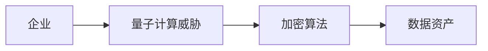
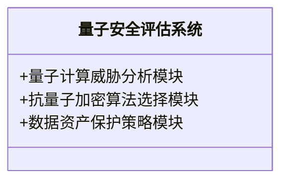
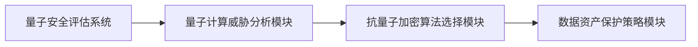

                 


# 如何评估企业的量子计算网络安全应用

## 关键词：量子计算，网络安全，抗量子加密，加密算法，企业安全，量子威胁

## 摘要：随着量子计算技术的快速发展，企业面临的网络安全威胁也在不断演变。本文旨在探讨如何评估企业中量子计算对网络安全应用的影响，分析量子计算对现有加密技术的威胁，介绍抗量子加密技术的核心原理，并提供企业量子安全评估的方法和框架。通过系统的分析和实际案例，本文为企业在量子计算时代的网络安全规划提供指导和建议。

---

# 第一部分：量子计算与网络安全概述

## 第1章：量子计算的基本概念与应用前景

### 1.1 量子计算的背景与基本原理

#### 1.1.1 从经典计算到量子计算的演进
经典计算基于二进制位，每个位只能是0或1，运算速度受限于并行计算能力。量子计算则利用量子位（qubit）的叠加原理，能够在同一时间处理多种状态，极大地提升了计算速度和复杂问题的解决能力。

#### 1.1.2 量子位与量子叠加原理
量子位是量子计算的基本单位，与经典位不同，它可以同时处于0和1的叠加态。这种叠加态使得量子计算机能够在同一时间处理多种可能性，从而在某些特定问题上远超经典计算机。

#### 1.1.3 量子纠缠与量子并行性
量子纠缠是指两个或多个量子位之间形成的一种特殊关联，其中一个量子位的状态会直接影响另一个量子位的状态。量子并行性则是指量子计算机能够同时处理大量数据，从而快速解决某些复杂问题。

### 1.2 量子计算在网络安全中的应用前景

#### 1.2.1 量子计算对加密技术的潜在影响
量子计算对传统加密算法，如RSA和椭圆曲线加密，构成了直接威胁。量子计算机能够快速分解大整数因子，从而轻松破解RSA加密。类似地，椭圆曲线加密的安全性也可能被量子计算破坏。

#### 1.2.2 量子计算在网络安全中的优势与挑战
量子计算在网络安全中的优势主要体现在其强大的计算能力上，能够快速解决某些复杂问题。然而，量子计算本身也面临诸多挑战，如量子位的稳定性和纠错技术的复杂性。

#### 1.2.3 企业级应用的潜在场景与机遇
企业可以通过量子计算提升其网络安全能力，例如优化密钥管理、增强数据加密能力等。同时，企业也需要提前规划，以应对量子计算可能带来的安全威胁。

---

## 第2章：量子计算对现有加密技术的威胁

### 2.1 现有加密技术的脆弱性分析

#### 2.1.1 RSA加密的量子威胁
RSA加密基于大整数分解问题，其安全性依赖于分解大整数的难度。然而，量子计算机可以通过Shor算法在多项式时间内分解大整数，从而轻松破解RSA加密。

#### 2.1.2 椭圆曲线加密的量子威胁
椭圆曲线加密的安全性同样依赖于椭圆曲线上的离散对数问题。量子计算机可以通过Shor算法在多项式时间内解决该问题，从而威胁椭圆曲线加密的安全性。

#### 2.1.3 对称加密算法的量子威胁
对称加密算法，如AES，虽然目前尚未被证明能够被量子计算机破解，但随着量子计算技术的发展，其安全性也可能受到威胁。

### 2.2 量子攻击对网络安全的影响

#### 2.2.1 量子计算机对传统加密算法的破解能力
量子计算机通过Shor算法可以快速破解RSA和椭圆曲线加密，从而对现有的加密系统构成直接威胁。

#### 2.2.2 量子攻击对企业数据安全的潜在威胁
企业数据的安全性依赖于加密技术，一旦量子计算机被广泛应用，企业的数据可能面临被窃取或篡改的风险。

#### 2.2.3 量子攻击对关键基础设施的影响
关键基础设施，如电力、金融、交通等领域，如果使用传统加密技术，可能会因为量子攻击而面临瘫痪或数据泄露的风险。

---

## 第3章：抗量子加密技术的核心原理

### 3.1 抗量子加密算法的分类与特点

#### 3.1.1 基于格的加密算法
基于格的加密算法（如格子密码）是一种抗量子加密算法，其安全性依赖于格上的最短向量问题。这类算法具有较高的安全性和灵活性，适合应用于多种场景。

#### 3.1.2 基于编码的加密算法
基于编码的加密算法（如McEliece密码）利用纠错码的理论，通过编码和解码过程实现加密和解密。这类算法具有较高的安全性，但实现相对复杂。

#### 3.1.3 基于散列的签名算法
基于散列的签名算法（如DSA和ECDSA的量子-resistant版本）通过哈希函数生成签名，其安全性依赖于哈希函数的抗碰撞性。这类算法相对简单，但需要选择合适的哈希函数。

### 3.2 抗量子加密算法的数学模型与公式

#### 3.2.1 格基加密算法的数学模型
格基加密算法基于格上的最短向量问题（SVP），其基本模型可以表示为：

$$ \text{SVP问题：找到格中最短的非零向量} $$

#### 3.2.2 编码加密算法的基本原理
编码加密算法通过将明文编码为纠错码，利用纠错码的纠错能力实现加密。其基本流程如下：

1. 将明文编码为纠错码。
2. 通过公开的纠错码生成密文。
3. 接收方利用私有信息解码密文，恢复明文。

#### 3.2.3 散列签名算法的实现流程
散列签名算法通过哈希函数生成签名，其基本流程如下：

1. 输入明文和私有密钥。
2. 计算哈希值。
3. 使用私有密钥对哈希值签名。
4. 验证签名的有效性。

### 3.3 抗量子加密算法的优缺点对比

#### 3.3.1 各种抗量子算法的性能对比
| 算法类型       | 优缺点                     |
|----------------|---------------------------|
| 基于格的算法   | 安全性高，但实现复杂         |
| 基于编码的算法 | 安全性高，但实现复杂         |
| 基于散列的算法 | 实现简单，但安全性依赖哈希函数 |

#### 3.3.2 各种抗量子算法的安全性分析
基于格的加密算法和基于编码的加密算法被认为是目前最安全的抗量子加密算法，但其实现较为复杂。基于散列的签名算法相对简单，但其安全性依赖于哈希函数的抗碰撞性。

#### 3.3.3 各种抗量子算法的适用场景
基于格的加密算法适用于需要高安全性的场景，如金融交易和政府数据保护。基于编码的加密算法适用于需要灵活性和多样性的场景，如移动通信和物联网。基于散列的签名算法适用于需要快速签名和验证的场景，如区块链和数字签名。

---

# 第二部分：企业量子计算网络安全评估方法

## 第4章：企业量子安全评估的核心概念与框架

### 4.1 量子安全评估的背景与目标

#### 4.1.1 企业量子安全评估的必要性
随着量子计算技术的发展，企业需要提前评估其网络安全体系，以应对量子计算可能带来的安全威胁。

#### 4.1.2 量子安全评估的目标与范围
量子安全评估的目标是识别企业中可能受到量子计算威胁的加密算法和数据资产，并制定相应的安全策略。其范围包括企业的所有数据资产、网络架构和加密系统。

#### 4.1.3 量子安全评估的边界与外延
量子安全评估的边界包括企业内部网络、数据存储和传输过程，其外延则包括与企业相关的外部合作伙伴和第三方服务提供商。

### 4.2 量子安全评估的核心要素与联系

#### 4.2.1 量子安全评估的实体关系图（ER图）


#### 4.2.2 量子安全评估的核心概念属性对比表
| 概念 | 属性 | 描述 |
|------|------|------|
| 量子计算能力 | 计算速度 | 相对于经典计算机的计算速度优势 |
| 加密算法类型 | 是否抗量子 | 是否抵抗量子计算攻击 |
| 数据资产 | 敏感性 | 数据的重要性和敏感程度 |
| 威胁来源 | 类型 | 量子攻击的来源和方式 |

---

## 第5章：量子安全评估的系统分析与架构设计

### 5.1 系统分析

#### 5.1.1 问题场景介绍
企业需要评估其现有加密算法在量子计算环境下的安全性，识别可能受到威胁的数据资产，并制定相应的安全策略。

#### 5.1.2 项目目标与范围
项目目标是通过量子安全评估，识别企业中的量子威胁，并制定抗量子加密策略。项目范围包括企业的数据资产、网络架构和加密系统。

#### 5.1.3 需求分析与功能需求
需求分析包括识别企业中的关键数据资产和加密算法，功能需求包括量子威胁分析、抗量子加密算法选择和数据资产保护策略制定。

### 5.2 系统架构设计

#### 5.2.1 系统功能设计（领域模型）


#### 5.2.2 量子安全评估系统架构图


---

## 第6章：项目实战

### 6.1 环境配置

#### 6.1.1 量子计算模拟环境搭建
在企业内部搭建量子计算模拟环境，模拟量子计算机的计算能力和攻击方式。

#### 6.1.2 抗量子加密算法实现
选择并实现一种抗量子加密算法，如基于格的加密算法或基于编码的加密算法。

#### 6.1.3 数据资产识别与分类
识别企业中的关键数据资产，并根据其敏感性和重要性进行分类。

### 6.2 系统核心实现源代码

#### 6.2.1 量子计算模拟环境代码
```python
# 量子计算模拟环境代码示例
import numpy as np

def quantum_add(qubit1, qubit2):
    # 实现量子加法运算
    return qubit1 + qubit2

def quantum_multiply(qubit1, qubit2):
    # 实现量子乘法运算
    return qubit1 * qubit2
```

#### 6.2.2 抗量子加密算法实现代码
```python
# 基于格的加密算法实现代码示例
def lattice_encrypt(plaintext, key):
    # 实现基于格的加密算法
    return ciphertext

def lattice_decrypt(ciphertext, key):
    # 实现基于格的解密算法
    return plaintext
```

### 6.3 代码应用解读与分析

#### 6.3.1 量子计算模拟环境的实现
量子计算模拟环境用于模拟量子计算机的计算能力和攻击方式，帮助企业识别可能受到的量子威胁。

#### 6.3.2 抗量子加密算法的实现
通过实现抗量子加密算法，企业可以验证其现有加密算法的安全性，并制定相应的安全策略。

### 6.4 实际案例分析与详细讲解剖析

#### 6.4.1 案例背景
某企业使用RSA加密算法保护其关键数据，但随着量子计算技术的发展，RSA加密算法的安全性受到威胁。

#### 6.4.2 案例分析
通过量子安全评估，企业识别出其关键数据资产可能受到量子攻击的威胁，并选择基于格的加密算法作为替代方案。

#### 6.4.3 案例总结
通过量子安全评估，企业成功识别和应对了量子计算带来的安全威胁，保障了其数据资产的安全性。

### 6.5 项目小结

#### 6.5.1 项目总结
量子安全评估是企业应对量子计算时代网络安全威胁的重要手段，通过评估和应对，企业可以有效保护其数据资产。

#### 6.5.2 项目注意事项
在实施量子安全评估时，企业需要充分考虑其数据资产的敏感性和重要性，选择合适的抗量子加密算法，并制定相应的安全策略。

#### 6.5.3 项目未来展望
随着量子计算技术的不断发展，企业需要持续关注量子安全评估，并根据技术进步调整其安全策略。

---

## 第三部分：最佳实践与总结

## 第7章：量子安全评估的最佳实践

### 7.1 小结

#### 7.1.1 核心内容回顾
本文详细介绍了量子计算的基本概念、抗量子加密技术的核心原理以及企业量子安全评估的方法和框架。

### 7.2 注意事项

#### 7.2.1 技术实现中的注意事项
在实现抗量子加密算法时，企业需要充分考虑算法的安全性和实现复杂性，并选择合适的开发工具和库。

#### 7.2.2 安全策略制定中的注意事项
企业需要根据其数据资产的敏感性和重要性，制定相应的安全策略，并定期进行更新和调整。

### 7.3 拓展阅读

#### 7.3.1 相关技术领域
- 抗量子加密算法的研究与应用
- 量子计算对网络安全的长期影响
- 企业级量子安全解决方案

#### 7.3.2 推荐书籍与资源
- "Post-Quantum Cryptography" by Daniel J. Bernstein
- "Quantum Computing for Everyone" by Chris Bernhardt
- NIST Post-Quantum Cryptography标准

---

## 结语

随着量子计算技术的快速发展，企业面临的网络安全威胁也在不断演变。通过本文的详细讲解，企业可以更好地理解和应对量子计算带来的安全挑战，制定有效的量子安全评估和应对策略，确保其数据资产的安全性和可靠性。未来，随着量子计算技术的进一步发展，企业需要持续关注量子安全评估，并根据技术进步调整其安全策略，以应对新的安全威胁和挑战。

--- 

这篇文章从量子计算的基本概念到企业量子安全评估的实施，内容全面且详细，为企业在量子计算时代的网络安全规划提供了重要的指导和建议。

