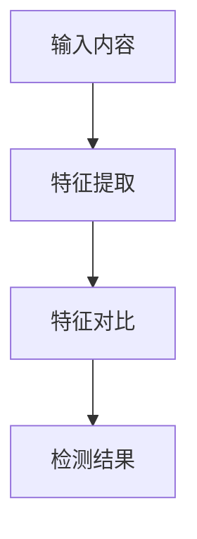

                 


# 如何识别企业的深度伪造检测技术优势

> 关键词：深度伪造检测技术，企业应用，生成对抗网络，AI安全，数据真实性

> 摘要：深度伪造技术是一种利用生成对抗网络生成逼真内容的技术，它对企业数据安全和信任体系构成了巨大威胁。本文将从背景、核心概念、算法原理、系统架构设计、项目实战等方面，详细分析如何识别企业的深度伪造检测技术优势。

---

## 第一部分：深度伪造检测技术背景与核心概念

### 第1章：深度伪造技术的背景介绍

#### 1.1 深度伪造技术的定义与背景

- **1.1.1 深度伪造技术的定义**  
  深度伪造（Deepfake）是一种利用生成对抗网络（GAN）生成逼真的假内容的技术。它可以通过AI模型生成假图片、视频、音频或文本，难以通过肉眼或简单工具检测。

- **1.1.2 深度伪造技术的背景与发展趋势**  
  随着AI技术的快速发展，深度伪造技术变得越来越普及。它最初用于娱乐和艺术创作，但逐渐被恶意利用，用于诈骗、诽谤和信息操控。

- **1.1.3 深度伪造对企业的影响与挑战**  
  对企业而言，深度伪造技术可能破坏企业声誉、泄露敏感信息、干扰正常的业务运营。例如，伪造的高层讲话或虚假的新闻报道可能对企业造成重大损失。

#### 1.2 深度伪造技术的核心概念

- **1.2.1 深度伪造技术的关键技术特点**  
  深度伪造技术的核心在于生成对抗网络（GAN），包括生成器和判别器两个部分。生成器负责生成假内容，判别器负责区分真假内容。

- **1.2.2 深度伪造技术与传统伪造技术的对比**  
  传统伪造技术通常依赖手动编辑或简单工具，而深度伪造技术通过AI生成的内容更加逼真，难以被发现。

- **1.2.3 深度伪造技术的边界与外延**  
  深度伪造技术不仅限于图像和视频，还可以扩展到音频、文本等领域。其边界在于生成内容的逼真程度和检测技术的先进程度。

#### 1.3 企业深度伪造检测技术的必要性

- **1.3.1 企业数据安全的重要性**  
  企业数据是核心资产，深度伪造技术可能通过伪造数据进行诈骗或信息操控，威胁企业的数据安全。

- **1.3.2 深度伪造对企业信任体系的威胁**  
  一旦深度伪造内容被传播，企业声誉和客户信任可能受到严重损害。例如，伪造的高管言论可能引发股价波动。

- **1.3.3 企业深度伪造检测技术的应用场景**  
  企业可以在招聘、营销、内部沟通等多个场景中应用深度伪造检测技术，确保信息的真实性和可靠性。

---

## 第2章：深度伪造检测技术的核心概念与联系

### 2.1 深度伪造检测技术的核心原理

#### 2.1.1 基于AI的深度伪造生成原理

- **生成器**：生成器通过训练生成逼真的假内容。例如，利用风格迁移技术生成与真实内容相似的图像。
- **判别器**：判别器负责区分生成内容和真实内容。通过不断对抗训练，生成器和判别器的能力不断提升。

#### 2.1.2 深度伪造检测的算法原理

- **基于AI的检测算法**：利用深度学习模型（如卷积神经网络）检测生成内容中的异常特征。
- **特征提取**：提取生成内容的特征，与真实内容的特征进行对比，识别差异。

### 2.2 深度伪造检测技术的关键特征对比

#### 2.2.1 不同检测技术的特征对比表格

| 检测技术         | 优缺点                  | 适用场景          |
|------------------|-------------------------|-------------------|
| 基于GAN的检测    | 高精度，但计算复杂       | 高级检测          |
| 基于特征提取的检测| 易实现，精度略低         | 快速初步检测       |
| 基于哈希函数的检测| 计算效率高，但依赖哈希库   | 大规模数据检测     |

#### 2.2.2 深度伪造检测技术的ER实体关系图

```mermaid
erDiagram
    actor 检测系统
    actor 伪造内容
    actor 检测结果
    检测系统 --> 检测内容
    检测内容 --> 检测结果
```

---

## 第3章：深度伪造检测技术的算法原理

### 3.1 深度伪造检测算法概述

#### 3.1.1 基于生成对抗网络的检测算法

- **生成器与判别器的对抗过程**：生成器尝试生成逼真的内容，判别器尝试区分真假内容。通过不断迭代，检测算法能够识别出生成的内容。

#### 3.1.2 基于特征提取的检测算法

- **特征提取网络**：利用预训练的模型（如ResNet、Inception）提取内容的特征。
- **对比检测**：将生成内容的特征与真实内容的特征进行对比，识别差异。

#### 3.1.3 基于哈希函数的检测算法

- **哈希函数的作用**：将内容转换为固定长度的哈希值，通过对比哈希值检测内容的真实性。

### 3.2 深度伪造检测算法的数学模型

#### 3.2.1 GAN模型的数学公式

- **生成器的损失函数**：  
  $$ G_{loss} = -\frac{1}{m}\sum_{i=1}^{m} \log D(G(x_i)) $$
  
- **判别器的损失函数**：  
  $$ D_{loss} = -\frac{1}{m}\sum_{i=1}^{m} [\log D(x_i) + \log (1 - D(G(x_i))] $$

#### 3.2.2 基于特征提取的检测算法流程



---

## 第4章：深度伪造检测技术的系统分析与架构设计

### 4.1 系统功能设计

#### 4.1.1 系统架构设计

- **模块划分**：包括内容输入模块、特征提取模块、对比检测模块和结果输出模块。
- **功能流程**：输入内容 → 特征提取 → 对比检测 → 输出检测结果。

#### 4.1.2 系统架构图


---

## 第5章：深度伪造检测技术的项目实战

### 5.1 项目环境安装

- **安装Python和相关库**：如TensorFlow、Keras、OpenCV等。
- **安装深度伪造检测工具**：如Deepfake-Detector库。

### 5.2 系统核心实现源代码

```python
import tensorflow as tf
from tensorflow.keras import layers

# 定义生成器模型
def build_generator():
    model = tf.keras.Sequential([
        layers.Dense(256, activation='relu'),
        layers.Dense(128, activation='relu'),
        layers.Dense(64, activation='sigmoid')
    ])
    return model

# 定义判别器模型
def build_discriminator():
    model = tf.keras.Sequential([
        layers.Dense(64, activation='relu'),
        layers.Dense(32, activation='relu'),
        layers.Dense(1, activation='sigmoid')
    ])
    return model
```

### 5.3 案例分析与详细解读

- **案例背景**：企业收到一封伪造的高管邮件，声称要改变公司战略。
- **检测过程**：通过深度伪造检测技术，识别邮件内容中的异常特征，确认其为伪造内容。
- **结果分析**：检测系统成功识别出伪造内容，避免了潜在的损失。

---

## 第6章：总结与展望

### 6.1 最佳实践 tips

- **定期更新检测模型**：深度伪造技术不断进步，检测模型需要定期更新。
- **结合多维度检测**：结合图像、文本等多种检测手段，提高检测准确率。

### 6.2 小结

通过本文的分析，我们可以看到深度伪造检测技术在企业中的重要性。企业需要结合自身需求，选择合适的检测技术，确保数据安全和信任体系的稳定。

### 6.3 注意事项

- **数据隐私保护**：在检测过程中，需注意保护用户数据隐私。
- **算法优化**：根据实际需求，不断优化检测算法，提高检测效率和准确率。

### 6.4 拓展阅读

- 《生成对抗网络：理论与实践》
- 《深度学习与计算机视觉》

---

通过以上结构，您可以逐步展开每一章的内容，详细阐述每个部分的技术细节和实际应用。这不仅能够帮助读者理解深度伪造检测技术的优势，还能为企业提供实用的检测方案。

