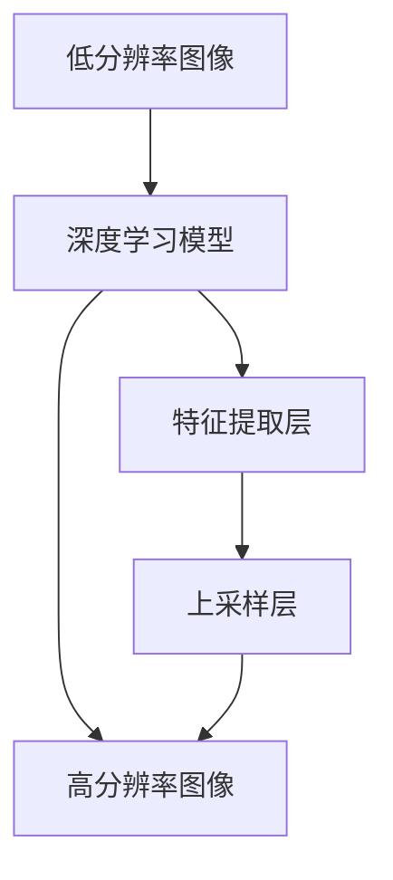
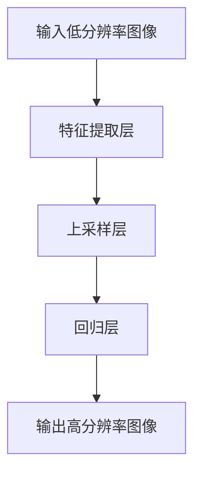
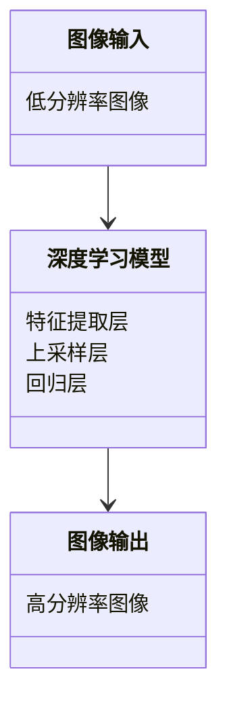
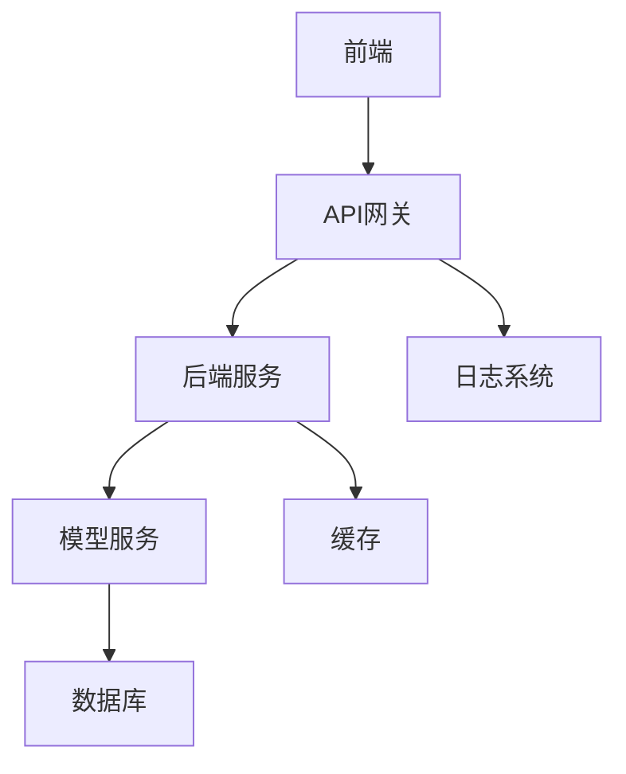

                 


# 如何识别企业的深度学习图像超分辨率优势

**关键词：深度学习，图像超分辨率，企业应用，算法原理，系统架构**

**摘要：** 本文将详细探讨如何识别企业中深度学习图像超分辨率技术的优势。文章从图像超分辨率技术的背景出发，逐步分析其核心概念、算法原理、系统架构，并通过实际项目案例展示其在企业中的应用价值。通过本文，读者将能够全面理解深度学习图像超分辨率技术的优势，并掌握如何将其应用到实际企业场景中。

---

# 第一部分：深度学习图像超分辨率技术背景与概念

## 第1章：图像超分辨率技术概述

### 1.1 图像超分辨率的定义与背景

#### 1.1.1 图像分辨率的概念
图像分辨率是衡量图像清晰度的重要指标，通常分为空间分辨率和灰度分辨率。空间分辨率指的是图像中能够区分的最小细节，而灰度分辨率则指图像中能够区分的颜色层次。低分辨率图像通常会导致视觉模糊，细节丢失，影响用户体验和分析准确性。

#### 1.1.2 图像分辨率低的原因与影响
低分辨率图像的产生原因包括：
1. 拍摄设备限制：如手机摄像头、监控摄像头等设备的物理限制。
2. 压缩技术：如JPEG压缩可能导致图像失真。
3. 传输过程中的损耗：网络传输或存储过程中可能导致图像质量下降。

低分辨率图像的影响：
1. **安防监控**：无法清晰识别目标，影响安全判断。
2. **医学影像**：可能导致误诊或漏诊。
3. **遥感图像**：影响地理信息的准确提取。

#### 1.1.3 深度学习在图像超分辨率中的作用
深度学习通过强大的特征提取能力和非线性映射能力，能够有效地将低分辨率图像重建为高分辨率图像。与传统图像处理方法相比，深度学习模型能够更好地恢复图像细节，提升图像质量。

---

### 1.2 深度学习图像超分辨率的核心问题

#### 1.2.1 从低分辨率到高分辨率的图像重建
图像超分辨率重建的核心任务是通过深度学习模型，从低分辨率图像中恢复出高质量的高分辨率图像。这一过程需要解决以下几个关键问题：
1. **信息丢失**：低分辨率图像中丢失了大量高频细节信息。
2. **重建模糊**：如何避免重建过程中引入的模糊或失真。
3. **模型选择**：选择合适的深度学习模型来实现高质量的图像重建。

#### 1.2.2 图像超分辨率的数学建模
图像超分辨率可以看作是一个图像重建问题，通常可以用以下数学模型表示：
$$
y = f(x) + \epsilon
$$
其中，$x$ 是低分辨率图像，$y$ 是高分辨率图像，$f$ 是降级过程（如采样和噪声），$\epsilon$ 是噪声。深度学习模型的目标是通过训练反向映射 $f^{-1}$，从 $x$ 中重建 $y$。

#### 1.2.3 深度学习模型在图像重建中的优势
深度学习模型（如卷积神经网络CNN）在图像超分辨率中的优势包括：
1. **端到端学习**：模型可以直接从输入到输出进行端到端优化。
2. **特征提取能力强**：CNN可以自动提取图像中的复杂特征。
3. **非线性映射**：能够处理复杂的图像重建问题。

---

### 1.3 深度学习图像超分辨率的应用场景

#### 1.3.1 安防监控中的图像增强
在安防监控中，低分辨率图像可能导致目标识别困难。通过图像超分辨率技术，可以将模糊的监控画面恢复为清晰的图像，帮助提高安全监控的准确性。

#### 1.3.2 医学影像处理
医学影像是患者诊断的重要依据，低分辨率图像可能导致关键细节丢失。图像超分辨率技术可以用于提高医学影像的分辨率，辅助医生更准确地诊断病情。

#### 1.3.3 遥感图像处理
遥感图像通常具有大范围和高分辨率的特点，但在传输和存储过程中可能会受到压缩和噪声的影响。图像超分辨率技术可以帮助恢复遥感图像的细节，提高地理信息的提取准确性。

#### 1.3.4 企业级图像处理系统中的应用
企业级图像处理系统通常需要处理大量图像数据，如产品质检、人脸识别等场景。图像超分辨率技术可以提升图像质量，提高后续处理算法的准确性和效率。

---

## 第2章：深度学习图像超分辨率的核心概念与联系

### 2.1 深度学习图像超分辨率的原理

#### 2.1.1 基于深度学习的图像重建模型
深度学习图像超分辨率的核心是通过训练深度神经网络模型，学习从低分辨率图像到高分辨率图像的映射关系。常用模型包括SRCNN、VDSR、ESRGAN等。

#### 2.1.2 深度学习模型的特征提取能力
深度学习模型（如CNN）能够通过多层卷积操作提取图像中的多层次特征，包括边缘、纹理、形状等。这些特征对于图像重建至关重要。

#### 2.1.3 模型的训练与优化
模型的训练通常使用高分辨率图像作为标签，低分辨率图像作为输入，通过反向传播算法优化模型参数。损失函数通常采用均方误差（MSE）或感知损失（Perceptual Loss）。

---

### 2.2 深度学习图像超分辨率的核心概念对比

#### 2.2.1 不同模型的优缺点对比
以下是一个对比表格：

| 模型名称 | 优点 | 缺点 |
|----------|------|------|
| SRCNN    | 简单高效，适合小规模数据 | 显微镜效应，图像边缘模糊 |
| VDSR     | 高效，适合大规模数据 | 对噪声敏感 |
| ESRGAN   | 图像质量高，细节恢复好 | 训练复杂，需要生成对抗网络 |

#### 2.2.2 模型复杂度与性能的对比分析
模型的复杂度与性能通常呈正相关，但过高的复杂度可能导致过拟合。因此，需要根据具体场景选择合适的模型。

#### 2.2.3 模型的可解释性与实际应用的平衡
深度学习模型通常具有较高的黑箱特性，可解释性较差。但在实际应用中，可以通过调整模型参数和优化训练数据来提高模型的实用性。

---

### 2.3 深度学习图像超分辨率的ER实体关系图



---

## 第3章：基于SRCNN的图像超分辨率算法

### 3.1 SRCNN模型结构

#### 3.1.1 SRCNN的输入输出
SRCNN的输入是低分辨率图像，输出是高分辨率图像。通常，输入图像会经过下采样处理，生成低分辨率版本。

#### 3.1.2 SRCNN的网络结构
SRCNN由三部分组成：
1. 特征提取层：用于提取低分辨率图像的特征。
2. 上采样层：用于将特征图上采样到高分辨率。
3. 回归层：用于调整上采样后的特征图，生成高分辨率图像。

#### 3.1.3 SRCNN的损失函数
SRCNN通常使用均方误差（MSE）作为损失函数：
$$
L = \frac{1}{N}\sum_{i=1}^{N} (y_i - \hat{y}_i)^2
$$

### 3.2 SRCNN算法流程



### 3.3 SRCNN算法的Python实现

#### 3.3.1 环境安装
```bash
pip install tensorflow matplotlib numpy
```

#### 3.3.2 核心代码实现
```python
import tensorflow as tf
import numpy as np
import matplotlib.pyplot as plt

# 定义SRCNN模型
def srcnn_model(input_shape):
    inputs = tf.keras.Input(shape=input_shape)
    conv1 = tf.keras.layers.Conv2D(filters=64, kernel_size=5, padding='same', activation='relu')(inputs)
    conv2 = tf.keras.layers.Conv2D(filters=32, kernel_size=3, padding='same', activation='relu')(conv1)
    conv3 = tf.keras.layers.Conv2D(filters=3, kernel_size=1, padding='same')(conv2)
    model = tf.keras.Model(inputs=inputs, outputs=conv3)
    return model

# 训练模型
def train_model(model, X_train, y_train, epochs=100, batch_size=32):
    model.compile(optimizer='adam', loss='mse')
    model.fit(X_train, y_train, epochs=epochs, batch_size=batch_size)

# 测试模型
def test_model(model, X_test):
    predicted = model.predict(X_test)
    return predicted

# 示例使用
if __name__ == '__main__':
    # 假设X_train和y_train已经准备好
    model = srcnn_model((None, None, 3))  # 假设输入为RGB图像
    train_model(model, X_train, y_train)
    predicted = test_model(model, X_test)
    plt.imshow(predicted[0])
    plt.show()
```

---

## 第4章：数学模型与公式推导

### 4.1 SRCNN的损失函数
SRCNN的损失函数通常采用均方误差（MSE）：
$$
L = \frac{1}{N}\sum_{i=1}^{N} (y_i - \hat{y}_i)^2
$$
其中，$y_i$ 是真实值，$\hat{y}_i$ 是预测值，$N$ 是样本数量。

### 4.2 深度学习模型的优化目标
深度学习模型的优化目标是通过反向传播算法最小化损失函数，同时更新模型参数。通常使用随机梯度下降（SGD）或Adam优化器。

---

## 第5章：系统分析与架构设计

### 5.1 问题场景介绍
企业可能面临以下问题：
1. **低分辨率图像影响业务**：如安防监控中无法清晰识别目标。
2. **图像数据量大**：需要高效处理大量图像数据。
3. **模型部署复杂**：需要将深度学习模型部署到生产环境中。

### 5.2 系统功能设计
#### 5.2.1 领域模型


#### 5.2.2 系统架构设计


---

## 第6章：项目实战

### 6.1 环境安装
```bash
pip install tensorflow keras matplotlib numpy
```

### 6.2 核心代码实现
```python
# 图像预处理
import cv2
import numpy as np

def read_image(image_path):
    image = cv2.imread(image_path)
    return image

def upscale_image(image, scale_factor=2):
    return cv2.resize(image, None, fx=scale_factor, fy=scale_factor, interpolation=cv2.INTER_CUBIC)

# 模型训练与测试
def train_model(X_train, y_train):
    model = srcnn_model((None, None, 3))
    model.compile(optimizer='adam', loss='mse')
    model.fit(X_train, y_train, epochs=100, batch_size=32)

def test_model(model, X_test):
    predicted = model.predict(X_test)
    return predicted

# 可视化结果
def visualize_results(low_res_image, high_res_image):
    plt.figure(figsize=(10, 5))
    plt.subplot(1, 2, 1)
    plt.imshow(low_res_image)
    plt.title('Low Resolution')
    plt.subplot(1, 2, 2)
    plt.imshow(high_res_image)
    plt.title('High Resolution')
    plt.show()
```

### 6.3 实际案例分析
假设我们有一个安防监控系统，输入是低分辨率的监控画面，目标是将画面中的目标清晰化。通过SRCNN模型进行图像重建，输出高分辨率图像，帮助安全人员更准确地识别目标。

---

## 第7章：总结与最佳实践

### 7.1 总结
深度学习图像超分辨率技术能够有效提升企业中低分辨率图像的质量，帮助企业在安防、医学、遥感等领域提高处理效率和准确性。选择合适的模型和优化算法是关键。

### 7.2 最佳实践
1. **选择合适的模型**：根据具体场景选择SRCNN、VDSR或ESRGAN等模型。
2. **优化模型训练**：使用合适的损失函数和优化器，避免过拟合。
3. **高效部署**：将模型部署到生产环境中，结合边缘计算提高效率。
4. **持续改进**：根据实际效果不断优化模型和算法。

### 7.3 注意事项
1. **数据质量**：确保训练数据多样化且标注准确。
2. **计算资源**：深度学习模型需要大量的计算资源，建议使用GPU加速。
3. **模型可解释性**：在实际应用中，需要关注模型的可解释性，避免黑箱模型带来的风险。

### 7.4 拓展阅读
1. **《深度学习》—— Ian Goodfellow**
2. **《卷积神经网络：从基础到高级》—— Leetcode**
3. **《图像处理与计算机视觉》—— Richard Szeliski**

---

通过本文的详细讲解，读者可以系统地理解深度学习图像超分辨率技术的优势，并能够在企业中有效应用这一技术，提升图像处理能力。

