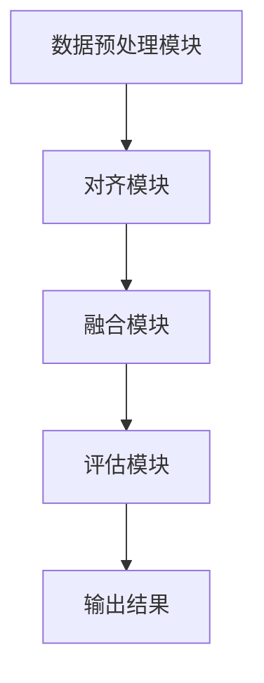
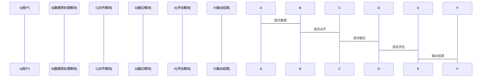

                 


# 如何识别企业的深度学习多模态融合优势

> 关键词：深度学习，多模态融合，企业应用，算法原理，系统架构

> 摘要：深度学习技术在多模态数据处理方面展现出了巨大潜力，尤其是在企业应用中，如何识别和利用深度学习多模态融合的优势，成为了当前技术领域的重要课题。本文从多模态融合的核心概念、算法原理、系统架构等多个方面进行详细分析，为企业识别和应用深度学习多模态融合优势提供理论依据和实践指导。

---

## 第1章: 多模态融合的背景与应用价值

### 1.1 多模态数据的定义与特点

#### 1.1.1 多模态数据的定义
多模态数据指的是来自多种数据类型的组合，例如文本、图像、音频、视频等。这些数据类型之间具有互补性，能够提供更全面的信息。

#### 1.1.2 多模态数据的特点
- **异构性**：不同模态的数据格式和语义不同。
- **互补性**：多种模态数据能够共同提供更全面的信息。
- **复杂性**：处理多模态数据需要解决模态之间的对齐和融合问题。

#### 1.1.3 多模态数据在企业中的应用价值
- 提高信息处理效率。
- 增强数据的分析能力。
- 支持跨模态检索和推荐。

### 1.2 深度学习与多模态融合的结合

#### 1.2.1 深度学习的基本概念
深度学习是一种基于人工神经网络的机器学习方法，能够从大量数据中自动提取特征。

#### 1.2.2 多模态融合的核心思想
将不同模态的数据进行对齐、融合，以获得更强大的表达能力和更好的任务性能。

#### 1.2.3 企业中深度学习多模态融合的优势
- 提高企业的数据分析能力。
- 支持多种应用场景，如智能客服、推荐系统等。
- 增强企业的竞争力。

---

## 第2章: 多模态融合的类型与应用场景

### 2.1 多模态数据的类型

#### 2.1.1 文本数据
文本数据是企业中最常见的数据类型之一，包括客户反馈、产品描述等。

#### 2.1.2 图像数据
图像数据包括产品图片、用户头像等，能够提供丰富的视觉信息。

#### 2.1.3 音频数据
音频数据包括语音对话、背景音乐等，能够提供声音信息。

#### 2.1.4 结构化数据
结构化数据包括数据库中的表格数据，能够提供精确的数值信息。

### 2.2 多模态融合的类型

#### 2.2.1 对齐式融合
将不同模态的数据对齐到同一空间，例如将文本和图像对齐。

#### 2.2.2 融合式融合
将不同模态的数据进行特征融合，例如将文本和图像的特征向量进行加权融合。

#### 2.2.3 对比式融合
通过对比不同模态的数据，提取其差异性信息。

### 2.3 多模态融合在企业中的应用场景

#### 2.3.1 智能客服
通过多模态数据（如文本、语音、图像）提供更智能的客服服务。

#### 2.3.2 智能推荐
基于多模态数据进行推荐，提供更个性化的推荐结果。

#### 2.3.3 智能监控
通过多模态数据进行实时监控，识别异常行为。

#### 2.3.4 智能医疗
通过多模态数据进行医疗诊断和治疗方案推荐。

---

## 第3章: 多模态融合的核心概念

### 3.1 多模态融合的理论基础

#### 3.1.1 模态对齐
模态对齐是指将不同模态的数据对齐到同一空间，以便更好地进行融合。

#### 3.1.2 模态转换
模态转换是指将一种模态的数据转换为另一种模态的数据，例如将文本转换为图像。

#### 3.1.3 模态融合
模态融合是指将不同模态的数据进行特征融合，以获得更全面的信息。

### 3.2 多模态融合的关键技术

#### 3.2.1 对齐技术
- **对比学习**：通过对比不同模态的数据，提取其特征。
- **对齐网络**：通过神经网络对齐不同模态的数据。

#### 3.2.2 融合技术
- **加权融合**：根据不同模态的重要性进行加权融合。
- **注意力机制**：通过注意力机制关注重要模态的信息。

#### 3.2.3 跨模态检索
- **跨模态检索**：在一种模态中检索另一种模态的数据，例如在文本中检索图像。

### 3.3 多模态融合的核心要素

#### 3.3.1 数据预处理
- 数据清洗：去除噪声数据。
- 数据归一化：将数据标准化处理。

#### 3.3.2 模态对齐
- 对齐方法：如对比学习、对齐网络。
- 对齐目标：如最大化相似性、最小化差异性。

#### 3.3.3 模态融合
- 融合方法：如加权融合、注意力机制。
- 融合目标：如最大化信息利用率、提高任务性能。

---

## 第4章: 多模态融合的核心原理

### 4.1 多模态对齐的原理

#### 4.1.1 对齐目标函数
$$ L = \frac{1}{N} \sum_{i=1}^{N} (d(x_i, y_i))^2 $$
其中，$x_i$ 是一种模态的数据，$y_i$ 是另一种模态的数据，$d(x_i, y_i)$ 是它们之间的距离。

#### 4.1.2 对齐优化方法
- 梯度下降：通过最小化目标函数进行优化。
- 对比学习：通过对比不同模态的数据进行对齐。

#### 4.1.3 对齐算法实现
```python
def align(x, y):
    # x: 模态1的数据
    # y: 模态2的数据
    with tf.GradientTape() as tape:
        # 对齐网络
        x_aligned = model(x)
        y_aligned = model(y)
        loss = tf.reduce_mean((x_aligned - y_aligned)**2)
    gradients = tape.gradient(loss, model.trainable_variables)
    optimizer.apply_gradients(zip(gradients, model.trainable_variables))
    return loss
```

### 4.2 多模态融合的原理

#### 4.2.1 融合方法的选择
- 根据任务需求选择加权融合或注意力机制。
- 根据数据特点选择合适的融合方式。

#### 4.2.2 融合模型的构建
- 使用神经网络构建融合模型，如多层感知机、Transformer等。
- 根据任务需求设计模型的输入和输出。

#### 4.2.3 融合结果的评估
- 使用评估指标，如准确率、召回率、F1值等。
- 通过对比实验评估融合效果。

### 4.3 多模态融合的数学模型

#### 4.3.1 对齐模型
$$ x' = f(x) $$
$$ y' = f(y) $$
其中，$f$ 是对齐网络，$x'$ 和 $y'$ 是对齐后的数据。

#### 4.3.2 融合模型
$$ z = g(x', y') $$
其中，$g$ 是融合函数，$z$ 是融合后的结果。

#### 4.3.3 评估模型
$$ L = \frac{1}{N} \sum_{i=1}^{N} (z_i - y_i)^2 $$

---

## 第5章: 多模态融合的算法原理与实现

### 5.1 多模态对齐与融合的算法原理

#### 5.1.1 对齐算法
- 对比学习：通过最大化相似性进行对齐。
- 对齐网络：通过神经网络对齐不同模态的数据。

#### 5.1.2 融合算法
- 加权融合：根据模态的重要性进行加权。
- 注意力机制：通过注意力机制关注重要模态的信息。

### 5.2 多模态融合的数学模型

#### 5.2.1 对齐模型
$$ x' = f(x) $$
$$ y' = f(y) $$

#### 5.2.2 融合模型
$$ z = g(x', y') $$

### 5.3 多模态融合的代码实现

```python
import tensorflow as tf
from tensorflow import keras

class AlignModel(keras.Model):
    def __init__(self):
        super(AlignModel, self).__init__()
        self.dense = keras.layers.Dense(128)

    def call(self, inputs):
        x = self.dense(inputs)
        return x

class FusionModel(keras.Model):
    def __init__(self):
        super(FusionModel, self).__init__()
        self.align = AlignModel()
        self.dense = keras.layers.Dense(1)

    def call(self, x, y):
        x_aligned = self.align(x)
        y_aligned = self.align(y)
        z = self.dense(tf.concat([x_aligned, y_aligned], axis=-1))
        return z

model = FusionModel()
optimizer = tf.keras.optimizers.Adam(learning_rate=0.001)

def train(x, y):
    with tf.GradientTape() as tape:
        z = model(x, y)
        loss = tf.reduce_mean((z - y)**2)
    gradients = tape.gradient(loss, model.trainable_variables)
    optimizer.apply_gradients(zip(gradients, model.trainable_variables))
    return loss
```

---

## 第6章: 多模态融合的系统架构设计

### 6.1 系统功能设计

#### 6.1.1 数据预处理模块
- 数据清洗：去除噪声数据。
- 数据归一化：将数据标准化处理。

#### 6.1.2 对齐模块
- 对比学习：通过最大化相似性进行对齐。
- 对齐网络：通过神经网络对齐不同模态的数据。

#### 6.1.3 融合模块
- 加权融合：根据模态的重要性进行加权。
- 注意力机制：通过注意力机制关注重要模态的信息。

### 6.2 系统架构设计



### 6.3 系统接口设计

#### 6.3.1 输入接口
- 接收多种模态的数据，如文本、图像等。

#### 6.3.2 输出接口
- 输出融合后的结果，如预测值、分类结果等。

### 6.4 系统交互设计



---

## 第7章: 多模态融合的项目实战

### 7.1 项目背景

#### 7.1.1 项目介绍
- 项目目标：实现一个基于深度学习的多模态融合系统。
- 项目需求：支持多种模态数据的对齐和融合。

### 7.2 项目环境安装

#### 7.2.1 安装依赖
- 安装TensorFlow、Keras等深度学习框架。

#### 7.2.2 安装其他工具
- 安装Mermaid、MathJax等可视化工具。

### 7.3 核心代码实现

#### 7.3.1 数据预处理代码
```python
import pandas as pd
import numpy as np

def preprocess(data):
    # 数据清洗
    data = data.dropna()
    # 数据归一化
    data = (data - data.mean()) / data.std()
    return data
```

#### 7.3.2 对齐代码
```python
class AlignModel(keras.Model):
    def __init__(self):
        super(AlignModel, self).__init__()
        self.dense = keras.layers.Dense(128)

    def call(self, inputs):
        x = self.dense(inputs)
        return x
```

#### 7.3.3 融合代码
```python
class FusionModel(keras.Model):
    def __init__(self):
        super(FusionModel, self).__init__()
        self.align = AlignModel()
        self.dense = keras.layers.Dense(1)

    def call(self, x, y):
        x_aligned = self.align(x)
        y_aligned = self.align(y)
        z = self.dense(tf.concat([x_aligned, y_aligned], axis=-1))
        return z
```

### 7.4 项目案例分析

#### 7.4.1 案例介绍
- 案例目标：实现一个基于多模态融合的智能推荐系统。

#### 7.4.2 数据准备
- 收集用户的行为数据，如点击、收藏、购买等。

#### 7.4.3 模型训练
- 使用多模态数据进行模型训练，如文本、图像等。

#### 7.4.4 模型评估
- 使用评估指标，如准确率、召回率等，评估模型性能。

### 7.5 项目小结

#### 7.5.1 项目总结
- 项目实现了基于深度学习的多模态融合系统。
- 项目验证了多模态融合技术在企业中的应用价值。

#### 7.5.2 项目不足
- 数据量不足，模型性能有待提升。
- 模型的解释性需要进一步优化。

---

## 第8章: 总结与展望

### 8.1 多模态融合的优势

#### 8.1.1 提高数据分析能力
- 通过多模态数据，能够提供更全面的信息。

#### 8.1.2 支持多种应用场景
- 在智能客服、推荐系统等场景中具有重要应用。

#### 8.1.3 增强企业的竞争力
- 通过多模态融合，能够提高企业的数据分析能力和决策能力。

### 8.2 多模态融合的未来展望

#### 8.2.1 技术发展
- 深度学习技术的进一步发展，将推动多模态融合技术的进步。

#### 8.2.2 应用场景扩展
- 多模态融合技术将在更多领域中得到应用，如医疗、金融等。

### 8.3 最佳实践 tips

#### 8.3.1 数据预处理
- 数据清洗和归一化是多模态融合的重要步骤。

#### 8.3.2 模型优化
- 通过对比学习和对齐网络，可以提高模型的对齐效果。

#### 8.3.3 模型评估
- 使用准确率、召回率等指标，评估模型的性能。

### 8.4 小结

- 多模态融合技术在企业中的应用具有重要价值。
- 通过深度学习技术，可以实现高效的多模态融合。
- 未来，多模态融合技术将在更多领域中得到应用。

---

## 附录: 参考文献与拓展阅读

- 《深度学习》——Ian Goodfellow
- 《多模态学习：理论与应用》——李航
- 《TensorFlow实战》——唐宇迪
- 《Keras深度学习实战》——周志华

