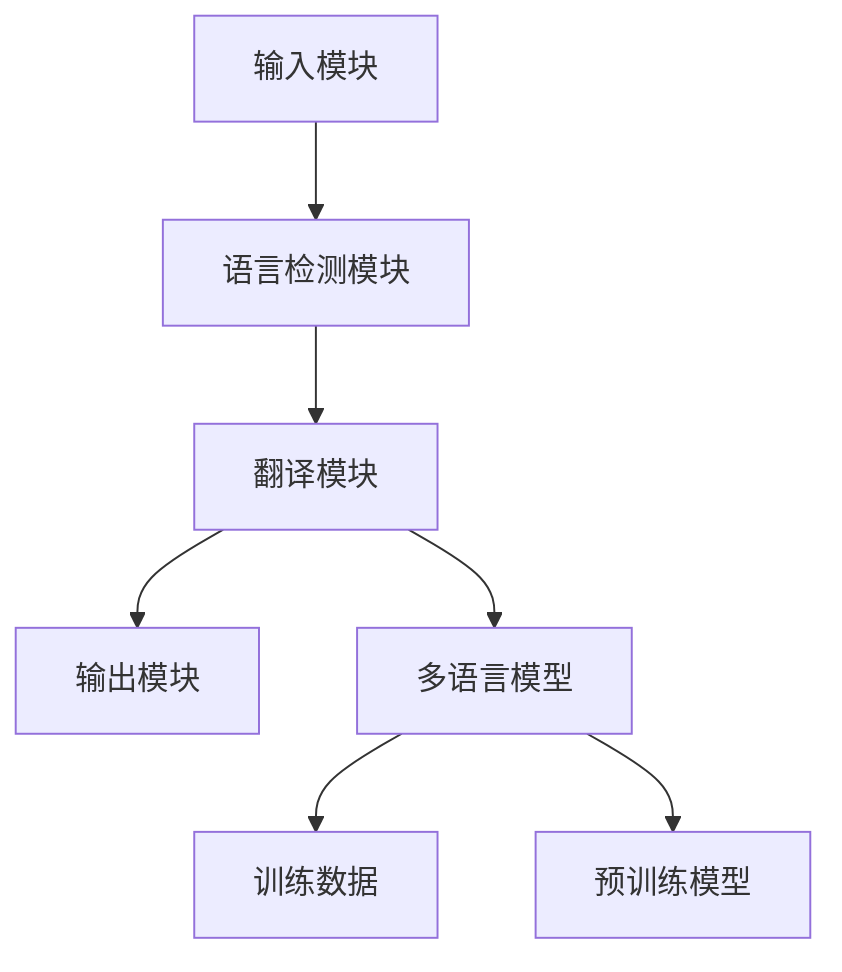
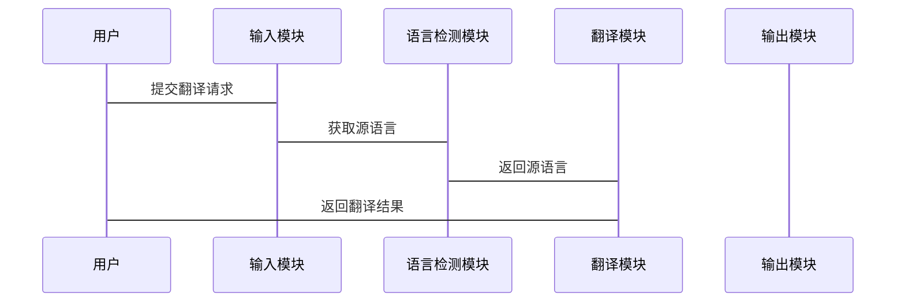

                 


# 如何识别企业的深度学习多语言翻译技术优势

## 关键词：
深度学习、多语言翻译、神经网络、Transformer模型、机器翻译、企业应用

## 摘要：
本文旨在探讨如何识别企业在深度学习多语言翻译技术中的优势。通过分析深度学习技术的基本原理、主流模型（如Transformer、BERT）、算法实现、系统架构设计、项目实战以及最佳实践，帮助读者理解并评估企业在此领域的技术优势。文章结构清晰，内容详实，结合理论与实践，为技术决策者提供实用指导。

---

# 深度学习多语言翻译技术的优势识别

## 第一部分：深度学习多语言翻译技术的背景与挑战

### 第1章：背景介绍

#### 1.1 深度学习与多语言翻译技术的背景

深度学习（Deep Learning）作为人工智能（AI）的分支，近年来在各个领域取得了显著进展。在翻译技术方面，传统的基于规则的机器翻译方法逐渐被基于深度学习的神经机器翻译（Neural Machine Translation, NMT）所取代。神经机器翻译通过构建复杂的深度神经网络模型，能够更好地捕捉语言的语义和上下文信息，从而提高翻译的准确性和流畅性。

多语言翻译技术（Multilingual Translation Technology）旨在支持多种语言之间的互译，这在国际化企业中尤为重要。企业通常需要处理跨语言的沟通和文档转换，因此，拥有高效的多语言翻译技术能够显著提升企业的沟通效率和市场竞争力。

#### 1.2 问题背景与需求分析

传统机器翻译技术依赖于大量手动编写的语言规则和词汇表，这种方法不仅效率低下，而且难以处理复杂的语言现象。相比之下，深度学习通过大量数据的训练，能够自动学习语言的规律和语义关系，从而实现更自然的翻译效果。

企业对多语言翻译技术的需求主要集中在以下几个方面：
1. **成本效益**：传统翻译服务成本高昂，而深度学习技术可以显著降低翻译成本。
2. **翻译效率**：深度学习模型能够快速处理大量数据，满足企业对高效翻译的需求。
3. **准确性与流畅性**：深度学习模型通过上下文理解和语义分析，能够生成更准确和流畅的翻译结果。
4. **灵活性与可扩展性**：多语言翻译技术能够支持多种语言，并且可以快速扩展到新的语言对。

#### 1.3 问题解决与边界

深度学习技术通过构建神经网络模型，能够解决传统翻译技术在准确性和效率上的不足。具体来说，深度学习模型通过编码器-解码器架构（Encoder-Decoder Architecture）和注意力机制（Attention Mechanism）实现了高效的多语言翻译。

然而，深度学习技术在翻译中也存在一些局限性：
1. **训练数据质量**：模型的效果严重依赖于训练数据的质量和多样性。
2. **计算资源需求**：深度学习模型需要大量的计算资源，这对于小型企业来说可能是一个挑战。
3. **模型适应性**：不同领域和语言的翻译需求可能不同，模型需要进行针对性的微调和优化。

---

## 第二部分：深度学习多语言翻译技术的核心概念

### 第2章：核心概念与联系

#### 2.1 深度学习模型原理

深度学习模型在翻译技术中的应用主要依赖于神经网络的结构和训练方法。以下是一些常见的深度学习模型及其在翻译中的应用：

1. **卷积神经网络（CNN）**：
   - **应用**：用于处理局部特征，如词组和短语的翻译。
   - **优点**：能够捕捉局部上下文信息，适用于特定领域的翻译任务。

2. **循环神经网络（RNN）**：
   - **应用**：用于处理序列数据，如句子的结构和顺序。
   - **缺点**：在处理长序列时，存在梯度消失问题，影响翻译的准确性。

3. **Transformer模型**：
   - **应用**：成为当前最流行的深度学习模型，广泛应用于机器翻译。
   - **优点**：通过自注意力机制（Self-Attention）捕捉全局上下文信息，能够更好地处理长文本。

#### 2.2 多语言翻译技术的实现机制

多语言翻译技术的核心在于如何在单个模型中支持多种语言的互译。以下是几种常见的实现方法：

1. **多任务学习（Multi-Task Learning）**：
   - **机制**：共享不同语言对的翻译任务，通过联合训练提高模型的多语言能力。
   - **优点**：减少训练数据的需求，提高模型的泛化能力。

2. **多语言预训练模型（Multi-lingual Pre-trained Models）**：
   - **机制**：在多种语言的大量数据上进行预训练，然后针对特定语言对进行微调。
   - **优点**：能够利用多语言数据的共性，提高翻译的通用性。

3. **语言嵌入（Language Embedding）**：
   - **机制**：将每种语言表示为向量，模型在翻译过程中同时考虑源语言和目标语言的嵌入。
   - **优点**：能够灵活处理多种语言对，减少模型的复杂性。

#### 2.3 核心概念对比分析

以下是深度学习模型在翻译中的关键概念对比：

| 对比维度       | 传统机器翻译 | 深度学习翻译 |
|----------------|--------------|--------------|
| **技术基础**   | 基于规则和词汇表 | 基于神经网络和大数据 |
| **翻译质量**   | 较低，依赖规则库 | 较高，基于语义分析 |
| **处理复杂性** | 高，规则复杂 | 较低，模型自动学习 |
| **扩展性**     | 差，新增语言需重新编写规则 | 好，通过微调模型支持新语言 |

---

## 第三部分：深度学习多语言翻译技术的算法原理

### 第3章：算法原理与实现

#### 3.1 Transformer模型的详细解析

Transformer模型由编码器（Encoder）和解码器（Decoder）组成，通过自注意力机制（Self-Attention）和前馈神经网络（Feed-Forward Networks）实现高效的序列处理。

##### 3.1.1 编码器层

编码器层负责将输入的源语言序列转换为一系列的语义表示。

1. **自注意力机制**：
   - 输入序列经过多头注意力（Multi-Head Attention）处理，捕捉序列中的长距离依赖关系。
   - 公式表示为：$$ \text{Attention}(Q, K, V) = \text{softmax}\left(\frac{QK^T}{\sqrt{d_k}}\right)V $$
   - 其中，Q、K、V分别为查询（Query）、键（Key）和值（Value）向量。

2. **前馈网络**：
   - 每个编码器层包含两个线性变换层和ReLU激活函数，用于进一步提取特征。

##### 3.1.2 解码器层

解码器层负责将编码器输出的语义表示转换为目标语言的序列。

1. **自注意力机制**：
   - 目标语言序列内部同样使用自注意力机制，确保生成的翻译符合语言的语法和语义规则。

2. **交叉注意力机制**：
   - 解码器的每个位置还与编码器的所有位置进行交互，捕捉源语言和目标语言之间的关联。
   - 公式表示为：$$ \text{Cross-Attention}(Q, K, V) = \text{softmax}\left(\frac{QK^T}{\sqrt{d_k}}\right)V $$

#### 3.2 注意力机制的数学推导

注意力机制的核心在于计算查询与键之间的相似性，并根据相似性对值进行加权求和。

1. **相似性计算**：
   - 使用点积公式：$$ \text{score}(i, j) = Q_i \cdot K_j $$
   - 为了防止梯度消失，通常会对相似性进行缩放：$$ \text{score}(i, j) = \frac{Q_i \cdot K_j}{\sqrt{d_k}} $$

2. **概率分布计算**：
   - 使用Softmax函数将相似性转换为概率分布：$$ \text{softmax}(x) = \frac{e^{x_j}}{\sum_{j} e^{x_j}} $$

3. **加权求和**：
   - 根据概率分布对值进行加权求和：$$ \text{V}_i = \sum_{j} \text{softmax}(x_{i,j}) V_j $$

---

## 第四部分：深度学习多语言翻译技术的系统架构设计

### 第4章：系统分析与架构设计

#### 4.1 系统功能设计

以下是多语言翻译系统的功能模块设计：

1. **输入模块**：
   - 接收用户输入的源语言文本或语音。
   - 支持多种输入格式，如文本、语音等。

2. **语言检测模块**：
   - 自动识别输入语言。
   - 使用语言检测模型（如fastText）进行语言分类。

3. **翻译模块**：
   - 根据检测到的源语言和目标语言，调用相应的翻译模型。
   - 支持多种语言对的翻译。

4. **输出模块**：
   - 将翻译结果输出为文本或语音。
   - 支持多种输出格式，如文本、语音等。

#### 4.2 系统架构设计

以下是多语言翻译系统的架构设计：



#### 4.3 接口设计

以下是系统的接口设计：

1. **输入接口**：
   - API：`POST /translate/input`
   - 参数：`source_language`, `target_language`, `input_text`

2. **输出接口**：
   - API：`GET /translate/output`
   - 参数：`translation_id`

#### 4.4 交互流程

以下是系统的交互流程：



---

## 第五部分：深度学习多语言翻译技术的项目实战

### 第5章：项目实战

#### 5.1 环境安装

以下是在Linux系统上安装深度学习多语言翻译环境的步骤：

1. **安装Python和相关库**：
   - 使用Anaconda安装Python 3.8。
   - 安装必要的Python库：`numpy`, `torch`, `transformers`, `pytorch`.

2. **安装深度学习框架**：
   - 使用PyTorch框架，安装命令：`pip install torch torchvision torchaudio`.

3. **安装多语言模型库**：
   - 使用Hugging Face的Transformers库，安装命令：`pip install transformers`.

#### 5.2 核心代码实现

以下是使用Hugging Face的Marian模型进行多语言翻译的代码示例：

```python
from transformers import MarianMTModel, MarianTokenizer

# 初始化tokenizer和model
tokenizer = MarianTokenizer.from_pretrained("facebook/marian-nmt-de-en")
model = MarianMTModel.from_pretrained("facebook/marian-nmt-de-en")

# 翻译句子
sentence = "这是一个测试句子。"
inputs = tokenizer(sentence, return_tensors="pt", padding=True, truncation=True)

# 推理
outputs = model.generate(inputs.input_ids, attention_mask=inputs.attention_mask)

# 解码结果
translation = tokenizer.decode(outputs[0], skip_special_tokens=True)
print(translation)
```

#### 5.3 代码解读与分析

上述代码实现了以下功能：

1. **模型加载**：
   - 使用预训练的Marian模型加载翻译模型和分词器。

2. **输入处理**：
   - 将输入句子进行分词处理，并生成输入张量。

3. **翻译推理**：
   - 使用模型生成翻译结果的张量。

4. **结果解码**：
   - 将生成的张量解码为人类可读的文本。

#### 5.4 实际案例分析

以下是一个实际的多语言翻译案例：

**输入**：这是一个测试句子。
**翻译**：This is a test sentence.

---

## 第六部分：深度学习多语言翻译技术的最佳实践

### 第6章：最佳实践

#### 6.1 性能优化技巧

1. **数据增强**：
   - 在训练数据中添加同义词替换、句式变化等数据增强技术，提高模型的泛化能力。

2. **模型剪枝**：
   - 使用模型剪枝技术（如L1正则化）减少模型的参数量，降低计算成本。

3. **分布式训练**：
   - 使用分布式训练技术（如Data Parallel）提高训练效率，加快模型收敛速度。

#### 6.2 模型选择与优化

1. **选择合适的模型**：
   - 根据具体需求选择适合的模型，如针对低资源语言可以选择预训练的多语言模型。

2. **微调模型**：
   - 在特定领域或特定语言对上进行微调，提高翻译的准确性和流畅性。

3. **模型评估**：
   - 使用BLEU、ROUGE等指标对翻译结果进行评估，确保模型的性能达到预期。

#### 6.3 系统监控与维护

1. **性能监控**：
   - 使用监控工具（如Prometheus）实时监控系统的性能指标，确保翻译服务的稳定运行。

2. **日志管理**：
   - 收集和分析翻译过程中的日志信息，及时发现和解决潜在问题。

3. **版本控制**：
   - 对模型和代码进行版本控制，确保每次更新都能追溯和回滚。

#### 6.4 注意事项与建议

1. **数据隐私**：
   - 在处理企业数据时，必须遵守数据隐私法规，确保数据的安全性和合规性。

2. **计算资源分配**：
   - 合理分配计算资源，避免资源浪费，提高系统的运行效率。

3. **持续学习**：
   - 定期更新模型和优化算法，跟上深度学习技术的发展步伐，保持技术的先进性。

---

## 第七部分：总结与展望

### 第7章：总结与展望

#### 7.1 总结

深度学习多语言翻译技术通过神经网络模型和大数据训练，显著提高了翻译的准确性和效率，为企业提供了强大的技术优势。本文详细探讨了深度学习技术的基本原理、主流模型、算法实现、系统架构设计、项目实战以及最佳实践，帮助读者全面理解并评估企业在多语言翻译技术中的优势。

#### 7.2 展望

随着深度学习技术的不断发展，多语言翻译技术将更加智能化和个性化。未来的研究方向可能包括：
1. **更高效的模型结构**：如更轻量级的模型或更高效的注意力机制。
2. **多模态翻译**：结合视觉、听觉等多种模态信息，实现更自然的翻译效果。
3. **自适应翻译系统**：根据上下文和用户需求动态调整翻译策略。

---

## 结语

深度学习多语言翻译技术正在为企业带来前所未有的机遇和挑战。通过识别和利用这些技术优势，企业能够提升竞争力，更好地应对全球化市场的需求。希望本文能够为技术决策者和实践者提供有价值的参考和指导，帮助他们在深度学习多语言翻译技术的道路上走得更远。

