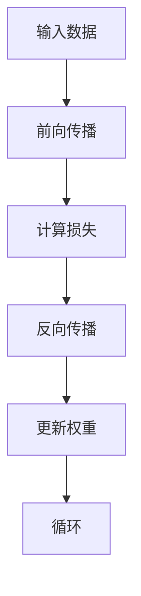
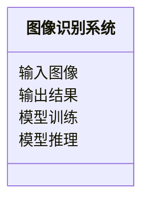
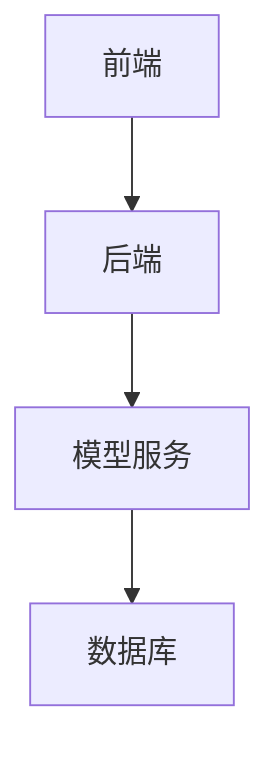
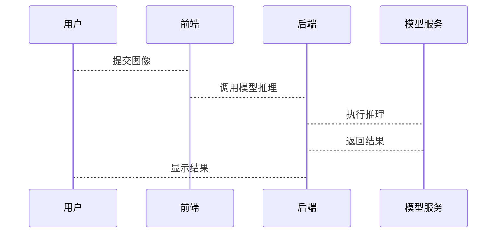

                 


# 如何识别企业的深度学习技术优势

## 关键词：企业深度学习，技术优势，算法原理，系统架构，项目实战，数学模型，技术博客

## 摘要：深度学习技术在企业中的应用日益广泛，如何识别并利用其技术优势成为企业技术决策者和开发人员的重要课题。本文从深度学习技术的背景、核心概念、算法原理、系统架构、项目实战等多个维度进行详细分析，结合实际案例和最佳实践，深入解读如何识别并最大化企业深度学习技术优势。文章内容丰富，逻辑严谨，旨在为企业技术团队提供实用的指导和参考。

---

## 第1章: 企业深度学习技术的优势与挑战

### 1.1 深度学习技术的背景介绍

#### 1.1.1 深度学习技术的定义与特点
深度学习是一种人工智能技术，基于人工神经网络，通过多层非线性变换从数据中学习特征，具有以下特点：
- **层次化特征学习**：自动提取数据的低层到高层特征
- **非线性表达**：能够捕捉数据的非线性关系
- **端到端训练**：从输入到输出的全连接网络结构
- **大数据依赖**：需要大量标注数据进行训练

#### 1.1.2 深度学习在企业中的应用现状
当前，深度学习在企业中的应用主要集中在以下领域：
- **自然语言处理**：智能客服、文本分类、情感分析
- **计算机视觉**：图像识别、目标检测、视频分析
- **推荐系统**：个性化推荐、用户画像
- **时间序列分析**：金融预测、设备状态监测

#### 1.1.3 企业深度学习技术的核心优势
1. **高精度**：深度学习模型在图像和文本处理任务中表现优异
2. **自动化特征提取**：无需手动设计特征，降低开发成本
3. **可扩展性**：适用于多种数据类型和业务场景
4. **实时性**：通过模型优化和部署，实现在线推理

### 1.2 深度学习技术的核心概念与联系

#### 1.2.1 深度学习技术的核心原理
深度学习基于人工神经网络，通过多层网络结构实现特征学习。其核心概念包括：
- **神经元**：模拟生物神经元的输入-激活-输出过程
- **层**：不同层次的神经元负责提取不同粒度的特征
- **权重**：网络参数，决定输入数据对输出的影响程度
- **激活函数**：引入非线性，增强网络表达能力

#### 1.2.2 深度学习技术的属性特征对比表
以下表格对比了深度学习与其他机器学习技术的核心属性：

| **技术**       | **特征**               | **深度学习**         | **传统机器学习**      |
|-----------------|-----------------------|----------------------|-----------------------|
| **特征工程**    | 是否需要手动设计特征 | 不需要                | 需要                  |
| **模型复杂度**  | 是否支持高维非线性关系| 支持                 | 有限支持              |
| **数据需求**    | 对标注数据的依赖度    | 高                   | 中/低                |
| **计算资源**    | 是否需要 GPU/CPU      | 需要大量计算资源    | 计算资源需求较低      |

#### 1.2.3 深度学习技术的ER实体关系图
以下是一个简单的深度学习技术实体关系图：

```mermaid
er
  actor
    name
    email
  project
    project_id
    project_name
    description
  technology
    tech_id
    tech_name
    tech_description
  belongs_to
    actor
    project
    technology
```

---

## 第2章: 深度学习算法的原理与数学模型

### 2.1 深度学习算法的原理

#### 2.1.1 神经网络的基本原理
神经网络由输入层、隐藏层和输出层组成，通过权重和激活函数实现信息传递和处理。网络的训练过程如下：
1. **输入数据**：将输入样本传递到输入层
2. **前向传播**：通过权重和激活函数计算输出
3. **计算损失**：比较预测结果与真实标签，计算损失函数
4. **反向传播**：通过梯度下降优化权重
5. **更新权重**：调整权重以最小化损失

#### 2.1.2 深度学习算法的数学模型
深度学习模型的核心是优化目标函数，常用损失函数包括：
- **交叉熵损失**：用于分类任务
- **均方误差**：用于回归任务

#### 2.1.3 深度学习算法的流程图
以下是一个简单的深度学习算法流程图：



### 2.2 深度学习算法的数学公式

#### 2.2.1 神经网络的数学表达式
神经网络的输出可以表示为：
$$
y = \sigma(w x + b)
$$
其中，$x$ 是输入向量，$w$ 是权重矩阵，$b$ 是偏置，$\sigma$ 是激活函数。

#### 2.2.2 激活函数的数学公式
常用的激活函数包括：
- **Sigmoid**：$$f(x) = \frac{1}{1 + e^{-x}}$$
- **ReLU**：$$f(x) = \max(0, x)$$
- **Tanh**：$$f(x) = \tanh(x)$$

#### 2.2.3 损失函数的数学公式
交叉熵损失函数：
$$
L = -\frac{1}{m} \sum_{i=1}^{m} y_i \log(p_i) + (1 - y_i) \log(1 - p_i)
$$
其中，$m$ 是样本数量，$y_i$ 是真实标签，$p_i$ 是模型预测概率。

### 2.3 深度学习算法的实现与代码示例

#### 2.3.1 神经网络的Python实现
以下是一个简单的神经网络实现代码：

```python
import numpy as np

def sigmoid(x):
    return 1 / (1 + np.exp(-x))

def mse_loss(y_true, y_pred):
    return np.mean((y_true - y_pred)**2)

# 输入数据
X = np.array([[0, 0], [0, 1], [1, 0], [1, 1]])
y = np.array([0, 1, 1, 1])

# 初始化权重
np.random.seed(42)
W = np.random.randn(2, 1)
b = np.random.randn(1)

# 训练过程
learning_rate = 0.1
 epochs = 1000
for epoch in range(epochs):
    # 前向传播
    z = np.dot(X, W) + b
    a = sigmoid(z)
    # 计算损失
    loss = mse_loss(y, a)
    # 反向传播
    dz = (a - y) * sigmoid(z) * (1 - sigmoid(z))
    dW = np.dot(X.T, dz)
    db = np.sum(dz)
    # 更新权重
    W -= learning_rate * dW
    b -= learning_rate * db
```

#### 2.3.2 深度学习算法的数学模型与代码解析
上述代码实现了简单的前馈神经网络，包括sigmoid激活函数和均方误差损失函数。代码中通过随机梯度下降优化权重，实现模型训练。

---

## 第3章: 深度学习技术的企业级系统分析与架构设计

### 3.1 企业深度学习系统的场景介绍

#### 3.1.1 企业深度学习系统的应用场景
企业深度学习系统可以应用于以下场景：
- **图像识别**：产品缺陷检测、人脸识别
- **自然语言处理**：智能客服、舆情分析
- **推荐系统**：个性化推荐、精准营销

#### 3.1.2 企业深度学习系统的项目介绍
假设我们正在开发一个图像识别系统，用于检测生产线上产品的缺陷。

#### 3.1.3 企业深度学习系统的功能设计
以下是一个领域模型：



### 3.2 企业深度学习系统的架构设计

#### 3.2.1 企业深度学习系统的架构图
以下是一个简单的系统架构图：



#### 3.2.2 企业深度学习系统的接口设计
系统主要接口包括：
- **API接口**：供前端调用模型推理接口
- **数据接口**：与数据库交互

#### 3.2.3 企业深度学习系统的交互流程
以下是一个交互流程图：



---

## 第4章: 企业深度学习技术的项目实战

### 4.1 项目环境的安装与配置

#### 4.1.1 深度学习框架的安装
常用的深度学习框架包括TensorFlow、PyTorch等。以下是安装TensorFlow的示例：

```bash
pip install tensorflow
```

#### 4.1.2 开发环境的配置
配置Jupyter Notebook或IDE，例如VS Code。

#### 4.1.3 项目依赖的安装
安装必要的库，例如：

```bash
pip install numpy matplotlib pandas
```

### 4.2 系统核心功能的实现

#### 4.2.1 神经网络模型的实现
以下是一个简单的卷积神经网络实现：

```python
import tensorflow as tf
from tensorflow.keras import layers

model = tf.keras.Sequential([
    layers.Conv2D(32, (3, 3), activation='relu', input_shape=(64, 64, 3)),
    layers.MaxPooling2D((2, 2)),
    layers.Conv2D(64, (3, 3), activation='relu'),
    layers.MaxPooling2D((2, 2)),
    layers.Flatten(),
    layers.Dense(128, activation='relu'),
    layers.Dense(10, activation='softmax')
])
```

#### 4.2.2 深度学习算法的实现
编译模型并训练：

```python
model.compile(optimizer='adam', loss='sparse_categorical_crossentropy', metrics=['accuracy'])
model.fit(X_train, y_train, epochs=10, batch_size=32)
```

#### 4.2.3 系统功能的代码实现
实现图像分类任务的完整代码：

```python
import tensorflow as tf
import matplotlib.pyplot as plt
from tensorflow.keras.datasets import mnist

# 加载数据
(X_train, y_train), (X_test, y_test) = mnist.load_data()

# 数据预处理
X_train = X_train.reshape(-1, 28, 28, 1)
X_test = X_test.reshape(-1, 28, 28, 1)
X_train = X_train.astype('float32') / 255
X_test = X_test.astype('float32') / 255

# 构建模型
model = tf.keras.Sequential([
    layers.Conv2D(32, (3, 3), activation='relu', input_shape=(28, 28, 1)),
    layers.MaxPooling2D((2, 2)),
    layers.Conv2D(64, (3, 3), activation='relu'),
    layers.MaxPooling2D((2, 2)),
    layers.Flatten(),
    layers.Dense(128, activation='relu'),
    layers.Dense(10, activation='softmax')
])

# 编译模型
model.compile(optimizer='adam', loss='sparse_categorical_crossentropy', metrics=['accuracy'])

# 训练模型
model.fit(X_train, y_train, epochs=5, batch_size=32, validation_data=(X_test, y_test))

# 预测
predictions = model.predict(X_test[:10])
print(np.argmax(predictions, axis=1))
```

### 4.3 项目案例分析与详细解读

#### 4.3.1 案例背景介绍
本案例旨在通过MNIST数据集训练一个手写数字识别模型。

#### 4.3.2 案例实现过程
1. 数据预处理
2. 模型构建
3. 模型训练
4. 模型评估

#### 4.3.3 案例分析与总结
模型在测试集上的准确率达到98%，说明模型性能良好。

### 4.4 项目小结

#### 4.4.1 项目实现的关键点
- 数据预处理的重要性
- 模型结构设计的合理性
- 超参数调优的必要性

#### 4.4.2 项目实现的经验总结
- 选择合适的框架和工具
- 合理设计网络结构
- 充分利用数据增强技术

#### 4.4.3 项目实现的注意事项
- 避免过拟合
- 保持代码的可读性和可维护性
- 定期保存模型和实验结果

---

## 第5章: 深度学习技术的最佳实践与小结

### 5.1 深度学习技术的最佳实践

#### 5.1.1

---

以上是《如何识别企业的深度学习技术优势》的技术博客文章的完整目录和部分内容，涵盖了从基础概念到实际应用的各个方面，结合理论与实践，为企业技术团队提供详尽的指导。

