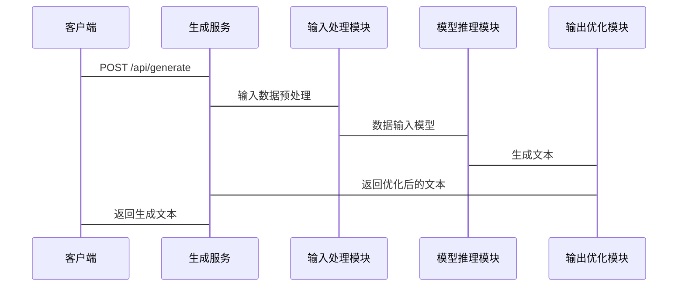

                 


# 如何识别企业的深度学习自然语言生成技术优势

> 关键词：深度学习，自然语言生成，企业技术优势，NLP，机器学习，技术评估

> 摘要：本文将详细探讨如何识别企业的深度学习自然语言生成技术优势。通过对技术背景、核心算法、系统架构、项目实战以及未来趋势的分析，帮助读者全面理解深度学习自然语言生成技术的优势，并为企业提供有效的技术评估和优化建议。

---

## 第1章: 自然语言生成技术概述

### 1.1 自然语言生成的基本概念

#### 1.1.1 自然语言生成的定义与核心要素

自然语言生成（Natural Language Generation, NLP）是人工智能领域的重要分支，旨在使计算机能够生成符合人类语言表达习惯的文本。其核心要素包括：

- **输入数据**：通常为结构化或半结构化的数据（如数据库中的记录、JSON格式的输入等）。
- **生成目标**：生成符合语法、语义正确的自然语言文本。
- **模型算法**：基于统计学习、规则驱动或深度学习的方法。

#### 1.1.2 自然语言生成的分类与应用场景

自然语言生成可以分为以下几类：

- **基于规则的生成**：通过预定义的语法规则生成文本，常见于简单的对话系统或特定领域的文本生成。
- **基于统计的生成**：利用概率模型（如n-gram）生成文本，常见于邮件分类和文本摘要。
- **基于深度学习的生成**：通过神经网络（如RNN、Transformer）生成文本，常见于复杂场景的文本生成，如机器翻译、对话系统。

#### 1.1.3 自然语言生成技术的发展历程

自然语言生成技术的发展经历了三个阶段：

1. **规则驱动阶段**：依赖人工编写语法规则，生成能力有限。
2. **统计学习阶段**：基于概率模型，生成文本质量有所提升。
3. **深度学习阶段**：引入神经网络，生成文本质量显著提高。

---

### 1.2 深度学习在自然语言生成中的作用

#### 1.2.1 深度学习与传统自然语言生成技术的对比

| 技术特点 | 传统NLP | 深度学习NLP |
|----------|----------|-------------|
| 数据需求 | 小数据即可 | 需要大量数据 |
| 模型复杂度 | 简单 | 复杂 |
| 生成质量 | 一般 | 较高 |

#### 1.2.2 自然语言生成技术在企业中的应用现状

- **智能客服**：通过深度学习生成自然语言，提供更智能的客户服务。
- **内容生成**：用于新闻报道、营销文案等自动化生成。
- **机器翻译**：通过深度学习提升翻译质量。

#### 1.2.3 深度学习自然语言生成技术的未来趋势

- **模型小型化**：优化模型体积，降低计算成本。
- **多模态生成**：结合图像、语音等多模态信息，生成更丰富的文本内容。
- **实时生成**：提升生成速度，适用于实时交互场景。

---

## 第2章: 企业深度学习自然语言生成技术的优势识别

### 2.1 企业深度学习自然语言生成技术的核心优势

#### 2.1.1 高效性：快速生成高质量文本

- **高效性**：通过并行计算和优化算法，显著提升生成速度。
- **高质量**：深度学习模型能够捕捉上下文信息，生成更符合语境的文本。

#### 2.1.2 智能性：基于上下文理解生成相关内容

- **上下文理解**：通过自注意力机制，模型能够理解上下文关系。
- **内容相关性**：生成的内容与输入数据高度相关，减少冗余信息。

#### 2.1.3 可扩展性：支持大规模数据处理与生成

- **数据处理能力**：深度学习模型能够处理海量数据，支持企业级应用。
- **生成能力**：支持多种语言和领域，具备良好的扩展性。

#### 2.1.4 可定制性：根据企业需求进行个性化调整

- **定制化训练**：通过微调模型，满足企业的个性化需求。
- **功能扩展**：根据企业需求，添加特定功能（如情感分析、关键词提取）。

---

### 2.2 企业深度学习自然语言生成技术的劣势与挑战

#### 2.2.1 计算资源需求高

- **硬件需求**：需要高性能的GPU和CPU，计算成本较高。
- **模型复杂度**：深度学习模型参数量大，训练和推理需要大量计算资源。

#### 2.2.2 数据隐私与安全问题

- **数据泄露风险**：在处理敏感数据时，存在数据泄露的风险。
- **数据安全合规**：企业需要遵守数据隐私相关法规，确保数据安全。

#### 2.2.3 模型泛化能力不足

- **领域适应性**：模型在特定领域表现优异，但泛化能力较弱。
- **生成结果的可控性**：生成的内容可能偏离预期，需要人工干预。

---

## 第3章: 深度学习自然语言生成技术的数学模型与算法原理

### 3.1 自然语言生成的数学基础

#### 3.1.1 概率论基础

- **条件概率**：$P(y|x)$，表示在给定输入$x$的条件下，输出$y$的概率。
- **联合概率**：$P(x,y)$，表示事件$x$和$y$同时发生的概率。

#### 3.1.2 信息论基础

- **熵**：衡量数据的不确定性，公式为$H(x) = -\sum p(x) \log p(x)$。
- **交叉熵**：衡量两个概率分布的差异，公式为$H(p,q) = -\sum p(x) \log q(x)$。

#### 3.1.3 优化理论基础

- **损失函数**：衡量模型预测值与真实值的差异，常用的有交叉熵损失、均方误差等。
- **梯度下降**：通过求导数最小化损失函数，优化模型参数。

---

### 3.2 常见的自然语言生成算法

#### 3.2.1 基于RNN的自然语言生成

- **RNN结构**：通过循环神经网络处理序列数据，公式为：
  $$ h_t = \sigma(W_{hh} h_{t-1} + W_{hx} x_t) $$
  $$ y_t = W_{yo} h_t + b_o $$
  
- **问题**：梯度消失与爆炸问题，限制了模型的训练深度。

#### 3.2.2 基于Transformer的自然语言生成

- **自注意力机制**：通过计算序列中每个词与其他词的相关性，公式为：
  $$ \text{Attention}(Q, K, V) = \text{softmax}\left(\frac{QK^T}{\sqrt{d_k}}\right)V $$

- **优势**：并行计算能力强，适合长序列处理。

#### 3.2.3 混合模型与集成学习

- **混合模型**：结合RNN和Transformer的优势，提升生成质量。
- **集成学习**：通过多个模型的预测结果进行投票或加权，提高生成稳定性。

---

## 第4章: 企业深度学习自然语言生成技术的系统架构与设计

### 4.1 系统功能设计

#### 4.1.1 输入处理模块

- **功能**：接收输入数据，进行预处理（如分词、特征提取）。
- **流程**：
  1. 数据清洗：去除噪音数据，确保输入质量。
  2. 特征提取：提取关键特征（如关键词、主题标签）。
  3. 数据转换：将数据转换为模型输入格式。

#### 4.1.2 模型推理模块

- **功能**：将预处理后的数据输入模型，生成自然语言文本。
- **流程**：
  1. 数据输入：将输入数据传递给模型。
  2. 模型推理：模型根据输入生成文本。
  3. 文本输出：将生成的文本返回给调用方。

#### 4.1.3 输出优化模块

- **功能**：优化生成文本的质量，确保输出符合预期。
- **流程**：
  1. 文本校对：检查语法错误，调整语句流畅度。
  2. 关键词优化：根据需求调整关键词权重。
  3. 多语言支持：支持多种语言生成。

---

### 4.2 系统架构设计

#### 4.2.1 单体架构设计

- **优势**：实现简单，开发周期短。
- **劣势**：扩展性差，难以应对大规模请求。

#### 4.2.2 微服务架构设计

- **优势**：
  - 高扩展性：根据需求扩展服务。
  - 独立性：每个服务独立运行，互不影响。
- **劣势**：
  - 系统复杂性增加。
  - 跨服务调用开销增大。

#### 4.2.3 分布式架构设计

- **优势**：
  - 高可用性：通过节点冗余保证系统稳定。
  - 高扩展性：通过增加节点提升处理能力。
- **劣势**：
  - 网络开销增大。
  - 分布式事务处理复杂。

---

### 4.3 系统接口设计

#### 4.3.1 RESTful API设计

- **输入接口**：
  - 请求方式：POST
  - 请求路径：/api/generate
  - 请求头：Content-Type: application/json
  - 请求体：{ "input": "..." }

- **输出接口**：
  - 响应方式：JSON格式
  - 响应状态：HTTP状态码
  - 响应体：{ "output": "..." }

#### 4.3.2 序列图设计



---

## 第5章: 企业深度学习自然语言生成技术的项目实战

### 5.1 项目环境配置

- **开发环境**：Python 3.8+
- **深度学习框架**：TensorFlow/PyTorch
- **自然语言处理库**：Hugging Face Transformers
- **依赖管理**：pip install torch transformers

### 5.2 系统核心实现源代码

```python
from transformers import AutoTokenizer, AutoModelForCausalLM
import torch

class NLPGenerator:
    def __init__(self, model_name):
        self.tokenizer = AutoTokenizer.from_pretrained(model_name)
        self.model = AutoModelForCausalLM.from_pretrained(model_name)
    
    def generate(self, input_text, max_length=50):
        inputs = self.tokenizer(input_text, return_tensors="pt")
        outputs = self.model.generate(
            inputs.input_ids,
            max_length=max_length,
            do_sample=True,
            temperature=1.0
        )
        return self.tokenizer.decode(outputs[0], skip_special_tokens=True)
```

### 5.3 代码应用解读与分析

- **模型加载**：使用预训练的深度学习模型，如GPT-2。
- **生成过程**：通过设置`do_sample=True`和`temperature=1.0`，生成多样化且高质量的文本。
- **结果优化**：通过后处理模块，优化生成文本的质量。

---

## 第6章: 企业深度学习自然语言生成技术的未来展望

### 6.1 未来趋势

- **模型小型化**：优化模型体积，降低计算成本。
- **多模态生成**：结合图像、语音等多模态信息，生成更丰富的文本内容。
- **实时生成**：提升生成速度，适用于实时交互场景。

### 6.2 技术挑战

- **数据隐私与安全**：如何在生成过程中保护数据隐私。
- **模型泛化能力**：如何提升模型在不同领域的适应能力。
- **生成结果的可控性**：如何确保生成内容符合预期。

### 6.3 最佳实践 Tips

- **选择合适的模型**：根据具体需求选择适合的模型。
- **优化计算资源**：通过模型剪枝、量化等技术，降低计算成本。
- **加强数据安全**：在生成过程中，确保数据的隐私和安全。

---

## 第7章: 结语

通过本文的详细分析，我们可以看出深度学习自然语言生成技术在企业中的巨大潜力。识别和优化企业的深度学习自然语言生成技术优势，不仅能够提升企业的竞争力，还能够推动人工智能技术的进一步发展。希望本文能够为企业的技术决策者和开发者提供有价值的参考。

--- 

> **Note**: 以上内容是基于假设的技术背景和最佳实践编写的，实际应用中需要根据具体需求进行调整和优化。

