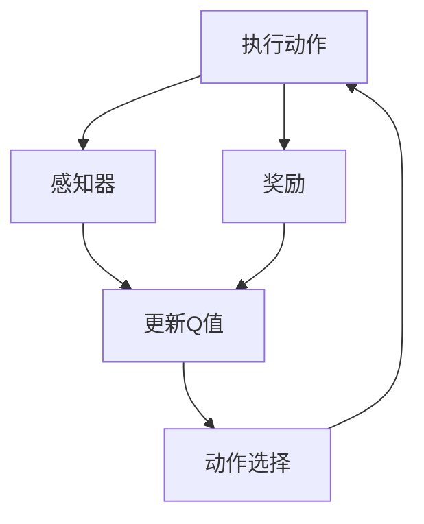

                 


# 如何识别企业的深度强化学习自主导航优势

> **关键词**：深度强化学习，自主导航，企业应用，技术优势，算法原理，系统设计

> **摘要**：深度强化学习（Deep Reinforcement Learning，DRL）作为一种新兴的人工智能技术，正在逐步改变企业自动化决策和自主导航的方式。本文将从背景介绍、核心概念、算法原理、系统设计、项目实战等多方面展开，详细阐述如何识别企业在深度强化学习自主导航中的技术优势，并为企业应用提供实践指导。通过本文的学习，读者将能够全面理解深度强化学习自主导航的核心原理，掌握其在企业中的应用场景，并能够结合实际需求设计和实现相关的系统。

---

## 第一部分：深度强化学习与自主导航的背景介绍

### 第1章：深度强化学习与自主导航的背景介绍

#### 1.1 深度强化学习的基本概念

- **1.1.1 人工智能与强化学习的演进**
  - 人工智能（AI）的定义与发展。
  - 强化学习（Reinforcement Learning，RL）的概念与特点。
  - 深度学习（Deep Learning）与强化学习的结合。

- **1.1.2 深度强化学习的核心概念**
  - 深度强化学习的定义：通过深度神经网络（DNN）实现强化学习。
  - 状态空间（State Space）：环境中的状态表示。
  - 动作空间（Action Space）：可执行的动作。
  - 奖励函数（Reward Function）：评估动作的价值。
  - 策略（Policy）：从状态到动作的映射。

- **1.1.3 自主导航的定义与特点**
  - 自主导航的定义：智能体在环境中自主决策并执行动作。
  - 自主导航的特点：实时性、自主性、适应性。

#### 1.2 自主导航在企业中的应用价值

- **1.2.1 企业自动化决策的需求**
  - 企业对自动化决策的需求背景。
  - 自主导航在企业中的潜在应用场景。

- **1.2.2 自主导航技术的潜在应用场景**
  - 工厂自动化：机器人导航与路径规划。
  - 仓储物流：无人车、无人机的自主导航。
  - 服务机器人：商场、酒店中的自主导航服务。

- **1.2.3 企业采用自主导航的优势与挑战**
  - 优势：提高效率、降低成本、增强灵活性。
  - 挑战：环境复杂性、算法性能、安全性问题。

#### 1.3 深度强化学习与自主导航的结合

- **1.3.1 深度强化学习在自主导航中的作用**
  - 深度强化学习如何提升自主导航的智能性。
  - 深度强化学习在路径规划中的应用。

- **1.3.2 自主导航的核心问题与解决方案**
  - 状态识别与环境建模。
  - 动作选择与路径优化。
  - 奖励函数的设计与优化。

- **1.3.3 深度强化学习与自主导航的边界与外延**
  - 深度强化学习与自主导航的结合范围。
  - 自主导航与其他人工智能技术的协同作用。

---

## 第二部分：深度强化学习与自主导航的核心概念

### 第2章：深度强化学习的核心原理

#### 2.1 深度强化学习的基本原理

- **2.1.1 强化学习的基本原理**
  - 强化学习的基本概念与核心要素。
  - 动作-奖励（Action-Reward）的循环机制。

- **2.1.2 深度神经网络在强化学习中的应用**
  - 深度神经网络用于状态表示与动作选择。
  - 神经网络在强化学习中的作用：近似策略或价值函数。

- **2.1.3 深度强化学习的数学模型**
  - 状态值函数（Value Function）的定义。
  - 策略梯度（Policy Gradient）与Q值函数（Q-Learning）的对比。

#### 2.2 自主导航的关键技术

- **2.2.1 自主导航的核心算法**
  - DQN（Deep Q-Network）算法的实现与优化。
  - PPO（Proximal Policy Optimization）算法的特点。
  - A2C（Advantage Actor-Critic）算法的优势。

- **2.2.2 自主导航的传感器与环境交互**
  - 传感器的作用：获取环境信息。
  - 环境建模：构建数字环境模型。

- **2.2.3 自主导航的路径规划与决策**
  - 路径规划的数学模型。
  - 动作选择的策略优化。

#### 2.3 深度强化学习与自主导航的结合

- **2.3.1 深度强化学习在自主导航中的应用**
  - 状态表示与动作选择的结合。
  - 奖励函数的设计与优化。

- **2.3.2 自主导航与深度强化学习的结合案例**
  - 工厂自动化中的应用案例。
  - 仓储物流中的自主导航应用。

- **2.3.3 深度强化学习与自主导航的未来发展趋势**
  - 算法的优化与创新。
  - 应用领域的扩展与深化。

---

### 图表示例：深度强化学习与自主导航的核心概念对比

#### 图表1：强化学习与深度强化学习的核心要素对比（表格）

| **核心要素**   | **强化学习（RL）**               | **深度强化学习（DRL）**             |
|----------------|-------------------------------|-----------------------------------|
| 状态表示       | 简单特征表示                   | 深度神经网络提取特征               |
| 动作选择       | 表格型或策略型动作选择         | 基于深度神经网络的策略优化         |
| 奖励函数       | 线性或非线性奖励函数           | 复杂奖励函数，依赖于深度神经网络   |
| 训练效率       | 数据量小，训练快               | 数据量大，训练时间长               |

#### 图表2：自主导航系统的实体关系图（ER图）

```mermaid
erDiagram
    actor 用户 {
        string 名称
        string 目标位置
    }
    system 自主导航系统 {
        string 当前位置
        string 状态
    }
    environment 环境 {
        string 地图信息
        string 障碍物
    }
    用户 --> 自主导航系统 : 发出导航请求
    自主导航系统 --> 环境 : 获取环境信息
    自主导航系统 --> 用户 : 返回导航路径
```

---

## 第三部分：深度强化学习与自主导航的算法原理

### 第3章：深度强化学习算法的数学模型与公式

#### 3.1 强化学习的基本数学模型

- **3.1.1 状态空间与动作空间的定义**
  - 状态空间 \( S \)：智能体所处的环境状态。
  - 动作空间 \( A \)：智能体可执行的动作。

- **3.1.2 奖励函数的数学表达**
  - 奖励函数 \( R: S \times A \rightarrow \mathbb{R} \)。

- **3.1.3 策略函数的数学表达**
  - 策略 \( \pi: S \rightarrow A \)。

#### 3.2 深度强化学习的数学模型

- **3.2.1 神经网络在强化学习中的应用**
  - 神经网络用于近似值函数或策略函数。

- **3.2.2 深度Q网络的数学公式**
  - Q值函数 \( Q(s, a) \)：表示状态 \( s \) 下执行动作 \( a \) 的期望奖励。
  - DQN算法的损失函数：
    $$ \mathcal{L} = \mathbb{E}[(r + \gamma \max_{a'} Q(s', a') - Q(s, a))^2] $$

- **3.2.3 策略梯度方法的数学公式**
  - 策略梯度 \( \nabla \theta \) 的计算：
    $$ \nabla \theta = \mathbb{E}[(r + \gamma Q(s', \pi(s')) - Q(s, a))] \cdot \nabla_\theta \pi_\theta(s, a) $$

#### 3.3 自主导航算法的数学模型

- **3.3.1 自主导航的状态表示**
  - 状态 \( s \) 包含位置、障碍物信息等。

- **3.3.2 自主导航的动作空间**
  - 可选动作：前进、左转、右转、后退。

- **3.3.3 自主导航的奖励函数设计**
  - 奖励函数 \( R(s, a) \)：到达目标位置获得正奖励，碰撞或偏离路径获得负奖励。

---

### 图表示例：深度Q网络（DQN）算法流程图



---

## 第四部分：深度强化学习与自主导航的系统设计

### 第4章：深度强化学习与自主导航的系统设计

#### 4.1 系统分析与架构设计

- **4.1.1 项目背景介绍**
  - 项目目标：实现企业环境中的自主导航系统。
  - 项目范围：仓储物流中的无人车导航。

- **4.1.2 系统功能设计**
  - 自主导航模块：路径规划、动作选择。
  - 环境感知模块：传感器数据处理、障碍物检测。
  - 交互模块：与用户或上层系统交互。

- **4.1.3 系统架构设计**
  ```mermaid
  architecture
    A[自主导航系统] --> B[感知器模块]
    A --> C[路径规划模块]
    A --> D[动作执行模块]
    B --> A
    C --> A
    D --> A
  ```

#### 4.2 系统实现与接口设计

- **4.2.1 系统核心接口**
  - 接口1：感知器模块与自主导航系统的数据交互。
  - 接口2：路径规划模块与动作执行模块的通信。

- **4.2.2 系统交互流程**
  ```mermaid
  sequenceDiagram
    participant 用户
    participant 系统
    participant 环境
    用户 -> 系统：发出导航请求
    系统 -> 环境：获取环境信息
    系统 -> 系统：路径规划与动作选择
    系统 -> 环境：执行动作
    环境 -> 系统：返回状态与奖励
  ```

---

## 第五部分：深度强化学习与自主导航的项目实战

### 第5章：深度强化学习与自主导航的项目实战

#### 5.1 环境安装与配置

- **5.1.1 安装深度学习框架**
  - 安装TensorFlow或PyTorch框架。
  - 安装强化学习库（如Keras-RL）。

- **5.1.2 安装自主导航相关库**
  - 安装机器人控制库（如ROS）。
  - 安装传感器模拟库。

#### 5.2 系统核心实现与代码示例

- **5.2.1 深度Q网络的实现代码**
  ```python
  import numpy as np
  import tensorflow as tf

  class DQN:
      def __init__(self, state_space, action_space):
          self.state_space = state_space
          self.action_space = action_space
          self.model = self.build_model()

      def build_model(self):
          model = tf.keras.Sequential([
              tf.keras.layers.Dense(24, activation='relu', input_dim=self.state_space),
              tf.keras.layers.Dense(24, activation='relu'),
              tf.keras.layers.Dense(self.action_space, activation='linear')
          ])
          return model

      def predict(self, state):
          return self.model.predict(np.array([state]))[0]

      def train(self, state, action, target):
          target = np.array([target])
          self.model.fit(np.array([state]), target, epochs=1, verbose=0)
  ```

- **5.2.2 自主导航系统的实现代码**
  ```python
  import numpy as np

  class AutonomousNavigation:
      def __init__(self, env):
          self.env = env
          self.dqn = DQN(env.state_space, env.action_space)

      def run(self):
          state = self.env.reset()
          while True:
              action = self.dqn.predict(state)
              next_state, reward, done = self.env.step(action)
              self.dqn.train(state, action, reward)
              state = next_state
              if done:
                  break
  ```

#### 5.3 项目案例分析与实现解读

- **5.3.1 项目案例分析**
  - 仓储物流中的无人车导航。
  - 自主导航系统的实际运行效果。

- **5.3.2 代码实现解读**
  - 状态空间与动作空间的定义。
  - DQN算法在自主导航中的具体应用。
  - 系统运行的流程与结果分析。

#### 5.4 项目总结与优化建议

- **5.4.1 项目总结**
  - 系统实现的关键点总结。
  - 系统性能的评估指标。

- **5.4.2 系统优化建议**
  - 算法优化建议：改进DQN算法，引入经验回放机制。
  - 系统性能优化：优化传感器数据处理速度。

---

## 第六部分：深度强化学习与自主导航的最佳实践

### 第6章：深度强化学习与自主导航的最佳实践

#### 6.1 总结与回顾

- **6.1.1 核心内容总结**
  - 深度强化学习与自主导航的核心原理。
  - 系统设计与实现的关键点。

- **6.1.2 本文的创新点与不足**
  - 创新点：结合深度强化学习与自主导航的技术优势。
  - 不足：算法性能与环境适应性的进一步优化。

#### 6.2 最佳实践 tips

- **6.2.1 系统设计 tips**
  - 合理设计状态与动作空间，避免过于复杂。
  - 优化奖励函数设计，提升系统性能。

- **6.2.2 代码实现 tips**
  - 选择合适的深度学习框架，提高代码运行效率。
  - 注重代码的可扩展性与可维护性。

#### 6.3 未来展望与注意事项

- **6.3.1 未来展望**
  - 深度强化学习算法的进一步优化。
  - 自主导航技术的多领域应用。

- **6.3.2 应用注意事项**
  - 确保系统的安全性和稳定性。
  - 注重数据隐私与系统防护。

#### 6.4 拓展阅读与学习资源

- **6.4.1 拓展阅读**
  - 推荐阅读的经典论文：《Playing atari with deep reinforcement learning》。
  - 推荐阅读的技术书籍：《Deep Reinforcement Learning Hands-On》。

- **6.4.2 学习资源**
  - 在线课程：Coursera上的《Introduction to Deep Learning》。
  - 开源项目：GitHub上的深度强化学习项目。

---

## 附录：代码与图表

### 附录A：代码实现细节

- DQN算法实现的完整代码。
- 自主导航系统实现的完整代码。

### 附录B：图表与流程图

- 深度Q网络（DQN）算法流程图。
- 自主导航系统架构图。

---

通过以上内容，读者可以系统地了解如何识别企业的深度强化学习自主导航优势，并能够结合实际需求设计和实现相关系统。本文从理论到实践，全面阐述了深度强化学习与自主导航的核心技术与应用实践，为企业的技术决策和系统设计提供了有力的指导。

