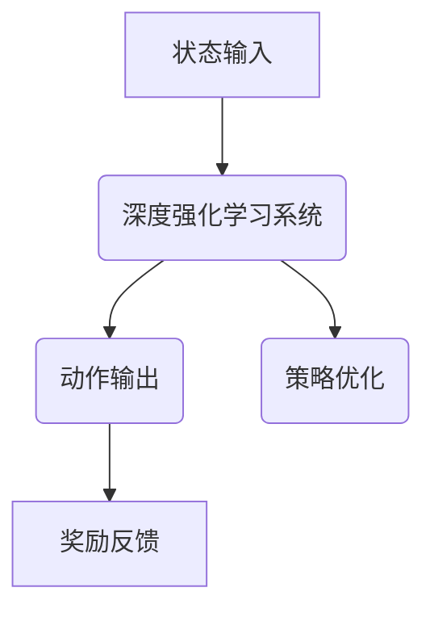

                 


# 如何识别企业的深度强化学习自主控制优势

---

## 关键词  
深度强化学习、自主控制、企业应用、算法实现、系统架构

---

## 摘要  
本文将详细探讨如何识别企业在深度强化学习中的自主控制优势。通过分析深度强化学习的核心概念、算法原理、系统架构以及实际案例，本文将为企业提供一套系统化的识别方法，帮助企业在复杂的商业环境中利用深度强化学习技术实现自主控制，提升竞争力。

---

## 第一部分: 深度强化学习的背景与核心概念

### 第1章: 深度强化学习概述

#### 1.1 深度强化学习的背景与意义  
深度强化学习（Deep Reinforcement Learning, DRL）是人工智能领域的重要分支，结合了深度学习和强化学习的优势，能够在复杂环境中实现自主决策。随着企业对智能化需求的增加，DRL 在企业中的应用越来越广泛。  

##### 1.1.1 人工智能的演进历程  
人工智能（AI）经历了从规则驱动到数据驱动的演变。深度强化学习的出现，使得机器能够通过与环境的交互，自主学习并优化决策策略。  

##### 1.1.2 深度强化学习的核心价值  
深度强化学习的核心价值在于其自主决策能力。它能够通过与环境的交互，不断优化策略，从而实现更高效、更智能的决策。  

##### 1.1.3 企业级应用中的自主控制优势  
在企业中，深度强化学习的自主控制优势体现在以下几个方面：  
- **自动化决策**：通过学习历史数据，DRL 能够生成最优决策策略。  
- **动态适应**：DRL 能够根据环境的变化，实时调整策略。  
- **复杂场景处理**：DRL 能够处理多目标、多约束的复杂问题。  

#### 1.2 企业中的深度强化学习应用  
深度强化学习在企业中的应用场景广泛，包括资源优化、流程自动化、风险控制等。  

##### 1.2.1 问题背景与应用场景  
企业在运营中面临诸多复杂问题，例如供应链优化、客户行为预测、投资决策等。这些问题通常具有高维状态空间和复杂动作空间，适合使用深度强化学习进行求解。  

##### 1.2.2 企业的痛点与需求  
企业在传统方法中面临以下痛点：  
- **决策效率低**：依赖人工经验，决策效率低下。  
- **适应性差**：难以快速响应环境变化。  
- **复杂性高**：传统方法难以处理多目标优化问题。  

##### 1.2.3 深度强化学习的解决方案  
深度强化学习通过以下方式解决企业的痛点：  
- **高效决策**：通过神经网络和强化学习算法，快速生成最优决策。  
- **动态调整**：实时感知环境变化，动态优化策略。  
- **复杂场景处理**：通过深度网络处理高维状态空间，解决复杂问题。  

#### 1.3 深度强化学习的核心概念与联系  
深度强化学习的核心概念包括状态、动作、奖励、策略和值函数。  

##### 1.3.1 核心概念原理  
- **状态（State）**：环境的当前情况，如库存水平、客户行为等。  
- **动作（Action）**：系统可以执行的操作，如调整生产计划、优化营销策略等。  
- **奖励（Reward）**：系统执行动作后获得的反馈，用于指导策略优化。  
- **策略（Policy）**：系统在给定状态下选择动作的规则。  
- **值函数（Value Function）**：衡量某状态下策略的好坏。  

##### 1.3.2 核心概念属性特征对比表格  
| **概念**  | **定义**                          | **作用**                          |
|-----------|---------------------------------|-----------------------------------|
| 状态      | 当前环境的描述                    | 作为决策的基础                    |
| 动作      | 可执行的操作                      | 决策的结果                        |
| 奖励      | 行为的反馈                        | 指导策略优化                      |
| 策略      | 动作选择的规则                    | 决策的核心                        |
| 值函数    | 状态的优劣衡量                    | 优化策略的依据                    |

##### 1.3.3 ER实体关系图架构的 Mermaid 流程图  
```mermaid
er
    actor(用户)
    system(深度强化学习系统)
    database(数据库)
    user
    system
    database
    user --> system: 提供输入
    system --> database: 查询状态
    system --> database: 更新状态
    database --> system: 返回反馈
    system --> user: 输出结果
```

---

### 第2章: 深度强化学习的算法原理  

#### 2.1 深度强化学习算法概述  

##### 2.1.1 算法的基本流程  
深度强化学习算法的基本流程包括：  
1. **初始化**：定义状态空间、动作空间、奖励函数。  
2. **与环境交互**：根据当前状态选择动作，执行动作，获得奖励和新状态。  
3. **学习更新**：利用经验回放和策略梯度方法，更新策略和网络参数。  

##### 2.1.2 算法的核心组件  
- **神经网络**：用于近似值函数或策略函数。  
- **强化学习算法**：如Q-Learning、Deep Q-Networks（DQN）、Policy Gradient（PG）等。  

##### 2.1.3 算法的优缺点分析  
- **优点**：能够处理高维状态空间，适应复杂环境。  
- **缺点**：需要大量数据，训练时间长，可能面临收敛问题。  

#### 2.2 深度强化学习的数学模型  

##### 2.2.1 数学模型的定义与公式  
深度强化学习的核心数学模型包括值函数和策略函数。  
- 值函数：衡量状态-动作对的优劣。  
- 策略函数：决定在给定状态下选择哪个动作。  

##### 2.2.2 算法的数学推导  
以DQN为例，其目标是最小化预测值与实际奖励的差值。  
$$ \text{损失函数} = \mathbb{E}[(r + \gamma v(s')) - Q(s, a)]^2 $$  

##### 2.2.3 典型案例分析与举例说明  
假设一家公司希望优化其库存管理，使用DQN算法：  
- **状态**：当前库存量、需求预测、供应商交货时间。  
- **动作**：订购数量。  
- **奖励**：库存成本降低的金额。  

#### 2.3 深度强化学习的算法实现  

##### 2.3.1 算法实现的步骤  
1. **环境定义**：定义状态、动作和奖励函数。  
2. **神经网络构建**：使用深度神经网络近似值函数。  
3. **策略选择**：基于当前策略选择动作。  
4. **经验回放**：存储历史经验，随机采样更新网络。  
5. **网络更新**：通过梯度下降优化网络参数。  

##### 2.3.2 算法实现的代码示例  
以下是一个简单的DQN算法实现示例：  

```python
import numpy as np
import tensorflow as tf

class DQN:
    def __init__(self, state_dim, action_dim, learning_rate):
        self.state_dim = state_dim
        self.action_dim = action_dim
        self.learning_rate = learning_rate
        self.model = self.build_model()
        self.target_model = self.build_model()
        self.optimizer = tf.keras.optimizers.Adam(learning_rate)
    
    def build_model(self):
        model = tf.keras.Sequential([
            tf.keras.layers.Dense(64, activation='relu', input_shape=(self.state_dim,)),
            tf.keras.layers.Dense(64, activation='relu'),
            tf.keras.layers.Dense(self.action_dim)
        ])
        return model
    
    def act(self, state):
        state = tf.convert_to_tensor(state)
        with tf.GradientTape() as tape:
            prediction = self.model(state)
        gradient = tape.gradient(prediction, self.model.trainable_weights)
        action = np.argmax(prediction.numpy(), axis=1)[0]
        return action
    
    def update(self, experiences):
        states = np.array([exp[0] for exp in experiences])
        actions = np.array([exp[1] for exp in experiences])
        rewards = np.array([exp[2] for exp in experiences])
        next_states = np.array([exp[3] for exp in experiences])
        
        targets = self.target_model.predict(next_states)
        targets = rewards + 0.99 * np.max(targets, axis=1)
        targets = targets.reshape(-1, 1)
        
        with tf.GradientTape() as tape:
            predictions = self.model.predict(states)
            loss = tf.keras.losses.mean_squared_error(targets, predictions)
        gradients = tape.gradient(loss, self.model.trainable_weights)
        self.optimizer.apply_gradients(zip(gradients, self.model.trainable_weights))
```

##### 2.3.3 代码的解读与分析  
- **模型构建**：使用两个Dense层，激活函数为ReLU。  
- **动作选择**：基于当前策略选择动作。  
- **网络更新**：使用经验回放和Adam优化器更新网络参数。  

---

### 第3章: 企业级系统的深度强化学习架构  

#### 3.1 企业级系统的深度强化学习应用  

##### 3.1.1 系统功能设计  
企业级系统的设计需要考虑以下功能：  
- **状态监测**：实时监测系统状态。  
- **动作选择**：根据状态选择最优动作。  
- **奖励计算**：根据结果计算奖励。  
- **策略优化**：根据经验更新策略。  

##### 3.1.2 系统架构设计  
系统架构设计需要考虑以下方面：  
- **数据流**：状态输入、动作输出、奖励反馈。  
- **网络结构**：前端采集、后端计算、结果输出。  

##### 3.1.3 系统接口设计  
系统接口设计包括：  
- **输入接口**：接收状态数据。  
- **输出接口**：输出动作指令。  
- **反馈接口**：接收奖励信号。  

#### 3.2 系统架构的 Mermaid 架构图  



---

### 第4章: 深度强化学习的系统分析与设计  

#### 4.1 系统分析  

##### 4.1.1 问题场景介绍  
假设某企业希望优化其供应链管理，使用深度强化学习进行库存优化。  

##### 4.1.2 项目介绍  
项目目标：优化库存管理，降低库存成本。  
项目范围：库存管理模块。  

##### 4.1.3 系统功能设计  
- **库存监测**：实时监测库存水平。  
- **需求预测**：预测未来需求。  
- **订单优化**：根据预测结果优化订单数量。  

#### 4.2 系统架

---

**接下来的内容将按照上述目录继续展开，涵盖算法实现、系统分析与设计、项目实战、最佳实践等部分。由于篇幅限制，本文仅展示了部分章节内容。**

---

## 最佳实践与小结  

### 第6章: 最佳实践与小结  

#### 6.1 最佳实践  
- **数据质量**：确保数据的完整性和准确性。  
- **模型调优**：通过网格搜索或随机搜索优化超参数。  
- **经验回放**：使用经验回放增强模型的泛化能力。  

#### 6.2 小结  
深度强化学习为企业提供了强大的自主控制能力，能够帮助企业优化决策、降低成本、提高效率。通过本文的分析，读者可以清晰地识别企业在深度强化学习中的自主控制优势，并在实际应用中加以利用。  

---

## 第7章: 未来展望  

深度强化学习的发展前景广阔，未来将朝着以下方向发展：  
- **多智能体协作**：研究多智能体之间的协作与竞争。  
- **实时决策**：提高决策的实时性和响应速度。  
- **应用扩展**：探索更多领域的应用，如医疗、金融等。  

---

## 参考文献  

1. Mnih, V., et al. "Playing atari with deep reinforcement learning." arXiv preprint arXiv:1312.5602 (2013).  
2. DeepMind. "Deep Q-Networks (DQN): Experience replay."  
3. Sutton, R. S., & Barto, A. G. "Reinforcement learning: An introduction."  

---

**以上是文章的部分内容，完整文章将涵盖从背景介绍到项目实战的各个方面，结合理论与实践，帮助读者全面理解如何识别和应用深度强化学习的自主控制优势。**

